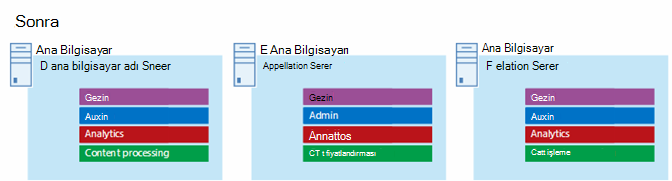

# Microsoft Azure 2013 için SharePoint Mimarileri

Azure, SharePoint Server 2013 çözümünü barındırmak için iyi bir ortamdır. Çoğu durumda bu sunucu Microsoft 365, ancak Azure'da SharePoint bir SharePoint Sunucu grubu belirli çözümler için iyi bir seçenek olabilir. Bu makalede, Azure platformuna SharePoint için çözümlerin nasıl mimarlar tarafından üretn gerekenler açıklanmıştır. Örnek olarak aşağıdaki iki özel çözüm kullanılır:
  
- [SharePoint Server 2013 Olağanüstü Durum Kurtarma Microsoft Azure](sharepoint-server-2013-disaster-recovery-in-microsoft-azure.md)
    
- [SharePoint Server 2013 kullanarak Microsoft Azure Internet Siteleri](internet-sites-in-microsoft-azure-using-sharepoint-server-2013.md)
    
## Azure Altyapı SharePoint için önerilen çözümler

Azure altyapı hizmetleri, en iyi çözümleri barındırmak için SharePoint bir seçenektir. Bazı çözümler, bu platforma diğerlerine göre daha iyidir. Aşağıdaki tabloda önerilen çözümler listelemektedir.
  
|**Çözüm**|**Azure için bu çözüm neden önerilir?**|
|:-----|:-----|
|Geliştirme ve test ortamları    |Bu ortamları oluşturmak ve yönetmek kolaydır.    |
|Azure'a acil durum kurtarma SharePoint şirket içi gruplarda kurtarma    |**Barındırılan ikincil veri merkezi** Farklı bir bölgeye ikincil veri merkezi yatırım yapmak yerine Azure kullanın.   **Olağanüstü durum kurtarma için düşük maliyetli ortamlar** Şirket içi olağanüstü durum kurtarma ortamına göre daha az kaynağı koruma ve ödeme. Kaynakların sayısı, seçtiğiniz olağanüstü durum kurtarma ortamına bağlıdır: soğuk bekleme, sıcak bekleme veya sıcak bekleme.   **Daha esnek bir platform** Bir facia durumunda, yükleme gereksinimlerini karşılamak için kurtarma grubu SharePoint ölçeğini kolayca ölçeklendirin. Artık kaynaklara ihtiyacınız kalmadan ölçeklendirin.   Hızlı [Erişim SharePoint Server 2013 Olağanüstü Durum Kurtarma Microsoft Azure](sharepoint-server-2013-disaster-recovery-in-microsoft-azure.md).    |
|Özellikler ve ölçek kullanan İnternet'e yönelik siteler bu sitelerde Microsoft 365    |**Çalışmalarınıza odaklanma** Altyapı inşa etmek yerine mükemmel bir site inşaa odaklanın.   **Azure'da esnekliğin avantajını elde edin** Yeni sunucular ekleyerek talep için sunucu grubu boyutu ve yalnızca ihtiyacınız olan kaynakları ödeyebilirsiniz. Dinamik makine ayırma özelliği desteklenmiyor (otomatik ölçek).   **Müşteri Azure Active Directory (AD)** Kullanma Müşteri hesapları için Azure AD'den yararlanma.   **Daha SharePoint raporlama ve web analizi Microsoft 365** fazla işlevsellik ekleme.   [SharePoint Server 2013'ü kullanarak Microsoft Azure'te İnternet Siteleri'ne bakın](internet-sites-in-microsoft-azure-using-sharepoint-server-2013.md).    |
|Uygulama gruplarını ve Microsoft 365 ortamlarını desteklemeye yönelik    |**Hem şirket içi hem de bulut ortamlarını** desteklemek için Azure'da uygulamalar oluşturun, test edin ve barındırın.   **Şirket içi ortamlar** için yeni donanım satın almak yerine Azure'da bu rolü barındırın.   |
   
İntranet ve işbirliği çözümleriyle iş yükleri için aşağıdaki seçenekleri göz önünde bulundurabilirsiniz:
  
- E-Microsoft 365 gereksinimlerinizi karşılamıyorsa veya çözümün bir parçası olup olmadığını belirler. Microsoft 365 her zaman güncel olan zengin bir özellik kümesi sağlar.
    
- Bu Microsoft 365 gereksinimlerinizin hepsi karşılamıyorsa, Microsoft Consulting Services'tan (MCS) şirket içi SharePoint 2013'ü uygulamaya yönelik standart bir uygulama olarak düşünün. Standart bir mimari, özelleştirilmiş bir mimariyi desteklemeniz için daha hızlı, daha düşük ve daha kolay bir çözüm olabilir. 
    
- Standart bir uygulama iş gereksinimlerinizi karşılamıyorsa, özelleştirilmiş bir şirket içi çözümü göz önünde bulundurarak.
    
- İş gereksinimleriniz için bulut platformu kullanmak önemli ise, Azure altyapı hizmetlerde barındırılan standart veya özelleştirilmiş SharePoint 2013 uygulamasını göz önünde bulundurabilirsiniz. SharePoint çözümleri, Azure'da destek olmak diğer yerel olmayan Microsoft genel bulut platformlarından çok daha kolaydır.
    
## Azure ortamını tasarlamadan önce

Bu makalede topolojilerle SharePoint, bu tasarım kavramlarını her tür kaynak grubu topolojisinde SharePoint kullanabilirsiniz. Azure ortamını tasarlamadan önce, aşağıdaki topolojiyi, mimariyi, kapasiteyi ve performans kılavuzlarını kullanarak aşağıdaki SharePoint kullanın:
  
- [SHAREPOINT 2013 IT profesyonelleri için mimari tasarımı](/SharePoint/technical-reference/technical-diagrams)
    
- [SharePoint Server 2013'te performans ve kapasite yönetimi planlama](/SharePoint/administration/performance-planning-in-sharepoint-server-2013)
    
## Active Directory etki alanı türünü belirleme

Her SharePoint Sunucu grubu, sunucu grubu kurulumunda yönetim hesaplarını sağlamak için Active Directory'ye dayandır. Şu anda, Azure'daki çözümlerini SharePoint iki seçenek vardır. Bunlar aşağıdaki tabloda açıklanmıştır.
  
|**Seçenek**|**Açıklama**|
|:-----|:-----|
|Ayrılmış etki alanı    |Azure'a ayrılmış ve yalıtılmış bir Active Directory etki alanını dağıtarak SharePoint destek sabilirsiniz. Bu, genele açık İnternet siteleri için iyi bir seçimdir.    |
|Şirket içi etki alanını şirket içi bağlantı üzerinden genişletme    |Şirket içi etki alanını şirket içi bir bağlantı aracılığıyla genişleterek, kullanıcılar intranet'iniz aracılığıyla SharePoint sunucu grubu şirket içinde barındırmış gibi erişim sağlar. Şirket içi Active Directory ve DNS uygulama avantajınızı kullanabilirsiniz.    Şirket içi sunucu grubu üzerinden başarısız olmak için Azure'da olağanüstü durum kurtarma ortamı inşa etmek için şirket içi bağlantı gerekir.    |
   
Bu makalede, şirket içi etki alanını şirket içi bir bağlantı üzerinden genişletmek için tasarım kavramları yer almaktadır. Çözümünüz ayrılmış bir etki alanı kullanıyorsa, şirket içi bağlantınız buna gerek değildir.
  
## Sanal ağı tasarlama

İlk olarak, Azure'da sanal makinelerinizi bu ağlara ağın da dahil olduğu bir sanal ağa ihtiyacınız vardır. Sanal ağın, bölümlerini alt ağlara atadığınız özel bir IP adresi alanı olmalıdır.
  
Şirket içi anızı şirket içi bir bağlantı üzerinden Azure'a genişletıyorsanız (olağanüstü durum kurtarma ortamı için gereklidir), şirket içi ortamınızı ve diğer Azure sanal ağlarını da içermek üzere, kuruluş ağının başka bir yerinde henüz kullanımda olmayan özel bir adres alanı seçmeniz gerekir. 
  
**Şekil 1: Azure'da sanal ağ ile şirket içi ortam**

  
Bu diyagramda:
  
- Azure'da bir sanal ağ, şirket içi ortamın yan yana gösterildiği bir resimdir. Bu iki ortam henüz bir şirket içi VPN bağlantısıyla (siteden siteye VPN bağlantısı veya ExpressRoute) bağlı değildir.
    
- Bu noktada, sanal ağ yalnızca alt ağları içerir; başka mimari öğelere dahil olmaz. Bir alt ağ, Azure ağ geçidini ve diğer alt ağlarda da Active Directory ve DNS için bir alt ağ olmak SharePoint alt ağların katmanlarını barındırıyor.
    
## Şirket içi bağlantı ekleme

Sonraki dağıtım adımı, şirket içi bağlantı oluşturmaktır (bu sizin çözümünüz için geçerli ise). Şirket içi bağlantılar için Azure ağ geçidi, adres alanı oluşturmanız ve atamanız gereken ayrı bir ağ geçidi alt ağ geçidinde bulunur. 
  
Şirket içi bir bağlantı planladığınız zaman, bir Azure ağ geçidi ve şirket içi ağ geçidi cihazına bağlantı tanımlar ve oluşturabilirsiniz.
  
**Şekil 2: Şirket içi ortamla Azure arasında siteden siteye bağlantı sağlamak için bir Azure ağ geçidi ve şirket içi ağ geçidi cihazı kullanma**

  
Bu diyagramda:
  
- Önceki diyagrama ek olarak, şirket içi ortam Azure sanal ağına bir şirket içi bağlantıyla bağlanır; bu, siteden siteye VPN bağlantısı veya ExpressRoute olabilir.
    
- Bir Azure ağ geçidi, ağ geçidi alt ağ geçidi üzerindedir.
    
- Şirket içi ortamı yönlendirici veya VPN sunucusu gibi bir ağ geçidi cihazı içerir.
    
Şirket içi sanal ağı planlamak ve oluşturmak için ek bilgi için bkz. Bağlan ağı kendi sanal ağına [Microsoft Azure oluşturma](connect-an-on-premises-network-to-a-microsoft-azure-virtual-network.md).
  
## Active Directory Etki Alanı Hizmetleri (AD DS) ve DNS ekleme

Azure'da olağanüstü durum kurtarma için, Windows Server AD ve DNS'i hem şirket içinde hem de Azure sanal makinelerde Windows Server AD dağıtılan karma bir senaryoda dağıtabilirsiniz.
  
**Şekil 3: Karma Active Directory etki alanı yapılandırması**

  
Bu diyagram, bir Windows Server AD DNS alt ağın iki sanal makineler ekleyerek önceki diyagramlarda yer almaktadır. Bu sanal makineler çoğaltma etki alanı denetleyicileri ve DNS sunucularıdır. Bunlar, şirket içi posta ortamının bir Windows Server AD olur. 
  
Aşağıdaki tablo, Azure'da bu sanal makineler için yapılandırma önerileri sağlar. Azure ortamınız şirket içi ortamınıza iletişim kurmadan ayrılmış bir etki alanı için bile, kendi ortamınızı tasarlamak için başlangıç noktası olarak bu adımları kullanın.
  
|**Öğe**|**Yapılandırma**|
|:-----|:-----|
|Azure'da sanal makine boyutu    |Standart katmanda A1 veya A2 boyutu    |
|İşletim sistemi    |Windows Server 2012 R2    |
|Active Directory rolü    |Genel katalog sunucusu olarak atanmış AD DS etki alanı denetleyicisi. Bu yapılandırma, şirket içi bağlantı üzerinden çıkış trafiğini azaltır.    Yüksek değişim oranlarına sahip bir çok etki alanı ortamında (bu yaygın bir durum değildir), yineleme trafiğini azaltmak için şirket içi etki alanı denetleyicilerini Azure'daki genel katalog sunucularıyla eşitlemeyecek şekilde yapılandırın.    |
|DNS rolü    |Etki alanı denetleyicilerinde DNS Server hizmetini yükleyin ve yapılandırabilirsiniz.    |
|Veri diskleri    |Active Directory veritabanını, günlüklerini ve SYSVOL'i ek Azure veri disklerine placek. Bunları işletim sistemi diske veya Azure tarafından sağlanan geçici disklere yerleştirin.    |
|IP adresleri    |Etki alanı denetleyicileri yapılandırıldığında, statik IP adreslerini kullanın ve bu adresleri sanal ağ içinde sanal makinelere atamak için sanal ağı yapılandırabilirsiniz.    |
   
> [!IMPORTANT]
> Azure'da Active Directory'yi dağıtmadan önce, Azure [Sanal Makinelerinde Windows Server Active Directory Yönergeleri'ne bakın](/windows-server/identity/ad-ds/introduction-to-active-directory-domain-services-ad-ds-virtualization-level-100). Bunlar, çözümünüz için farklı bir mimari veya farklı yapılandırma ayarlarının gerekli olup olmadığını belirlemenize yardımcı olur. 
  
## Grup SharePoint ekleme

Alt ağların sanal makinelerini SharePoint alt ağların katmanlarında yer almaktadır.
  
**Şekil 4: Sanal SharePoint yerleşimi**

  
Bu diyagram, önceki diyagramlar üzerinde ilgili katmanlara SharePoint sunucu grubu rollerini ekleyerek bilgi grubu rollerini ekler.
  
- Veritabanı katmanı oluşturmak için SQL Server veritabanı sanal makineleri.
    
- Aşağıdaki katmanların her biri SharePoint Server 2013'ü çalıştıran iki sanal makine: ön uç sunucuları, dağıtılmış önbellek sunucuları ve arka uç sunucuları.
    
## Kullanılabilirlik kümeleri ve hata etki alanları için sunucu rollerini tasarlama ve ince ayarlama

Hata etki alanı, rol örneklerinin çalıştır yer alan bir donanım grubudur. Aynı hata etki alanı içindeki sanal makineler, Azure altyapısı tarafından aynı anda güncelleştirilebilir. Ya da aynı rafı paylaşıyorları için aynı anda başarısız olabilir. Aynı hata etki alanında iki sanal makine olması riskini önlemek için, sanal makinelerinizi bir kullanılabilirlik kümesi olarak yapılandırabilirsiniz; bu da her sanal makinenin farklı bir hata etki alanında yer ayarlamalarını sağlar. Üç sanal makine kullanılabilirlik kümesi olarak yapılandırılırsa, Azure sanal makinelerden ikiden fazlasının aynı hata etki alanında yer alamay güvencesini sağlar.
  
Azure mimarisini bir SharePoint grubu için tasarlarken, aynı sunucu rollerini bir kullanılabilirlik kümesi kapsamında yapılandırabilirsiniz. Bu, sanal makinenizin birden çok hata etki alanına yayılmasını sağlar.
  
**Şekil 5: Azure Kullanılabilirlik Kümelerini kullanarak, diğer grup katmanlarını SharePoint sağlama**

  
Bu diyagram, Azure altyapısı içindeki kullanılabilirlik kümelerinin yapılandırmasını çağrır. Aşağıdaki rollerden her biri ayrı bir kullanılabilirlik kümesi paylaşır:
  
- Active Directory ve DNS
    
- Veritabanı
    
- Arka uç
    
- Önbelleği dağıt
    
- Ön uç
    
Bu SharePoint Azure platformunda ince ayar yapmak zorunda olabilir. Tüm bileşenlerin yüksek kullanılabilirliğini sağlamak için, sunucu rollerinin hepsinin aynı şekilde yapılandırıldığından emin olun.
  
Burada, belirli kapasite ve performans hedeflerine uygun standart bir İnternet Siteleri mimarisini gösteren bir örnek ve almaktadır. Bu örnek, aşağıdaki mimari modelinde öne almaktadır: [SharePoint Server 2013](https://go.microsoft.com/fwlink/p/?LinkId=261519) için İnternet Siteleri Arama Mimarileri.
  
**Şekil 6: Üç katmanlı bir grup içinde kapasite ve performans hedefleri için planlama örneği**

  
Bu diyagramda:
  
- Üç katmanlı bir sunucu grubu temsil edildi: web sunucuları, uygulama sunucuları ve veritabanı sunucuları.
    
- Üç web sunucusu, birden çok bileşenle aynı şekilde yapılandırılmıştır.
    
- İki veritabanı sunucusu aynı şekilde yapılandırılmıştır.
    
- Üç uygulama sunucusu aynı şekilde yapılandırılmaz. Bu sunucu rollerinde Azure'da kullanılabilirlik kümelerinde ince ayarlamalar yapmak gerekir.
    
Uygulama sunucu katmanına daha yakından bakalım.
  
**Şekil 7: İnce ayar öncesinde uygulama sunucusu katmanı**

  
Bu diyagramda:
  
- Uygulama katmanına üç sunucu dahildir.
    
- İlk sunucu dört bileşen içerir.
    
- İkinci sunucu üç bileşen içerir.
    
- Üçüncü sunucu iki bileşen içerir.
    
Bileşenlerin sayısını, grup için performans ve kapasite hedeflerine göre belirlersiniz. Bu mimariyi Azure'a uyarlamak için, bu üç sunucuya da dört bileşeni çoğaltılacaktır. Bu, performans ve kapasite için gerekenlerin ötesinde bileşenlerin sayısını artırır. Bu tasarım, bir kullanılabilirlik kümesine bu üç sanal makine atandığı zaman Azure platformunda her dört bileşenin de yüksek kullanılabilirliğini sağlar.
  
**Şekil 8: İnce ayar yapıldıktan sonra uygulama sunucusu katmanı**

  
Bu diyagramda, aynı dört bileşenle aynı şekilde yapılandırılan üç uygulama sunucusu da görünür.
  
Bir grup katmanına kullanılabilirlik kümeleri SharePoint, uygulama tamamlanır.
  
**Şekil 9: Azure altyapı SharePoint tamamlandıktan sonra grup**

  
Bu diyagramda, Azure SharePoint hizmetlerinde uygulanan sunucu grubu ve her katmanda sunuculara hata etki alanları sağlamak için kullanılabilirlik kümeleri vardır.
  
## Ayrıca Bkz

[Microsoft 365 çözüm ve mimari merkezi](../solutions/index.yml)
  
[SharePoint Server 2013 kullanarak Microsoft Azure Internet Siteleri](internet-sites-in-microsoft-azure-using-sharepoint-server-2013.md)
  
[SharePoint Server 2013 Olağanüstü Durum Kurtarma Microsoft Azure](sharepoint-server-2013-disaster-recovery-in-microsoft-azure.md)