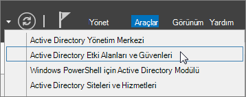
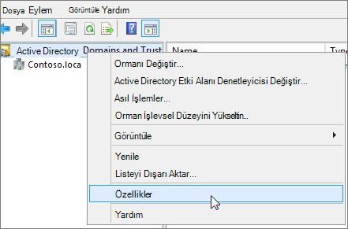

# <a name="prepare-a-non-routable-domain-for-directory-synchronization"></a>Dizin eşitlemesi için yönlendirilebilir olmayan bir etki alanını hazırlama

Şirket içi dizininizi Microsoft 365 ile eşitlerken, Azure Active Directory(Azure AD) içinde doğrulanmış bir etki alanınızın olması gerekir. Yalnızca şirket içi Active Directory Etki Alanı Hizmetleri (AD DS) etki alanıyla ilişkilendirilmiş Kullanıcı Asıl Adları (UPN) eşitlenir. Ancak, ".local" (örneğin: billa@contoso.local) gibi yönlendirilebilir olmayan bir etki alanı içeren tüm UPN'ler bir .onmicrosoft.com etki alanıyla eşitlenir (örnek: billa@contoso.onmicrosoft.com). 

ŞU anda AD DS'deki kullanıcı hesaplarınız için ".local" etki alanı kullanıyorsanız, Microsoft 365 etki alanınızla düzgün eşitlemek için bunları billa@contoso.com gibi doğrulanmış bir etki alanı kullanacak şekilde değiştirmeniz önerilir.
  
## <a name="what-if-i-only-have-a-local-on-premises-domain"></a>Yalnızca ".local" şirket içi etki alanım varsa ne olur?

AD DS'nizi Microsoft 365 kiracınızın Azure AD kiracısına eşitlemek için Azure AD Bağlan kullanırsınız. Daha fazla bilgi için bkz. [Şirket içi kimliklerinizi Azure AD ile tümleştirme](/azure/architecture/reference-architectures/identity/azure-ad).
  
Azure AD Bağlan, kullanıcıların şirket içinde kullandıkları kimlik bilgileriyle oturum açabilmesi için kullanıcılarınızın UPN'sini ve parolasını eşitler. Ancak Azure AD Bağlan kullanıcıları yalnızca Microsoft 365 tarafından doğrulanan etki alanlarıyla eşitler. Bu, Microsoft 365 kimlikleri Azure AD tarafından yönetildiğinden etki alanının Azure AD tarafından da doğrulandığını gösterir. Başka bir deyişle, etki alanının geçerli bir İnternet etki alanı (.com, .org, .net, .us gibi) olması gerekir. İç AD DS'niz yalnızca yönlendirilemeyen bir etki alanı kullanıyorsa (örneğin, ".local"), Microsoft 365 kiracınız için sahip olduğunuz doğrulanmış etki alanıyla eşleşmesi mümkün değildir. Bu sorunu, şirket içi AD DS'nizdeki birincil etki alanınızı değiştirerek veya bir veya daha fazla UPN soneki ekleyerek düzeltebilirsiniz.
  
### <a name="change-your-primary-domain"></a>Birincil etki alanınızı değiştirme

Birincil etki alanınızı Microsoft 365'de doğruladığınız bir etki alanıyla değiştirin( örneğin, contoso.com). Contoso.local etki alanına sahip her kullanıcı daha sonra contoso.com olarak güncelleştirilir. Bununla birlikte, bu ilgili bir süreçtir ve aşağıdaki bölümde daha kolay bir çözüm açıklanmaktadır.
  
### <a name="add-upn-suffixes-and-update-your-users-to-them"></a>UPN sonekleri ekleme ve kullanıcılarınızı bunlara güncelleştirme

".local" sorununu çözmek için AD DS'de yeni UPN sonekini veya soneklerini Microsoft 365'de doğruladığınız etki alanıyla (veya etki alanlarıyla) eşleşecek şekilde kaydedebilirsiniz. Yeni soneki kaydettikten sonra, kullanıcı UPN'lerini ".local" yerine yeni etki alanı adıyla (örneğin, bir kullanıcı hesabı billa@contoso.com gibi görünecek şekilde) güncelleştirirsiniz.
  
UPN'leri doğrulanmış etki alanını kullanacak şekilde güncelleştirdikten sonra, şirket içi AD DS'nizi Microsoft 365 ile eşitlemeye hazır olursunuz.
  
#### <a name="step-1-add-the-new-upn-suffix"></a>1. Adım: Yeni UPN sonekini ekleme**
  
1. AD DS etki alanı denetleyicisinin Sunucu Yöneticisi **Araçlar** \> **Active Directory Etki Alanları ve Güvenleri'ni** seçin.
    
    **Ya da Windows Server 2012**
    
    **Çalıştır** iletişim kutusunu açmak için **Windows tuşu + R** tuşlarına basın ve ardından Domain.msc yazın ve **Tamam'ı** seçin.
    
    
  
2. **Active Directory Etki Alanları ve Güvenleri** penceresinde **Active Directory Etki Alanları ve Güvenleri'ne** sağ tıklayın ve **özellikler'i** seçin.
    
    
  
3. **UPN Sonekleri** sekmesindeki **Alternatif UPN Sonekleri** kutusuna yeni UPN sonekini veya soneklerini yazın ve **Uygula** **Ekle'yi** \> seçin.
    
    
  
    Sonek eklemeyi bitirdiğinizde **Tamam'ı** seçin. 
    
 #### <a name="step-2-change-the-upn-suffix-for-existing-users"></a>2. Adım: Mevcut kullanıcılar için UPN sonekini değiştirme
  
1. AD DS etki alanı denetleyicisinin Sunucu Yöneticisi **Araçlar** \> **Active Directory Kullanıcıları ve Bilgisayarları'ı** seçin.
    
    **Ya da Windows Server 2012**
    
    **Çalıştır** iletişim kutusunu açmak için **Windows tuşu + R** tuşlarına basın ve ardından Dsa.msc yazın ve **Tamam'a** tıklayın
    
2. Bir kullanıcı seçin, sağ tıklayın ve **özellikler'i** seçin.
    
3. **Hesap** sekmesinde, UPN soneki açılan listesinde yeni UPN sonekini ve ardından **Tamam'ı** seçin.
    
    
  
4. Her kullanıcı için bu adımları tamamlayın.
    
   
### <a name="use-powershell-to-change-the-upn-suffix-for-all-of-your-users"></a>Tüm kullanıcılarınız için UPN sonekini değiştirmek için PowerShell kullanma

Güncelleştirilecek çok sayıda kullanıcı hesabınız varsa PowerShell'i kullanmak daha kolaydır. Aşağıdaki örnek, tüm contoso.local soneklerini AD DS'de contoso.com olarak değiştirmek için [Get-ADUser](/previous-versions/windows/it-pro/windows-server-2008-R2-and-2008/ee617241(v=technet.10)) ve [Set-ADUser](/previous-versions/windows/it-pro/windows-server-2008-R2-and-2008/ee617215(v=technet.10)) cmdlet'lerini kullanır. 

Örneğin, tüm contoso.local soneklerini contoso.com olarak güncelleştirmek için aşağıdaki PowerShell komutlarını çalıştırabilirsiniz:
    
  ```powershell
  $LocalUsers = Get-ADUser -Filter "UserPrincipalName -like '*contoso.local'" -Properties userPrincipalName -ResultSetSize $null
  $LocalUsers | foreach {$newUpn = $_.UserPrincipalName.Replace("@contoso.local","@contoso.com"); $_ | Set-ADUser -UserPrincipalName $newUpn}
  ```

AD [DS'de Windows PowerShell](/previous-versions/windows/it-pro/windows-server-2008-R2-and-2008/ee617195(v=technet.10)) kullanma hakkında daha fazla bilgi edinmek için bkz. Active Directory Windows PowerShell modülü.