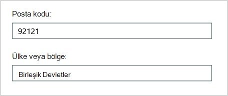

# <a name="why-you-need-to-use-powershell-for-microsoft-365"></a>Microsoft 365 için PowerShell'i neden Microsoft 365

*Bu makale hem son hem de Microsoft 365 Kurumsal hem de Office 365 Kurumsal.*

Microsoft 365 yönetim merkezi ile kullanıcı hesaplarınızı Microsoft 365 lisanslarınızı yönetebilirsiniz. Ayrıca Çevrimiçi Microsoft 365, Exchange Online, Teams ve SharePoint yönetebilirsiniz. Bunun yerine bu hizmetleri yönetmek için PowerShell kullanıyorsanız hız, otomasyon ve ek özellikler için komut satırı ve betik dili ortamından yararlanabilir ve bu ortamdan yararlanabilirsiniz.

Bu makalede, powershell kullanarak şu Microsoft 365:

- Web Microsoft 365 yönetim merkezi'de görmeyilen ek bilgileri Microsoft 365 yönetim merkezi

- PowerShell ile yalnızca mümkün olan özellikleri ve ayarları yapılandırma

- Toplu işlem yapma

- Verilere filtre uygulama

- Verileri yazdırma veya kaydetme

- Hizmetler arasında yönetme

Microsoft 365 için PowerShell'in, Windows PowerShell tabanlı hizmetler ve platformlar için bir komut satırı ortamı olan Windows modül kümesi olduğunu unutmayın. Bu ortam, ek modüllerle uzatılabilir bir komut kabuğu dili oluşturur. Basit veya karmaşık komutları veya betikleri yürütmek için bir yol sağlar. Örneğin, Microsoft 365 için PowerShell modüllerini yükledikten ve Microsoft 365 aboneliğinize bağlandıktan sonra, aşağıdaki komutu çalıştırarak tüm kullanıcı posta kutularını Microsoft Exchange Online:

```powershell
Get-Mailbox
```

Ayrıca posta kutularının listesini almak için posta kutularının listesini Microsoft 365 yönetim merkezi, ancak tüm web uygulamalarınız için tüm siteler için tüm listelerde yer alan öğeleri saymak kolay değildir.

Microsoft 365 için PowerShell, yeni metinleri değiştirmeden Microsoft 365 yönetime yardımcı olmak Microsoft 365 yönetim merkezi. Yöneticilerin Microsoft 365 için PowerShell'i kullanaları gerekir, çünkü Microsoft 365 için PowerShell komutlarıyla yaplabilecek bazı yapılandırma Microsoft 365 vardır. Böyle durumlarda, şunları nasıl yapmak zorunda olduğunu bilmek gerekir:

- Yeni modüller için PowerShell Microsoft 365 yükleyin (her yönetici bilgisayar için yalnızca bir kez yapılır).

- Bağlan (her Microsoft 365 PowerShell oturumu için bir kez) oturuma tıklayın.

- Bu komutlar için gerekli PowerShell komutlarını çalıştırmak Microsoft 365 toplayın.

- Daha fazla bilgi için PowerShell Microsoft 365 çalıştırın.

Bu temel becerileri edindikten sonra, Posta Kutusu Al komutunu kullanarak posta kutusu kullanıcılarınızı **listeleyebilirsiniz** . Ayrıca, daha önce belirtildiği gibi yeni bir komutu tüm web uygulamalarınız için tüm siteler için tüm listelerde yer alan tüm öğeleri saymak için nasıl yeni bir komut oluşturabilirsiniz? Microsoft ve yönetici topluluğu gerektiğinde bu tür görevlerde size yardımcı olabilir.

## <a name="powershell-for-microsoft-365-can-reveal-information-that-you-cant-see-with-the-microsoft-365-admin-center"></a>Microsoft 365 için PowerShell, aşağıdaki komutlarla birlikte sizin göre olmadığınız bilgileri Microsoft 365 yönetim merkezi

Aşağıdaki Microsoft 365 yönetim merkezi, birçok yararlı bilgi görüntüler. Ancak kullanıcılar, lisanslar, posta kutuları ve siteler Microsoft 365 depolayanın tüm olası bilgileri görüntülenmez. Aşağıdaki örnekte, gruptaki *kullanıcılar ve* gruplar Microsoft 365 yönetim merkezi:


Bu görünüm, birçok durumda size gereken bilgileri sağlar. Bununla birlikte, bazı zamanlarda daha fazlası gerekir. Örneğin, Microsoft 365 lisanslama (Microsoft 365 kullanıcıya kullanılabilen lisans özellikleri) kullanıcının coğrafi konumunu kısmen bağlıdır. ABD'de yaşayan bir kullanıcıya genişletiyor olabileceğiniz ilkeler ve özellikler, Hindistan veya Belçika'daki bir kullanıcıya genişletiyor olabileceğiniz ilkeler ve özelliklerle aynı değildir. Kullanıcının coğrafi konumunu Microsoft 365 yönetim merkezi için aşağıdaki adımları izleyin:

1. Kullanıcının Görünen **Adı'ne çift tıklayın**.

2. Kullanıcı özellikleri görüntüleme bölmesinde ayrıntıları **seçin**.

3. Ayrıntılar görüntüsünde ek **ayrıntıları seçin**.

4. Ülke veya bölge başlığı bulana **kadar kaydırın**:

     

5. Kullanıcının görünen adını ve konumunu bir parça kağıda yazın veya kopyalayıp başka bir kağıda Not Defteri.

Bu yordamı her kullanıcı için yinelemelisiniz. Çok sayıda kullanıcınız varsa, bu işlem can sıkıcı olabilir. Microsoft 365 için PowerShell ile, aşağıdaki komutu kullanarak tüm kullanıcılarınız için bu bilgileri görüntüebilirsiniz:

```powershell
Get-AzureADUser | Select DisplayName, UsageLocation
```


>[!Note]
>PowerShell Core, *Msol'Microsoft Azure Active Directory Msol* Windows PowerShell cmdlet'ler için Modülünü desteklemez. Bu cmdlet'leri kendi Windows PowerShell.
>

İşte sonuçlar için bir örnek:

```powershell
DisplayName                               UsageLocation
-----------                               -------------
Bonnie Kearney                            GB
Fabrice Canel                             BR
Brian Johnson (TAILSPIN)                  US
Anne Wallace                              US
Alex Darrow                               US
David Longmuir                            BR
```

Bu PowerShell komutunun yorumu: Geçerli Microsoft 365 aboneliğinde (**Get-AzureADUser**) tüm kullanıcıları edinin), ancak her kullanıcının yalnızca adını ve konumunu görüntüler (**DisplayName, UsageLocation** öğesini seçin).

Microsoft 365 için PowerShell komut kabuğu dilini desteklediğine göre, **Get-AzureADUser komutuyla alınan bilgileri daha fazla işleme koyabilirsiniz**. Örneğin, bu kullanıcıları konumlarına göre sıralamak, tüm Brezilya kullanıcılarını birlikte, Amerika Birleşik Devletleri kullanıcılarını birlikte gruplamak, buna benzer şeyleri yapmak istediğiniz olabilir. Bu komut şu şekildedir:

```powershell
Get-AzureADUser | Select DisplayName, UsageLocation | Sort UsageLocation, DisplayName
```

İşte sonuçlar için bir örnek:

```powershell
DisplayName                                 UsageLocation
-----------                                 -------------
David Longmuir                              BR
Fabrice Canel                               BR
Bonnie Kearney                              GB
Alex Darrow                                 US
Anne Wallace                                US
Brian Johnson (TAILSPIN)                    US
```

Bu PowerShell komutunun yorumu: Geçerli Microsoft 365 aboneliğinde tüm kullanıcıları alın, ancak her kullanıcının yalnızca adını ve konumunu görüntüp önce konumlarına ve ardından adlarına göre sıralayın (**Sort UsageLocation, DisplayName**).

Ayrıca, ek filtreleme de kullanabilirsiniz. Örneğin, yalnızca Brezilya'ya bağlı kullanıcılar hakkında bilgi görmek için bu komutu kullanın:

```powershell
Get-AzureADUser | Where {$_.UsageLocation -eq "BR"} | Select DisplayName, UsageLocation
```

İşte sonuçlar için bir örnek:

```powershell
DisplayName                                           UsageLocation
-----------                                           -------------
David Longmuir                                        BR
Fabrice Canel                                         BR
```

Bu PowerShell komutunun yorumu: Konumu Brezilya (**{$\_) olan geçerli Microsoft 365 kullanıcı alın. UsageLocation -eq "BR"}**) ve ardından her kullanıcının adını ve konumunu görüntüler.

 **Büyük etki alanları hakkında bir not**

On binlerce kullanıcısı olan büyük bir etki alanınız varsa, bu makalede göstermemiz gereken örneklerden bazılarına bakarak azaltmaya yol açabilirsiniz. Güç ve kullanılabilir ağ bant genişliği gibi etmenlere bağlı olarak, bir defada çok şey yapmaya çalışıyor olabilirsiniz. Büyük kuruluşlar, bu PowerShell işlemlerinin bazılarını iki komuta bölmek istiyor olabilir.

Örneğin, aşağıdaki komut tüm kullanıcı hesaplarını döndürür ve her biri için adı ve konumu gösterir:

```powershell
Get-AzureADUser | Select DisplayName, UsageLocation
```

Bu daha küçük etki alanları için çok işe yarar. Ancak büyük bir kuruluşta, bu işlemi iki komuta bölmek istiyor olabileceğiniz gibi, kullanıcı hesabı bilgilerini değişkende depolamak için bir komut ve gerekli bilgileri görüntülemek için başka bir komut daha vardır. İşte bir örnek:

```powershell
$x = Get-AzureADUser
$x | Select DisplayName, UsageLocation
```

Bu PowerShell komut kümesi yorumlanması:
1. Geçerli abonelikte yer alan tüm kullanıcıları Microsoft 365 ve bilgileri $x **$x = Get-AzureADUser adlı bir değişkende depolar**.
1.  Değişkenin içeriğini görüntüleme *$x*, ancak her kullanıcı için yalnızca adı ve konumu **içerir ($x | DisplayName, UsageLocation) öğesini seçin**.

## <a name="microsoft-365-has-features-that-you-can-only-configure-with-powershell-for-microsoft-365"></a>Microsoft 365, yalnızca Microsoft 365 için PowerShell ile yapılandırılan özelliklere Microsoft 365

Bu Microsoft 365 yönetim merkezi, çoğu ortam için geçerli olan ortak, yararlı yönetim görevlerine erişim sağlamak üzere tasarlanmıştır. Başka bir deyişle, Microsoft 365 yönetim merkezi genel yöneticinin en yaygın yönetim görevlerini gerçekleştire yönetiminden biri olacak şekilde tasarlanmıştır. Ancak yönetim merkezinde bazı görevlerin yerineiyebilirsiniz.

Örneğin, Skype Kurumsal Online yönetim merkezinde özel toplantı davetleri oluşturmak için birkaç seçenek vardır:


Bu ayarlarla, toplantı davetine bir kişiselleştirme ve profesyonellik katabilirsiniz. Ancak, toplantı yapılandırma ayarlarından daha fazlası özel toplantı davetleri oluşturmaktan daha fazlasıdır. Örneğin, varsayılan olarak toplantılar şunların izinlerini kullanır:

- Anonim kullanıcılar her toplantıya otomatik giriş elde etmek için.

- Toplantıyı kaydeden katılımcılar.

- Kurumdan gelen tüm kullanıcılar, toplantıya katıldıklarında sunucu olarak belirlenecek.

Bu ayarlara Skype Kurumsal Online yönetim merkezinden kullanılamaz. Bunları Microsoft 365 için PowerShell'den Microsoft 365. İşte bu üç ayarı devre dışı bırakan bir komut:

```powershell
Set-CsMeetingConfiguration -AdmitAnonymousUsersByDefault $False -AllowConferenceRecording $False -DesignateAsPresenter "None"
```

> [!NOTE]
> Bu komutu çalıştırmak için, [Skype Kurumsal Online PowerShell Modülü'ne yüklemiş olun](https://www.microsoft.com/download/details.aspx?id=39366).

Bu PowerShell komutunun yorumu:

1. Yeni Skype Kurumsal Online toplantılarının (**Set-CsMeetingConfiguration**) ayarlarında, anonim kullanıcıların toplantılara otomatik giriş elde etmelerine izin verme (**-AdmitAnonymousUsersByDefault $False**).
2.  Katılımcıların toplantı kaydetme özelliğini devre dışı bırakma (**-AllowConferenceRecording $False**).
3. Kuruluştan tüm kullanıcıları sunucu olarak atamayın (**-AteAsPresenter "None"**).

Bu varsayılan ayarları geri yüklemek (seçenekleri etkinleştirmek) için şu komutu çalıştırın:

```powershell
Set-CsMeetingConfiguration -AdmitAnonymousUsersByDefault $True -AllowConferenceRecording $True -DesignateAsPresenter "Company"
```

Başka benzer senaryolar da vardır ve bu nedenle yöneticilerin bu komutlar için PowerShell'i nasıl çalıştıracaklarını Microsoft 365 gerekir.

## <a name="powershell-for-microsoft-365-is-great-for-bulk-operations"></a>Microsoft 365 için PowerShell, toplu işlemler için mükemmeldir

tek bir işlem Microsoft 365 yönetim merkezi, görsel arabirimler en çok değerlidir. Örneğin, bir kullanıcı hesabını devre dışı bırakmanız gerekirse, onay kutusunu hızla bulup temizlemek için yönetim merkezini kullanabilirsiniz. Bu, PowerShell'de benzer bir işlem yapmaktan daha kolay olabilir.

Ancak, büyük bir dizi başka şeyi içinde birçok şeyi veya bazı seçili şeyleri değiştirmek zorundaysanız, Microsoft 365 yönetim merkezi en iyi araç olasilik olmaz. Örneğin, binlerce telefon numarasının ön ekini değiştirmeli veya belirli bir kullanıcı *Ken Myer'ı* tüm SharePoint kaldırabilirsiniz. Bunu aşağıdaki olayda nasıl Microsoft 365 yönetim merkezi?

Son örnekte, diyelim ki birkaç SharePoint Çevrimiçi sitelerine sahipsiniz ve Hangileri Ken Meyer'in üyesi olduğunu bilmiyor  olun. aşağıdaki yordamı her site için Microsoft 365 yönetim merkezi gerekir:

1. Sitenin **URL'sini** seçin.

2. Site **koleksiyonu özellikleri kutusunda** , **Web Sitesi Adresi bağlantısını seçerek** siteyi açın.

3. Sitede Paylaş'ı **seçin**.

4. Paylaş **iletişim** kutusunda, siteyle ilgili izinleri olan tüm kullanıcıları gösteren bağlantıyı seçin:

     

5. Paylaşılan **iletişim kutusunda** Gelişmiş'i **seçin**.

6. Kullanıcı listesini aşağı kaydırın, Ken Myer'ı bulun ve seçin (site üzerinde izinleri olduğu varsayıldı) ve ardından Kullanıcı İzinlerini **Kaldır'ı seçin**.

Bu, birkaç *yüz site* için uzun zaman alır.

Alternatif olarak, tüm sitelerden Ken Myer'ı kaldırmak Microsoft 365 için PowerShell'de aşağıdaki komutu çalıştırabilirsiniz:

```powershell
Get-SPOSite | ForEach {Remove-SPOUser -Site $_.Url -LoginName "kenmyer@litwareinc.com"}
```

> [!NOTE]
> Bu komut için SharePoint [Online PowerShell modülü yüklenir](/powershell/sharepoint/sharepoint-online/connect-sharepoint-online).

Bu PowerShell komutunun yorumu: Geçerli Microsoft 365 aboneliğindeki (**Get-SPOSite**) tüm SharePoint sitelerini alın ve her site için Ona erişen kullanıcılar listesinden Ken Meyer'i kaldırın (**ForEach {Remove-SPOUser -Site $\_. Url -LoginName "kenmyer\@ litwareinc.com"}**).

Erişimi Microsoft 365 da dahil olmak üzere tüm sitelerden Ken Meyer'i kaldırmayı söyleyin. Dolayısıyla, sonuçlar, erişimi olmayan sitelerle ilgili hatalar gösterir. Bu komutta, Ken Meyer'i yalnızca oturum açma listesinde bulunduran sitelerden kaldırmak için ek bir koşul kullanabiliriz. Ancak döndürülen hatalar sitelere zarar vermez. Bu komutun, çalışma saatleri dışında yüzlerce site üzerinde çalışması birkaç dakika Microsoft 365 yönetim merkezi.

İşte bir diğer toplu işlem örneği. Bu komutu, kuruluşta tüm sitelere yönetici olarak SharePoint veya Veya *Kearney'yi* eklemek için kullanın:

```powershell
Get-SPOSite | ForEach {Add-SPOUser -Site $_.Url -LoginName "bkearney@litwareinc.com" -Group "Members"}
```

Bu PowerShell komutunun yorumu: Geçerli Microsoft 365 aboneliğindeki ve her site için Tüm SharePoint sitelerini almak, bu kullanıcının oturum açma adını sitenin Üyeler grubuna (**ForEach {Add-SPOUser -Site $\_ ) ekleyerek Bu kullanıcıya izin veriyor. Url -LoginName "bkearney\@ litwareinc.com" -Group "Members"}**).

## <a name="powershell-for-microsoft-365-is-great-at-filtering-data"></a>Microsoft 365 için PowerShell verileri filtrelemede mükemmeldir

Aşağıdaki Microsoft 365 yönetim merkezi, hedefli bir bilgi alt kümesini kolayca bulmak için verilerinizi filtrelemek için çeşitli yollar sağlar. Örneğin, Exchange posta kutusunun herhangi bir özelliğine göre filtre uygulama kolay olur. Örneğin, Bloomington'da yaşayan tüm kullanıcıların posta kutularının listesi şöyledir:


Yönetim <a href="https://go.microsoft.com/fwlink/p/?linkid=2059104" target="_blank">Exchange merkezi de filtre</a> ölçütlerini birleştirmenizi sağlar. Örneğin, Bloomington'da yaşayan ve Finans bölümünde çalışan tüm kişilerin posta kutularını bulabilirsiniz.

Ancak, Genel Yönetim merkezinde neler Exchange vardır. Örneğin, *Bloomington veya* San Diego'da yaşayan kişilerin posta kutularını veya Bloomington'da yaşamaz tüm kişilerin posta kutularını kolayca bulamazdınız.

Bloomington veya San Diego'da Microsoft 365 posta kutularının listesini almak üzere aşağıdaki PowerShell for Microsoft 365 komutunu kullanabilirsiniz:

```powershell
Get-User | Where {$_.RecipientTypeDetails -eq "UserMailbox" -and ($_.City -eq "San Diego" -or $_.City -eq "Bloomington")} | Select DisplayName, City
```

İşte sonuçlar için bir örnek:

```powershell
DisplayName                              City
-----------                              ----
Alex Darrow                              San Diego
Bonnie Kearney                           San Diego
Julian Isla                              Bloomington
Rob Young                                Bloomington
```

Bu PowerShell komutunun yorumu: San Diego veya Bloomington şehrinde posta kutusu olan tüm Microsoft 365 aboneliğindeki tüm kullanıcıları (**Where {$ ) alın\_. RecipientTypeDetails -eq "UserMailbox" -and ($\_. Şehir -eq "San Diego" -veya $\_. Şehir -eq "Bloomington")}**) ve ardından her biri için adı ve şehri görüntüle (**DisplayName, Şehir'i seçin**).

İşte Bloomington dışında herhangi bir yerde yaşayan kişilerin posta kutularının tüm posta kutularını listele komutu:

```powershell
Get-User | Where {$_.RecipientTypeDetails -eq "UserMailbox" -and $_.City -ne "Bloomington"} | Select DisplayName, City
```

İşte sonuçlar için bir örnek:

```powershell
DisplayName                               City
-----------                               ----
MOD Administrator                         Redmond
Alex Darrow                               San Diego
Allie Bellew                              Bellevue
Anne Wallace                              Louisville
Aziz Hassouneh                            Cairo
Belinda Newman                            Charlotte
Bonnie Kearney                            San Diego
David Longmuir                            Waukesha
Denis Dehenne                             Birmingham
Garret Vargas                             Seattle
Garth Fort                                Tulsa
Janet Schorr                              Bellevue
```

Bu PowerShell komutunun yorumu: Bloomington'da ({$) yer almayan bir posta kutusu olan tüm geçerli Microsoft 365 aboneliğindeki **tüm kullanıcıları alın\_. RecipientTypeDetails -eq "UserMailbox" -and $\_. City -ne "Bloomington"}**) ve ardından her biri için adı ve şehri görüntüleniyor.

### <a name="use-wildcards"></a>Joker karakter kullanma

Ayrıca, PowerShell filtrelerde bir adın bir bölümüyle eşleşmesi için joker karakterler de kullanabilirsiniz. Örneğin, bir kullanıcı hesabı arıyorsanız varsayalım. Tek anımsayabilen şey, kullanıcının soyadı *Hernea* ya da *Henderson* veya *Jorgenson olduğudur*.

Arama aracını kullanarak ve üç farklı arama Microsoft 365 yönetim merkezi içinde o kullanıcının izlemesi olabilir:

- 1.  *Sykpya*

- Henderson için  *bir tane*

- *Jorgenson için bir tane*

Bu adların üçü de "son" ile sona erdiğinden, PowerShell'e adı "son" ile biten tüm kullanıcıları görüntülemelerini söyleyin. Bu komut şu şekildedir:

```powershell
Get-User -Filter '{LastName -like "*son"}'
```

Bu PowerShell komutunun yorumu: Geçerli Microsoft 365 aboneliğindeki tüm kullanıcıları alın, ancak yalnızca soyadları "son" (**-Filter '{LastName -like "\*son"}**' ile sona eren kullanıcıların listesini alan bir filtre kullanın). Tüm \* karakter kümelerinin açılımı, kullanıcının soyadında yer alan harflerdir.

## <a name="powershell-for-microsoft-365-makes-it-easy-to-print-or-save-data"></a>Microsoft 365 için PowerShell verileri yazdırmayı veya kaydetmeyi kolaylaştırır

Aşağıdaki Microsoft 365 yönetim merkezi veri listelerini görüntülemenizi sağlar. Skype Kurumsal Online için etkinleştirilmiş kullanıcıların listesini görüntüleyen Skype Kurumsal Online yönetim merkezine bir örnek Skype Kurumsal:


Bu bilgileri bir dosyaya kaydetmek için, bir belgeye veya çalışma sayfasına Microsoft Excel gerekir. Her iki durumda da ek biçimlendirme gerekli olabilir. Buna ek Microsoft 365 yönetim merkezi, görüntülenen listeyi doğrudan yazdırmak için bir yol sağlamaz.

Neyse ki, PowerShell'i yalnızca listeyi görüntülemekle değil, aynı zamanda kolayca başka bir dosyaya aktarılmış bir dosyaya kaydetmek için Excel. Skype Kurumsal Online kullanıcı verilerini virgülle ayrılmış değerler (CSV) dosyasına kaydeden ve bundan sonra Excel çalışma sayfasına kolayca tablo olarak aktarabilirsiniz örnek bir komut şöyledir:

```powershell
Get-CsOnlineUser | Select DisplayName, UserPrincipalName, UsageLocation | Export-Csv -Path "C:\Logs\SfBUsers.csv" -NoTypeInformation
```

İşte sonuçlar için bir örnek:


Bu PowerShell komutunun yorumu: Geçerli Microsoft 365 aboneliğinde (**Get-CsOnlineUser**) tüm Skype Kurumsal Online kullanıcılarını alın; yalnızca kullanıcı adını, UPN'yi ve konumu alın (**DisplayName, UserPrincipalName, UsageLocation**) ve bu bilgileri C:\\Logs\\SfBUsers.csv (**Export-Csv -Path "C:\\Logs\\SfBUsers.csv" -NoTypeInformation) adlı bir CSV dosyasına kaydedin**).

Bu listeyi bir XML dosyası veya HTML sayfası olarak kaydetmek için de seçenekleri kullanabilirsiniz. Aslında, diğer PowerShell komutlarıyla, istediğiniz özel biçimlendirmeyle Excel bir dosya olarak doğrudan kaydedebilirsiniz.

Ayrıca, listeyi doğrudan PowerShell'de varsayılan yazıcıda görüntüleyen PowerShell komutunun çıkışını da Windows. İşte örnek bir komut:

```powershell
Get-CsOnlineUser | Select DisplayName, UserPrincipalName, UsageLocation | Out-Printer
```

Yazdırılmış belgeniz şöyle olur:


Bu PowerShell komutunun yorumu: Geçerli Microsoft 365 aboneliğinde tüm Skype Kurumsal Online kullanıcılarını alın; yalnızca kullanıcı adını, UPN'yi ve konumu alın ve ardından bu bilgileri varsayılan Windows yazıcıya **(Yazıcı** Dışında) gönderin.

Yazdırılan belge, PowerShell komut penceresindeki görüntü ile aynı basit biçimlendirmeye sahip. Sabit kopyayı almak için yalnızca dosya **| Komutun sonuna** kadar Yazıcı Dışında.

## <a name="powershell-for-microsoft-365-lets-you-manage-across-server-products"></a>Microsoft 365 için PowerShell, sunucu ürünlerinde yönetiminizi sağlar

Bu bileşenlerin Microsoft 365 birlikte çalışmak üzere tasarlanmıştır. Örneğin, e-postanıza yeni bir kullanıcı Microsoft 365, kullanıcının departmanı ve telefon numarası gibi bilgileri belirttiğinizi varsayalım. Bu bilgiler daha sonra kullanıcının bilgilerine şu Microsoft 365 hizmetlerden (Skype Kurumsal Online, Exchange veya SharePoint.

Ama bu, ürün paketine yayılan yaygın bilgiler içindir. Kullanıcının posta kutusu bilgileri gibi ürüne özgü Exchange, normalde paket genelinde kullanılamaz. Örneğin, kullanıcının posta kutusunun etkin olup olmadığıyla ilgili bilgiler yalnızca Genel Exchange kullanılabilir.

Tüm kullanıcılarınız için aşağıdaki bilgileri gösteren bir rapor yapmakla ilgili bir rapor yapmakla ilgili olduğunu varsayalım:

- Kullanıcının görünen adı

- Kullanıcının lisansının olup olmadığı Microsoft 365

- Kullanıcının posta kutusunun Exchange etkin olup olmadığı

- Kullanıcının Skype Kurumsal Online için etkinleştiril olup olmadığı

Yeni raporda kolayca böyle bir rapor Microsoft 365 yönetim merkezi. Bunun yerine, bilgileri depolamak için çalışma sayfanızda tablo oluşturma gibi ayrı bir Excel gerekir. Ardından, Microsoft 365 yönetim merkezi'tan tüm kullanıcı adlarını ve lisans bilgilerini alın, Exchange yönetim merkezinden posta kutusu bilgilerini <a href="https://go.microsoft.com/fwlink/p/?linkid=2059104" target="_blank">alın, Skype Kurumsal</a> Online Yönetim merkezinden Skype Kurumsal Online bilgilerini alın ve bu bilgileri birleştirin.

Alternatif olarak, raporu sizin için derlemek için bir PowerShell betiği kullanabilirsiniz.

Aşağıdaki örnek betik, bu makalede şimdiye kadar görmüş olduğunu komutlardan daha karmaşıktır. Ancak, aksi halde elde etmek zor bilgi görünümleri oluşturmak için PowerShell kullanmanın olası olduğunu gösterir. İşte size gereken listeyi derlemek ve görüntülemek için betik:

```powershell
$x = Get-AzureADUser

foreach ($i in $x)
    {
      $y = Get-Mailbox -Identity $i.UserPrincipalName
      $i | Add-Member -MemberType NoteProperty -Name IsMailboxEnabled -Value $y.IsMailboxEnabled

      $y = Get-CsOnlineUser -Identity $i.UserPrincipalName
      $i | Add-Member -MemberType NoteProperty -Name EnabledForSfB -Value $y.Enabled
    }

$x | Select DisplayName, IsLicensed, IsMailboxEnabled, EnabledforSfB
```

İşte sonuçlar için bir örnek:

```powershell
DisplayName             IsLicensed   IsMailboxEnabled   EnabledForSfB
-----------             ----------   ----------------   --------------
Bonnie Kearney          True         True               True
Fabrice Canel           True         True               True
Brian Johnson           False        True               False
Anne Wallace            True         True               True
Alex Darrow             True         True               True
David Longmuir          True         True               True
Katy Jordan             False        True               False
Molly Dempsey           False        True               False
```

Bu PowerShell betiği yorumlanması:

1. Geçerli Microsoft 365 aboneliğinde tüm kullanıcıları alın ve bilgileri *$x* **$x = Get-AzureADUser) adlı bir değişkende depolar**.
1. Değişken türü (her ikisinde de olan) değişken $x tüm kullanıcılar üzerinde **$i bir döngü $x.**
1. $y adlı *bir* değişken tanımlayın ve kullanıcının posta kutusu bilgilerini bu değişkende **depolar ($y = Get-Mailbox -Identity $i.UserPrincipalName**).
1. Kullanıcı bilgilerine *IsMailBoxEnabled adlı yeni bir özellik ekleyin*. Bunu, kullanıcının posta kutusunun IsMailBoxEnabled özelliğinin (**$i | Add-Member -MemberType NoteProperty -Name IsMailboxEnabled -Value $y.IsMailboxEnabled)** değerine ayarlayın.
1. *$y* adlı bir değişken tanımlayın ve kullanıcının Skype Kurumsal Online bilgilerini burada depolar (**$y = Get-CsOnlineUser -Identity $i.UserPrincipalName**).
1. Kullanıcı bilgilerine *EnabledForSfB adlı yeni bir özellik ekleyin*. Bunu, kullanıcının Skype Kurumsal Online bilgisinin Enabled özelliğinin değerine ayarlayın (**$i | Add-Member -MemberType NoteProperty -Name EnabledForSfB -Value $y.Enabled**).
1. Kullanıcıların listesini görüntüleme; yalnızca adını, lisanslı olup olmadığını ve posta kutularının etkin olup olmadığını ve Skype Kurumsal Online için etkinleştirip etkinleştirilme olduklarını gösteren iki yeni **özelliği $x | DisplayName, IsLicensed, IsMailboxEnabled, EnabledforSfB) öğesini seçin**.

## <a name="see-also"></a>Ayrıca bkz.

[Microsoft 365 için PowerShell'i Microsoft 365](getting-started-with-microsoft-365-powershell.md)

[PowerShell Microsoft 365 hesaplarını, lisanslarını ve gruplarını yönetme](manage-user-accounts-and-licenses-with-microsoft-365-powershell.md)

[Windows PowerShell'da rapor oluşturmak için Microsoft 365](use-windows-powershell-to-create-reports-in-microsoft-365.md)