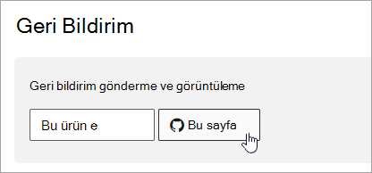

# Microsoft 365 belgeleri gezinti kılavuzu

Bu konu başlığında, teknik belge alanı içinde gezinmeye Microsoft 365 ve püf noktaları bulabilirsiniz.  

## Merkez sayfası

En Microsoft 365 hub sayfası, ilgili veri [https://aka.ms/microsoft365docs](./index.yml) türü içeriğini bulmanın giriş Microsoft 365 olur.

İstediğiniz zaman, teknik belge kümesi içindeki her **sayfanın üst Microsoft 365** üst bilgiden Başlık'ı seçerek bu Microsoft 365 dönebilirsiniz:

## ToC araması 
İçerik docs.microsoft.com, üst sıradaki filtre arama kutusunu kullanarak içindekiler tablosundaki içerikte aramaabilirsiniz:

## Sürüm filtresi
Teknik Microsoft 365 belgesinde, 21 Vianet (Çin) tarafından işletilen Office 365 Almanya ve Office 365 ürünleri dahil olmak üzere ek ürünler için içerik sağlar. Özellikler bu sürümler arasında değişiklik gösterebilir ve bu nedenle bazen içeriğin kendisi farklılık gösterebilir.

sürüm filtresinin uygun sürümüne uygun içeriği görüyor olmasını sağlamak için Microsoft 365:

## Breadcrumbs

İçerikcrumları üstbilginin altında ve içindekiler tablosu üzerinde bulunabilir ve geçerli makalenin içindekiler tablosunda nerede bulunduğu belirtebilirsiniz.  Bu, bağlamı okumakta olduğu içerik türüne ayarlamakla aynı zamanda içindekiler tablosu ağacına geri dönmenizi de sağlar:

## Makale bölüm gezintisi

Sağ gezinti bölmesi, makalenin içindeki bölümlere hızla gezinmenizi ve makale içindeki yerlerinizi tanımlamanızı sağlar.  

## Belge geri bildirimi gönderme

Bir makalede yanlış bir şey bulursanız, sayfayı aşağı kaydırarak ve İçerik geri bildirimi'yi seçerek bu makalenin SQL İçerik **ekibine geri bildirim gönderebilirsiniz**.

## Belgelere katkıda Microsoft 365 sağlama

İçeriği kendi kendinize düzenleyemezsiniz, biliyor docs.microsoft.com var mıydı? Bunu yaparsanız, belgelerimiz geliştir olmaz, aynı zamanda sayfaya katkıda bulunan olarak da kredi ödemesi yapar. Başlamak için bkz:

- [Microsoft Docs katılımcı kılavuzu](/contribute/)

## Sonraki adımlar

- Teknik belgelere Microsoft 365 [başlama](index.yml).