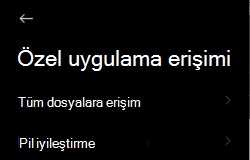

# Android'de Uç Nokta için Microsoft Defender'da sorun giderme

[!INCLUDE [Microsoft 365 Defender rebranding](../../includes/microsoft-defender.md)]

**Aşağıdakiler için geçerlidir:**
- [Uç Nokta Planı 1 için Microsoft Defender](https://go.microsoft.com/fwlink/p/?linkid=2154037)
- [Uç Nokta Planı 2 için Microsoft Defender](https://go.microsoft.com/fwlink/p/?linkid=2154037)
- [Microsoft 365 Defender](https://go.microsoft.com/fwlink/?linkid=2118804)

> Uç Nokta için Microsoft Defender'ı mı deneyimliysiniz? [Ücretsiz deneme için kaydol'](https://signup.microsoft.com/create-account/signup?products=7f379fee-c4f9-4278-b0a1-e4c8c2fcdf7e&ru=https://aka.ms/MDEp2OpenTrial?ocid=docs-wdatp-exposedapis-abovefoldlink)

Bir cihazı eklemeye başladıktan sonra uygulama yüklendikten sonra oturum açma sorunlarıyla karşı görüşebilirsiniz.

Ekleme sırasında, uygulama cihazınıza yüklendikten sonra oturum açma sorunlarıyla karşılaşabilirsiniz.

Bu makale, oturum açma sorunlarının çözümüne yardımcı olacak çözümler sunar.

## Oturum açma başarısız - beklenmeyen hata

**Oturum açma başarısız: Beklenmeyen** *hata, daha sonra deneyin*

:::image type="content" alt-text="Oturum açma başarısız hatası Beklenmeyen hata görüntüsü." source="images/f9c3bad127d636c1f150d79814f35d4c.png":::

**İleti:**

Beklenmeyen hata, daha sonra deneyin

**Neden:**

Aygıtınızda "Microsoft Authenticator" uygulamasının eski bir sürümü yüklü.

**Çözüm:**

Google Play Store'dan [Microsoft Authenticator](https://play.google.com/store/apps/details?id=com.azure.authenticator) sürümünü ve kullanıcılarını yükleyin ve yeniden deneyin.

## Oturum açma başarısız - geçersiz lisans

**Oturum açma başarısız: Geçersiz** *lisans, lütfen yöneticiye başvurun*

:::image type="content" alt-text="Oturum açma başarısız oldu resmi için lütfen yöneticiye başvurun." source="images/920e433f440fa1d3d298e6a2a43d4811.png":::

**İleti:** *Geçersiz lisans, lütfen yöneticiye başvurun*

**Neden:**

Atanmış lisans Microsoft 365 yoksa veya kuruluş bu abonelik için lisans Microsoft 365 Kurumsal yok.

**Çözüm:**

Yardım için yöneticinize başvurun.

## Güvenli olmayan siteyi bildirme

Kimlik avı web siteleri, kişisel veya finansal bilgilerinizi almak amacıyla güvenilir web sitelerinin kimliğine bürünüler. Kimlik avı [sitesi olabilir bir web sitesini](https://www.microsoft.com/wdsi/filesubmission/exploitguard/networkprotection) rapor etmek için Ağ koruması hakkında geri bildirim sağlama sayfasını ziyaret edin.

## Kimlik avı sayfaları bazı OEM cihazlarda engellenmiş değildir

**Aşağıdakiler için geçerlidir:** Yalnızca belirli OEM'ler

- **Xiaomi**

Android için Uç Nokta için Defender tarafından algılanan kimlik avı ve zararlı web tehditleri bazı Xiaomi cihazlarda engellanmaz. Aşağıdaki işlevler bu cihazlarda çalışmıyor.

**Neden:**

Xiaomi cihazları yeni bir izin modeli içerir. Bu, Android için Uç Nokta Defender'ın arka planda çalışırken açılır pencereleri görüntülemesini önler.

Xiaomi cihazları izni: "Arka planda çalışırken açılır pencereleri görüntüle."

**Çözüm:**

Xiaomi cihaz üzerinde gerekli izni etkinleştirin.

- Arka planda çalışırken açılır pencereleri görüntüleme.

## Bazı OEM cihazlarda ekleme sırasında "Kalıcı koruma" iznine izin veremiyor

**Aşağıdakiler için geçerlidir:** Yalnızca belirli OEM cihazları.

- **Android 11 ile Xiaomi**

Defender Uygulaması, uygulama eklemenin bir parçası olarak cihazlarda Pil İyileştirme/Kalıcı Koruma izni isterse ve İzin Ver'i seçmek, izin ayarlanana kadar bir hata verir. Yalnızca "Kalıcı Koruma" adlı son izni etkiler. 

**Neden:**

Xiaomi, Android 11'de pil iyileştirme izinlerini değiştirdi. Uç nokta için Defender'ın pil iyileştirmelerini yoksaymak üzere bu ayarı yapılandırmasına izin verilmiyor.

**Çözüm:**

Uygulama ekleme ekranından bu izni etkinleştirmeye olanak sağlayacak bir çözüm bulmak için OEM ile birlikte çalışıyoruz. Bu sorun çözul olduğunda belgeleri güncelleştiriz.
Kullanıcılar cihaz ayarlarından aynı izinleri etkinleştirmek için şu adımları izleyin: 

1. Cihazınızın **Ayarlar** Git'e gidin.

2. Pil İyileştirme'yi **ara ve seçin**.

   

3. Özel **uygulama erişiminde Pil** **İyileştirme'yi seçin**.

   

4. Tüm Uygulamaları göstermek için Açılan **Liste'ye göz atabilirsiniz**.

   

   

5. "Uç Nokta için Microsoft Defender" öğesini bulun ve **En İyi Duruma Getirme'yi seçin**.

   

Uç nokta ekleme için Microsoft Defender ekranına geri dönüp İzin Ver'i seçin; pano ekranına yönlendirildisiniz.

## Uygulama içinde geri bildirim gönderme

Kullanıcı yukarıdaki bölümlerde henüz çözüme ulaşamayan veya listelenen adımların kullanamadığı bir sorunla karşı karşıya geliyorsa, kullanıcı tanılama verileriyle birlikte uygulama içinde  geri **bildirim de sağlar**. Bundan sonra ekibimiz doğru çözümü sağlamak için günlükleri inceler. Kullanıcılar aynı şeyi yapmak için aşağıdaki adımları takip eder:

1.  Aygıtınızda **MDE** uygulamasını açın ve sol **üst köşedeki** profil simgesine tıklayın.

    :::image type="content" alt-text="Profil simgesine tıklayın." source="images/select-profile-icon-1.jpg":::

2.  "Yardım ve geri &" öğesini seçin.

    :::image type="content" alt-text="Yardım ve geri bildirim'i seçin." source="images/selecthelpandfeedback2.png":::

3.  "Microsoft'a geri bildirim gönder" öğesini seçin.

    :::image type="content" alt-text="Microsoft'a geri bildirim gönder'i seçin." source="images/send-feedback-to-microsoft-3.jpg":::

4.  Verilen seçeneklerden birini belirleyin. Bir sorunu rapor etmek için "Bir sorunu rapor etmek istiyorum" seçeneğini seçin.

    :::image type="content" alt-text="Sorun bildirin." source="images/report-issue-4.jpg":::

5.  Karşılaştığınız sorunun ayrıntılarını iletin ve "Tanılama verilerini gönder" konusunu kontrol edin. Ekibin bir çözüm veya izleme ile size geri dönesin için "E-posta adresinizi dahil edin" ifadesini denetlemenizi öneririz.

    :::image type="content" alt-text="Ayrıntıları ekleyin ve tanılama verileri ekleyin." source="images/finalsubmit5.png":::

6.  Geri bildirimi başarıyla göndermek için "Gönder"e tıklayın.
