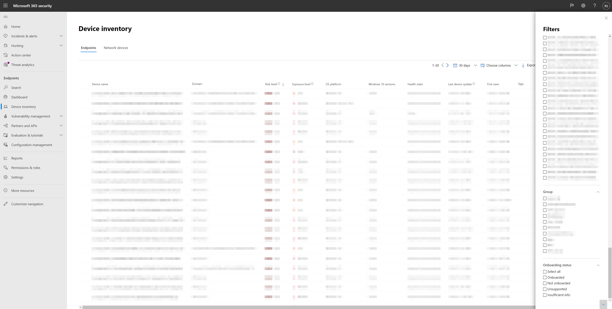

# <a name="device-discovery-overview"></a>Cihaz keşfine genel bakış

[!INCLUDE [Microsoft 365 Defender rebranding](../../includes/microsoft-defender.md)]

**Aşağıdakiler için geçerlidir:**
- [Uç Nokta Planı 2 için Microsoft Defender](https://go.microsoft.com/fwlink/p/?linkid=2154037)
- [Microsoft 365 Defender](https://go.microsoft.com/fwlink/?linkid=2118804)

Ortamınızı korumak, ağda yer alan cihazların envanterini almak gerektirir. Bununla birlikte, bir ağ üzerinden eşleme cihazları genellikle pahalı, zorlu ve zaman alıcı olabilir.

Uç Nokta için Microsoft Defender, ek cihazlara veya zahmetli süreç değişikliklerine gerek kalmadan şirket ağınıza bağlı olan, yönetimi olmayan cihazları bulamıyorum bir cihaz bulma özelliği sağlar. Cihaz bulma, ağın içinde bulunan yerleşik uç noktaları, ağını toplamak, taramak veya taramak için, unmanaged cihazları bulmak için kullanır. Cihaz bulma özelliği şunları keşfetme olanağı sağlar:

- Enterprise için Microsoft Defender'a henüz ekli olmadığınız iş noktaları (iş istasyonları, sunucular ve mobil cihazlar) yükleme
- Yönlendiriciler ve anahtarlar gibi ağ cihazları
- Yazıcılar ve kameralar gibi IoT cihazları

Eşleşmeyen bir yazıcı, zayıf güvenlik yapılandırmalarına sahip ağ cihazları veya güvenlik denetimleri olmayan bir sunucu gibi bilinmeyen ve belirlenemeyen cihazlar ağınıza önemli riskler gönderir. Cihazlar bulunduktan sonra şunlarıabilirsiniz:

- Hizmet için unmanaged endpoints onboard, bu uç noktalar üzerindeki güvenlik görünürlüğünü artırıyor.
- Güvenlik açıklarını tanımip değerlendirerek ve yapılandırma boşluklarını algıarak saldırı yüzeyini azaltın.

Cihaz bulmayla ilgili hızlı bir genel bakış için bu videoyu izleyin:

> [!VIDEO https://www.microsoft.com/en-us/videoplayer/embed/RWORdQ]

Bu özellikle birlikte, mevcut Tehdit ve Güvenlik Açığı Yönetimi deneyimi kapsamında, Uç Nokta için Microsoft Defender'a cihazları eklemeye yönelik bir güvenlik önerisi mevcuttur.

## <a name="discovery-methods"></a>Bulma yöntemleri

Yerleşik cihazlarınız tarafından kullanılacak bulma modunu seçebilirsiniz. Mod, şirket ağınız içinde yönetimi olmayan cihazlar için edinebilirsiniz görünürlük düzeyini kontrol eder.

Kullanılabilir iki keşif modu vardır:

- **Temel bulma**: Bu modda, uç noktalar ağnizdeki olayları pasif olarak toplar ve onlardan cihaz bilgilerini ayıklar. Temel bulma, pasif SenseNDR.exe veri toplama için ikili olarak kullanılır ve ağ trafiği başlat olmaz. Uç noktalar yalnızca, bir cihaz tarafından görülen her ağ trafiğinden veri ayıklar. Temel bulma sayesinde, yalnızca ağ bağlantınız için unmanaged uç noktalarında sınırlı görünürlük elde olursiniz.

- **Standart bulma** (önerilen): Bu mod, uç noktaların toplanan verileri zenginleştirmek ve daha fazla cihaz keşfetmek için ağ'daki cihazları etkin bir şekilde bulmalarına olanak tanır ve güvenilir ve tutarlı bir cihaz envanteri oluşturmanıza yardımcı olur. Pasif yöntemi kullanılarak gözlemlenen cihazlara ek olarak, standart mod daha fazla cihaz bulmak için ağda sorgular kullanan yaygın bulma protokollerini de kullanır. Standart mod, gözlemlenen cihazlar hakkında mevcut cihaz bilgilerini zenginleştirmek için ek bilgiler bulmak için akıllı ve etkin olasılıklar kullanır. Standart modu etkinleştirildiğinde, keşif algılayıcısı tarafından oluşturulan çok az ve uygun olmayan ağ etkinlikleri, kurum içinde ağ izleme araçları tarafından gözlemlenebilir.

Bulma ayarlarınızı değiştirebilir ve özelleştirebilirsiniz. Daha fazla bilgi için bkz. Cihaz [bulma'yi yapılandırma](configure-device-discovery.md).

> [!IMPORTANT]
> 19 Temmuz 2021'den itibaren tüm müşteriler için standart keşif varsayılan moddur. Ayarlar sayfasından, bu yapılandırmayı temel yapılandırma olarak değiştirebilirsiniz. Temel modu seçerseniz, yalnızca ağ bağlantınız için unmanaged uç noktalarında sınırlı görünürlük kazanırsınız.

> [!NOTE]
> Keşif altyapısı, şirket ağına alınan ağ olaylarını şirket ağının dışından ayırt edicidir. Şirket ağlarına bağlı değil cihazlar, cihaz envanteri içinde keşfed olmaz veya listelenmiyor.

## <a name="device-inventory"></a>Cihaz Envanteri

Uç Nokta için Microsoft Defender tarafından henüz ekli veya güvenlik altına alınmış olan cihazlar, Uç Noktalar sekmesinde Cihaz Envanteri'nden listelenir.

Cihaz envanteri listesinde ekleme durumu olarak adlandırılan ve aşağıdaki değerlerden herhangi birini elde eden bir filtre kullanabilirsiniz:

- Ekli: Uç nokta, Uç Nokta için Microsoft Defender'a ekli olarak gönderilir.
- Kullanılabilir: Uç nokta ağda keşfedildi ve İşletim Sistemi Uç Nokta için Microsoft Defender tarafından desteklenen bir işletim sistemi olarak tanımlanır, ancak şu anda ekli değildir. Bu cihazları işe eklemenizi kesinlikle öneririz.
- Desteklenmiyor: Uç nokta ağda bulundu ancak Uç Nokta için Microsoft Defender tarafından desteklenmiyor.
- Yetersiz bilgi: Sistem, cihazın desteklanabilirliğini belirleyemedi. Ağ'daki diğer cihazlarda standart bulmanın etkinleştirilmesi, bulunan öznitelikleri zenginleştirebilirsiniz.



> [!TIP]
> Yönetimi olmayan cihazları cihaz stok listesinden dışarıda tutmak için her zaman filtre uygulayabilirsiniz. Ayrıca, yönetimi olmayan cihazları filtrelemek için API sorgularında ekleme durumu sütununu da kullanabilirsiniz.

## <a name="network-device-discovery"></a>Ağ cihazı bulma

Kuruluşta dağıtılan, fazla sayıdaki yönetimi olmayan ağ cihazları büyük bir saldırı alanı oluşturur ve tüm kuruluş için önemli bir riski temsil eder. Uç nokta ağ bulma özellikleri için Microsoft Defender, ağ cihazlarının varlık stoku içinde bulunmasına, doğru şekilde sınıflandırılmasına ve eklenmeye yardımcı olur.

Ağ cihazları standart uç nokta olarak yönetilmiyor, çünkü Uç Nokta için Defender'ın kendi ağ cihazlarına yerleşik bir algılayıcısı olmaz. Bu tür cihazlar, uzaktan taramanın cihazlardan gerekli bilgileri edineni aracısız bir yaklaşım gerektirir. Bunu yapmak için, her ağ kesimi üzerinde önceden yapılandırılmış ağ cihazları için düzenli olarak kimliği doğrulanmış taramalar yapmak üzere uç nokta için belirlenmiş bir Microsoft Defender cihazı kullanılır. Bulunduktan sonra, Uç Nokta İçin Defender güvenlik Tehdit ve Güvenlik Açığı Yönetimi bulunan anahtarlar, yönlendiriciler, WLAN denetleyicileri, güvenlik duvarları ve VPN ağ geçitleri için tümleşik iş akışları sağlar.

Daha fazla bilgi için bkz. [Ağ cihazları](network-devices.md).

## <a name="device-discovery-integrations"></a>Cihaz Bulma Tümleştirmeleri

Uç Nokta için Microsoft Defender'ın tüm OT/IOT varlık envanterini bulmak, belirlemek ve güvenliğini sağlamak üzere yeterli görünürlük elde etmek için artık aşağıdaki tümleştirmeleri destekler:

- **Corelight**: Microsoft, Corelight ağ cihazlarından veri almak için Corelight ile ortak çalışma kaydetti. Bu, Microsoft 365 Defender da içinde olmak üzere, diğer unmanaged cihazlar veya dış ağlarla iletişim gibi, unmand cihazların ağ etkinliklerine karşı daha fazla görünürlük sağlar. Daha fazla bilgi için bkz [. Corelight veri tümleştirmesini etkinleştirme](corelight-integration.md).

- **IoT için Microsoft Defender**: Bu tümleştirme, bir IT ağına bağlı kurumsal IoT cihazlarını (örneğin, İnternet Protokolü (VoIP), yazıcılar ve akıllı TV'ler üzerinden seslendirmeyi sağlamak için uç noktanın cihaz bulma özellikleri için Microsoft Defender'ı IoT için Microsoft Defender'ın aracısız izleme özellikleriyle birleştirir. Daha fazla bilgi için bkz [. IoT tümleştirmesi için Microsoft Defender'ı etkinleştirme](enable-microsoft-defender-for-iot-integration.md).

## <a name="vulnerability-assessment-on-discovered-devices"></a>Bulunan cihazlarda güvenlik açığı değerlendirmesi

Cihazlarınız ve ağ üzerinde bulunan diğer güvenlik açıkları ve riskler, ağda bulunan ve "Güvenlik Öneriler" kapsamındaki mevcut TVM akışlarının bir parçası ve portalda var olan varlık sayfalarında temsil edilenler.
Yönetilemeyen ve yönetilen cihazlarla ilgili SSH güvenlik açıklarını bulmak için "SSH" ile ilgili güvenlik önerilerini arama.


## <a name="use-advanced-hunting-on-discovered-devices"></a>Bulunan cihazlarda Gelişmiş Av kullanma

Bulunan cihazlarda görünürlük kazanmak için Gelişmiş Av sorgularını kullanabilirsiniz.
CihazBilgileri tablosunda bulunan Uç Noktalar hakkında ayrıntıları veya DeviceNetworkInfo tablosunda bu cihazlar hakkında ağla ilgili bilgileri bulabilirsiniz.


Cihaz bulma, ekli olmayan cihazlara öznitelik etkinlikleri için ağ veri kaynağı olarak Uç nokta için Microsoft Defender'ı kullanıyor. Bu, uç nokta için Microsoft Defender ekli olmayan bir cihazla iletişim kurarsa, ekli olmayan cihazdaki etkinliklerin zaman çizelgesinde ve Gelişmiş av DeviceNetworkEvents tablosu aracılığıyla görülebnliği anlamına gelir.

Yeni etkinlikler, İletim Denetimi Protokolü (TCP) bağlantı tabanlıdır ve geçerli DeviceNetworkEvents düzenine uyar. Uç Nokta için Microsoft Defender olmayan etkin bir cihazda Uç Nokta için Microsoft Defender etkin cihaza TCP girişi.

Aşağıdaki eylem türleri de eklendi:

- ConnectionAttempt - TCP bağlantısı (syn) kurma girişimi
- ConnectionAcknowledged - TCP bağlantısının kabul edilen bir bildirim (syn\ack)

Şu örnek sorguyu  deneyebilirsiniz:

```text
DeviceNetworkEvents
| where ActionType == "ConnectionAcknowledged" or ActionType == "ConnectionAttempt"
| take 10
```

## <a name="changed-behavior"></a>Değiştirilmiş davranış

Aşağıdaki bölümde, bu özellik etkinleştirildiğinde Uç Nokta ve Kullanıcı Portalı için Microsoft Defender <a href="https://go.microsoft.com/fwlink/p/?linkid=2077139" target="_blank">Microsoft 365 Defender</a> yaptığınız değişiklikler listelenir.

1. Uç nokta için Microsoft Defender'a ekli olmadığınız cihazların cihaz envanteri, gelişmiş arama ve API sorgularında görünmesi bekmektedir. Bu, sorgu sonuçlarının boyutunu önemli ölçüde artırır.
    1. Gelişmiş Sındır'daki "CihazBilgileri" ve "DeviceNetworkInfo" tabloları artık bulunan cihazı bulunduracak. "OnboardingStatus" özniteliğini kullanarak bu cihazları filtreyi atabilirsiniz.
    2. Bulunan cihazların Streaming API sorgu sonuçlarında görünmesi bekleniyor. Sorgunuzda filtreyi kullanarak bu cihazları `OnboardingStatus` filtrenin dışında da filtresini sebilirsiniz.
2. Unmanaged devices will beassigned to existing device groups based on the defined criteria.
3. Ender durumlarda, Standart bulma, ağ monitörleri veya güvenlik araçlarında uyarıları tetikler. Bu tür olaylarla sık sık karşılaşılan sorunları önlemeye yardımcı olmak için lütfen geri bildirim gönderin. Belirli hedefleri veya alt ağların tamamını, Standart bulma tarafından etkin bir şekilde hedeflenen ağların dışında tutabilirsiniz.

## <a name="next-steps"></a>Sonraki adımlar

- [Cihaz bulma'yi yapılandırma](configure-device-discovery.md)
- [Cihaz bulma SSS](device-discovery-faq.md)
