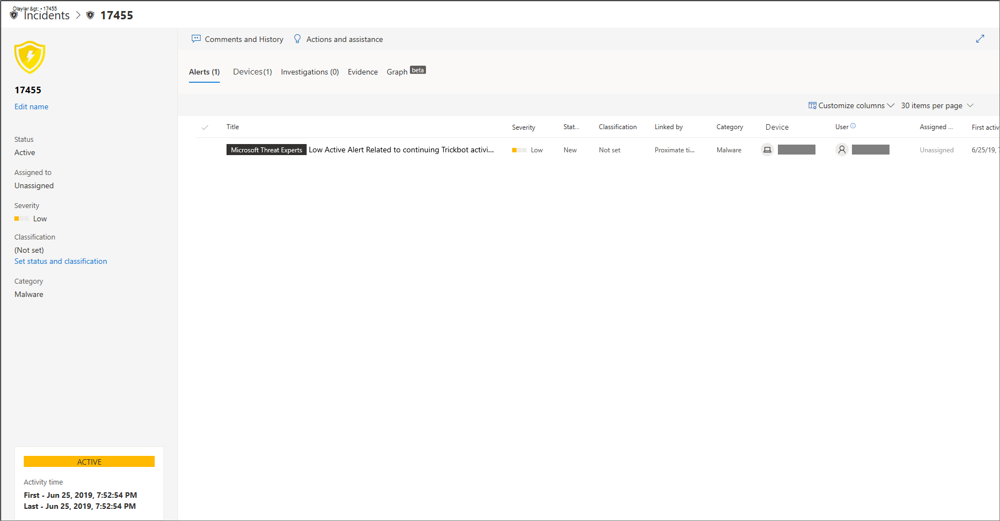
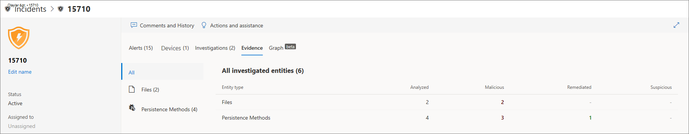

# Uç nokta için Microsoft Defender'da olayları araştırma

[!INCLUDE [Microsoft 365 Defender rebranding](../../includes/microsoft-defender.md)]

**Aşağıdakiler için geçerlidir:**
- [Uç Nokta Planı 1 için Microsoft Defender](https://go.microsoft.com/fwlink/p/?linkid=2154037)
- [Uç Nokta Planı 2 için Microsoft Defender](https://go.microsoft.com/fwlink/p/?linkid=2154037)
- [Microsoft 365 Defender](https://go.microsoft.com/fwlink/?linkid=2118804)

Anızı etkileyen olayları araştıryın, bunların ne anlama gelen olduğunu an olun ve bunları çözmek için kanıtları harmanlar.

Bir olayı incelerken şunları görüyorsunuz:

- Olay ayrıntıları
- Olay yorumları ve eylemleri
- Sekmeler (uyarılar, cihazlar, soruşturmalar, kanıt, grafik)

> [!VIDEO https://www.microsoft.com/videoplayer/embed/RE4qLUV]

## Olay ayrıntılarını çözümleme

Olay bölmesini görmek için bir **olayı tıklatın**. Olay **ayrıntılarını ve ilgili bilgileri** (uyarılar, cihazlar, soruşturmalar, kanıt, grafik) görmek için Olay sayfasını aç'ı seçin.

### Uyarılar

Uyarıları inceler ve bir olayda nasıl bağlantılı olduklarını öğrensiniz. Uyarılar, aşağıdaki nedenlere göre olaylarda gruptur:

- Otomatik araştırma - Otomatik araştırma, özgün uyarıyı araştırırken bağlantılı uyarıyı tetikler
- Dosya özellikleri - Uyarıyla ilişkilendirilmiş dosyaların benzer özellikleri vardır
- El ile ilişkilendirme - Bir kullanıcı uyarıları el ile birbirine bağlı
- Proximate time - Uyarılar belirli bir zaman çerçevesi içinde aynı cihazda tetikldi
- Aynı dosya - Uyarıyla ilişkilendirilmiş dosyalar tamamen aynıdır
- Aynı URL - Uyarıyı tetikleyen URL tamamen aynıdır

Ayrıca, uyarıyı yönetebilir ve diğer bilgilerle birlikte uyarı meta verilerini de görebilirsiniz. Daha fazla bilgi için bkz [. Uyarıları araştırma](investigate-alerts.md).

### Cihazlar

Ayrıca, ilgili veya bir olayın parçası olan cihazları da araştırabilirsiniz. Daha fazla bilgi için bkz. [Cihazları araştırma](investigate-machines.md).

### İncelemeler

Sistem **tarafından başlatılan** tüm otomatik soruşturmaları olay uyarılarına yanıt olarak görmek için Araştırmalar'ı seçin.

## Kanıtın üzerinden geçerek

Uç Nokta için Microsoft Defender, uyarılarda olayların desteklenen tüm olaylarını ve şüpheli varlıklarını otomatik olarak inceler ve önemli dosyalar, işlemler, hizmetler ve daha fazlası hakkında otomatik yanıt ve bilgi sağlar.

Çözümlenen varlıkların her biri virüs bulaştırıldı, düzeltildi veya şüpheli olarak işaretlenir.

## İlişkili siber güvenlik tehditlerini görselleştirme

Uç Nokta için Microsoft Defender tehdit bilgilerini bir olayla bir araya toplar, böylece çeşitli veri noktalarından gelen desenleri ve korelasyonları görmek için kullanılır. Bu tür bağıntıyı olay grafiği aracılığıyla görüntüabilirsiniz.

### Olay grafiği

Güvenlik **Graph** siber güvenlik saldırılarının anlat olduğu bir anlatıdır. Örneğin, hangi giriş noktası olduğunu, hangi cihazda güvenliğin veya etkinliğin gözlenen bir göstergesini gösterir. vb.

Olay grafiğinde çemberlere tıklayarak kötü amaçlı dosyaların ayrıntılarını, ilişkili dosya algılamalarını, dünya çapında kaç örnek olduğunu, kaç örnek olduğunu, bu durumda kaç örnek olduğunu, kuruluş içinde gözlemlenmiş olup olmadığını görebilirsiniz.

## İlgili konular

- [Olay sırası](/microsoft-365/security/defender-endpoint/view-incidents-queue)
- [Uç nokta için Microsoft Defender'da olayları araştırma](/microsoft-365/security/defender-endpoint/investigate-incidents)
- [Uç nokta olayları için Microsoft Defender'ı yönetme](/microsoft-365/security/defender-endpoint/manage-incidents)
