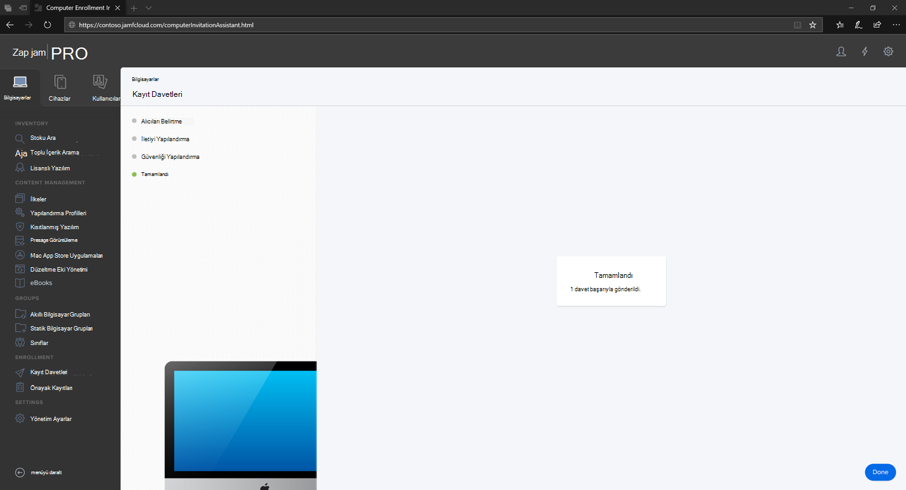

# macOS cihazlarda Uç Nokta için Microsoft Defender'ı Jamf hizmetine Pro

[!INCLUDE [Microsoft 365 Defender rebranding](../../includes/microsoft-defender.md)]

**Aşağıdakiler için geçerlidir:**
- [Uç Nokta Planı 1 için Microsoft Defender](https://go.microsoft.com/fwlink/p/?linkid=2154037)
- [Uç Nokta Planı 2 için Microsoft Defender](https://go.microsoft.com/fwlink/p/?linkid=2154037)
- [Microsoft 365 Defender](https://go.microsoft.com/fwlink/?linkid=2118804)

> Uç Nokta için Defender'ı deneyimli yapmak mı istiyor musunuz? [Ücretsiz deneme için kaydol'](https://signup.microsoft.com/create-account/signup?products=7f379fee-c4f9-4278-b0a1-e4c8c2fcdf7e&ru=https://aka.ms/MDEp2OpenTrial?ocid=docs-wdatp-investigateip-abovefoldlink)

## macOS cihazlarını kaydetme

JamF'e kaydolmanın birden çok yöntemi vardır.

Bu makale sizi iki yönteme göre yönlendirecek:

- [Yöntem 1: Kayıt Davetleri](#enrollment-method-1-enrollment-invitations)
- [Yöntem 2: Prestage Kayıtları](#enrollment-method-2-prestage-enrollments)

Tam liste için bkz. [Bilgisayar Kaydı Hakkında](https://docs.jamf.com/9.9/casper-suite/administrator-guide/About_Computer_Enrollment.html).

## Kayıt Yöntemi 1: Kayıt Davetleri

1. Jamf Kayıt Pro, Kayıt **davetleri'ne gidin**.

    

2. **+ Yeni'yi seçin**.

    

3. Davet **Adresi Için Alıcıları Belirtin** > E-posta Adresleri'nin altında alıcıların e-posta adreslerini(leri) girin.

    

    

    Örneğin: janedoe@contoso.com

    

4. Davetin iletiyi yapılandırabilirsiniz.

    

    

    

    

## Kayıt Yöntemi 2: Prestage Kayıtları

1. Jamf Pro panosunda **, Prestage kayıtları'ne gidin**.

    

2. Bilgisayar Ön Görünümü [Kayıtları'nın yönergelerini izleyin](https://docs.jamf.com/9.9/casper-suite/administrator-guide/Computer_PreStage_Enrollments.html).

## macOS cihazı kaydetme

1. Sistem **Tercihleri** penceresinden Devam'ı seçin ve CA **sertifikasını** yükleyin.

    

2. CA sertifikası yüklendikten sonra tarayıcı penceresine geri dönüp Devam'ı **seçin** ve MDM profilini yükleyin.

    

3. **JAMF'den** indirmelere izin ver'i seçin.

    

4. MDM **Profili** yüklemesi ile devam etmek için Devam'ı seçin.

    

5. MDM **Profilini yüklemek** için Devam'ı seçin.

    

6. **Yapılandırmayı tamamlamak** için Devam'ı seçin.

    
