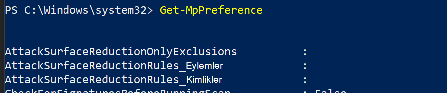

# Microsoft Endpoint Manager kullanarak işe Microsoft Endpoint Manager

[!INCLUDE [Microsoft 365 Defender rebranding](../../includes/microsoft-defender.md)]

**Aşağıdakiler için geçerlidir:**

- [Uç Nokta Planı 2 için Microsoft Defender](https://go.microsoft.com/fwlink/p/?linkid=2154037)
- [Microsoft 365 Defender](https://go.microsoft.com/fwlink/?linkid=2118804)

> Uç Nokta için Microsoft Defender'ı mı deneyimliysiniz? [Ücretsiz deneme için kaydol'](https://signup.microsoft.com/create-account/signup?products=7f379fee-c4f9-4278-b0a1-e4c8c2fcdf7e&ru=https://aka.ms/MDEp2OpenTrial?ocid=docs-wdatp-exposedapis-abovefoldlink)

Bu makale, Dağıtım kılavuzunda yer almaktadır ve örnek bir ekleme yöntemi olarak hareket almaktadır.

Planlama [başlığında](deployment-strategy.md) , cihazları hizmete eklemeye için çeşitli yöntemler sağlanmıştır. Bu konu, bulut yerel mimarisini kapsar.

 *Ortam mimarisi diyagramı*

Uç Nokta için Defender çeşitli uç noktaların ve araçların onboarding'i destekler ama bu makale bunları desteklemez. Diğer desteklenen dağıtım araçları ve yöntemleri kullanılarak genel ekleme hakkında bilgi için bkz. [Eklemeye genel bakış](onboarding.md).

[Microsoft Endpoint Manager](/mem/endpoint-manager-overview), çeşitli hizmetleri bire bir veren bir çözüm platformudur. Bu, çeşitli [Microsoft Intune](/mem/intune/fundamentals/what-is-intune)

tabanlı cihaz yönetimi.

Bu konu başlığı, kullanıcıları şu konuda yönlendirmektedir:

- 1. Adım: ŞU cihazlarda yapılandırmaları atamak için Microsoft Endpoint Manager MEM) içinde bir grup oluşturarak cihazları hizmete ekleme
- 2. Adım: Defender'ı Uç Nokta özellikleri için yapılandırma Microsoft Endpoint Manager

Bu ekleme kılavuzu, bu kılavuzu kullanırken atılması gereken aşağıdaki temel Microsoft Endpoint Manager:

- [Hedef cihazları veya kullanıcıları tanımlama](#identify-target-devices-or-users)
  - Grup oluşturma Azure Active Directory (Kullanıcı veya Cihaz)
- [Yapılandırma Profili Oluşturma](#step-2-create-configuration-policies-to-configure-microsoft-defender-for-endpoint-capabilities)
  - Bu Microsoft Endpoint Manager, her özellik için ayrı bir ilke oluşturma konusunda size yol edeceğiz.

## Kaynaklar

Burada, sürecin kalan kalanı için size gereken bağlantılar ve ardından:

- [MEM portalı](https://aka.ms/memac)
- [Microsoft 365 Defender](https://security.microsoft.com)
- [Intune Güvenlik taban çizgisi](/mem/intune/protect/security-baseline-settings-defender-atp#microsoft-defender)

Çalışma hakkında daha fazla Microsoft Endpoint Manager için şu kaynaklara bakın:

- [Microsoft Endpoint Manager sayfası](/mem/)
- [Intune ve ConfigMgr'in yakınsamasıyla ilgili blog gönderisi](https://www.microsoft.com/microsoft-365/blog/2019/11/04/use-the-power-of-cloud-intelligence-to-simplify-and-accelerate-it-and-the-move-to-a-modern-workplace/)
- [MEM'ye giriş videosu](https://www.microsoft.com/microsoft-365/blog/2019/11/04/use-the-power-of-cloud-intelligence-to-simplify-and-accelerate-it-and-the-move-to-a-modern-workplace)

## 1. Adım: CIHAZLARı, ŞU cihazlarda yapılandırmaları atamak için MEM'de bir grup oluşturarak ekleme

### Hedef cihazları veya kullanıcıları belirleme

Bu bölümde, yapılandırmalarınızı atamak için bir test grubu oluşturuz.

> [!NOTE]
> Intune, Azure Active Directory yönetmek için Azure AD) gruplarında çalışır. Intune yöneticisi olarak, grupları kuruluş ihtiyaçlarını karşılamak için kurebilirsiniz.
>
> Daha fazla bilgi için bkz [. Kullanıcıları ve cihazları düzenlemek için grup ekleme](/mem/intune/fundamentals/groups-add).

### Grup oluşturma

1. MEM portalını açın.

2. Yeni **Grup > Gruplar'a açın**.

    > [!div class="mx-imgBorder"]
    > 

3. Ayrıntıları girin ve yeni grup oluşturun.

    > [!div class="mx-imgBorder"]
    > 

4. Test kullanıcınızı veya cihazınızı ekleyin.

5. Tüm gruplar **> altında** yeni grubunızı açın.

6. **Üyeler'i > Ekle'yi seçin**.

7. Test kullanıcınızı veya cihazınızı bulun ve seçin.

    > [!div class="mx-imgBorder"]
    > 

8. Test grubunuz artık test etmek için bir üyeye sahip.

## 2. Adım: Uç nokta özellikleri için Microsoft Defender'ı yapılandırmak üzere yapılandırma ilkeleri oluşturma

Aşağıdaki bölümde bir dizi yapılandırma ilkeleri oluşturabilirsiniz.

İlk olarak, Uç Nokta için Defender'a hangi kullanıcı veya cihaz gruplarının yer olacağını seçmek için bir yapılandırma ilkesi vardır:

- [Uç nokta algılama ve yanıt](#endpoint-detection-and-response)

Ardından, farklı türde uç nokta güvenlik ilkeleri oluşturarak devam edersiniz:

- [Yeni nesil koruma](#next-generation-protection)
- [Saldırı yüzeyini azaltma](#attack-surface-reduction---attack-surface-reduction-rules)

### Uç nokta algılama ve yanıt

1. MEM portalını açın.

2. Uç nokta **algılama ve > uç nokta güvenlik durumu'ne gidin**. Profil **Oluştur'a tıklayın**.

    > [!div class="mx-imgBorder"]
    > 

3. Platform **altında, Oluştur Windows 10 da Profil - Uç nokta algılama ve yanıt > seçin**.

4. Bir ad ve açıklama girin, ardından Sonraki'yi  **seçin**.

    > [!div class="mx-imgBorder"]
    > 

5. Gerekli ayarları ve ardından Sonraki'yi  **seçin**.

    > [!div class="mx-imgBorder"]
    > 

    > [!NOTE]
    > Bu örnekte, uç nokta için Defender intune ile zaten tümleştirilmiş olarak bu otomatik doldurulmuştu. Tümleştirme hakkında daha fazla bilgi için bkz. [Intune'da Uç Nokta için Microsoft Defender'ı Etkinleştirme](/mem/intune/protect/advanced-threat-protection-configure#to-enable-microsoft-defender-atp).
    >
    > Aşağıdaki resim, Uç Nokta için Microsoft Defender Intune ile tümleşik DEĞIL olduğunda göreceğiz resmin bir örneğidir:
    >
    > 

6. Gerekirse kapsam etiketleri ekleyin ve ardından Sonraki'yi  **seçin**.

    > [!div class="mx-imgBorder"]
    > 

7. Eklemek istediğiniz grupları seçin seçeneğine **tıklayarak test grubu ekleyin** ve ardından Sonraki'yi  **seçin**.

    > [!div class="mx-imgBorder"]
    > 

8. Gözden geçir ve kabul et, ardından Oluştur'a  **seçin**.

    > [!div class="mx-imgBorder"]
    > 

9. Tamamlanmış ilkenizi görüntüabilirsiniz.

    > [!div class="mx-imgBorder"]
    > 

### Yeni nesil koruma

1. MEM portalını açın.

2. Virüsten Koruma **ve İlke > Uç >'e gidin**.

    > [!div class="mx-imgBorder"]
    > 

3. Platform **- Windows 10 ve Sonraki - Windows - Oluştur'Microsoft Defender Virüsten Koruma > seçin**.

4. Ad ve açıklama girin, ardından Sonraki'yi  **seçin**.

    > [!div class="mx-imgBorder"]
    > 

5. Yapılandırma ayarları **sayfasında**: Sistem yapılandırması için Microsoft Defender Virüsten Koruma yapılandırmaları ayarlayın (Bulut Koruması, Dışlamalar, Real-Time ve Düzeltme).

    > [!div class="mx-imgBorder"]
    > 

6. Gerekirse kapsam etiketleri ekleyin ve ardından Sonraki'yi  **seçin**.

    > [!div class="mx-imgBorder"]
    > 

7. Dahil etmek istediğiniz grupları seçin, test grubunuza attay ın ardından Sonraki'yi  **seçin**.

    > [!div class="mx-imgBorder"]
    > 

8. Gözden geçir ve oluştur'a ve ardından Oluştur'a  **seçin**.

    > [!div class="mx-imgBorder"]
    > 

9. Oluşturduğunuz yapılandırma ilkesi buradadır.

    > [!div class="mx-imgBorder"]
    > 

### Saldırı Yüzeyini Azaltma - Saldırı yüzeyini azaltma kuralları

1. MEM portalını açın.

2. Saldırı yüzeyini **azaltma hakkında > uç nokta güvenliğine gidin**.

3. İlke  **Oluştur'a seçin**.

4. Platform **- Uygulama Windows 10 - Profil - Saldırı yüzeyini azaltma kuralları'na ve Oluştur'> seçin**.

    > [!div class="mx-imgBorder"]
    > 

5. Bir ad ve açıklama girin, ardından Sonraki'yi  **seçin**.

    > [!div class="mx-imgBorder"]
    > 

6. Yapılandırma ayarları **sayfasında:** Saldırı yüzeyini azaltma kuralları için gereken yapılandırmaları ayarlayın ve ardından Sonraki'yi  **seçin**.

    > [!NOTE]
    > Saldırı yüzeyini azaltma kurallarının hepsini Denetim'e göre yapılandıracak şekilde yapılandır istiyoruz.
    >
    > Daha fazla bilgi için Saldırı [yüzeyini azaltma kuralları'ne bakın](attack-surface-reduction.md).

    > [!div class="mx-imgBorder"]
    > 

7. Kapsam Etiketlerini gereken şekilde ekleyin ve ardından Sonraki'yi  **seçin**.

    > [!div class="mx-imgBorder"]
    > 

8. Dahil etmek ve test grubuna atamak için grupları seçin, sonra da Sonraki'yi  **seçin**.

    > [!div class="mx-imgBorder"]
    > 

9. Ayrıntıları gözden geçirerek Oluştur'a  **tıklayın**.

    > [!div class="mx-imgBorder"]
    > 

10. İlkeyi görüntüleme.

    > [!div class="mx-imgBorder"]
    > 

### Saldırı Yüzeyini Azaltma - Web Koruması

1. MEM portalını açın.

2. Saldırı yüzeyini **azaltma hakkında > uç nokta güvenliğine gidin**.

3. İlke  **Oluştur'a seçin**.

4. **Oluştur'Windows 10 - Web koruma ve daha > seçin**.

    > [!div class="mx-imgBorder"]
    > 

5. Bir ad ve açıklama girin, ardından Sonraki'yi  **seçin**.

    > [!div class="mx-imgBorder"]
    > 

6. Yapılandırma ayarları **sayfasında:** Web Koruması için gereken yapılandırmaları ayarlayın ve ardından Sonraki'yi  **seçin**.

    > [!NOTE]
    > Web Korumasını Engelle olarak yapılandırıyoruz.
    >
    > Daha fazla bilgi için bkz. [Web Koruması](web-protection-overview.md).

    > [!div class="mx-imgBorder"]
    > 

7. Sonraki **adımla, Gerektiğinde Kapsam > ekleyin**.

    > [!div class="mx-imgBorder"]
    > 

8. Grup **test etmek için ata'> seçin**.

    > [!div class="mx-imgBorder"]
    > 

9. Gözden Geçir **ve Oluştur'> seçin**.

    > [!div class="mx-imgBorder"]
    > 

10. İlkeyi görüntüleme.

    > [!div class="mx-imgBorder"]
    > 

## Yapılandırma ayarlarını doğrulama

### İlkelerin uygulandığını onaylama

Yapılandırma ilkesi atandıktan sonra, ilkenin geçerliksi biraz zaman alır.

Zamanlama hakkında bilgi için bkz [. Intune yapılandırma bilgileri](/mem/intune/configuration/device-profile-troubleshoot#how-long-does-it-take-for-devices-to-get-a-policy-profile-or-app-after-they-are-assigned).

Test cihazınıza yapılandırma ilkesi uygulandığını onaylamak için, her yapılandırma ilkesi için aşağıdaki işlemi izleyin.

1. MEM portalını açın ve yukarıdaki adımlarda gösterildiği gibi ilgili ilkeye gidin. Aşağıdaki örnek, yeni nesil koruma ayarlarını gösterir.

    > [!div class="mx-imgBorder"]
    > 

2. İlke **durumunu görüntülemek** için Yapılandırma İlkesi'ne tıklayın.

    > [!div class="mx-imgBorder"]
    > 

3. Durumu  **görmek için** Cihaz Durumu'mu seçin.

    > [!div class="mx-imgBorder"]
    > 

4. Durumu  **görmek için** Kullanıcı Durumu'mu seçin.

    > [!div class="mx-imgBorder"]
    > 

5. Durumu  **görmek için Ayar başına durum'ı** seçin.

    > [!TIP]
    > Bu görünüm, başka bir ilkeyle çakışan ayarları belirlemek için çok yararlıdır.

    > [!div class="mx-imgBorder"]
    > 

### Onay uç noktada algılama ve yanıtlama

1. Yapılandırmayı uygulamadan önce, Endpoint Protection Için Defender başlat bağlı değil.

    > [!div class="mx-imgBorder"]
    > 

2. Yapılandırma uygulandıktan sonra, Endpoint Protection için Defender başlatmalıdır.

    > [!div class="mx-imgBorder"]
    > 

3. Hizmetler cihazda çalışıyor olduktan sonra, bu cihazda Microsoft Defender Güvenlik Merkezi.

    > [!div class="mx-imgBorder"]
    > 

### Yeni nesil korumayı onayla

1. İlkeyi test cihazına uygulamadan önce, aşağıda gösterildiği gibi ayarları el ile yönetebilirsiniz.

    > [!div class="mx-imgBorder"]
    > 

2. İlke uygulandıktan sonra, ayarları el ile yönetemelisiniz.

    > [!NOTE]
    > Aşağıdaki resimde **Buluta teslim edilen korumayı aç** **ve Gerçek zamanlı korumayı aç** yönetiliyor olarak gösterilmektedir.

    > [!div class="mx-imgBorder"]
    > 

### Saldırı Yüzeyini Azaltma - Saldırı yüzeyini azaltma kurallarını onaylayın

1. İlkeyi test cihazına uygulamadan önce, kalemle bir PowerShell Penceresi yazın `Get-MpPreference`.

2. Bu, içeriğiz yer vermeyen aşağıdaki satırlarla yanıt verir:

    > AttackSurfaceReductionOnlyExclusions:
    >
    > AttackSurfaceReductionRules_Actions:
    >
    > AttackSurfaceReductionRules_Ids:

    

3. İlkeyi bir test cihazına uygulamadan sonra bir PowerShell Windows yazın`Get-MpPreference`.

4. Bu, aşağıda gösterildiği gibi içeriği olan aşağıdaki satırlarla yanıt vermektedir:

    

### Saldırı Yüzeyini Azaltma - Web Koruması

1. Test cihazında bir PowerShell Windows yazın`(Get-MpPreference).EnableNetworkProtection`.

2. Bu, aşağıda gösterildiği gibi 0 ile yanıt verir.

    

3. İlkeyi uygulamadan sonra bir PowerShell Windows açın ve yazın`(Get-MpPreference).EnableNetworkProtection`.

4. Bu, aşağıda gösterildiği gibi 1 ile yanıt verir.

    
