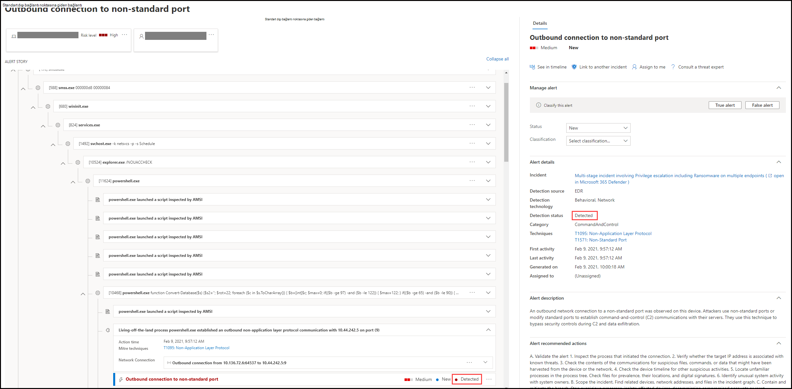

# Uç Nokta için Microsoft Defender'da uyarıları gözden geçirme

[!INCLUDE [Microsoft 365 Defender rebranding](../../includes/microsoft-defender.md)]

**Aşağıdakiler için geçerlidir:**
- [Uç Nokta Planı 2 için Microsoft Defender](https://go.microsoft.com/fwlink/p/?linkid=2154037)

> Uç Nokta için Defender'ı deneyimli yapmak mı istiyor musunuz? [Ücretsiz deneme için kaydol'](https://signup.microsoft.com/create-account/signup?products=7f379fee-c4f9-4278-b0a1-e4c8c2fcdf7e&ru=https://aka.ms/MDEp2OpenTrial?ocid=docs-wdatp-managealerts-abovefoldlink)

Ayrıntılı bir uyarı hikayesini oluşturmak üzere seçili uyarıyla ilgili saldırı sinyallerini ve uyarıları birleştirerek, Uç Nokta için Microsoft Defender'daki uyarı sayfası uyarıya tam bağlam sağlar.

Hızlı bir şekilde inceleme, inceleme ve kurumlarınızı etkileyen uyarılar üzerinde etkili bir işlem. Neden tetiklenen olduğunu ve tek konumdan etkilenmelerini anlıyoruz. Daha fazla bilgi edinmek için bu genel bakış'a bakın.

> [!VIDEO https://www.microsoft.com/videoplayer/embed/RE4yiO5]

## Uyarıyla çalışmaya başlama

Uç nokta için Defender'da bir uyarının adını seçmek sizi uyarı sayfasına ayacaktır. Uyarı sayfasında, tüm bilgiler seçili uyarı bağlamında gösterilir. Her uyarı sayfası 4 bölümden oluşur:

1. **Uyarı başlığı uyarının** adını gösterir ve sayfada ne seçtiğinize bakılmaksızın geçerli araştırmanızı başlatan uyarıyı anımsatmaya yardımcı olur.
2. [**Etkilenen varlıklar**](#review-affected-assets) , bu uyarıdan etkilenen cihaz ve kullanıcıların kartlarını listeler. Bu uyarıdan etkilenen kullanıcılar, daha fazla bilgi ve eylem için tıklanabilir.
3. Uyarı **anlatısı** , uyarıyla ilgili tüm varlıkları bir ağaç görünümüyle bağlantılı olarak görüntüler. Seçili uyarının sayfasına ilk kez geldiğinde başlıkta uyarı odak noktası olur. Uyarı hikayesinde yer alan varlıklar, ek bilgi sağlamak ve uyarı sayfasının sağ bağlamı içinde işlemnizi hızlandırmak için genişletilebilir ve tıklanabilir durumda olur. Araştırmanızı başlatmak için uyarı hikayenizi kullanın. Nasıl olduğunu öğrenmek için [Microsoft Defender for Endpoint uyarılarını araştırma.](/microsoft-365/security/defender-endpoint/investigate-alerts)
4. Ayrıntılar **bölmesi,** ilk başta seçili uyarının ayrıntılarını ve bu uyarıyla ilgili ayrıntıları ve eylemleri gösterir. Uyarı hikayesinde etkilenen varlıklardan veya varlıklardan herhangi birini seçtiysanız, ayrıntılar bölmesi seçili nesne için bağlamsal bilgi ve eylemler sağlamak üzere değişir.

Uyarınız için algılama durumunu notun.

- Önlenir: Şüpheli eylem denendi. Örneğin, bir dosya diske yazmdı veya yürütülm yoktu.

  

- Engellendi: Şüpheli davranış yürütülür ve ardından engellenir. Örneğin, bir işlem yürütülür, ancak bundan sonra şüpheli davranışlar sergilesin diye işlem sonlandırıldı.

  

- Algılandı: Bir saldırı algılandı ve hala etkin.

  

Daha sonra, uyarı ayrıntıları bölmesinde  otomatik soruşturma ayrıntılarını gözden geçirebilirsiniz; ayrıca hangi eylemlerin zaten gerçekleştir olduğunu görebilir ve önerilen eylemler için uyarı açıklamasını da inceleyebilirsiniz.

Uyarı açıldığında ayrıntılar bölmesinde mevcut olan diğer bilgiler MİTRE tekniklerini, kaynağı ve ek bağlamsal ayrıntıları içerir.

## Etkilenen varlıkları gözden geçirme

Etkilenen varlıklar bölümlerinde bir cihaz veya kullanıcı kartı seçerek ayrıntılar bölmesinde cihazın veya kullanıcının ayrıntılarına geçebilirsiniz.

- **Cihazlar için** ayrıntılar bölmesinde, cihazla ilgili Etki Alanı, İşletim Sistemi ve IP gibi bilgiler görüntülenir. Bu cihazda etkin uyarılar ve oturum açan kullanıcılar da kullanılabilir. Cihazı çıkararak, uygulama yürütmeyi kısıtarak veya virüsten koruma taraması çalıştırarak hemen harekete geçebilirsiniz. Alternatif olarak, bir araştırma paketi toplayabilirsiniz, otomatik bir araştırma başlatabilirsiniz veya cihazın görünüm noktasından araştırma yapmak için cihaz sayfasına gidebilirsiniz.

   

- **Kullanıcılar için**, ayrıntılar bölmesinde kullanıcının SAM adı ve SID gibi ayrıntılı kullanıcı bilgileri ile bu kullanıcı tarafından gerçekleştirilen oturum açma türleri ve bu kullanıcıyla ilgili tüm uyarılar ve olaylar görüntülenir. Bu kullanıcının *bakış açısından incelemeye* devam etmek için Kullanıcı sayfasını aç'ı seçin.

   

## İlgili konular

- [Olayları görüntüleme ve düzenleme](view-incidents-queue.md)
- [Olayları araştırma](investigate-incidents.md)
- [Olayları yönetme](manage-incidents.md)
