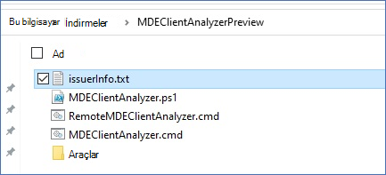

# <a name="run-the-client-analyzer-on-windows"></a>İstemci çözümleyicisini çözümleyiciyi çalışma Windows

**Aşağıdakiler için geçerlidir:**
- [Uç Nokta Planı 2 için Microsoft Defender](https://go.microsoft.com/fwlink/p/?linkid=2154037)

1. [MDE İstemci Çözümleyicisi aracını](https://aka.ms/mdatpanalyzer) araştırmaniz Windows makineye indirin.

2. Makinede MDEClientAnalyzer.zip içeriğini ayıkla.

3. Yükseltilmiş bir komut satırı açın:
    1. **Başlat'a gidin** ve **cmd yazın**.
    2. Komut istemi'ne **sağ tıklayın ve** Yönetici olarak **çalıştır'ı seçin**.

4. Aşağıdaki komutu girin ve Enter tuşuna **basın**:

   ```dos
   HardDrivePath\MDEClientAnalyzer.cmd
   ```

   **Örneğin, SabitDrivePath'i aracın ayıklanan yol ile değiştirin:**

   ```dos
   C:\Work\tools\MDEClientAnalyzer\MDEClientAnalyzer.cmd
   ```

Yukarıdakilere ek olarak, canlı yanıt kullanarak çözümleyici destek [günlüklerini toplama seçeneği de vardır](troubleshoot-collect-support-log.md).

> [!NOTE]
> Modern birleşik çözümün yüklü olduğu Windows 10/11, Windows Server 2019/2022 veya Windows Server 2012R2/2016'da, [](configure-server-endpoints.md#new-windows-server-2012-r2-and-2016-functionality-in-the-modern-unified-solution-preview) `MDEClientAnalyzer.exe` istemci çözümleyicisi betiği, bulut hizmeti URL'lerine bağlantı testlerini çalıştırmak için adlandırılan bir yürütülebilir dosyaya çağrılar.
>
> Ekleme Windows 8.1, Microsoft Monitoring Agent Windows Server 2016 (MMA) kullanılan önceki herhangi bir OS sürümü gibi istemci çözümleyicisi betiği, `MDEClientAnalyzerPreviousVersion.exe` Komut ve Denetim (CnC) URL'leri için bağlantı testleri çalıştırmak üzere çağrılmak üzere bir yürütülebilir dosyaya çağrılar. Microsoft Monitoring Agent Veri kanalı `TestCloudConnection.exe` URL'leri için bir bağlantı aracı sağlar.


Çözümleyicide yer alan tüm PowerShell betikleri ve modülleri Microsoft tarafından imzalanmıştır.
Dosyalar herhangi bir şekilde değiştirildiyse, çözümleyicinin aşağıdaki hatayla birlikte çıkışı bekleniyor:


Bu hata gösteriliyorsa, hata issuerInfo.txt bu hatanın nedeni ve hangi dosyanın etkilendiği hakkında ayrıntılı bilgi içerir:




Değişiklik yapıldıktan sonra MDEClientAnalyzer.ps1 içeriği:


## <a name="result-package-contents-on-windows"></a>Sonuç paketi içeriği Windows

> [!NOTE]
> Tam olarak yakalanan dosyalar, aşağıdakiler gibi faktörlere bağlı olarak değişebilir:
>
> - Çözümleyicinin çalıştır olduğu pencerelerin sürümü.
> - Makinede olay günlüğü kanalı kullanılabilirliği.
> - Algılayıcının başlangıç EDR (Makine henüz yerleşik olarak gelmediyse Algı durdurulur).
> - Çözümleyici komutuyla gelişmiş bir sorun giderme parametresi kullanılmışsa.

Varsayılan olarak, paketsiz MDEClientAnalyzerResult.zip aşağıdaki öğeleri içerir.

- MDEClientAnalyzer.htm

  Bu, çözümleyici betiğinin makinede çalıştırabildiklerini ve içereyle ilgili bulguları ve kılavuzu içeren ana HTML çıkış dosyasıdır.

- SystemInfoLogs \[Klasörü\]
  - AddRemovePrograms.csv

    Açıklama: Kayıt defterinden toplanan x64 işletim sistemi yazılımında x86 yüklü yazılımın listesi.

  - AddRemoveProgramsWOW64.csv

    Açıklama: Kayıt defterinden toplanan x64 işletim sistemi yazılımında x86 yüklü yazılımın listesi.

    - CertValidate.log

      Açıklama: CertUtil'e çağrılarak yürütülen sertifika iptali [sonucunda ayrıntılı sonuç](/windows-server/administration/windows-commands/certutil).

    - dsregcmd.txt

      Açıklama: [dsregcmd çalıştırarak çıktı](/azure/active-directory/devices/troubleshoot-device-dsregcmd). Bu işlem, makinenin Azure AD durumu hakkında ayrıntılı bilgi sağlar.

    - IFEO.txt

      Açıklama: [Makinede yapılandırılmış Görüntü Dosyası](/previous-versions/windows/desktop/xperf/image-file-execution-options) Yürütme Seçeneklerinin çıkışı

    - MDEClientAnalyzer.txt

      Açıklama: Bu, çözümleyici betiği yürütmenin ayrıntılarını gösteren ayrıntılı metin dosyasıdır.

    - MDEClientAnalyzer.xml

      Açıklama: Çözümleyici betik bulgularını içeren XML biçimi.

    - RegOnboardedInfoCurrent.Json

      Açıklama: Kayıt defterinden JSON biçiminde toplanmış, yerleşik makine bilgileri.

  - RegOnboardingInfoPolicy.Json

    Açıklama: Kayıt defterinden JSON biçiminde toplanmış ekleme ilkesi yapılandırması.

    - SCHANNEL.txt

      Açıklama: Kayıt defterinden toplanmış gibi bir makineye uygulanan [SCHANNEL](/windows-server/security/tls/manage-tls) yapılandırmasıyla ilgili ayrıntılar.

    - SessionManager.txt

      Açıklama: Oturum Yöneticisi'ne özgü ayarlar kayıt defterinden toplanır.

    - SSL_00010002.txt

      Açıklama: Kayıt defterinden [toplanmış](/windows-server/security/tls/manage-tls) makineye uygulanan SSL yapılandırmasıyla ilgili ayrıntılar.

- EventLogs [Klasör]

  - utc.evtx

    Açıklama: DiagTrack olay günlüğünü dışarı aktarma

  - senseIR.evtx

    Açıklama: Otomatik Araştırma olay günlüğünü dışarı aktarma

  - sense.evtx

    Açıklama: Algılayıcı ana olay günlüğünü dışarı aktarma

  - OperationsManager.evtx

    Açıklama: Microsoft Monitoring Agent olay günlüğünü dışarı aktarma


## <a name="see-also"></a>Ayrıca bkz.

- [İstemci çözümleyicisi genel bakış](overview-client-analyzer.md)
- [İstemci çözümleyicisini indirme ve çalıştırma](download-client-analyzer.md)
- [Windows'da gelişmiş sorun giderme için veri Windows](data-collection-analyzer.md)
- [Çözümleyici HTML raporunu anlama](analyzer-report.md)
