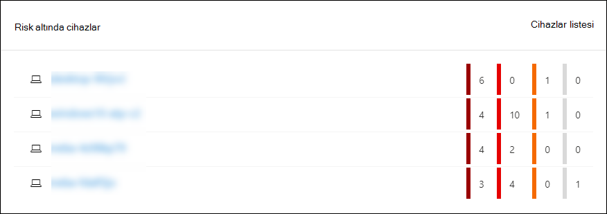
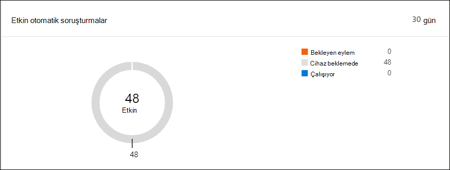

# Microsoft Defender Güvenlik Merkezi İşlemler panosu

[!INCLUDE [Microsoft 365 Defender rebranding](../../includes/microsoft-defender.md)]

**Aşağıdakiler için geçerlidir:**
- [Uç Nokta Planı 2 için Microsoft Defender](https://go.microsoft.com/fwlink/?linkid=2154037)

> Uç Nokta için Microsoft Defender'ı mı deneyimliysiniz? [Ücretsiz deneme için kaydol'](https://signup.microsoft.com/create-account/signup?products=7f379fee-c4f9-4278-b0a1-e4c8c2fcdf7e&ru=https://aka.ms/MDEp2OpenTrial?ocid=docs-wdatp-secopsdashboard-abovefoldlink)

Güvenlik **işlemleri panosu**, en uç noktada algılama ve yanıtlama ortaya çıkar. Algılamaların nerede görüldükleri ve yanıt eylemlerinin gerekli olduğu vurgular hakkında üst düzey bir genel bakış sağlar.

Pano aşağıdakilerin anlık görüntüsünü görüntüler:

- Etkin uyarılar
- Risk altında cihazlar
- Algılayıcı sağlığı
- Hizmet durumu
- Günlük cihazlar raporlaması
- Etkin otomatik soruşturmalar
- Otomatik soruşturma istatistikleri
- Risk altında kullanıcılar
- Şüpheli etkinlikler

Ağ üzerinde şüpheli etkinliklerin gerçekleştir olup olmadığını, nerede ve ne zaman olduğunu hemen belirlemek için uyarıları ve cihazları inceler ve araştırabilirsiniz; bu etkinliklerin hangi bağlamda olduğunu anlamanıza yardımcı olur.

Güvenlik **işlemleri panosunda** , cihazda önemli etkinliklerin veya davranışların tanımlanmasını kolaylaştırmak için toplanan olayları görürsünüz. Ayrıca ayrıntılı olaylara ve düşük düzeyli göstergelere de detaya girsiniz.

Ayrıca, kurum genel durumuyla ilgili görsel ipuçları vermek için tıklanabilir kutucuklar da vardır. Her kutucuk ilgili genel görünümün ayrıntılı bir görünümünü açar.

## Etkin uyarılar

Kutucukta, ağda son 30 gün içinde etkin uyarıların toplam sayısını görüntüebilirsiniz. Uyarılar Yeni ve Sürüyor **olarak** **gruplandı**.

Her grup, ilgili uyarı önem düzeyine göre daha da alt kategorilere ayrılmıştır. Her uyarı halkası içindeki uyarı sayısını tıklatın ve o kategorinin kuyruğuna ait sıralanmış görünümü görüntüleyin (Yeni **veya** **Sürüyor**).

Daha fazla bilgi için [Uyarılar'a genel bakış bilgilerine bakın](alerts-queue.md).

Her satır bir uyarı önem düzeyi kategorisi ve uyarının kısa bir açıklamasını içerir. Ayrıntılı görünümünü görmek için uyarıya tıkabilirsiniz. Daha fazla bilgi için bkz  [. Uç nokta uyarıları ve Uyarılar için Microsoft Defender'ı](investigate-alerts.md) [Araştırma genel bakış](alerts-queue.md).

## Risk altında cihazlar

Bu kutucuk size, en yüksek etkin uyarı sayısına sahip cihazların listesini gösterir. Her cihaz için toplam uyarı sayısı cihaz adının yanında bir daire içinde gösterilir ve kutucuğun en ucundaki önem düzeyine göre daha da kategorilere ayrılmıştır (etiketini görmek için her önem derecesi çubuğunun üzerine gelin).

Bu cihazla ilgili ayrıntıları görmek için cihazın adına tıklayın. Daha fazla bilgi için bkz [. Uç Nokta Cihazları için Microsoft Defender listesinde cihazları araştırma](investigate-machines.md).

Etkin uyarı **sayısına göre** sıralanmış olarak doğrudan Cihazlar listesine gitmek **için** kutucuğun en üstünde Cihazlar listesine de tıkabilirsiniz. Daha fazla bilgi için bkz [. Uç Nokta Cihazları için Microsoft Defender listesinde cihazları araştırma](investigate-machines.md).

## Algılayıcı sorunu olan cihazlar

Algılayıcı **sorunu olan cihazlar kutucuğu** , ayrı ayrı cihazın Uç Nokta hizmeti için Microsoft Defender'a algılayıcı verileri sağlayabilme yeteneği hakkında bilgi sağlar. Kaç cihaza dikkat gerek olduğunu rapor ediyor ve sorunlu cihazları tanımlamanıza yardımcı oluyor.

Hizmete düzgün bir şekilde rapor etmek için bildirilen cihazların sayısı hakkında bilgi sağlayan iki durum göstergesi vardır:

- **Hatalı yapılandırma: Bu** cihazlar kısmen uç nokta için Microsoft Defender'a algılayıcı verilerini bildiriyor olabilir ve düzeltilmesi gereken yapılandırma hataları olabilir.
- **Etkin Olmayan**: Geçen ay içinde yediden fazla gün boyunca Uç Nokta için Microsoft Defender hizmetine bildirmeyi durduran cihazlar.

Gruplardan herhangi birini tıklatmanız, tercihe bağlı olarak filtrelenmiş cihazlar listesine yönlendirildiniz. Daha fazla bilgi için bkz [. Algılayıcı durumunu denetleme](check-sensor-status.md) ve [Cihazları araştırma](investigate-machines.md).

## Hizmet durumu

Hizmet **durumu kutucuğu** , hizmetin etkin olup olduğunu veya sorun olup olduğunu size haber sağlar.

Hizmet durumu hakkında daha fazla bilgi için bkz [. Uç nokta için Microsoft Defender hizmet durumunu denetleme](service-status.md).

## Günlük cihazlar raporlaması

Günlük **cihazlar raporlama kutucuğu** , son 30 gün içinde günlük olarak rapor eden cihazların sayısını gösteren bir çubuk grafik gösterir. Her gün raporlama yapılan cihazların tam sayısını görmek için grafikte tek tek çubukların üzerine gelin.

## Etkin otomatik soruşturmalar

Etkin otomatik soruşturmalar kutucuğunu kullanarak, ağınız için son 30 gün içinde yapılan otomatik **soruşturmaların toplam sayısını görüntüebilirsiniz** . Araştırma, Bekleyen eylem, **Cihaz bekleniyor** ve Çalışıyor **olarak** **gruplandı**.

## Otomatik soruşturma istatistikleri

Bu kutucuk, son yedi gün içinde otomatik soruşturmalarla ilgili istatistikleri gösterir. Tamamlanan araştırma sayısını, başarılı bir şekilde düzeltilen soruşturmaların sayısını, bir soruşturmanın başlatılması için gereken ortalama bekleme süresi, bir uyarıyı düzeltmek için gereken ortalama süre, araştırılan uyarı sayısını ve genel bir elle incelemeden kaydedilen otomasyon saatlerini gösterir. 

Uygun kategoriye **göre filtrelenmiş** olarak Araştırma sayfasına gitmek için Otomatik  soruşturmalar **, Düzeltilen** soruşturmalar ve Araştırılan Uyarılar'a tıkleyebilirsiniz. Bu, bağlam içinde soruşturmaların ayrıntılı dökümünü görmenizi sağlar.

## Risk altında kullanıcılar

Kutucuk en etkin uyarılara ve yüksek, orta veya düşük uyarılarda görülen uyarı sayısına sahip kullanıcı hesaplarının listesini gösterir. 

Kullanıcı hesabıyla ilgili ayrıntıları görmek için kullanıcı hesabına tıklayın. Daha fazla bilgi için bkz [. Kullanıcı hesabını araştırma](investigate-user.md).

> Uç Nokta için Microsoft Defender'ı mı deneyimliysiniz? [Ücretsiz deneme için kaydol'](https://signup.microsoft.com/create-account/signup?products=7f379fee-c4f9-4278-b0a1-e4c8c2fcdf7e&ru=https://aka.ms/MDEp2OpenTrial?ocid=docs-wdatp-secopsdashboard-belowfoldlink)

## İlgili konular

- [Uç nokta portalı için Microsoft Defender'ı anlama](use.md)
- [Portala genel bakış](portal-overview.md)
- [Threat & Vulnerability Management panosunun görünümünü görüntüleme](tvm-dashboard-insights.md)
- [Threat Analytics panosuna göz atarak önerilen risk azaltma eylemleri gerçekleştirin](threat-analytics.md)
