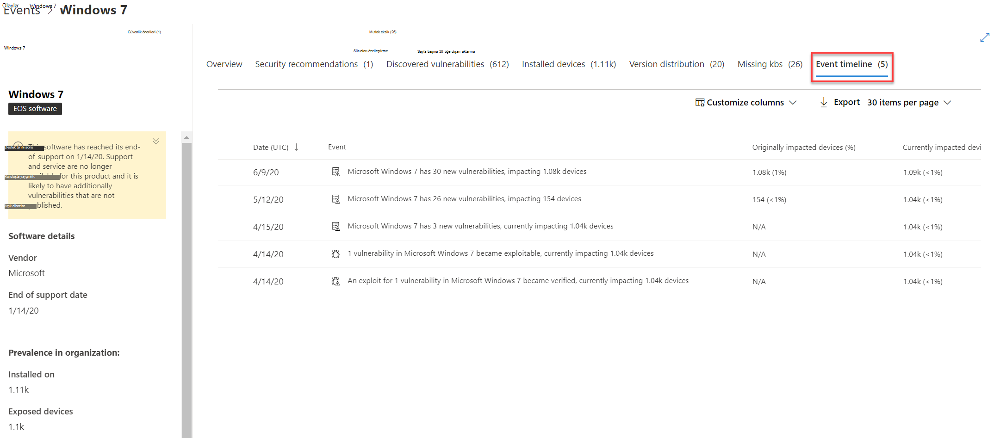

# Etkinlik zaman çizelgesi - Tehdit ve Güvenlik Açığı Yönetimi

[!INCLUDE [Microsoft 365 Defender rebranding](../../includes/microsoft-defender.md)]

**Aşağıdakiler için geçerlidir:**
- [Uç Nokta Planı 2 için Microsoft Defender](https://go.microsoft.com/fwlink/?linkid=2154037)
- [Microsoft 365 Defender](https://go.microsoft.com/fwlink/?linkid=2118804)

> Uç Nokta için Microsoft Defender'ı mı deneyimliysiniz? [Ücretsiz deneme için kaydol'](https://signup.microsoft.com/create-account/signup?products=7f379fee-c4f9-4278-b0a1-e4c8c2fcdf7e&ru=https://aka.ms/MDEp2OpenTrial?ocid=docs-wdatp-portaloverview-abovefoldlink)

Etkinlik zaman çizelgesi, yeni güvenlik açıkları veya açıkları ya da açıkları aracılığıyla kuruluşa risklerin nasıl gir açıkları olduğunu yorumlamanıza yardımcı olan bir risk haber akışıdır. Kuruluş riskini etkileyilebilecek olayları görüntüabilirsiniz. Örneğin, ortaya eklenen yeni güvenlik açıklarını, sömürülebilir hale gelen güvenlik açıklarını, bir exploit kit'ine eklenen açıkları ve daha fazlasını bulabilirsiniz.

Etkinlik zaman çizelgesi, büyük değişikliklerin nedenini belirlemenize yardımcı [olmak](tvm-exposure-score.md) için pozlama puanınızı ve Cihazlar [için Microsoft Güvenli](tvm-microsoft-secure-score-devices.md) Puanı'nın öyküünü de anlatır. Etkinlikler cihazlarınızı veya cihaz puanınızı etkiler. Önceliklendirmeli güvenlik önerilerine dayalı olarak nelerin düzeltilleri gerektiğini ele alarak maruz kalma [süresini azaltabilirsiniz](tvm-security-recommendation.md).

> [!TIP]
> Yeni güvenlik açığı olayları hakkında e-postalar almak için bkz. Uç Nokta için [Microsoft Defender'da güvenlik açığı e-posta bildirimlerini yapılandırma](configure-vulnerability-email-notifications.md)

## Olay zaman çizelgesi sayfasına gidin

Ayrıca, Giriş panosundan üç [Tehdit ve Güvenlik Açığı Yönetimi vardır](tvm-dashboard-insights.md):

- **Kuruluş pozlama puanı kartı**: "Zaman içinde pozlama puanı" grafiğinde etkinlik noktaları üzerine gelin ve "Bugünden tüm etkinlikleri gör" öğesini seçin. Olaylar yazılım güvenlik açıklarını temsil eder.
- **Cihazlar için Microsoft Güvenli** Puan: "Zaman içinde cihazlar için puanınız" grafiğinde etkinlik noktaları üzerine gelin ve "Bugünden itibaren tüm etkinlikleri gör" öğesini seçin. Olaylar yeni yapılandırma değerlendirmelerini temsil ediyor.
- **En önemli etkinlik** kartı: En önemli etkinlikler tablonun altındaki "Daha fazla göster"i seçin. Kart, son 7 gün içinde en çok etkileyen üç olayları görüntüler. Etkin etkinlikler, etkinliğin çok fazla sayıda cihazı etkilediği veya kritik bir güvenlik açığı olması durumunda dahil olabilir.

### Pozlama puanı ve Cihazlar için Microsoft Güvenli Puan grafikleri

Tehdit ve Güvenlik Açığı Yönetimi panosunda, cihazlarınızı etkileyen en önemli yazılım açığı olaylarını görüntülemek için etkilenme puanı grafiğinin üzerine gelin. Puanınızı etkileyen yeni güvenlik yapılandırması değerlendirmelerini görüntülemek için Cihazlar için Microsoft Güvenli Puanı grafiğinin üzerine gelin.

Cihazlarınızı veya cihazlarınız için puanınızı etkileyen bir etkinlik yoksa, hiçbiri gösterilmez.

 

### O günün olaylarından ayrıntıya gitme

Bu günden **itibaren tüm etkinlikleri göster'i seçmek** , sizi o gün için özel bir tarih aralığı olan Etkinlik zaman çizelgesi sayfasına alır.

Tarih **aralığını başka** bir özel aralıkla veya önceden ayarlanmış bir zaman aralığıyla değiştirmek için Özel aralık'ı seçin.

## Etkinlik zaman çizelgesine genel bakış

Olay zaman çizelgesi sayfasında, bir olayla ilgili tüm gerekli bilgileri görüntüleyebilirsiniz.

Özellikler:

- Sütunları özelleştirme
- Olay türüne veya etkilenmiş cihazların yüzdesini filtreleme
- Sayfa başına 30, 50 veya 100 öğe görüntüleme

Sayfanın en üstünde yer alan iki büyük sayı, yeni güvenlik açıklarının ve açıklarından yararlanılabilir güvenlik açıklarının sayısını gösterir; olaylar değil. Bazı olaylarda birden çok güvenlik açıkları ve bazı güvenlik açıkları da birden fazla olay olabilir.

### Sütunlar

- **Tarih**: ay, gün, yıl
- **Olay**: Bileşen, tür ve etkiyisi olan cihazların sayısı da içinde olmak üzere etkili bir olay
- **İlgili bileşen**: yazılım
- **Başlangıçta etkileyen cihazlar**: bu etkinlikte etkilenen cihazların sayısı ve yüzde değeri. Ayrıca, toplam cihaz sayısının dışında, başlangıçtan etkilenmiş cihazların yüzdesini filtreleebilirsiniz.
- **Şu anda etki edilen** cihazlar: bu etkinliğin şu anda etkilemektedir olduğu cihazların geçerli numarası ve yüzde değeri. Bu alanı, Sütunları özelleştir'i **seçerek bulabilirsiniz**.
- **Türler**: puanı etkileyen zaman damgalı olayları yansıtın. Filtre ed olabilir.
  - Exploit bir exploit kit'e eklendi
  - Exploit doğrulandı
  - Yeni kamu açıklarından yararlanma
  - Yeni güvenlik açığı
  - Yeni yapılandırma değerlendirmesi
- **Puan eğilimi**: açık puan eğilimi

### Simgeler

Etkinliklerin yanında aşağıdaki simgeler gösterilir:

-  Yeni kamu açıklarından yararlanma
-  Yeni güvenlik açığı yayımlandı
-  Exploit kit'te bulunan exploit
-  Exploit verified

### Belirli bir olayın detaya gitme

Bir etkinlik seçin ve cihazlarınızı etkileyen geçerli CVE'leri listeli bir uç uçarak görünür. Daha fazla CVR gösterebilir veya ilgili öneriyi görüntüabilirsiniz.

"Puan eğilimi"nin altındaki ok, bu etkinliğin kurumsal açık kalma puanınızı yükseltip yükseltemeyebileceklerini belirlemenize yardımcı olur. Daha yüksek pozlama puanı, cihazların açıklarından yararlanmaya karşı daha korumasız olduğu anlamına gelir.

Buradan, güvenlik **önerileri sayfasında İlgili güvenlik** önerisine git'i seçerek yeni yazılım güvenlik [açığının giderin önerisine bakın](tvm-security-recommendation.md). Güvenlik önerisinde açıklamayı ve güvenlik açığı ayrıntılarını okuduktan sonra bir düzeltme isteği gönderebilir ve düzeltme sayfasında [isteği izleyebilirsiniz](tvm-remediation.md).

## Yazılım sayfalarında Etkinlik zaman çizelgelerini görüntüleme

Yazılım sayfasını açmak için, açılır > "İlgili bileşen" adlı bölümde köprüye bağlı yazılım adını (Visual Studio 2017 gibi) seçin. [Yazılım sayfaları hakkında daha fazla bilgi](tvm-software-inventory.md#software-pages)

Belirli bir yazılımın tüm ayrıntılarının yer olduğu tam bir sayfa görüntülenir. Belirli bir yazılımla ilgili olayların zaman çizelgesini görmek için fareyi grafiğin üzerinde tutun.

Bu yazılımla ilgili tüm olayları görüntülemek için olay zaman çizelgesi sekmesine gidin. Ayrıca güvenlik önerilerini, bulunan güvenlik açıklarını, yüklü cihazları ve sürüm dağıtımını da görüntüebilirsiniz.

## İlgili konular

- [Tehdit ve güvenlik açığı yönetimi genel bakış](next-gen-threat-and-vuln-mgt.md)
- [Pano](tvm-dashboard-insights.md)
- [Pozlama puanı](tvm-exposure-score.md)
- [Güvenlik önerileri](tvm-security-recommendation.md)
- [Güvenlik açıklarını düzeltme](tvm-remediation.md)
- [Yazılım envanteri](tvm-software-inventory.md)
