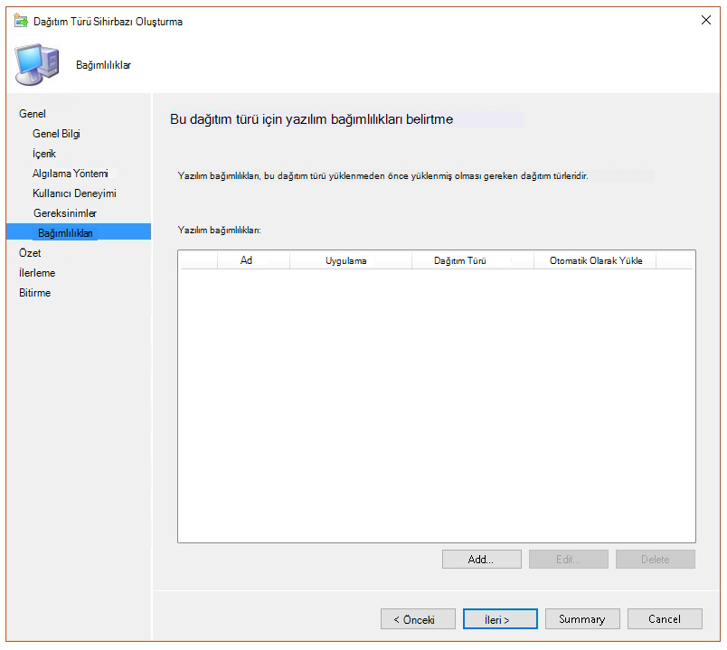
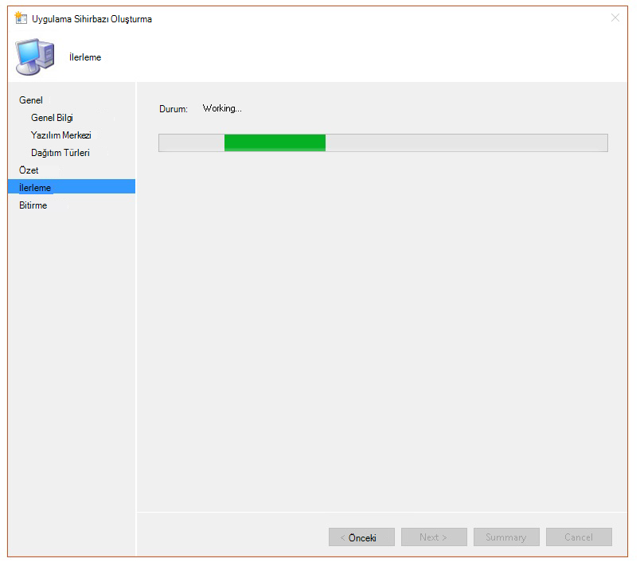

# <a name="troubleshoot-microsoft-defender-for-endpoint-onboarding-issues"></a>Uç nokta ekleme sorunları için Microsoft Defender'da sorun giderme

[!INCLUDE [Microsoft 365 Defender rebranding](../../includes/microsoft-defender.md)]


**Aşağıdakiler için geçerlidir:**

- [Uç Nokta Planı 2 için Microsoft Defender](https://go.microsoft.com/fwlink/p/?linkid=2154037)
- Windows Server 2012 R2
- Windows Server 2016
- [Microsoft 365 Defender](https://go.microsoft.com/fwlink/?linkid=2118804)

> Uç Nokta için Defender'ı deneyimli yapmak mı istiyor musunuz? [Ücretsiz deneme için kaydol'](https://signup.microsoft.com/create-account/signup?products=7f379fee-c4f9-4278-b0a1-e4c8c2fcdf7e&ru=https://aka.ms/MDEp2OpenTrial?ocid=docs-wdatp-pullalerts-abovefoldlink)

Sorunlarla karşılaşırsanız Uç Nokta için Microsoft Defender ekleme işlemini gidermeniz gerekir.
Bu sayfada, dağıtım araçlarından biri ile dağıtım sırasında ortaya çıkacak ekleme sorunlarını ve cihazlarda oluşabilir yaygın hataları gidermeye yardımcı olacak ayrıntılı adımlar sağlar.

Ekleme araçlarıyla ilgili sorunları gidermeye başlamadan önce, hizmetlere cihaz ekleme için en düşük gereksinimlerin karşı olup olduğunu kontrol etmek önemlidir. [Cihazları hizmete eklemeye lisans, donanım ve yazılım gereksinimleri hakkında bilgi edinebilirsiniz](minimum-requirements.md).

## <a name="troubleshoot-issues-with-onboarding-tools"></a>Ekleme araçlarıyla ilgili sorunları giderme

Ekleme işlemini tamamladıysanız ve bir saat sonra Cihazlar listesinde cihazları görmüyorsanız, bu [](investigate-machines.md) bir ekleme veya bağlantı sorunu gösteriyor olabilir.

### <a name="troubleshoot-onboarding-when-deploying-with-group-policy"></a>Grup İlkesi ile dağıtım için ekleme sorunlarını giderme

Grup İlkesiyle Dağıtım, cihazlarda ekleme betiği çalıştırarak  yapılır. Grup İlkesi konsolu, dağıtımın başarılı olup olmadığını belirter.

Ekleme işlemini tamamladıysanız ve bir saat sonra Cihazlar listesinde cihazları görmüyorsanız, betiğin çıktısını cihazlardan kontrol edin.[](investigate-machines.md) Daha fazla bilgi için bkz [. Betikle dağıtım için ekleme sorunlarını giderme](#troubleshoot-onboarding-when-deploying-with-a-script).

Betik başarıyla tamamlanırsa, [oluşan ek hatalar](#troubleshoot-onboarding-issues-on-the-device) için bkz. Cihazlardaki ekleme sorunlarını giderme.

### <a name="troubleshoot-onboarding-issues-when-deploying-with-microsoft-endpoint-configuration-manager"></a>Microsoft Endpoint Configuration Manager ile dağıtım için ekleme sorunlarını giderme

Configuration Manager'ın aşağıdaki sürümlerini kullanan cihazlar kullanılırken:

- Microsoft Uç Noktası Yapılandırma Yöneticisi
- System Center 2012 Yapılandırma Yöneticisi
- System Center 2012 R2 Yapılandırma Yöneticisi

Configuration Manager'ın yukarıda bahsedilen sürümleriyle dağıtım, cihazlarda ekleme betiği çalıştırarak yapılır. Dağıtımı Yapılandırma Yöneticisi Konsolu'nu kullanarak izleyebilirsiniz.

Dağıtım başarısız olursa, betiğin çıkışını cihazlardan kontrol edin.

Ekleme başarıyla tamamlandı ancak cihazlar bir saat sonra Cihazlar listesinde görünmüyorsa, ortaya  çıkabilir diğer hatalar için bkz. Cihazda [](#troubleshoot-onboarding-issues-on-the-device) ekleme sorunlarını giderme.

### <a name="troubleshoot-onboarding-when-deploying-with-a-script"></a>Komut dosyasıyla dağıtım için ekleme sorunlarını giderme

**Betiğin cihazda sonucu kontrol edin:**

1. **Başlat'a** tıklayın, **Olay Görüntüleyicisi yazın** ve Enter tuşuna **basın**.

2. Günlükler **Uygulaması Windows** \> **gidin**.

3. **WDATPOnboarding olay kaynağından bir** olay bakın.

Betik başarısız olursa ve olay bir hata ise, sorunu gidermenize yardımcı olmak için aşağıdaki tabloda yer alan olay kimliğini kontrol edin.

> [!NOTE]
> Aşağıdaki olay kimlikleri yalnızca ekleme betiğine özeldir.

<br>

****

|Olay Kimliği|Hata Türü|Çözüm adımları|
|:---:|---|---|
|`5`|Offboard verileri bulundu ancak silinemedi|Özellikle kayıt defteri izinlerini denetleyin <p> `HKLM\SOFTWARE\Policies\Microsoft\Windows Advanced Threat Protection`.|
|`10`|Ekleme verileri kayıt defterine yazilamadı|Özellikle kayıt defteri izinlerini denetleyin <p> `HKLM\SOFTWARE\Policies\Microsoft\Windows Advanced Threat Protection`. <p> Betiğin yönetici olarak çalıştır doğrulayın.|
|`15`|SENSE hizmeti başlatılamadı|Hizmet durumunu denetleme (`sc query sense` komut). Ara durumda (*'Pending_Stopped'*, 'Pending_Running *'*) durumda olmadığınından emin olun ve betiği yeniden çalıştırmayı deneyin (yönetici haklarıyla). <p> Cihaz şu sürümde Windows 10 1607 ve komut çalıştırılıyorsa`sc query sense`, `START_PENDING`cihazı yeniden başlatın. Cihazı yeniden başlatmak soruna neden olmayacaksa KB4015217 sürümüne yükseltin ve yeniden başlatmayı deneyin.|
|`15`|SENSE hizmeti başlatılamadı|Hata iletisi: Sistem hatası 577 veya 1058 hatası oluştu ise, Microsoft Defender Virüsten Koruma ELAM sürücüsünü etkinleştirmeniz gerekir. Yönergeler için bkz. [Microsoft Defender Virüsten Koruma'un](#ensure-that-microsoft-defender-antivirus-is-not-disabled-by-a-policy) devre dışı bırakılmış olduğundan emin olun.|
|`30`|Betik, hizmetin çalışmaya başlaması için bekleyemedi|Hizmet başlamaya çalışırken daha fazla zaman almış veya hatalarla karşılaşmış olabilir. SENSE ile ilgili olaylar ve hatalar hakkında daha fazla bilgi için bkz. [Olay görüntüleyiciyi kullanarak olayları ve hataları gözden geçirme](event-error-codes.md).|
|`35`|Betik gerekli ekleme durumu kayıt defteri değerini bulamadı|SENSE hizmeti ilk kez başladığında, kayıt defteri konumuna ekleme durumunu yazar <p> `HKLM\SOFTWARE\Microsoft\Windows Advanced Threat Protection\Status`. <p> Betik birkaç saniye sonra bulamadı. El ile test edebilirsiniz ve orada olup olduğunu kontrol edebilirsiniz. SENSE ile ilgili olaylar ve hatalar hakkında daha fazla bilgi için bkz. [Olay görüntüleyiciyi kullanarak olayları ve hataları gözden geçirme](event-error-codes.md).|
|`40`|SENSE hizmet ekleme durumu **1 olarak ayarlanmaz**|SENSE hizmeti düzgün biçimde ekleme başarısız oldu. SENSE ile ilgili olaylar ve hatalar hakkında daha fazla bilgi için bkz. [Olay görüntüleyiciyi kullanarak olayları ve hataları gözden geçirme](event-error-codes.md).|
|`65`|Yetersiz ayrıcalıklar|Betiği yönetici ayrıcalıklarıyla yeniden çalıştırın.|
|

### <a name="troubleshoot-onboarding-issues-using-microsoft-intune"></a>Microsoft Intune kullanarak ekleme sorunlarını giderme

Microsoft Intune'i kullanarak hata kodlarını kontrol etmek ve sorunun nedenini gidermeye çalışabilirsiniz.

Intune'da yapılandırılmış ilkeleriniz varsa ve bunlar cihazlara yayılmazsa, otomatik MDM kaydı yapılandırmanız gerekir.

Ekleme sırasında karşılaşılan sorunların olası nedenlerini anlamak için aşağıdaki tabloları kullanın:

- Microsoft Intune kodları ve OMA-URIs tıklatın
- Uyumluluk dışı tabloyla ilgili bilinen sorunlar
- Mobil Cihaz Yönetimi (MDM) olay günlükleri tablosu

Olay günlüklerinden ve sorun giderme adımlarından hiçbiri işe yaramadı ise, portalın Cihaz yönetimi  bölümünden Yerel betiği indirin ve yükseltilmiş bir komut isteminde çalıştırın.

#### <a name="microsoft-intune-error-codes-and-oma-uris"></a>Microsoft Intune kodlarını ve OMA-URIs

<br>

****

|Hata Kodu Hex|Hata Kodu Ara|Hata Açıklaması|OMA-URI|Olası neden ve sorun giderme adımları|
|:---:|---|---|---|---|
|0x87D1FDE8|-2016281112|Düzeltme başarısız oldu|Ekleme <p> Offboarding|**Olası neden:** Yanlış blob üzerinde ekleme veya çıkarma başarısız oldu: yanlış imza veya eksik PreviousOrgIds alanları. <p> **Sorun giderme adımları:** <p> Cihaz olay günlüğü bölümündeki [Aracı ekleme hatalarını görüntüle bölümünde olay kimliklerini](#view-agent-onboarding-errors-in-the-device-event-log) denetleyin. <p> Aşağıdaki tabloda MDM olay günlüklerini kontrol edin veya Aşağıdaki tabloda [MDM hatalarını tanılama Windows](/windows/client-management/mdm/diagnose-mdm-failures-in-windows-10).|
||||Ekleme <p> Offboarding <p> Örnek Şekil|**Olası neden:** Uç Nokta İlkesi için Microsoft Defender kayıt defteri anahtarı yoktur veya OMA DM istemcisinin buna yazma izinleri yoktur. <p> **Sorun giderme adımları:** Aşağıdaki kayıt defteri anahtarının var olduğundan emin olun: `HKEY_LOCAL_MACHINE\SOFTWARE\Policies\Microsoft\Windows Advanced Threat Protection` <p> Yoksa yükseltilmiş bir komut açın ve anahtarı ekleyin.|
||||SenseIsRunning <p> OnboardingState <p> OrgId|**Olası neden:** Salt okunur özelliğiyle düzeltme girişimi. Ekleme başarısız oldu. <p> **Sorun giderme adımları:** Cihazda ekleme sorunlarını [giderme'nin sorun giderme adımlarını kontrol edin](#troubleshoot-onboarding-issues-on-the-device). <p> Aşağıdaki tabloda MDM olay günlüklerini kontrol edin veya Aşağıdaki tabloda [MDM hatalarını tanılama Windows](/windows/client-management/mdm/diagnose-mdm-failures-in-windows-10).|
||||Tümü|**Olası neden:** Özellikle Holographic SKU'nun desteklenen olmayan SKU/Platform'da Uç Nokta için Microsoft Defender'ı dağıtma girişimi. <p> Şu anda desteklenen platformlar: <p> Enterprise, Eğitim ve Diğer Professional.<p> Sunucu desteklenmiyor.|
|0x87D101A9|-2016345687|SyncML(425): Gönderenin alıcı üzerinde yeterli erişim denetimi izinleri (ACL) olduğundan istenen komut başarısız oldu.|Tümü|**Olası neden:** Özellikle Holographic SKU'nun desteklenen olmayan SKU/Platform'da Uç Nokta için Microsoft Defender'ı dağıtma girişimi.<p> Şu anda desteklenen platformlar: <p> Enterprise, Eğitim ve Diğer Professional.|
|

#### <a name="known-issues-with-non-compliance"></a>Uyumluluk dışıyla ilgili bilinen sorunlar

Aşağıdaki tabloda, uyumlulukla ilgili sorunlar ve bu sorunları nasıl ele a konulara koyabilirsiniz?

<br>

****

|Büyük//harf|Belirtiler|Olası neden ve sorun giderme adımları|
|:---:|---|---|
|`1`|Cihaz, SenseIsRunning OMA-URI ile uyumludur. Ancak OrgId, Onboarding ve OnboardingState OMA-URI'leri ile uyumlu değildir.|**Olası neden:** Yükleme veya yükseltme sonrasında kullanıcının OOBE'Windows geçeni kontrol edin. OOBE sırasında ekleme tamamlanamadı ancak SENSE zaten çalışıyor. <p> **Sorun giderme adımları:** OOBE'nin tamamlandıktan sonra tamamlanacak olan görevi tamamlaması için bekleyin.|
|`2`|Cihaz OrgId, Onboarding ve OnboardingState OMA-URI ile uyumludur ancak SenseIsRunning OMA-URI ile uyumlu değildir.|**Olası neden:** Anlamlı hizmetin başlangıç türü "Gecikmeli Başlangıç" olarak ayarlanır. Bu durum bazen Microsoft Intune, sistem başlarken DM oturumu gerçekleşirken, Microsoft Intune sunucusunun cihazı SenseIsRunning ile uyumlu değil olarak bildirmesi için neden olur. <p> **Sorun giderme adımları:** Sorun 24 saat içinde otomatik olarak düzeltilir.|
|`3`|Cihaz uyumlu değil|**Sorun giderme adımları:** Ekleme ve Çıkarılan ilkelerin aynı cihazda aynı anda dağıtılamamalarını sağlar.|
|

#### <a name="mobile-device-management-mdm-event-logs"></a>Mobil Cihaz Yönetimi (MDM) olay günlükleri

Ekleme sırasında ortaya çıkabilecek sorunları gidermek için MDM olay günlüklerini görüntüleme:

Günlük adı: Microsoft\Windows\DeviceManagement-EnterpriseDiagnostics-Provider

Kanal adı: Yönetici

<br>

****

|Kimlik|Önem Derecesi|Olay açıklaması|Sorun giderme adımları|
|---|---|---|---|
|1819|Error|Uç Nokta CSP için Microsoft Defender: Düğümün Değeri Ayarlanamadı. NodeId: (%1), BelirteçAdı: (%2), Sonuç: (%3).|[Windows 10, 1607 toplu güncelleştirmesini indirin](https://go.microsoft.com/fwlink/?linkid=829760).|
|

## <a name="troubleshoot-onboarding-issues-on-the-device"></a>Cihazda ekleme sorunlarını giderme

Kullanılan dağıtım araçları ekleme işlemi sırasında bir hataya neden görünmüyorsa ancak cihazlar bir saat içinde cihazlar listesinde görünmeye devam ediyorsa, Uç nokta aracısı için Microsoft Defender'da hata olup olmadığını kontrol etmek için aşağıdaki doğrulama konularını takip edin.

- [Cihaz olay günlüğünde aracı ekleme hatalarını görüntüleme](#view-agent-onboarding-errors-in-the-device-event-log)
- [Tanılama veri hizmetinin etkinleştirildiğinden emin olun](#ensure-the-diagnostics-service-is-enabled)
- [Hizmetin başlangıç olarak ayar olduğundan emin olmak](#ensure-the-service-is-set-to-start)
- [Cihazın İnternet bağlantısı olduğundan emin olun](#ensure-the-device-has-an-internet-connection)
- [E-Microsoft Defender Virüsten Koruma ilke tarafından devre dışı bırakılamay olduğundan emin olmak](#ensure-that-microsoft-defender-antivirus-is-not-disabled-by-a-policy)

### <a name="view-agent-onboarding-errors-in-the-device-event-log"></a>Cihaz olay günlüğünde aracı ekleme hatalarını görüntüleme

1. **Başlat'a** tıklayın, **Olay Görüntüleyicisi yazın** ve Enter tuşuna **basın**.

2. Olay **Görüntüleyicisi (Yerel) bölmesinde**, Uygulama ve Hizmet Günlükleri  **Microsoft'u Windows** \>  \> \> **gerekir**.

   > [!NOTE]
   > SENSE, Uç Nokta için Microsoft Defender'a güç gücü yapan davranışsal algılayıcıya başvurmak için kullanılan iç addır.

3. Günlüğü **yüklemek için** İşlem'i seçin.

4. Eylem bölmesinde **Geçerli** günlüğe Filtre **Ekle'ye tıklayın**.

5. Filtre sekmesinde **,** Olay düzeyi altında **: Kritik****, Uyarı** ve **Hata'yı** seçin **ve** Tamam'a **tıklayın**.

   

6. Sorunları gösterilebilecek olaylar İşlem bölmesinde **görüntülenir** . Aşağıdaki tabloda yer alan çözümleri temel alarak bu sorunları gidermeyi  çalışabilirsiniz:

   <br>

   ****

   |Olay Kimliği|İleti|Çözüm adımları|
   |:---:|---|---|
   |`5`|Uç Nokta hizmeti için Microsoft Defender değişken olarak sunucuya _bağlanamadı_|[Cihazın İnternet erişimi olduğundan emin olun](#ensure-the-device-has-an-internet-connection).|
   |`6`|Uç Nokta hizmeti için Microsoft Defender ekli değildir ve ekleme parametresi bulunamadı. Hata kodu: _değişken_|[Ekleme betiğini yeniden çalıştırın](configure-endpoints-script.md).|
   |`7`|Uç Nokta Hizmeti için Microsoft Defender ekleme parametrelerini okuyamadı. Hata kodu: _değişken_|[Cihazın İnternet erişimi olduğundan emin olun](#ensure-the-device-has-an-internet-connection) ve ardından tüm ekleme işlemini yeniden çalıştırın.|
   |`9`|Uç Nokta hizmeti için Microsoft Defender başlangıç türünü değiştiremedi. Hata kodu: değişken|Olay ekleme sırasında olduysa, yeniden başlatın ve ekleme betiği çalıştırmayı yeniden başlatın. Daha fazla bilgi için bkz [. Ekleme betiğini yeniden çalıştırma](configure-endpoints-script.md). <br><br>Etkinlik, çıkarma sırasında gerçekleştiyse destekle iletişime geçin.|
   |`10`|Uç Nokta hizmeti için Microsoft Defender ekleme bilgilerini kalıcı olarak yükleyemedi. Hata kodu: değişken|Olay ekleme sırasında olduysa, ekleme betiği çalıştırmayı yeniden deneme. Daha fazla bilgi için bkz [. Ekleme betiğini yeniden çalıştırma](configure-endpoints-script.md). <br><br>Sorun devam ederse destek ile iletişime geçin.|
   |`15`|Uç Nokta için Microsoft Defender, URL: değişkeniyle komut kanalı _başlatamıyor_|[Cihazın İnternet erişimi olduğundan emin olun](#ensure-the-device-has-an-internet-connection).|
   |`17`|Uç Nokta Hizmeti için Microsoft Defender, Bağlı Kullanıcı Deneyimleri ve Telemetri hizmeti konumunu değiştiremedi. Hata kodu: değişken|[Ekleme betiğini yeniden çalıştırın](configure-endpoints-script.md). Sorun devam ederse destek ile iletişime geçin.|
   |`25`|Uç Nokta hizmeti için Microsoft Defender kayıt defterinde durum sıfırlanamadı. Hata kodu: _değişken_|Desteğe başvurun.|
   |`27`|Windows Defender'de Uç Nokta için Microsoft Defender etkinleştir Windows Defender. Ekleme işlemi başarısız oldu. Hata kodu: değişken|Desteğe başvurun.|
   |`29`|Çıkarma parametreleri okunamadı. Hata türü: %1, Hata kodu: %2, Açıklama: %3|Cihazın İnternet erişimi olduğundan emin olun ve ardından tüm çıkar işlemini yeniden çalıştırın.|
   |`30`|Uç Nokta için Microsoft Defender'da $(build.sense.productDisplayName) modu devre dışı bırakılamadı. Hata kodu: %1|Desteğe başvurun.|
   |`32`|$(build.sense.productDisplayName) hizmeti, çıkar işleminin ardından kendisini durdurma isteğinda bulundu. Hata kodu: %1|Hizmet başlangıç türünün el ile olduğunu doğrulayın ve cihazı yeniden başlatın.|
   |`55`|Secure ETW otomatik günlüğü oluşturulamadı. Hata kodu: %1|Cihazı yeniden başlatın.|
   |`63`|Dış hizmetin başlangıç türünü güncelleştirme. Ad: %1, gerçek başlangıç türü: %2, beklenen başlangıç türü: %3, çıkış kodu: %4|Bahsedilen hizmetin başlangıç türünde değişikliklere neyin neden olduğunu belirleme. Çıkış kodu 0 ise, başlangıç türünü beklenen başlangıç türüne el ile düzeltin.|
   |`64`|Başlangıç durduruldu dış hizmet. Ad: %1, çıkış kodu: %2|Etkinlik yeniden görünmeye devam ederse destekle iletişime geçin.|
   |`68`|Hizmetin başlangıç türü beklenmedik bir durum. Hizmet adı: %1, gerçek başlangıç türü: %2, beklenen başlangıç türü: %3|Başlangıç türü içinde değişikliklerin neden olduğunu belirleme. Bahsedilen hizmet başlangıç türünü düzeltin.|
   |`69`|Hizmet durduruldu. Hizmet adı: %1|Bahsedilen hizmeti başlatma. Devam ederse destek ile iletişime geçin.|
   |

Cihazda Uç nokta aracısı için Microsoft Defender'ın düzgün çalışmasına bağlı olan ek bileşenler vardır. Uç nokta aracısı için Microsoft Defender olay günlüğünde ekleme ile ilgili hatalar yoksa, ek bileşenlerin doğru yapılandırıldığından emin olmak için aşağıdaki adımlarla devam edin.

<span id="ensure-the-diagnostics-service-is-enabled" />

### <a name="ensure-the-diagnostic-data-service-is-enabled"></a>Tanılama veri hizmetinin etkinleştirildiğinden emin olun

Cihazlar düzgün bildir çalışmıyorsa tanılama veri hizmetinin otomatik olarak başlat ayar olup olmadığını ve cihazda Windows ayar olup olmadığını denetlemeniz gerekir. Hizmet başka programlar veya kullanıcı yapılandırma değişiklikleri tarafından devre dışı bırakılmış olabilir.

İlk olarak, hizmeti otomatik olarak başlatacak şekilde ayar olup olmadığını kontrol edin Windows, ardından hizmetin şu anda çalışıyor olup olmadığını denetlemeli (ve değilse de başlat) gerekir.

### <a name="ensure-the-service-is-set-to-start"></a>Hizmetin başlangıç olarak ayar olduğundan emin olmak

**Tanılama veri hizmeti başlangıç türünü Windows için komut çizgilerini kullanın**:

1. Cihazda yükseltilmiş komut satırı istemini açın:

   a. **Başlat'a** tıklayın, **cmd yazın ve** Enter tuşuna **basın**.

   b. Komut istemi'ne **sağ tıklayın ve** Yönetici olarak **çalıştır'ı seçin**.

2. Aşağıdaki komutu girin ve Enter tuşuna **basın**:

   ```console
   sc qc diagtrack
   ```

   Hizmet etkinleştirilmişse, sonuç aşağıdaki ekran görüntüsüne benzer olmalıdır:

   

   `START_TYPE` olarak ayarlanmazsa`AUTO_START`, hizmeti otomatik olarak başlayacak şekilde ayarlayabilirsiniz.

**Varsayılan tanılama veri hizmetini otomatik olarak Windows için komut çizgilerini kullanın:**

1. Cihazda yükseltilmiş komut satırı istemini açın:

   a. **Başlat'a** tıklayın, **cmd yazın ve** Enter tuşuna **basın**.

   b. Komut istemi'ne **sağ tıklayın ve** Yönetici olarak **çalıştır'ı seçin**.

2. Aşağıdaki komutu girin ve Enter tuşuna **basın**:

   ```console
   sc config diagtrack start=auto
   ```

3. Bir başarı iletisi görüntülenir. Aşağıdaki komutu girerek değişikliği doğrulayın ve Enter tuşuna **basın**:

   ```console
   sc qc diagtrack
   ```

4. Hizmeti başlatabilirsiniz. Komut istemine aşağıdaki komutu yazın ve Enter tuşuna **basın**:

   ```console
   sc start diagtrack
   ```

### <a name="ensure-the-device-has-an-internet-connection"></a>Cihazın İnternet bağlantısı olduğundan emin olun

Uç nokta algılayıcısı için Microsoft Defender, algılayıcı verilerini bildirmesi ve Uç nokta hizmeti için Microsoft Defender ile iletişim kurması için Microsoft Windows HTTP (WinHTTP) gerektirir.

WinHTTPHTTP internete gözatma proxy ayarlarından ve diğer kullanıcı bağlam uygulamalarından bağımsızdır ve kendi ortamınıza uygun proxy sunucularını algılamalıdır.

Algılayıcının hizmet bağlantısına sahip olduğundan emin olmak için, Uç nokta hizmeti URL'leri için [Microsoft Defender ile istemci bağlantısını doğrulama konusunda açıklanan adımları](configure-proxy-internet.md#verify-client-connectivity-to-microsoft-defender-for-endpoint-service-urls) izleyin.

Doğrulama başarısız olursa ve ortamınız İnternet'e bağlanmak için proxy kullanıyorsa, Proxy ve İnternet bağlantısı ayarlarını yapılandırma konusunda [açıklanan adımları](configure-proxy-internet.md) izleyin.

### <a name="ensure-that-microsoft-defender-antivirus-is-not-disabled-by-a-policy"></a>E-Microsoft Defender Virüsten Koruma ilke tarafından devre dışı bırakılamay olduğundan emin olmak

> [!IMPORTANT]
> Aşağıdakiler yalnızca Ağustos 2020  (sürüm 4.18.2007.8) güncelleştirmesini henüz edinemeyen cihazlar için Microsoft Defender Virüsten Koruma.
>
> Bu güncelleştirme, Microsoft Defender Virüsten Koruma ilkesi aracılığıyla istemci cihazlarda kapatılamamalarını sağlar.

**Sorun**: Uç nokta için Microsoft Defender hizmeti eklemeden sonra başlanmaz.

**Belirti**: Ekleme işlemi başarıyla tamamlanır, ancak hizmeti başlatmaya çalışırken hata 577 veya hata 1058'i görüyorsunuz.

**Çözüm**: Cihazlarınız üçüncü taraf bir kötü amaçlı yazılımdan koruma istemcisi çalıştır alıyorsa, Uç Nokta için Microsoft Defender aracısı Erken Başlatma Kötü Amaçlı Yazılımdan Koruma (ELAM) sürücüsünün etkinleştirilmesi gerekir. Sistem ilkesi tarafından kapatılamay olduğundan emin olun.

- İlkeleri uygulamak için kullandığınız araça bağlı olarak, aşağıdaki kullanıcı ilkelerinin temiz Windows Defender gerekir:

  - DisableAntiCcaware
  - DisableAntiVirus

  Örneğin, Grup İlkesi'de aşağıdaki değerler gibi hiçbir girdi olmayacaktır:

  - `<Key Path="SOFTWARE\Policies\Microsoft\Windows Defender"><KeyValue Value="0" ValueKind="DWord" Name="DisableAntiSpyware"/></Key>`
  - `<Key Path="SOFTWARE\Policies\Microsoft\Windows Defender"><KeyValue Value="0" ValueKind="DWord" Name="DisableAntiVirus"/></Key>`

> [!IMPORTANT]
> Ağustos `disableAntiSpyware` 2020 (sürüm 4.18.2007.8) güncelleştirmesinde geçerli olan bu ayar, tüm Windows 10 cihazlarında artık ve yok Microsoft Defender Virüsten Koruma.

- İlkeyi temizledikten sonra, ekleme adımlarını yeniden çalıştırın.

- Ayrıca, kayıt defteri anahtarını açarak ilkenin devre dışı bırakılmıştır.`HKEY_LOCAL_MACHINE\SOFTWARE\Policies\Microsoft\Windows Defender`

    

   > [!NOTE]
   > Tüm Windows Defender (wdboot, wdfilter, wdnisdrv, wdnissvc ve windefend) varsayılan durumlarında olur. Bu hizmetlerin başlangıcı desteklenmez ve sizi sistemi yeniden başlatmaya zorlar.
   >
   > WdBoot ve WdFilter için varsayılan örnek yapılandırmalar:
   >
   > - `<Key Path="SYSTEM\CurrentControlSet\Services\WdBoot"><KeyValue Value="0" ValueKind="DWord" Name="Start"/></Key>`
   > - `<Key Path="SYSTEM\CurrentControlSet\Services\WdFilter"><KeyValue Value="0" ValueKind="DWord" Name="Start"/></Key>`

## <a name="troubleshoot-onboarding-issues"></a>Ekleme sorunlarını giderme 

> [!NOTE]
> Aşağıdaki sorun giderme kılavuzu yalnızca daha düşük Windows Server 2016 için geçerlidir.

Sunucuyu alırken sorunlarla karşılaşırsanız, olası sorunları ele için aşağıdaki doğrulama adımlarını izleyin.


- [Algılayıcı Microsoft Monitoring Agent (MMA) yüklü olduğundan ve bu hizmet için algılayıcı verilerini bildir sağlayacak şekilde yapılandırıldığından emin olmak](configure-server-endpoints.md)
- [Sunucu ara sunucusunun ve İnternet bağlantı ayarlarının düzgün yapılandırıldığından emin olun](configure-server-endpoints.md)

Ayrıca, şunları da denetlemelisiniz:

- Görev Yöneticisi'nin İşlemler sekmesinde çalışan bir Uç Nokta Hizmeti **için** Microsoft Defender olup **olduğunu kontrol edin**. Örneğin:

    

- Hata **olup olduğunu görmek** \> **için Olay Görüntüleyicisi** \> **Uygulamaları ve** Hizmet Günlükleri İşlem Yöneticisi'ni denetleyin.

- **Hizmetler'de**, sunucuda **Microsoft Monitoring Agent** bağlantının çalıştır olup denetleme. Örneğin,

    

- Azure **Microsoft Monitoring Agent** \> **Analytics'te (OMS)** Çalışma Alanlarını kontrol edin ve durumun çalıştığını doğrulayın.

    

- Cihazların portalda yer alan Cihazlar listesine **yansıtıldıklarına** bakın.

## <a name="confirming-onboarding-of-newly-built-devices"></a>Yeni oluşturulan cihazların işe alım işlemini onaylama

Eklemenin yeni oluşturulan bir cihaza dağıtılmasına ama tamamlanmama örnekleri olabilir.

Aşağıdaki adımlar, aşağıdaki senaryo için yol gösterici bilgiler sağlar:

- Eklenen paket yeni eklenen cihazlara dağıtılır
- Kutuda olmayan deneyim (OOBE) veya ilk kullanıcı oturum açma işlemi tamamlanmadı olduğundan algılayıcı başlanmaz
- Son kullanıcı ilk oturum açma işlemini başlatmadan önce cihaz kapalı veya yeniden başlatıldı
- Bu senaryoda, ekleme paketi dağıtıldığında bile SENSE hizmeti otomatik olarak başlamaz

> [!NOTE]
> OOBE'den sonra kullanıcı oturum açma işlemi, SENSE hizmetinin aşağıdaki veya daha yeni Windows sürümlerinde başlaması için artık gerekli değildir: Windows 10, sürüm 1809, Windows Server 2019 veya 22 Nisan 2021 güncelleştirme toplaması ile Windows Server [2022](https://support.microsoft.com/kb/5001384). Windows 10 [2021 güncelleştirme toplaması ile sürüm 1909](https://support.microsoft.com/kb/5001396). Windows 10 28 Nisan 2021 güncelleştirme toplaması ile [2004/20H2 sürümü.](https://support.microsoft.com/kb/5001391) 


> [!NOTE]
> Aşağıdaki adımlar yalnızca E-posta Microsoft Endpoint Configuration Manager. Microsoft Endpoint Configuration Manager kullanarak ekleme hakkında daha fazla ayrıntı için bkz. [Uç Nokta için Microsoft Defender](/mem/configmgr/protect/deploy-use/windows-defender-advanced-threat-protection).

1. Dosya'da uygulama Microsoft Endpoint Configuration Manager.

    

2. Uygulama **bilgilerini el ile belirtin'i seçin**.

    

3. Uygulama hakkında bilgi belirtin ve ardından Sonraki'yi **seçin**.

    

4. Yazılım merkezi hakkında bilgi belirtin ve ardından Sonraki'yi **seçin**.

    

5. Dağıtım **türlerinde Ekle'yi** **seçin**.

    

6. Dağıtım **türü bilgilerini el ile belirtin'i seçin ve** sonra da Sonraki'yi **seçin**.

    

7. Dağıtım türüyle ilgili bilgileri belirtin ve ardından Sonraki'yi **seçin**.

    

8. İçerik **Yükleme** \> **programı içinde** şu komutu belirtin: `net start sense`.

    

9. Algılama **yönteminde**, bu dağıtım **türünün varlığını algılamak için Kuralları yapılandır'ı seçin ve sonra** da Yan Tümce **Ekle'yi seçin**.

    

10. Aşağıdaki algılama kuralı ayrıntılarını belirtin ve ardından Tamam'ı **seçin**:

    

11. Algılama **yönteminde Sonraki'yi** **seçin**.

    

12. Kullanıcı **Deneyimi'ne** aşağıdaki bilgileri belirtin ve sonra da Sonraki'yi **seçin**:

    

13. **Gereksinimler'de** Sonraki'yi **seçin**.

    

14. **Bağımlılıklar'da**, Sonraki'yi **seçin**.

    

15. **Özet'te** Sonraki'yi **seçin**.

    

16. **Tamamlanma'da** Kapat'ı **seçin**.

    

17. Dağıtım **türleri'de** Sonraki'yi **seçin**.

    

18. **Özet'te** Sonraki'yi **seçin**.

    

    Durum görüntülenir: Yapılandırma19 

19. **Tamamlanma'da** Kapat'ı **seçin**.

    

20. Şimdi uygulamaya sağ tık tıklar ve Dağıt'ı seçerek uygulamayı **dağıtabilirsiniz**.

    

21. **Genel'de** **Bağımlılıklar için içeriği otomatik olarak dağıt'ı ve Gözat'ı** **seçin**.

    

22. **İçerik'te Sonraki'yi** **seçin**.

    

23. Dağıtım **ayarlarından** Sonraki'yi **seçin**.

    

24. **Zamanlama'da** uygun **süreden sonra mümkün olan en kısa zamanda öğesini seçin ve sonra** da Sonraki'yi **seçin**.

    

25. Kullanıcı **deneyimi'nde**, Değişiklikleri **son tarihe kadar veya bakım penceresi sırasında teslim edin'i seçin (yeniden başlatmaları gerektirir)** ve sonra da Sonraki'yi **seçin**.

    

26. **Uyarılar'da Sonraki'yi** **seçin**.

    

27. **Özet'te** Sonraki'yi **seçin**.

    

    Ardından durum, Yapılandırma29'un 

28. **Tamamlanma'da** Kapat'ı **seçin**.

    

## <a name="related-topics"></a>İlgili konular

- [Uç Nokta için Microsoft Defender Sorunlarını Giderme](troubleshoot-mdatp.md)
- [Cihazları ekleme](onboard-configure.md)
- [Cihaz ara sunucusunu ve İnternet bağlantısı ayarlarını yapılandırma](configure-proxy-internet.md)
