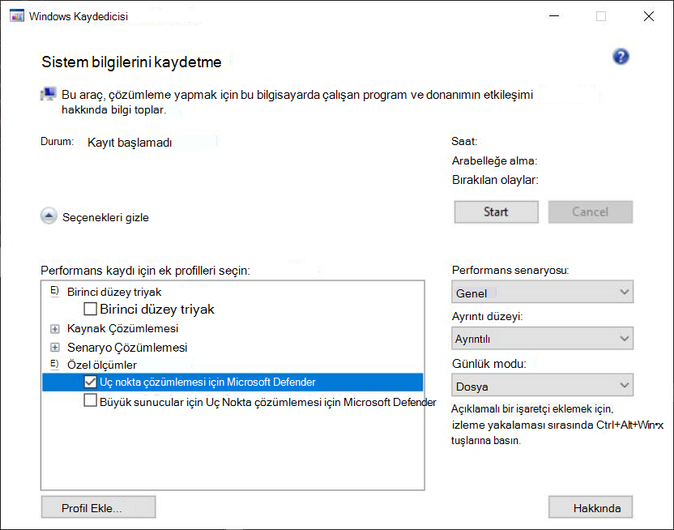

# <a name="troubleshoot-performance-issues-related-to-real-time-protection"></a>Gerçek zamanlı korumayla ilgili performans sorunlarını giderme


[!INCLUDE [Microsoft 365 Defender rebranding](../../includes/microsoft-defender.md)]


**Aşağıdakiler için geçerlidir:**
- [Uç Nokta Planı 2 için Microsoft Defender](https://go.microsoft.com/fwlink/p/?linkid=2154037)

Sisteminiz Uç Nokta için Microsoft Defender'daki gerçek zamanlı koruma hizmetiyle ilgili yüksek CPU kullanımı veya performans sorunlarına sahipse Microsoft desteğine bilet gönderebilirsiniz. Verileri tanılama verilerini toplama [Microsoft Defender Virüsten Koruma adımları izleyin](collect-diagnostic-data.md).

Yönetici olarak, bu sorunları kendi başına da gidersiniz.

İlk olarak, soruna başka bir yazılımdan kaynak gerek olup olduğunu kontrol etmek iyi olabilir. [Virüsten koruma dışlamaları için satıcıyla birlikte denetleme makalelerini okuyun](#check-with-vendor-for-antivirus-exclusions).

Aksi takdirde, Microsoft Koruma Günlüğünü Çözümleme altında verilen adımları takip edip tanımlanan performans sorunuyla hangi yazılımın [ilişkili olduğunu tanımlayabilirsiniz](#analyze-the-microsoft-protection-log).

Ayrıca, aşağıdaki adımları takip edin ve Microsoft desteğine gönderimnize ek günlükler sabilirsiniz:

- [İşlem İzleyicisi'yi kullanarak işlem günlüklerini yakalama](#capture-process-logs-using-process-monitor)
- [Yeni Performans Kaydedicisi'Windows günlükleri yakalama](#capture-performance-logs-using-windows-performance-recorder)

## <a name="check-with-vendor-for-antivirus-exclusions"></a>Virüsten koruma dışlamalarını satıcıya denetleme

Sistem performansını etkileyen yazılımı hemen tanımyabilirsiniz, yazılım satıcısının bilgi bankasına veya destek merkezine gidin. Virüsten koruma dışlamaları hakkında önerileri varsa arama. Satıcının web sitesinde bu yoksa, bu satıcıyla birlikte bir destek bileti açabilir ve bir bilet yayımlamalarını sorabilirsiniz.

Yazılım satıcılarının hatalı pozitif sonuç sayısını en aza indirmek için [sektörle iş ortağı çalışma'daki çeşitli yönergeleri izlemelerini öneririz](https://www.microsoft.com/security/blog/2018/08/16/partnering-with-the-industry-to-minimize-false-positives/). Satıcı, yazılımlarını portal üzerinden [Microsoft Güvenlik Zekası gönderebilirsiniz](https://www.microsoft.com/wdsi/filesubmission?persona=SoftwareDeveloper).

## <a name="analyze-the-microsoft-protection-log"></a>Microsoft Protection Günlüğünü Çözümleme

**MPLog-xxxxxxxx-xxxxxx.log** bilgisinde, yazılımın tahmini performans üzerindeki etki bilgilerini *EstimatedImpact olarak bulabilirsiniz*:

`Per-process counts:ProcessImageName: smsswd.exe, TotalTime: 6597, Count: 1406, MaxTime: 609, MaxTimeFile: \Device\HarddiskVolume3\_SMSTaskSequence\Packages\WQ1008E9\Files\FramePkg.exe, EstimatedImpact: 65%`

<br>

****

|Alan adı|Açıklama|
|---|---|
|ProcessImageName|İşlem resmi adı|
|TotalTime|Bu işlemle erişilen dosyaları taramalarda harcanan mili saniye cinsinden kümülatif süre|
|Sayı|Bu işlemle erişilen taranmış dosya sayısı|
|MaxTime|Bu işlemle erişilen bir dosyaya en uzun tek taramada mili saniye cinsinden süre|
|MaxTimeFile|Bu işlem tarafından erişilen ve sürenin en uzun taramasını `MaxTime` kaydeden dosyanın yolu|
|EstimatedImpact|Bu işlem tarafından erişilen dosyaları taramalarda harcanan sürenin, bu işlemde tarama etkinliğiyle deneyimle geçen dönem dışında|
|

Performans etkisi yüksekse, bu taramalar için dışlamaları yapılandırma ve doğrulama'daki adımları takip edin ve Yol/İşlem [dışlamalarına işlemi Microsoft Defender Virüsten Koruma deneyin](collect-diagnostic-data.md).

Önceki adım sorunu çöze olursa, aşağıdaki bölümlerde İşlem İzleyicisi veya Windows [Performans](#capture-performance-logs-using-windows-performance-recorder) Kaydedicisi aracılığıyla daha [](#capture-process-logs-using-process-monitor) fazla bilgi toplayabilirsiniz.

## <a name="capture-process-logs-using-process-monitor"></a>İşlem İzleyicisi'yi kullanarak işlem günlüklerini yakalama

Süreç İzleyicisi (ProcMon), gerçek zamanlı işlemleri gösteren gelişmiş bir izleme aracıdır. Bu, performans sorunu oluştuğunda yakalamak için kullanabilirsiniz.

1. İşlem [monitörü v3.60'i](/sysinternals/downloads/procmon) gibi bir klasöre indirin `C:\temp`.

2. Dosyanın web işaretini kaldırmak için:
    1. Özellikler'e **ProcessMonitor.zip** özellikler'i **seçin**.
    1. Genel *sekmesinin* altında Güvenlik'i *seçin*.
    1. Engeli **kaldır'ın yanındaki kutuyu işaretleyin**.
    1. **Uygula'ya seçin**.

    

3. Dosyanın sıkıştırması açarak `C:\temp` klasör yolunun bu şekilde olması gerekir `C:\temp\ProcessMonitor`.

4. Sorunu **ProcMon.exe** Windows istemcisine veya Windows sunucuya kopyalayın.

5. ProcMon'yu çalıştırmadan önce, yüksek CPU kullanımı sorunuyla ilgili diğer tüm uygulamaların kapalı olduğundan emin olun. Bunu yapmak, denetleme işlemlerinin sayısını en aza indirger.

6. ProcMon'i iki şekilde başlatabilirsiniz.
    1. Sağ tıklayın ve **ProcMon.exe** Yönetici olarak **çalıştır'ı seçin**.

        Günlük otomatik olarak başladığından, geçerli yakalamayı durdurmak için büyüteç simgesini seçin veya **Ctrl+E klavye kısayolunu kullanın**.

        

        Yakalamayı durdurmuş olduğunu doğrulamak için, büyüteç simgesinin şimdi kırmızı bir X ile görüntülendiğinden emin olur.

        

        Ardından, önceki yakalamayı temizlemek için silgi simgesini seçin.

        

        **Ctrl+X klavye kısayolunu da kullanabilirsiniz**.

    2. İkinci yol, komut satırı yönetici **olarak çalıştırmak** ve ardından İşlem İzleyicisi yolundan çalıştırmaktır:

        

        ```console
        Procmon.exe /AcceptEula /Noconnect /Profiling
        ```

        > [!TIP]
        > İzlemeyi kolayca başlatmak ve durdurmak için, veri yakalama için ProcMon penceresini mümkün olduğunca küçük hale sürükleyin.
        >
        > 

7. 6. adımda yordamlardan birini takip ettikten sonra, filtreleri ayarlamaya ilişkin bir seçenek göreceğiniz gibi. **Tamam**'ı seçin. Yakalama tamamlandıktan sonra sonuçları her zaman filtreleysiniz.

    

8. Yakalamayı başlatmak için büyüteç simgesini yeniden seçin.

9. Sorunu yeniden üretin.

    > [!TIP]
    > Sorunun tümüyle yeniden üretil bekleni, ardından izleme başlandı diye zaman damgasını not almak için bekleyin.

10. Yüksek CPU kullanımı koşulu sırasında iki ile dört dakika arasında işlem etkinliğiniz olduktan sonra, büyüteç simgesini seçerek yakalamayı durdurun.

11. Yakalamayı benzersiz bir adla ve .pml biçiminde kaydetmek için Dosya'ya ve ardından **Kaydet** ... **öğesini seçin**. Tüm etkinlikler ve Yerel İşlem **İzleyicisi Biçimi** **(PML) radyo düğmelerini seçmeye emin olun**.

    

12. Daha iyi izleme için varsayılan yolu şu yerden `C:\temp\ProcessMonitor\LogFile.PML` `C:\temp\ProcessMonitor\%ComputerName%_LogFile_MMDDYEAR_Repro_of_issue.PML` değiştirebilirsiniz:
    - `%ComputerName%` cihazın adıdır
    - `MMDDYEAR` ay, gün ve yıldır
    - `Repro_of_issue` yeniden oluşturmaya istediğiniz sorunun adıdır

    > [!TIP]
    > Çalışma sisteminiz varsa, karşılaştırmak için örnek bir günlük almak istiyor olabilir.

13. .pml dosyasını sıkıştırın ve Microsoft desteğine gönderin.

## <a name="capture-performance-logs-using-windows-performance-recorder"></a>Yeni Performans Kaydedicisi'Windows günlükleri yakalama

Microsoft desteğine Windows ek bilgiler eklemek için Windows Performans Kaydedicisi 'ne (WPR) kullanabilirsiniz. WPR, kayıtlarda etkinlik izleme için Olay İzlemeyi oluşturan Windows aracıdır.

WPR, Windows Değerlendirme ve Dağıtım Seti'nin (Windows ADK) bir parçasıdır ve [WINDOWS ADK](/windows-hardware/get-started/adk-install) yükleme'den indirilebilir. Ayrıca, bunu Windows 10 SDK'de Windows 10 Yazılım Geliştirme [Seti'nin bir parçası Windows 10.](https://developer.microsoft.com/windows/downloads/windows-10-sdk/)

WPR kullanıcı arabirimini, WPR KULLANıCı Arabirimini kullanarak performans günlüklerini [yakalama'daki adımları kullanarak kullanabilirsiniz](#capture-performance-logs-using-the-wpr-ui).

Alternatif olarak, WPR CLI *kullanarak* performans günlüklerini yakalama'daki adımlarıwpr.exeve Windows 8 sonraki sürümlerde bulunan komut satırı aracını [da kullanabilirsiniz](#capture-performance-logs-using-the-wpr-cli).

### <a name="capture-performance-logs-using-the-wpr-ui"></a>WPR kullanıcı arabirimini kullanarak performans günlüklerini yakalama

> [!TIP]
> Birden fazla cihaz bu sorunu yaşıyorsa, en çok RAM içeren cihazı kullanın.

1. WPR'i indirin ve yükleyin.

2. *Setler Windows altında Performans* Kaydedicisi'ne **Windows tıklayın**.

    

    **Diğer'i seçin**. Yönetici **olarak çalıştır'ı seçin**.

3. Kullanıcı Hesabı Denetimi iletişim kutusu görüntülendiğinde Evet'i **seçin**.

    

4. Ardından, Uç nokta [çözümleme profili için Microsoft Defender'ı](https://github.com/YongRhee-MDE/Scripts/blob/master/MDAV.wprp) indirin ve gibi `MDAV.wprp` bir klasöre kaydedin `C:\temp`.

5. WPR iletişim kutusunda Diğer **seçenekler'i seçin**.

    

6. Profil **Ekle... öğesini** seçin ve dosyanın yolunu `MDAV.wprp` bulun.

7. Bundan sonra, altında Uç nokta çözümlemesi için Microsoft Defender *adlı özel* ölçümler altında *yeni bir profil kümesi* görüyor olun.

    

    > [!WARNING]
    > Windows Sunucunuz 64 GB veya daha büyük RAM'e sahipse, yerine özel `Microsoft Defender for Endpoint analysis for large servers` ölçü birimini kullanın`Microsoft Defender for Endpoint analysis`. Aksi takdirde, sisteminiz yüksek miktarda sayfasız havuz belleği veya arabellek tüketebilir ve bu da sistemin yetersizlik durumuna yol açabilirsiniz. Kaynak Çözümlemesi'nin kapsamını genişleterek hangi profillerin **ek gerektireceklerini seçebilirsiniz**.
    Bu özel profil, ayrıntılı performans çözümlemesi için gerekli bağlamı sağlar.

8. WPR kullanıcı arabiriminde Uç nokta ayrıntılı çözümleme profili için Microsoft Defender özel ölçüsini kullanmak için:

    1. birinci düzey öncelik, Kaynak Çözümleme *ve Senaryo Çözümlemesi gruplarının* altında *hiçbir profilin seçilmey* *olduğundan emin* olun.
    2. Özel **ölçümler'i seçin**.
    3. Uç nokta **çözümlemesi için Microsoft Defender'ı seçin**.
    4. Ayrıntı **düzeyi'nin altında** *Verbose'yi* seçin.
    5. Günlük **modu altında** Dosya **veya** Bellek'i seçin.

    > [!IMPORTANT]
    > Performans sorunu *kullanıcı* tarafından doğrudan yeniden üretilebilirse, dosya günlüğü modunu kullanmak için Dosya'ı seçmeniz gerekir. Çoğu sorun bu kategorinin altında yer alıyor. Bununla birlikte, kullanıcı sorunu doğrudan yeniden üretese de sorun oluştuğunda bunu kolayca farkebiliyorsa, kullanıcının bellek günlüğü modunu kullanmak  için Bellek'i seçmesi gerekir. Bu, izleme günlüğünün uzun çalışma süresi nedeniyle aşırı derecede yoğun olarak ortaya çıkışmalarını sağlar.

9. Artık verileri toplamaya hazır mısınız? Performans sorunu yeniden ortaya çıkmayla ilgili olan tüm uygulamalardan çıkın. WpR **penceresinin** yer kapladığı alanı küçük tutmak için Gizle seçeneklerini seçebilirsiniz.

    

    > [!TIP]
    > İzlemeyi tam sayı saniyeye başlatmayı deneyin. Örneğin, 01:30:00. Bu, verileri çözümlemeyi kolaylaştırır. Ayrıca, sorunun tam olarak ne zaman yeniden üretil yaptığını zaman damgasını takip etmeye çalış.

10. **Başlat**'ı seçin.

    

11. Sorunu yeniden üretin.

    > [!TIP]
    > Veri toplamayı beş dakikadan uzun süre tutmaz. Çok fazla veri toplanıyor olması bu iki ile üç dakika arasında iyi bir aralıktır.

12. **Kaydet**'i seçin.

    

13. Doldurma **Sorunun ayrıntılı bir açıklamasını yazın: sorun** ve sorunu nasıl yeniden ürettiyebilirsiniz.

    

    1. İzleme **dosyanın nereye kayded** olacağını belirlemek için Dosya Adı: öğesini seçin. Varsayılan olarak, 'a kaydedilir `%user%\Documents\WPR Files\`.
    1. **Kaydet**'i seçin.

14. İzleme birleştirilirken bekleyin.

    

15. İzleme kaydedildiktan sonra Klasörü **aç'ı seçin**.

    

    Microsoft Desteği'ne göndermenize hem dosyayı hem de klasörü dahil edin.

    

### <a name="capture-performance-logs-using-the-wpr-cli"></a>WPR CLI kullanarak performans günlüklerini yakalama

Komut satırı aracı, *wpr.exe* ile başlayan işletim sisteminin bir Windows 8. Şu komut satırı aracını kullanarak bir WPR izlemesi wpr.exe:

1. Gibi **[yerel bir dizinde adı olan](https://github.com/YongRhee-MDE/Scripts/blob/master/MDAV.wprp)** bir dosyaya performans izlemeleri için Uç `MDAV.wprp` nokta çözümleme profili için Microsoft Defender'ı indirin `C:\traces`.

2. Başlat Menüsü **simgesine sağ tıklayın** ve Yönetici **(Windows PowerShell)** veya Komut İstemi **(Yönetici)** öğesini seçerek Yönetici komut istemi penceresini açın.

3. Kullanıcı Hesabı Denetimi iletişim kutusu görüntülendiğinde Evet'i **seçin**.

4. Yükseltilmiş istemde, uç nokta performans izlemesi için bir Microsoft Defender başlatmak üzere aşağıdaki komutu çalıştırın:

    ```console
    wpr.exe -start C:\traces\MDAV.wprp!WD.Verbose -filemode
    ```

    > [!WARNING]
    > Windows Sunucunuzda 64 GB veya daha fazla RAM veya daha büyük bir RAM varsa, `WDForLargeServers.Light` `WDForLargeServers.Verbose` profilleri sırasıyla profiller `WD.Light` `WD.Verbose`ve yerine kullanın. Aksi takdirde, sisteminiz yüksek miktarda sayfasız havuz belleği veya arabellek tüketebilir ve bu da sistemin yetersizlik durumuna yol açabilirsiniz.

5. Sorunu yeniden üretin.

    > [!TIP]
    > Veri toplamayı beş dakikadan uzun süre tutmaz. Senaryoya bağlı olarak, çok fazla veri toplanıyor olması bu nedenle iki ile üç dakika arasında iyi bir aralıktır.

6. Yükseltilmiş istemde, performans izlemeyi durdurmak için aşağıdaki komutu çalıştırın; sorun ve sorunu nasıl yeniden üretmiş olduğunuz hakkında bilgi sağlamak için:

    ```console
    wpr.exe -stop merged.etl "Timestamp when the issue was reproduced, in HH:MM:SS format" "Description of the issue" "Any error that popped up"
    ```

7. İzleme birleştirilene kadar bekleyin.

8. Hem dosyayı hem de klasörü Microsoft desteğine gönderinize dahil edin.

## <a name="see-also"></a>Ayrıca bkz.

- [Tanılama Microsoft Defender Virüsten Koruma toplama](collect-diagnostic-data.md)
- [Taramalar için dışlamaları yapılandırma Microsoft Defender Virüsten Koruma doğrulama](configure-exclusions-microsoft-defender-antivirus.md)
