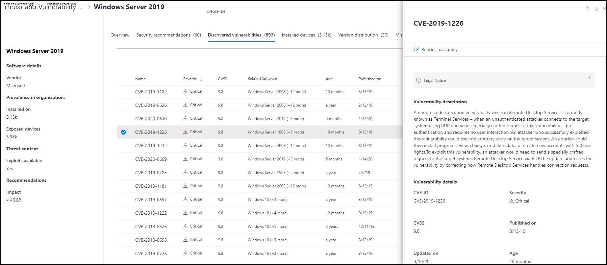

# Kuruluşumda güvenlik açıkları - Tehdit ve Güvenlik Açığı Yönetimi

[!INCLUDE [Microsoft 365 Defender rebranding](../../includes/microsoft-defender.md)]

**Aşağıdakiler için geçerlidir:**
- [Uç Nokta Planı 2 için Microsoft Defender](https://go.microsoft.com/fwlink/?linkid=2154037)
- [Tehdit ve güvenlik açığı yönetimi](next-gen-threat-and-vuln-mgt.md)
- [Microsoft 365 Defender](https://go.microsoft.com/fwlink/?linkid=2118804)

> Uç Nokta için Microsoft Defender'ı mı deneyimliysiniz? [Ücretsiz deneme için kaydol'](https://signup.microsoft.com/create-account/signup?products=7f379fee-c4f9-4278-b0a1-e4c8c2fcdf7e&ru=https://aka.ms/MDEp2OpenTrial?ocid=docs-wdatp-portaloverview-abovefoldlink)

> [!IMPORTANT]
> Tehdit ve güvenlik açığı yönetimi, uygulamalar ve bileşenlere yönelik Log4j güvenlik açıklarını belirlemeye yardımcı olabilir. [Daha fazla bilgi edinin](https://www.microsoft.com/security/blog/2021/12/11/guidance-for-preventing-detecting-and-hunting-for-cve-2021-44228-log4j-2-exploitation/#TVM).

Tehdit ve güvenlik açığı yönetimi, güvenlik açıklarını taramak ve algılamak için Uç nokta koruması için Defender'da aynı işaretleri kullanır.

**Cihazlarınızı güvenlik açıkları** listesi, Ortak Güvenlik Açıkları ve SALDıRıLAR (ALI) Kimliği listelemektedir. Ayrıca önem derecesine, Ortak Güvenlik Açığı Puanlama Sistemi (CVSS) derecelendirmesine, organizasyonda yaygın kullanılanlara, ilgili ihlallere, tehdit öngörülerine ve daha birçok bilgiye de bakabilirsiniz.

> [!NOTE]
> Bir güvenlik açığı için resmi BIRYALI KODU atanmamışsa güvenlik açığı adı ilgili kullanıcı tarafından Tehdit ve Güvenlik Açığı Yönetimi.

> [!TIP]
> Yeni güvenlik açığı olayları hakkında e-postalar almak için bkz. Uç Nokta için [Microsoft Defender'da güvenlik açığı e-posta bildirimlerini yapılandırma](configure-vulnerability-email-notifications.md)

## Zayıf Noktaları sayfasına gidin

Esnaflar sayfasına birkaç farklı şekilde erişin:

- Microsoft 365 Defender portalında **Güvenlik Açığı yönetimi** gezinti menüsünden [Zayıf noktaları seçme](portal-overview.md) 
- Genel arama

### Gezinti menüsü

**CVE** listesini **açmak için Güvenlik Açığı yönetimi** gezinti menüsüne gidin ve Zayıf Yönler'i seçin.

### Genel aramada güvenlik açıkları

1. Genel arama açılan menüsüne gidin.
2. Ortak **Güvenlik Açıkları** ve Saldırılar (ALıK) Kimliğinde (NOD) Güvenlik Açığı ve Anahtar'ı seçin ve ardından arama simgesini seçin. **Yalnızlıklar** sayfası, sizin istediğiniz HER ŞEY bilgileriyle birlikte açılır.

3. GÜVENLIK açığı açıklaması, ayrıntılar, tehdit öngörüleri ve açık cihazlar dahil daha fazla bilgi içeren bir açılır panel açmak için PANO'ya tıklayın.

Zayıf noktaları sayfasındaki güvenlik açıklarının geri **kalanını görmek için** , ZAMANLI yazın ve arama'ya tıklayın.

## Zayıf noktalarına genel bakış

Açık cihazlardaki güvenlik açıklarını düzeltmek, riski varlıklarınıza ve organizasyonuma azaltmaya yöneliktir. Maruz Kalan **Cihazlar sütununda** 0 varsa, bu risk altında olmadığınız anlamına gelir.

### İhlal ve tehdit öngörüleri

Simgeler kırmızı renkte olduğunda Tehdit sütununda ilgili **ihlalleri** ve tehdit öngörülerini görebilirsiniz.

 > [!NOTE]
 > Sürekli tehditlerle ilişkilendirilmiş önerilere her zaman öncelikleri belirleme. Bu öneriler, tehdit içgörü simgesi Basit kırmızı  ve breach insight icon .

Kuruluşta herhangi bir güvenlik açığı olması durumunda ihlal öngörüleri simgesi vurgulanır.

Kuruluşta bulunan güvenlik açığının açıklarında ilişkilendirilmiş istismarlar varsa tehdit öngörüleri simgesi vurgulanır. Simgenin üzerine gelindiğinde, tehdit bir exploit kit kapsamında mı yoksa belirli gelişmiş kalıcı kampanyalara veya etkinlik gruplarına bağlı mı olduğu gösterilir. Kullanılabilir olduğunda, sıfır günlük sömürüm haberleri, açıklamalar veya ilgili güvenlik danışmanları içeren bir Threat Analytics raporunun bağlantısı vardır.

### Güvenlik açığı öngörüleri

BIR AYRINTI seçerek, güvenlik açığı açıklaması, ayrıntılar, tehdit öngörüleri ve açık cihazlar gibi daha fazla bilgiye sahip bir açılır panel açılır.

- "işletim sistemi özelliği" kategorisi ilgili senaryolarda gösterilir
- Cihaz açık olduğunda her ASPİ için ilgili güvenlik önerisine gidebilirsiniz

 

### Desteklenen olmayan yazılım

Şu anda tehdit ve tehdit tarafından desteklemeen yazılımlar için CVE'ler & güvenlik açığı yönetimi A'lar sayfasında hala mevcuttur. Yazılım desteklenmiyor olduğundan, yalnızca sınırlı veriler kullanılabilir.

CvE'ler için desteklenmeyen yazılımlara sahip açık cihaz bilgileri kullanılamaz. "Açık cihazlar" bölümündeki "Kullanılamaz" seçeneğini seçerek desteklenmeyen yazılımlara göre filtre kullanın.

:::image type="content" alt-text="Açık cihazlar filtresi." source="images/tvm-exposed-devices-filter.png":::

## Diğer yerlerde Ortak Güvenlik Açıkları ve Pozlama (DEMİ) girdilerini görüntüleme

### Panoda en korumasız yazılım

1. En korumasız [Tehdit ve Güvenlik Açığı Yönetimi araç](tvm-dashboard-insights.md) çubuğu panosuna gidin ve sayfayı En korumasız yazılım **widget'izine kadar aşağı** kaydırın. Her yazılımda bulunan güvenlik açıklarının sayısını, ayrıca tehdit bilgilerini ve cihazın zaman içinde açık kalma düzeyini üst düzey olarak gösterirsiniz.

    

2. Detaya gitme sayfasına gitmek için araştırma yapmak istediğiniz yazılımı seçin.

3. Bulunan güvenlik **açıkları sekmesini** seçin.

4. Güvenlik açığı ayrıntıları hakkında daha fazla bilgi için araştırma yapmak istediğiniz güvenlik açığını seçin

    

### Cihaz sayfasındaki güvenlik açıklarını keşfedin

Cihaz sayfasında ilgili İhale bilgilerini görüntüleyebilirsiniz.

1. Gezinti Microsoft 365 Defender çubuğuna gidin ve cihaz simgesini seçin. Cihaz **envanteri** sayfası açılır.

2. Cihaz **envanteri** sayfasında, araştırma yapmak istediğiniz cihaz adını seçin.

    

3. Cihaz sayfası, araştırma yapmak istediğiniz cihazın ayrıntılarını ve yanıt seçeneklerini içerir.

4. Bulunan **güvenlik açıkları'ı seçin**.

   :::image type="content" alt-text="Ayrıntıları ve yanıt seçeneklerinin yer olduğu cihaz sayfası." source="images/tvm-discovered-vulnerabilities.png" lightbox="images/tvm-discovered-vulnerabilities.png":::

5. AŞAĞıDAKI güvenlik açığı açıklaması, tehdit içgörüleri ve algılama mantığı gibi, PANO ayrıntılarına sahip bir açılır panel açmak üzere araştırma yapmak istediğiniz güvenlik açığını seçin.

#### YERKARAKT Algılama mantığı

Yazılım kanıtına benzer şekilde, korumasız olduğunu göstermek için artık bir cihaza uygulanan algılama mantığını gösteriyoruz. Yeni bölüm "Algılama Mantığı" olarak (cihaz sayfasında bulunan herhangi bir açıkta) kullanılır ve algılama mantığıyla kaynağını gösterir.

"işletim sistemi özelliği" kategorisi ilgili senaryolarda da gösterilir. BIR YERKARAKA,yalnızca belirli bir işletim sistemi bileşeni etkinleştirildiğinde korumasız işletim sistemi çalıştıran cihazları etkileyebilir. DNS bileşeninde Windows Server 2019 veya Windows Server 2022'nin bir güvenlik açığı olduğunu var sayabilirsiniz. Bu yeni özellikle, bu AYNI ÖZELLIĞINI yalnızca işletim sistemi içinde etkinleştirilmiş DNS özelliği etkinleştirilmiş Windows Server 2019 ve Windows Server 2022 cihazlarına ekley.

:::image type="content" alt-text="Algılama Mantığı örneği, cihazda algılanan yazılımları ve KBS'leri listeler." source="images/tvm-cve-detection-logic.png":::

## Rapor yanlışlığı

Belirsiz, yanlış veya eksik bilgiler gördüğünüzde hatalı bir pozitif sonuç bildirebilirsiniz. Daha önce düzeltmiş olan güvenlik önerilerini de bildirebilirsiniz.

1. Zayıflıklar sayfasında YERİNA'ya tıklayın.
2. Yanlış **bildir'i seçin** ; bir açılır pencere açılır.
3. Açılan menüden yanlış kategoriyi seçin ve e-posta adresinizi ve hatalı ayrıntılarınızı girin.
4. **Gönder'i seçin**. Geri bildiriminiz tüm uzmanlara Tehdit ve Güvenlik Açığı Yönetimi gönderilir.

## İlgili makaleler

- [Tehdit ve güvenlik açığı yönetimi genel bakış](next-gen-threat-and-vuln-mgt.md)
- [Güvenlik önerileri](tvm-security-recommendation.md)
- [Yazılım envanteri](tvm-software-inventory.md)
- [Pano içgörüleri](tvm-dashboard-insights.md)
- [Uç Nokta Cihazları için Microsoft Defender listesini görüntüleme ve düzenleme](machines-view-overview.md)
