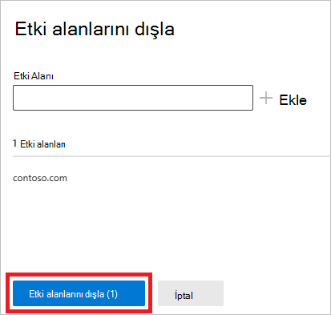

# Dışlamada Kimlik algılama dışlamaları için Defender'ı Microsoft 365 Defender

**Aşağıdakiler için geçerlidir:**

- Microsoft 365 Defender
- Kimlik için Defender

Bu makalede, Microsoft Defender'da Kimlik algılama [dışlamaları](/defender-for-identity) için nasıl yapılandır [Microsoft 365 Defender](/microsoft-365/security/defender/overview-security-center).

> [!IMPORTANT]
> Kimlik Doğrulama ve Doğrulama Microsoft 365 Defender bir parçası olarak, kimlik için Defender portalında yer alan konumlarından bazı seçenekler ve ayrıntılar değiştirilmiştir. Hem tanıdık hem de yeni özellikleri nerede bulamıyorum? bulmak için lütfen aşağıdaki ayrıntıları okuyun.

[!INCLUDE [Product long](includes/product-long.md)] belirli IP adreslerinin, bilgisayarların, etki alanlarının veya kullanıcıların bir dizi algılamadan dışlanmasına olanak sağlar.

Örneğin, DNS'yi tarama mekanizması olarak kullanan bir güvenlik tarayıcısı DNS **Reconnaissance** uyarısını tetikler. Dışlama oluşturmak, Kimlik için Defender'ın bu tarayıcıları yoksaymasını ve hatalı pozitif sonuç sayısını azaltmasını sağlar.

>[!NOTE]
>Bu uyarılarda açılan [DNS](/defender-for-identity/exfiltration-alerts#suspicious-communication-over-dns-external-id-2031) uyarıları üzerinden şüpheli iletişim ile en yaygın etki alanları arasında, müşterilerin en çok uyarı dışında tutulacak etki alanlarını gözlemlemiştir. Bu etki alanları varsayılan olarak dışlamalar listesine eklenir, ancak bunları kolayca kaldırma seçeneğiniz vardır.

## Algılama dışlamaları ekleme

1. Daha [Microsoft 365 Defender](https://security.microsoft.com/), Kimlikler'Ayarlar'e **gidin**.

    

1. Sol menüde **Dışlanan varlıklar'ı** göreceğiz.

    

Daha sonra iki yönteme göre dışlamalar oluşturabilirsiniz: Algılama **kuralıyla ve** Dışlanan genel varlıklarla **dışlamalar**.

## Algılama kuralına göre dışlamalar

1. Sol menüde, Algılama kuralına göre **dışlamalar'ı seçin**. Algılama kurallarının listesini görüntülenir.

    

1. Yapılandırmak istediğiniz her algılama için aşağıdaki adımları uygulayın:

    1. Kuralı seçin. Arama çubuğunu kullanarak algılamaları arayabilirsiniz. Seçildikten sonra, algılama kuralı ayrıntılarının yer alan bir bölme açılır.

        

    1. Dışlama eklemek için Dışlanan varlıklar **düğmesini** seçin ve sonra da dışlama türünü seçin. Her kural için, dışarıda bırakılan farklı varlıklar vardır. Bunlar kullanıcıları, cihazları, etki alanlarını ve IP adreslerini içerir. Bu örnekte, seçenekler Cihazları dışla **ve** IP adreslerini **dışla'dır**.

        

    1. Dışlama türünü seçtikten sonra dışlamayı  eklersiniz. Açılan bölmede dışlama eklemek **+** için düğmeyi seçin.

        

    1. Ardından dışlamak istediğiniz varlığı ekleyin. Varlığı **listeye eklemek** için + Ekle'yi seçin.

        

    1. Sonra, **dışlamayı tamamlamak için IP** adreslerini dışla (bu örnekte) öğesini seçin.

        

    1. Dışlamaları ekledikten sonra, Dışlanan varlıklar düğmesine dönerek listeyi dışarı aktarabilirsiniz veya **dışlamaları kaldırabilirsiniz** . Bu örnekte, Cihazları **Dışla'ya geri döndük**. Listeyi dışarı aktarma için aşağı ok düğmesini seçin.

        

    1. Dışlama silmek için dışlamayı seçin ve çöp kutusu simgesini seçin.

        

## Genel dışlanan varlıklar

Artık Dışlanan Genel varlıklar tarafından **dışlamaları da yapılandırebilirsiniz**. Genel dışlamalar, Belirli varlıkları (IP adresleri, alt ağlar, cihazlar veya etki alanları) Identity için Defender'ın sahip olduğu tüm algılamalarda hariç tutmanız için olanak tanır. Dolayısıyla, örneğin bir cihazı dışlarsanız, yalnızca algılamanın bir parçası olarak cihaz kimliği bulunan algılamalara uygulanır.

1. Sol menüde Genel dışlanan **varlıklar'ı seçin**. Hariç tutabilirsiniz varlıkların kategorilerini burada görüntülersiniz.

    

1. Bir dışlama türü seçin. Bu örnekte, Etki alanlarını **dışla'ya seçilmiştir**.

    

1. Dışarıda bırakılacak etki alanını ekleyebilirsiniz bir bölme açılır. Dışarıda tutmak istediğiniz etki alanını ekleyin.

    

1. Etki alanı listeye eklenir. **Dışlamayı tamamlamak için Etki** alanlarını dışla'ya seçin.

    

1. Ardından, tüm algılama kurallarından çıkarılacak varlıklar listesinde etki alanını gösterir. Varlıkları seçerek ve Kaldır düğmesine tıklayarak dışarı aktarabilirsiniz.

    

## Ayrıca bkz.

- [Kimlik güvenlik uyarıları için Defender'ı yönetme](manage-security-alerts.md)
