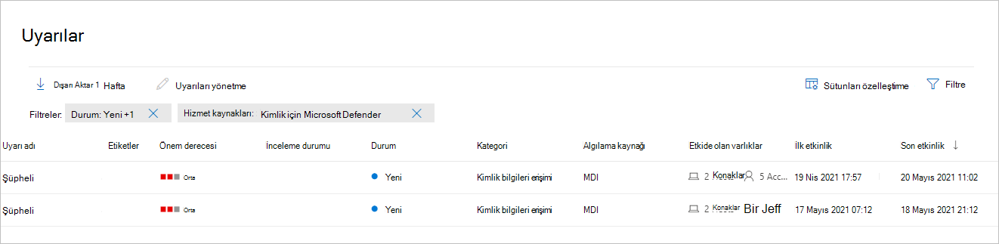
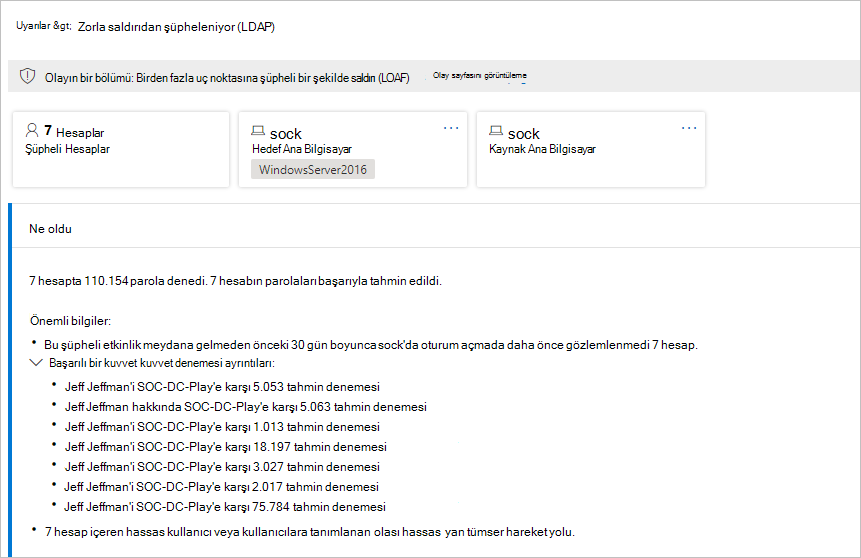
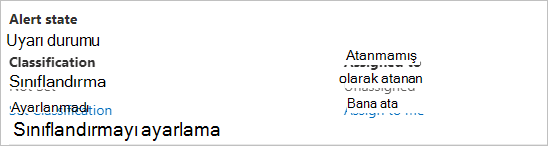
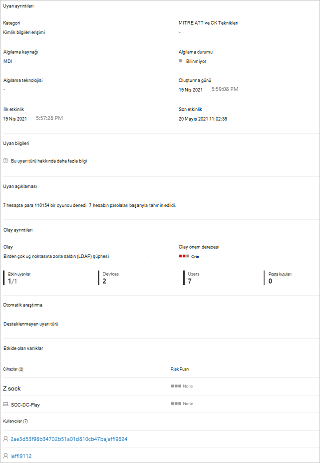

# Microsoft 365 Defender'ta Kimlik güvenlik uyarıları için Defender

**Aşağıdakiler için geçerlidir:**

- Microsoft 365 Defender
- Kimlik için Defender

Bu makalede, Microsoft [Defender for Identity](/defender-for-identity) güvenlik uyarıları ile çalışma hakkında temel [Microsoft 365 Defender.](/microsoft-365/security/defender/overview-security-center)

Kimlik uyarıları için Defender, özel bir Kimlik <a href="https://go.microsoft.com/fwlink/p/?linkid=2077139" target="_blank">uyarısı Microsoft 365 Defender</a> biçimiyle yerel olarak tümleşiktir. Bu, Microsoft Defender for Identity deneyiminin tamamını Kurumsal'a tanıtma [yolculuğunun ilk Microsoft 365 Defender](/defender-for-identity/defender-for-identity-in-microsoft-365-defender).

Yeni Kimlik uyarı sayfası, Identity müşterileri için Microsoft Defender'a etki alanı arasında zenginleştirme ve yeni otomatik kimlik yanıtı özelliklerini daha iyi bir şekilde sunuyor. Güvende kalmanızı sağlar ve güvenlik işlemlerinizin verimliliğini artırmaya yardımcı olur.

[Microsoft 365 Defender](/microsoft-365/security/defender/microsoft-365-defender) aracılığıyla uyarıları incelemenin faydalarından biri, Kimlik için Microsoft Defender uyarılarının pakette yer alan diğer ürünlerin her biri üzerinden edinilen bilgilerle daha fazla ilişkili olduğudur. Gelişmiş bu uyarılar, Office 365 için Microsoft Defender ve Uç Microsoft 365 Defender için [Microsoft Defender'dan](/microsoft-365/security/office-365-security) kaynaklanan diğer uyarı [biçimleriyle tutarlıdır](/microsoft-365/security/defender-endpoint). Yeni sayfa, kimlikle ilişkili uyarıları araştırmak için başka bir ürün portalına gezinme ihtiyacı ortadan kalkmış olur.

Identity için Defender'dan başlatılan uyarılar, artık Microsoft 365 Defender düzeltme ve şüpheli etkinliklere katkıda bulun sağlayacak araç ve işlemlerin azaltılması da dahil olmak üzere Microsoft 365 Defender otomatik soruşturma ve yanıt [(AIR)](/microsoft-365/security/defender/m365d-autoir) özelliklerini tetikley kullanılabilmektedir.

> [!IMPORTANT]
> Kimlik Doğrulama ve Doğrulama Microsoft 365 Defender bir parçası olarak, kimlik için Defender portalında yer alan konumlarından bazı seçenekler ve ayrıntılar değiştirilmiştir. Hem tanıdık hem de yeni özellikleri nerede bulamıyorum? bulmak için lütfen aşağıdaki ayrıntıları okuyun.

## Güvenlik uyarılarını gözden geçirme

Uyarılar sayfası, Olaylar sayfası, tek tek Cihazlar sayfaları ve Gelişmiş  av sayfası gibi birden çok  konumdan **uyarılara erişilebilir**. Bu örnekte, Uyarılar sayfasını **gözden geçirledik**.

Daha <a href="https://go.microsoft.com/fwlink/p/?linkid=2077139" target="_blank">Microsoft 365 Defender</a>' gidin **, Uyarı & Olaylar'a** **gidin**.

Kimlik için Defender'dan gelen uyarıları görmek için sağ üst sağdan Filtre'yi seçin ve ardından Hizmet  kaynakları'nın altında **Kimlik için Microsoft Defender'ı** ve sonra Uygula'yi **seçin**:

Uyarılar, şu sütunlarda bilgilerle birlikte **görüntülenir: Uyarı** **adı, Etiketler****, Önem** **Derecesi,** Araştırma durumu, **Durum**, **Kategori**, **Algılama kaynağı****,** Etkileniyor **varlıklar, İlk** etkinlik ve **Son etkinlik**.

## Uyarıları yönetme

Uyarılardan **biri için** Uyarı adına tıklarsanız, uyarıyla ilgili ayrıntıların yer olduğu sayfaya gidersiniz. Sol bölmede, Ne oldu? **özetini görebilirsiniz**:

Neler oldu **kutusunun üstünde** , uyarının **Hesaplar,** Hedef Ana **Bilgisayar ve** **Kaynak Ana Bilgisayarı düğmeleri** bulunur. Diğer uyarılarda, diğer ana bilgisayarlarla, hesaplarla, IP adresleriyle, etki alanlarıyla ve güvenlik gruplarıyla ilgili ayrıntılara sahip düğmelere bakabilirsiniz. Katılan varlıklar hakkında daha fazla ayrıntı almak için bu seçeneklerden herhangi birini seçin.

Sağ bölmede Uyarı ayrıntılarını **görebilirsiniz**. Burada daha fazla ayrıntı görebilir ve çeşitli görevleri gerçekleştirebilirsiniz:

- **Bu uyarıyı sınıflandırın** - Burada, bu uyarıyı Doğru uyarı veya **Yanlış uyarı** **olarak**

    

- **Uyarı durumu** - Sınıflandırma **Kümesi'nde** uyarıyı Doğru veya Yanlış **olarak** **sınıflandırın**. **Atanan'da** uyarıyı kendinize ataabilir veya atamayı geri atabilirsiniz.

    

- **Uyarı** ayrıntıları - Uyarı ayrıntıları'nın **altında, belirli** uyarı hakkında daha fazla bilgi bulabilir, uyarı türüyle ilgili belgelere ulaşacak bir bağlantıyı takip eder, uyarının hangi olayla ilişkilendiril olduğunu görebilir, bu uyarı türüyle bağlantılı tüm otomatik soruşturmaları gözden geçirebilirsiniz ve etkilenen cihazları ve kullanıcıları görebilirsiniz.

    

- **Açıklamalar & -** Burada uyarıya yorumlarınızı ekleyebilir ve uyarıyla ilişkili tüm eylemlerin geçmişini bakabilirsiniz.

    

- **Uyarıyı** yönetme - **Uyarıyı yönet'i** seçerek şunları düzenlemenizi sağlayan bir bölmeye gidersiniz:
  - **Durum** - Yeni, **Çözümlendi** **veya** **Sürüyor'ı seçebilirsiniz**.
  - **Sınıflandırma** - Doğru uyarı **veya Yanlış uyarı'ya** **seçebilirsiniz**.
  - **Açıklama** - Uyarıyla ilgili bir açıklama ekleyin.

    Manage alert öğesinin yanındaki üç noktayı seçerek bir tehdit uzmanına danışabilirsiniz **,** uyarıyı bir  Excel dosyasına aktarın veya Başka bir **olayla bağlantı açın**.

    

    > [!NOTE]
    > Excel artık iki bağlantınız vardır: Kimlik için **Microsoft Defender'da Görüntüle ve Diğer** **Microsoft 365 Defender.** Her bağlantı sizi ilgili portala getirir ve uyarı hakkında orada bilgi sağlar.

## Ayrıca bkz.

- [E-postada uyarıları Microsoft 365 Defender](../defender/investigate-alerts.md)
