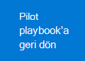

# Deneme Microsoft 365 Defender veya pilot ortamınız için sütun sütunlarını yapılandırma

[!INCLUDE [Microsoft 365 Defender rebranding](../includes/microsoft-defender.md)]

**Aşağıdakiler için geçerlidir:**
- Microsoft 365 Defender

Deneme Microsoft 365 Defender pilot ortamı oluşturmak ve bu ortamı dağıtmak üç aşamalı bir işlemdir:

| [Aşama 1: Hazırlama](prepare-m365d-eval.md) | [Aşama 2: Ayarlama](setup-m365deval.md) | Aşama 3: Ekleme |  [Pilot playbook'a geri dön](m365d-pilot.md) |
|--|--|--|--|
|| |*Buradasınız!* | |

Şu anda yapılandırma aşamasındayız.

Hazırlık, başarılı bir dağıtım için çok önemli. Bu makalede, Uç Nokta için Microsoft Defender'ı dağıtırken göz önünde bulundurabilirsiniz.

## Microsoft 365 Defender sütunlar
Microsoft 365 Defender dört sütundan oluşur. Bir sütun zaten ağ kuruluş güvenliği için değer sağlaysa da, dört sütunlu sütunun etkinleştirilmesi Microsoft 365 Defender en fazla değeri verir.

Bu bölüm, şunları yapılandırmak için sizi yönlendirecek:

- Office 365 için Microsoft Defender
- Kimlik için Microsoft Defender
- Microsoft Cloud App Security
- Uç Nokta için Microsoft Defender

## Windows için Microsoft Defender'ı Office 365

> [!NOTE]
> Defender for-Step'i zaten etkinleştirdiysem bu adımı Office 365.

Bu ayarlardan bazılarının belirlenmesine yardımcı Office 365 Gelişmiş Tehdit Koruması Önerilen Yapılandırma Çözümleyicisi *(ORCA)* adlı bir PowerShell Modülü vardır. Kiracınız içinde yönetici olarak çalıştırsanız, get-ORCAReport istenmeyen posta önleme, kimlik avı önleme ve diğer ileti olay ayarlarıyla ilgili bir değerlendirme oluşturmak için yardımcı olur. Bu modülü 'dan indirebilirsiniz https://www.powershellgallery.com/packages/ORCA/.

1. Güvenlik [ve uyumluluk Office 365'&](https://protection.office.com/homepage) >  **Threat managementPolicy'ye** >  **gidin**.

   

2. Kimlik **avı önleme'ye tıklayın**, **İlke adını** ve açıklamasını oluştur ve doldur'u seçin. **İleri**'ye tıklayın.

   

   > [!NOTE]
   > Daha fazla bilgi için Microsoft Defender'da Gelişmiş kimlik avıyla mücadele Office 365. Gelişmiş **Kimlik Avı Eşiği'ne** **2 - Saldırgan olarak değiştirme**.

3. Koşul **ekle açılan menüsüne** tıklayın ve alıcı etki alanı olarak etki alanlarınızı seçin. **İleri**'ye tıklayın.

   

4. Ayarlarınızı gözden geçirebilirsiniz. Onaylamak **için Bu ilkeyi oluştur'a** tıklayın.

   

5. **Ekleri Kasa'i** seçin ve **AtP'yi SharePoint, OneDrive ve** Devre Microsoft Teams seçin.

   

6. Yeni bir güvenli ek ilkesi oluşturmak ve bunu etki alanlarınıza alıcı etki alanı olarak uygulamak için + simgesine tıklayın. **Kaydet**'e tıklayın.

   

7. Ardından, Bağlantılar **Kasa seçin** ve ardından varsayılan ilkeyi düzenlemek için kalem simgesine tıklayın.

8. Kullanıcılar güvenli **bağlantılara tıklarken izleme** seçeneğinin seçili olmadığını ve diğer seçeneklerin seçili olduğundan emin olun. Ayrıntılar [Kasa Bağlantı ayarlarını değiştirme](/microsoft-365/security/office-365-security/recommended-settings-for-eop-and-office365) bağlantısına bakın. **Kaydet**'e tıklayın.

   

9. Ardından Kötü amaçlı **yazılımdan koruma ilkesi'ne** tıklayın, varsayılanı seçin ve kalem simgesini seçin.

10. Evet **Ayarlar i** tıklatın ve **Evet'i seçin ve Kötü Amaçlı Yazılım Algılama Yanıtı'yı** etkinleştirmek için **varsayılan bildirim metnini kullanın**. Ortak Ek **Türleri Filtresi'ne** tıklayın. **Kaydet**'e tıklayın.

    

11. Güvenlik [ve Office 365 Merkezi&](https://protection.office.com/homepage) **SearchAudit** >  >  **günlük aramalarına gidin** ve Denetimi açma.

    

12. Sistem için Microsoft Defender'ı Office 365 için Microsoft Defender ile Uç Nokta için Microsoft Defender'ı tümleştirin. Office 365 [Güvenlik](https://protection.office.com/homepage) >  & Uyumluluk **MerkeziThreat** **managementExplorer'a** >  gidin ve ekranın sağ üst köşesindeki Uç Nokta Ayarlar için **Microsoft Defender'ı** seçin. Uç nokta bağlantısı için Defender iletişim kutusunda, Uç Nokta için **Bağlan Için Defender'ı açın**.

    

## Kimlik için Microsoft Defender'ı yapılandırma

> [!NOTE]
> Kimlik için Microsoft Defender'ı zaten etkinleştirdiysem bu adımı atla

1. Güvenlik [Merkezi'Microsoft 365 gidin ve](https://security.microsoft.com/info) > **KaynaklarMicrosoft** >  **Defender Kimlik'i seçin**.

   

2. Kimlik **için** Microsoft Defender sihirbazını başlatmak için Oluştur'a tıklayın.

   

3. **Active Directory ormanınıza bağlanmak için Kullanıcı adı ve parola sağla'ya tıklayın**.

   

4. Active Directory şirket içi kimlik bilgilerinizi girin. Bu, Active Directory'ye okuma erişimi olan herhangi bir kullanıcı hesabı olabilir.

   

5. Ardından Algılayıcı Kurulumunu **İndir ve dosyayı etki** alanı denetleyicinize aktar'ı seçin.

   

6. Kimlik Algılayıcısı Kurulumu için Microsoft Defender'ı çalıştırın ve sihirbazı takip edin.

   

7. Algılayıcı **dağıtım** türüne göre Sonraki'ye tıklayın.

   

8. Erişim anahtarını kopyalayın çünkü Sihirbazın yanına girmeniz gerekir.

   

9. Erişim anahtarını Sihirbaz'a kopyalayın ve Yükle'ye **tıklayın**.

   

10. Tebrikler, etki alanı denetleyicisinde Identity için Microsoft Defender'ı başarıyla yapılandırdınız.

    

11. Kimlik için [Microsoft Defender Ayarları bölümünün](https://go.microsoft.com/fwlink/?linkid=2040449) altında **Uç Nokta için **Microsoft Defender ** seçeneğini seçin ve ardından iki durumlu düğmeyi açabilirsiniz. **Kaydet**'e tıklayın.

    

## Microsoft Cloud App Security

> [!NOTE]
> Bu özelliği zaten etkinleştirdiysek bu adımı Microsoft Cloud App Security.

1. Güvenlik Merkezi [Microsoft 365 More Resources](https://security.microsoft.com/info) >  **Microsoft Cloud App Security** > **.**

   

2. Kimlik için Microsoft Defender'ı tümleştirin bilgi isteminde Kimlik veri **tümleştirmesi için Microsoft Defender'ı Etkinleştir'i seçin**.

   

   > [!NOTE]
   > Bu istemi görmüyorsanız, bu Kimlik için Microsoft Defender veri tümleştirmenizin zaten etkinleştirilmiş olduğu anlamına gelir. Ancak emin değilseniz, onaylamak için IT Yöneticinize başvurun.

3. Kimlik Tümleştirme **Ayarlar** için **Microsoft Defender'ı açıp** Kaydet'e **tıklayın**.

   

   > [!NOTE]
   > Yeni Identity örnekleri için Microsoft Defender'da bu tümleştirme iki durumlu düğme otomatik olarak açılır. Bir sonraki adıma devammeden önce Kimlik için Microsoft Defender tümleştirmenizin etkinleştirildiğinden emin olun.

4. Bulut bulma ayarları altında Uç nokta **tümleştirmesi için Microsoft Defender'ı seçin** ve tümleştirmeyi etkinleştirin. **Kaydet**'e tıklayın.

   

5. Bulut bulma ayarları'nın altında Kullanıcı **zenginleştirme'yi** seçin ve sonra verilerle tümleştirmeyi Azure Active Directory.

   

## Uç Nokta için Microsoft Defender'ı yapılandırma

> [!NOTE]
> Uç Nokta için Microsoft Defender'ı zaten etkinleştirdiysem bu adımı atlayabilirsiniz.

1. Güvenlik Merkezi [Microsoft 365 More Resources](https://security.microsoft.com/info) >  **Microsoft Defender Güvenlik Merkezi** > **.** **Aç'a tıklayın**.

   

2. Uç Nokta için Microsoft Defender sihirbazını izleyin. **İleri**'ye tıklayın.

   

3. Tercih ettiğiniz veri depolama konumu, veri bekletme ilkesi, kuruluş boyutu ve önizleme özellikleri için kabul edin.

   

   > [!NOTE]
   > Daha sonra veri depolama konumu gibi bazı ayarları değiştiremezsiniz.

   **İleri**'ye tıklayın.

4. **Devam'a** tıklayın; Uç nokta kiracısı için Microsoft Defender'nızı sağlar.

   

5. Grup İlkeleri aracılığıyla veya Microsoft Endpoint Manager için Microsoft Defender'da yerel bir betik çalıştırarak uç noktalarınızı ekleme. Basitlik açısından, bu kılavuz yerel betiği kullanır.

6. Paketi **indir'e** tıklayın ve ekleme betiği uç noktalarınıza kopyalayın.

   

7. Uç noktanız üzerinde, ekleme betiği yönetici olarak çalıştırın ve Y'yi seçin.

   

8. Tebrikler, ilk uç noktanızı sizin için kullandınız.

   

9. Algılama sınamalarını Uç nokta için Microsoft Defender sihirbazından kopyalayıp yapıştırın.

   

10. PowerShell betiği yükseltilmiş bir komut istemine kopyalayın ve çalıştırın.

    

11. **Sihirbazdan Uç Nokta için Microsoft Defender'ı Kullanmaya** Başla'ya tıklayın.

    

12. Ziyaret [Microsoft Defender Güvenlik Merkezi.](https://securitycenter.windows.com/) Gelişmiş **özellikler'Ayarlar** ve sonra da Gelişmiş **özellikler'i seçin**.

    

13. Identity için **Microsoft Defender ile tümleştirmeyi açma**.

    

14. Tehdit İstihbaratı ile **Office 365 açma**.

    

15. Microsoft Cloud App Security ile **tümleştirmeyi Microsoft Cloud App Security**.

    

16. Yeni tümleştirmeleri onaylamak **için ekranı aşağı kaydırın** ve Kaydetme tercihleri'ne tıklayın.

    

## Microsoft 365 Defender hizmetini başlatma

> [!NOTE]
> 1 Haziran 2020'den başlayarak, Microsoft tüm uygun Microsoft 365 Defender kiracılara uygulama özelliklerini otomatik olarak sağlar. Ayrıntılar için [lisans Community ile ilgili bu Microsoft Tech teknik makalesine](https://techcommunity.microsoft.com/t5/security-privacy-and-compliance/microsoft-threat-protection-will-automatically-turn-on-for/ba-p/1345426) bakın.

Güvenlik [Merkezi'Microsoft 365 gidin](https://security.microsoft.com/homepage). **Arama'ya Ayarlar** ve sonra **Seç'i Microsoft 365 Defender**.

Daha kapsamlı bir kılavuz için bkz[. Kılavuzu Microsoft 365 Defender](m365d-enable.md).

Tebrikler! Deneme laboratuvarınızı veya pilot Microsoft 365 Defender ortamınızı yeni oluşturdunız! Artık yeni kullanıcı arabirimini Microsoft 365 Defender bilebilirsiniz! Aşağıdaki etkileşimli kılavuzda neler öğrenebilirsiniz Microsoft 365 Defender öğrenin ve her bir panoyu günlük güvenlik işlemi görevleriniz için nasıl kullanabileceğinizi öğrenin.

[Etkileşimli kılavuza göz atabilirsiniz](https://aka.ms/MTP-Interactive-Guide)

Ardından bir saldırının benzetimini yapmak ve çapraz ürünün özelliklerini nasıl algılayanın, uyarı oluşturarak ve uç noktada dosyasız bir saldırıya otomatik olarak yanıt verebilirsiniz.

## Sonraki adım

- [Test uyarısı oluşturma](generate-test-alert.md) - Test laboratuvarında bir saldırı benzetimi Microsoft 365 Defender çalıştırın.
