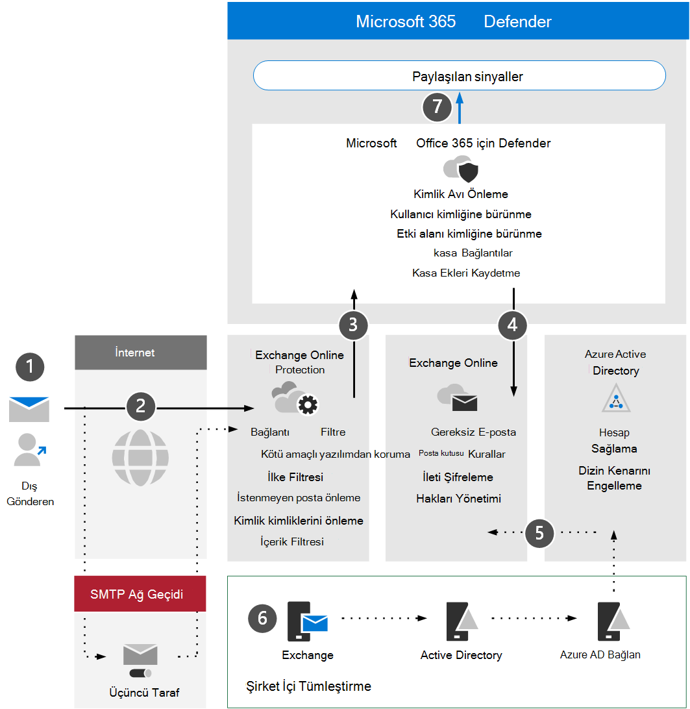

# Daha fazla mimari gereksinimleri ve Office 365 için Microsoft Defender'ı gözden geçirin

**Aşağıdakiler için geçerlidir:**
- Microsoft 365 Defender

Bu makale, Microsoft Defender için değerlendirme ortamını ayarlama işleminin [1/ 3](eval-defender-office-365-overview.md). adımıdır ve Office 365. Bu işlem hakkında daha fazla bilgi için genel bakış [makalesine bakın](eval-defender-office-365-overview.md).

Sistem için Defender'Office 365 etkinleştirmeden önce mimariyi anlıyoruz ve gereksinimleri karşılaya hazır olduğundan emin olun. Bu makalede, bu ortamın karşılaması gereken mimari, temel kavramlar ve Exchange Online önkoşullar açıklanmıştır.

## Mimariyi anlama

Aşağıdaki diyagramda, üçüncü taraf SMTP ağ geçidini veya şirket içi tümleştirmeyi de içermesi Office için Microsoft Defender temel mimarisini gösterir. Karma birlikte çalışma senaryoları (örneğin, üretim posta kutularının her ikisi de şirket içi ve çevrimiçidir), daha karmaşık yapılandırmalar gerektirir ve bu makale veya değerlendirme kılavuzunda ele alınmayacaktır.

Aşağıdaki tabloda bu çizim açık gösterilmiştir.

|Çağrıdan çıkma  |Açıklama  |
|---------|---------|
|1     | Dış gönderenin ana bilgisayar sunucusu normalde MX kaydı için genel bir DNS araması yapar ve bu da iletiyi geçişi için hedef sunucunun sağlar.  Bu başvuru doğrudan Exchange Online (EXO) veya EXO'ye geçiş için yapılandırılmış bir SMTP ağ geçidi olabilir.  |
|2     | Exchange Online Protection görüşmelerini ve gelen bağlantısını doğrulamalarını sağlar ve ek ilkeler, etiketleme veya işlemenin gerekli olduğunu belirlemek için ileti üst bilgilerini ve içeriğini inceler.  |
|3     | Exchange Online gelişmiş tehdit koruması, risk azaltma ve düzeltme Office 365 için Microsoft Defender ile tümleştirilmiştir. |
|4     | Kötü amaçlı, engellenmemiş veya karantinaya alınmış bir ileti işlenir ve EXO'de alıcıya teslim edilir; burada gereksiz postayla, posta kutusu kurallarıyla veya diğer ayarlarla ilgili kullanıcı tercihleri değerlendirilir ve tetiklenir. |
|5     | Posta özelliği etkin nesne ve hesapları eşitlemek ve en sonunda en üst düzeye Bağlan için eşitlemek ve sağlanması için, şirket içi Active Directory Azure Active Directory ile tümleştirme Exchange Online. |
|6     | Şirket içi ortamı tümleştirinken, postayla ilgili özniteliklerin, ayarların ve yapılandırmaların yönetimi ve yönetimi için Exchange sunucusu kullanmanın kesinlikle teşvik edildi |
|7     | Microsoft Defender for Office 365 shares signals to Microsoft 365 Defender for extended detection and response (XDR).|

Şirket içi tümleştirme yaygındır, ancak isteğe bağlıdır. Ortamınız yalnızca bulut tabanlı ise, bu kılavuz size de yardımcı olur.

## Önemli kavramları anlama

Aşağıdaki tabloda, MDO'yu değerlendirme, yapılandırma ve dağıtmada anlamanın önemli olduğu önemli kavramlar tanımlandı.

|Kavram  |Açıklama |Daha fazla bilgi  |
|---------|---------|---------|
|Exchange Online Protection      |    Exchange Online Protection (EOP), organizasyonlarınızı istenmeyen postalara ve kötü amaçlı yazılım e-postalarına karşı korumaya yardımcı olan bulut tabanlı filtreleme hizmetidir. EOP, lisansları ve Microsoft 365 lisansların tüm lisanslarında Exchange Online.     |   [Exchange Online Protection genel bakış](../office-365-security/exchange-online-protection-overview.md)      |
|Kötü amaçlı yazılımdan koruma     |    EXO'da posta kutuları olan kuruluşlar, kötü amaçlı yazılımlara karşı otomatik olarak korunur.     |  [EOP'de kötü amaçlı yazılımdan koruma](../office-365-security/anti-malware-protection.md)       |
|İstenmeyen posta önleme koruması     |   EXO'da posta kutuları olan kuruluşlar, gereksiz posta ve istenmeyen posta ilkelerine karşı otomatik olarak korunur.      |  [EOP'de istenmeyen posta önleme koruması](../office-365-security/anti-spam-protection.md)       |
|Kimlik avı koruması |  MDO, kimlik avı, veri avı, fidye yazılımı ve diğer zararlı etkinliklerle ilgili daha gelişmiş kimlik avı koruması sunar.   | [Windows için Microsoft Defender'da ek kimlik avı koruması Office 365](../office-365-security/anti-phishing-protection.md)   |
|Anti-spoing protection     |   EOP, kurumlarınızı sahte (sahte) gönderenlerden korumaya yardımcı olan özellikler içerir.      |   [EOP'de anti-poing protection](../office-365-security/anti-spoofing-protection.md)      |
|Kasa ekleme     |   Kasa, e-posta iletilerine teslim edilene kadar ekleri kontrol etmek ve "detonate" etmek için sanal bir ortam kullanarak ek bir koruma katmanı sağlar.      |   [Kasa için Microsoft Defender'daki Ekleri Office 365](../office-365-security/safe-attachments.md)      |
|Kasa, dosya SharePoint OneDrive için ekleri Microsoft Teams     |    Kasa, SharePoint, OneDrive ve Microsoft Teams ekleri, bulut depolama depolarında karşıya yüklenen dosyalar için ek bir koruma katmanı sunar.     |  [Kasa, Bağlantı SharePoint OneDrive için Ekleri Microsoft Teams](../office-365-security/mdo-for-spo-odb-and-teams.md)       |
|Güvenli Bağlantılar     | Kasa Bağlantılar, gelen e-posta iletileri içinde URL taraması ve yeniden yazma özellikleri sağlar ve teslim veya tıklamadan önce bu bağlantıların doğrulamasını sağlar.        |   [Kasa için Microsoft Defender'daki Office 365](../office-365-security/safe-links.md)      |
|    |         |         |

Microsoft Defender for Office'de bulunan özellikler hakkında daha ayrıntılı bilgi için bkz. Office 365 [için Microsoft Defender](/office365/servicedescriptions/office-365-advanced-threat-protection-service-description).

## Mimari gereksinimlerini gözden geçirme
Başarılı bir MDO değerlendirmesi veya üretim pilotları aşağıdaki önkulları varsayıyor:
- Tüm alıcı posta kutularınız şu anda posta Exchange Online.
- Genel MX kaydınız doğrudan EOP'ye veya üçüncü taraf SMTP ağ geçidine çözüm gelir ve bu ağ geçidi gelen dış e-postayı doğrudan EOP'ye iletir.
- Birincil e-posta etki alanınız *e-posta adresinizde* yetkili Exchange Online.
- Dizin Tabanlı Uç Engelleme'yi (DBEB) uygun *şekilde* başarıyla dağıttınız ve yapılandırdınız. Daha fazla bilgi için bkz [. Geçersiz Directory-Based iletileri reddetmek için Edge Engelleme'nin kullanımını engelleme](/exchange/mail-flow-best-practices/use-directory-based-edge-blocking).

> [!IMPORTANT]
> Bu gereksinimler geçerli yoksa veya hala karma bir birlikte çalışma senaryosundasanız, Office 365 için Microsoft Defender değerlendirme, bu kılavuzda tam olarak kapsamına uymayan daha karmaşık veya gelişmiş yapılandırmalar gerekli olabilir.

## SIEM tümleştirmesi

Kuruluş genelindeki güvenlik olaylarını daha kapsamlı olarak çözümlemek ve etkili ve hemen yanıt için playbooks oluşturmak için Office 365 için Microsoft Sentinel ile Microsoft Defender'ı tümleştirin. Daha fazla bilgi için bkz[. Bağlan için Microsoft Defender'dan gelen Office 365](/azure/sentinel/connect-office-365-advanced-threat-protection).

Uygulama için Microsoft Defender Office 365 Etkinlik Yönetimi API'si kullanılarak diğer Güvenlik Bilgileri ve Olay Yönetimi (SIEM) [Office 365 tümleşik olabilir](/office/office-365-management-api/office-365-management-activity-api-reference).

## Sonraki adımlar

Adım 2 / 3: [Microsoft Defender'ı değerlendirme ortamını Office 365](eval-defender-office-365-enable-eval.md)

Windows için [Microsoft Defender'ı Değerlendirme genel görünümüne Office 365](eval-defender-office-365-overview.md)

Değerlendirme ve pilot uygulama için [genel bakış Microsoft 365 Defender](eval-overview.md) 
