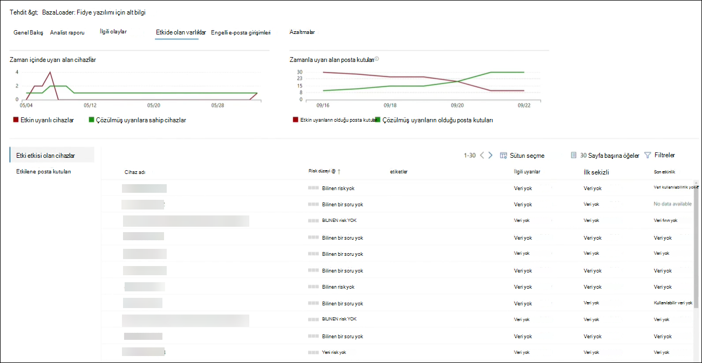

# Yeni Microsoft 365 Defender'de tehdit Microsoft 365 Defender 

[!INCLUDE [Microsoft 365 Defender rebranding](../includes/microsoft-defender.md)]

**Aşağıdakiler için geçerlidir:**
- Microsoft 365 Defender

> Bu deneyimi Microsoft 365 Defender? Bunu bir [laboratuvar ortamında değerlendirin veya](m365d-evaluation.md?ocid=cx-docs-MTPtriallab) [üretimde pilot projenizi çalıştırın](m365d-pilot.md?ocid=cx-evalpilot).
>

[!INCLUDE [Prerelease](../includes/prerelease.md)]

Tehdit analizi, güvenlik ekiplerinin mümkün olduğunca verimli olması için tasarlanmıştır ve ortaya çıkan tehditlere karşı aşağıdakiler gibi, uzman Microsoft güvenlik araştırmacısı tarafından alınan ürün için tehdit çözümüdür:

- Etkin tehdit tehditlerini ve onların kampanyalarını tehdit ediyor
- Popüler ve yeni saldırı teknikleri
- Kritik güvenlik açıkları
- Yaygın saldırı yüzeyleri
- Yaygın kötü amaçlı yazılım

Tehdit analizinin en son tehditleri izleme ve bunları durdurma konusunda nasıl yardımcı olduğu hakkında daha fazla bilgi edinmek için bu kısa videoyu izleyin.

>[!VIDEO https://www.microsoft.com/en-us/videoplayer/embed/RWwJfU]

Tehdit analizlerine Microsoft 365 güvenlik portalının gezinti çubuğunun sol üst tarafından veya kuruluşta en çok tehditleri gösteren adanmış bir pano kartından erişebilirsiniz. Etkin veya devam eden kampanyalar hakkında görünürlük elde etmek ve tehdit analizleri aracılığıyla ne olacağını bilmek, güvenlik işlemleri ekibinizi bilgili kararlar alma konusunda yardımcı olabilir. 

_Tehdit analizine erişim nerede olur?_

Sık sık ve yaygın olarak ortaya çıkan daha gelişmiş rakipler ve yeni tehditlerle, hızla devam etmek kritik öneme sahip:

- Ortaya çıkan tehditleri belirleme ve buna tepki verme
- Şu anda saldırıya mı neden olduğunu öğrenin
- Varlıklarınız için tehdidin etkisini değerlendirme
- Tehditlere karşı olan belki de tehditlere karşı olan korumanızı gözden geçirme
- Tehditlere karşı durarak veya onları içermek için gerçekleştir atabilirsiniz azaltma, kurtarma veya önleme eylemlerini belirleme

Her rapor, bu tehdite karşı savunma konusunda izlemeli bir tehdidin ve kapsamlı bir kılavuzun analizlerini sağlar. Ayrıca, ağınıza gelen, tehdidin etkin olup olmadığını ve geçerli korumalara sahip olup olmadığınızı gösteren verileri de bir almaktadır.

## Tehdit analiz panosuyu görüntüleme

Threat Analytics panosu ([security.microsoft.com/threatanalytics3](https://security.microsoft.com/threatanalytics3)), organizasyonunıza en uygun raporları vurgular. Aşağıdaki bölümlerdeki tehditleri özetler:

- **En son** tehdit: En son yayımlanan veya güncelleştirilmiş tehdit raporlarını, ayrıca etkin ve çözümlenmiş uyarıların sayısını listeler.
- **Çok etkili tehditlerin** olduğu, organizasyonlarınızı en çok etkileyen tehditleri listeler. Bu bölümde, öncelikle en yüksek etkin ve çözümlenmiş uyarı sayısına sahip tehdit listeleri listelenir.
- **Tehdit özeti**— etkin ve çözümlenmiş uyarılarla birlikte tehdit sayısını göstererek tüm izlemeli tehditlerin genel etkisini sağlar.

Bu tehdidin raporunu görüntülemek için panodan bir tehdit seçin.

_Threat analytics panosu. Ayrıca, okumak istediğiniz tehdit analizi raporuyla ilgili bir anahtar sözcükte Ara simgesine de tıkabilirsiniz._ 

## Tehdit analizi raporunu görüntüleme

Her tehdit çözümleme raporu birkaç bölümde bilgi sağlar:

- [**Genel bakış**](#overview-quickly-understand-the-threat-assess-its-impact-and-review-defenses)
- [**Analist raporu**](#analyst-report-get-expert-insight-from-microsoft-security-researchers)
- [**İlgili olaylar**](#related-incidents-view-and-manage-related-incidents)
- [**Etkide olan varlıklar**](#impacted-assets-get-list-of-impacted-devices-and-mailboxes)
- [**Engelli e-posta girişimleri**](#prevented-email-attempts-view-blocked-or-junked-threat-emails)
- [**Azaltmalar**](#mitigations-review-list-of-mitigations-and-the-status-of-your-devices)

### Genel bakış: Tehdidi hızlı bir şekilde anlıyoruz, etkisini değerlendirin ve savunmayı gözden geçirme

Genel **Bakış** bölümü, ayrıntılı analist raporunun bir önizlemesini sağlar. Ayrıca, hatalı ve eşleşmeyen cihazlar aracılığıyla organizasyonunız için tehdidin etkisini vurgulayan grafikler de sağlar.

_Tehdit analizi raporunun genel bakış bölümü_

#### Organizasyonu üzerinde etkisini değerlendirme

Her rapor, bir tehdidin kurumsal etkisi hakkında bilgi sağlamak için tasarlanmış grafikler içerir:

- **İlgili olaylar**: Aşağıdaki verilerle, izlenilen tehdidin organizasyonu üzerindeki etkisiyle ilgili genel bir bakış sağlar:
  - Etkin uyarı sayısı ve ilişkilendirilen etkin olay sayısı
  - Etkin olayları önem derecesi
- **Zamanla yapılan uyarılar**— İlgili Etkin ve Zaman **içinde çözülen** uyarıların sayısını gösterir. Çözülen uyarıların sayısı, kuruluşun bir tehditle ilişkilendirilmiş uyarılara ne kadar hızlı yanıt veremediklerine işaret ediyor. İdeal olan, grafiğin birkaç gün içinde çözülen uyarıları göstermesidir.
- **Etkileyen varlıklar—** şu anda izleme tehdidiyle ilişkili en az bir etkin uyarıya sahip olan ayrı cihazların ve e-posta hesaplarının (posta kutuları) sayısını gösterir. Tehdit e-postaları alan posta kutuları için uyarılar tetiklenir. Tehdit e-postalarının teslimi sırasında neden olan geçersiz kılmalar için hem kuruluş hem de kullanıcı düzeyi ilkeleri gözden geçirebilirsiniz.
- **Engellenmiş e-posta** denemeleri— son yedi gündeki e-posta sayısını gösterir. Bu e-posta teslim veya gereksiz posta klasörüne teslim edilmedi.

#### Güvenlik inalisini ve şuurlarını gözden geçirme

Her raporda, kuruma yönelik olarak verilen bir tehdite karşı ne kadar uygun olduğuyla ilgili genel bir bakış sağlayan grafikler yer almaktadır:

- **Güvenli yapılandırma durumu**: Hatalı yapılandırılmış güvenlik ayarlarına sahip cihazların sayısını gösterir. Tehdidi azaltmak için önerilen güvenlik ayarlarını uygulama. Tüm izleme **ayarlarını uyguladıkları** cihazlar _Güvenli_ olarak kabul edilir.
- **Güvenlik açığı düzeltme eki durumu**— korumasız cihazların sayısını gösterir. Tehdit tarafından yararlanan güvenlik açıkları için güvenlik güncelleştirmeleri veya düzeltme ekleri uygulayabilirsiniz.

#### Tehdit etiketleri başına raporları görüntüleme

Tehdit raporu listesini filtrenin ve belirli bir tehdit etiketine (kategori) veya rapor türüne göre en uygun raporları görüntüebilirsiniz.

- **Tehdit etiketleri**— belirli bir tehdit kategorisine göre en uygun raporları görüntülemede size yardımcı olabilir. Örneğin, fidye yazılımıyla ilgili tüm raporlar.
- **Rapor türleri**— belirli bir rapor türüne göre en uygun raporları görüntülemede size yardımcı olabilir. Örneğin, araçları ve teknikleri kapsaan tüm raporlar. 
- **Filtreler**— tehdit raporu listesini etkili bir şekilde gözden geçirme ve belirli bir tehdit etiketi veya rapor türüne göre görünümü filtreleme konusunda size yardımcı olur. Örneğin, fidye yazılımı kategorisiyle ilgili tüm tehdit raporlarını veya güvenlik açıklarını kapsaan tehdit raporlarını gözden geçirebilirsiniz.

##### Nasıl çalışır?

Microsoft Tehdit İstihbaratı ekibi her tehdit raporuna tehdit etiketleri ekledi:

- Dört tehdit etiketi artık kullanılabilir:
  - Fidye yazılımı
  - Kimlik avı
  - Güvenlik Açığı
  - Etkinlik grubu
- Tehdit etiketleri tehdit çözümleme sayfasının en üstünde, her etiket altında kullanılabilir rapor sayısına yönelik sayaçlarla birlikte sunulmaktadır.

  

- Liste ayrıca tehdit etiketlerine göre de sıralandırabilirsiniz:

  

- Filtreler her tehdit etiketi ve rapor türü için kullanılabilir:

  

### Analist raporu: Microsoft güvenlik araştırmacısı'nın uzman içgörülerini alın

Analist **raporu bölümünde** , ayrıntılı uzman yazılarını okuyun. Raporların çoğu, MITRE ATT&CK çerçevesine eşlenen taktikler ve teknikler, çok kapsamlı öneri listeleri ve güçlü tehdit arama kılavuzu dahil olmak üzere saldırı zincirleri hakkında [ayrıntılı açıklamalar sağlar](advanced-hunting-overview.md) .

[Analist raporu hakkında daha fazla bilgi](threat-analytics-analyst-reports.md)

### İlgili olaylar: İlgili olayları görüntüleme ve yönetme

İlgili **olaylar sekmesi** , izlenilen tehditle ilgili tüm olayların listesini sağlar. Her olayla bağlantılı olayları atayanın veya uyarıları yönetin. 

_Tehdit analizi raporunun ilgili olaylar bölümü_

### Etkiulan varlıklar: Etki etkisi olan cihazların ve posta kutularının listesini alın

Bir varlık etkin, çözümlenmemiş bir uyarıdan etkilenirse etkilendiği kabul edilir. **Etkiulan varlıklar** sekmesi, aşağıdaki etkiyi olan varlık türlerini listeler:

- **Etkilenen** cihazlar: Uç nokta uyarıları için çözümlenmemiş Microsoft Defender uç noktaları. Bu uyarılar genellikle bilinen tehdit göstergeleri ve etkinliklerine karşı bir durumla karşı karşıya olur.
- **Etkilenen posta kutuları**: Posta kutuları, e-posta iletileri almış olan ve bu iletiler için Microsoft Defender'ı tetikleyen Office 365 kutusudur. Uyarıları tetikleyen iletilerin çoğu normalde engellenmiş durumdayken, kullanıcı veya kuruluş düzeyi ilkeleri filtreleri geçersiz kılar.

_Tehdit analizi raporunun etkili varlıklar bölümü_

### Engellenmiş e-posta girişimleri: Engellenen veya gereksiz tehdit e-postalarını görüntüleme

Microsoft Defender for Office 365 typically blocks email with known threat indicators, including malicious links or attachments. Bazı durumlarda, şüpheli içeriği denetlemeye yönelik proaktif filtreleme mekanizmaları, tehdit e-postalarını gereksiz posta klasörüne gönderir. Her iki durumda da, cihazda kötü amaçlı yazılım kodunu başlatma tehdidinin olasılığı azaltıldı.

**Engellenmiş e-posta** girişimleri sekmesi, teslimden önce engellenen veya Microsoft Defender tarafından gereksiz posta klasörüne gönderilen tüm e-postaları Office 365. 

_Tehdit analizi raporunun engelli e-posta girişimleri bölümü_

### Azaltmalar: Risk azaltma listesini ve cihazlarınızı durumunu gözden geçirme

Azaltmalar **bölümünde** , tehditlere karşı kuruluşa karşı daha fazla özgü, eyleme geçirilebilir öneriler listesini gözden geçirebilirsiniz. İzli risk azaltmalar listesi şunları içerir:

- **Güvenlik güncelleştirmeleri**—yerleşik cihazlarda bulunan güvenlik açıkları için desteklenen yazılım güvenlik güncelleştirmeleri dağıtımı
- **Desteklenen güvenlik yapılandırmaları**
  - Bulut teslimi koruma  
  - İstenmeyen olabilecek uygulama (PUA) koruması
  - Gerçek zamanlı koruma

Bu bölümdeki azaltma bilgileri, rapor Tehdit ve Güvenlik Açığı Yönetimi çeşitli bağlantılarından ayrıntılı detaya gitme bilgileri de sağlayan veri bağlantılarını içerir.

_Tehdit analizi raporunun Azaltmalar bölümü_

## Ek rapor ayrıntıları ve sınırlamaları

> [!NOTE]
> Birleştirilmiş güvenlik deneyiminin bir parçası olarak tehdit çözümlemeleri, artık yalnızca Uç Nokta için Microsoft Defender'da değil, aynı zamanda Microsoft Defender for Office E5 lisans sahipleri için de sağlanmaktadır.
>
> Microsoft 365 güvenlik portalını (Microsoft 365 Defender) kullanmayacaksanız, rapor ayrıntılarını da (Office verileri için Microsoft Defender olmadan) Microsoft Defender Güvenlik Merkezi portalında (Uç nokta için Microsoft Defender) de bulabilirsiniz.

Tehdit analizi raporuna erişmek için belirli rollere ve izinlere ihtiyacınız vardır. Ayrıntılar [için bkz. Rol tabanlı erişim denetiminde Microsoft 365 Defender](custom-roles.md) roller.

- Uyarıları, olayları veya etkileyen varlık verilerini görüntülemek için, Office için Microsoft Defender veya Uç nokta uyarı verileri için Microsoft Defender veya her ikisini birden kabul etmek için izinlere sahip olmak gerekir.
- Engelli e-posta girişimlerini görüntülemek için, bu denemeler için Microsoft Defender Office izinlere sahip olmak gerekir. 
- Risk azaltmaları görüntülemek için, Uç Nokta için Microsoft Defender'Tehdit ve Güvenlik Açığı Yönetimi verileri görüntüleme izinlerine sahip olmak gerekir.

Tehdit çözümleme verilerine bakarak şu faktörleri unutmayın:

- Grafikler yalnızca izlenen risk azaltmalarını yansıttır. Grafiklerde gösterülen ek risk azaltmaları için rapora genel bakış bilgilerine bakın.
- Azaltmalar tam bir teminat garanti etmez. Sağlanan azaltmalar, performansı geliştirmek için gereken en iyi olası eylemleri yansıttır.
- Aygıtlar hizmete veri aktarmamışsa "kullanılamaz" olarak sayılır.
- Virüsten korumayla ilgili istatistikler veri Microsoft Defender Virüsten Koruma temel Microsoft Defender Virüsten Koruma temel almaktadır. Üçüncü taraf virüsten koruma çözümlerine sahip cihazlar "açık" olarak görünebilir.

## İlgili konular

- [Gelişmiş avla tehditlere karşı önceden bulma](advanced-hunting-overview.md) 
- [Analist raporu bölümünü anlama](threat-analytics-analyst-reports.md)
- [Güvenlik açıklarını ve pozlama durumlarını değerlendirin ve çözüm bulun](/windows/security/threat-protection/microsoft-defender-atp/next-gen-threat-and-vuln-mgt)
