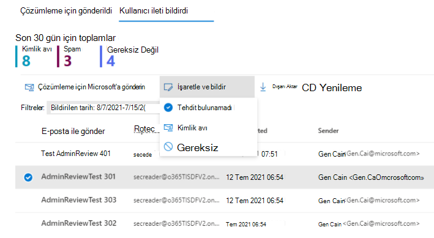

# Bildirilen iletiler için yönetici incelemesi

[!INCLUDE [Microsoft 365 Defender rebranding](../includes/microsoft-defender-for-office.md)]

**Geçerli olduğu yer:**
- [1. plan Office 365 plan 2 için Microsoft Defender](defender-for-office-365.md)
- [Microsoft 365 Defender](../defender/microsoft-365-defender.md)

Microsoft 365 posta kutuları olan Exchange Online Microsoft Defender ve Office 365 için Microsoft Defender'da yöneticiler artık bildirilen iletileri gözden geçirdikten sonra şablon iletileri son kullanıcılara geri gönderebilir. Şablonlar, organizasyonunız için özelleştirilebilir ve yöneticinizin kararına bağlı olarak da özelleştirilebilir.

Bu özellik kullanıcılarınıza geri bildirim vermek üzere tasarlanmıştır, ancak sistem içerisinde ileti kararlarını değiştirmez. Microsoft'un filtrelerini güncelleştirmesini ve geliştirmesini yardımcı olmak için, Yönetici gönderimini kullanarak çözümleme için [ileti göndermeniz gerekir](admin-submission.md).

İleti yalnızca, hatalı pozitif veya yanlış negatif olarak bildiriliyorsa, sonuçları gözden geçirme sonuçlarını işaretp [bildirebilirsiniz](report-false-positives-and-false-negatives.md).

## Başlamadan önce bilmeniz gerekenler

- Microsoft 365 Defender portalını açın<https://security.microsoft.com>. Doğrudan Gönderiler **sayfasına gitmek için** kullanın <https://security.microsoft.com/reportsubmission>.

- Kullanıcı gönderimlerinin yapılandırmasını değiştirmek için, aşağıdaki rol gruplarından birinin üyesi olmak gerekir:
  - Web Portalı'nın Kuruluş Yönetimi [Microsoft 365 Defender.](permissions-microsoft-365-security-center.md)
  - Kuruluş Yönetimi ([Exchange Online](/Exchange/permissions-exo/permissions-exo#role-groups).

- Exchange Online PowerShell'e de erişiminiz vardır. Kullanmaya istediğiniz hesabın PowerShell'de Exchange Online erişimi yoksa, Etki alanınıza bir e-posta adresi belirtin *hatasını alırsınız*. PowerShell'de erişimi etkinleştirme veya devre dışı Exchange Online daha fazla bilgi için aşağıdaki konulara bakın:
  - [Exchange Online PowerShell'e erişimi etkinleştirme veya devre dışı bırakma](/powershell/exchange/disable-access-to-exchange-online-powershell)
  - [Web'de İstemci Erişimi Exchange Online](/exchange/clients-and-mobile-in-exchange-online/client-access-rules/client-access-rules)

## Kullanıcıları portalın içinde bilgilendirin

1. Microsoft 365 Defender portalında, E-posta <https://security.microsoft.com>ve **işbirliği** Gönderileri'nin **Gönderiler &** \> **gidin**. Doğrudan Gönderiler **sayfasına gitmek için** kullanın <https://security.microsoft.com/reportsubmission>.

2. Kullanıcı **tarafından bildirilen iletiler'e** tıklayın, ardından işaretlemek ve bildirmek istediğiniz iletiyi seçin.

3. Farklı işaretle **ve bildir açılan liste'yi** seçin ve ardından Tehdit **bulunamadı, Kimlik** Avı **veya Gereksiz'i** **seçin**.

   > [!div class="mx-imgBorder"]
   > 

Bildirilen ileti hatalı pozitif veya yanlış negatif olarak işaretlenir ve portaldan iletiyi bildiren kullanıcıya otomatik olarak bir e-posta gönderilir.

## Kullanıcıları bilgilendirmede kullanılan iletileri özelleştirme

1. Microsoft 365 Defender portalında, <https://security.microsoft.com>E-posta ve İşbirliği İlkeleri  **sayfasındaki Kullanıcı** gönderimleri sayfasına & \> Kuralları Tehdit ilkeleri  **&** \>  \>, Kullanıcı Diğer bölümünde ileti **ayarlarını** bildirdi. Doğrudan Kullanıcı gönderimleri **sayfasına gitmek için** , kullanın <https://security.microsoft.com/userSubmissionsReportMessage>.

2. Kullanıcı gönderimleri sayfasında, gönderenin görünen adını belirtmek isterseniz, Yönetici inceleme sonuçları için **e-posta** bildirimleri bölümünde Office 365 e-posta adresini belirtin kutusunu işaretleyin ve kullanmak istediğiniz adı girin. E-posta adresi, e-Outlook ve tüm yanıtlar bu adrese gider.

3. Şablonlardan herhangi birini özelleştirmek için sayfanın en altındaki **E-posta** bildirimini özelleştir'e tıklayın. Açılan açılır listede yalnızca şunları özelleştirebilirsiniz:

    - Kimlik avı
    - Gereksiz
    - Tehdit bulunamadı
    - Alt Bilgi

    > [!div class="mx-imgBorder"]
    > 

4. Bitirdiğinizde, **Kaydet**'i tıklatın. Bu değerleri temizlemek için, **Kullanıcı gönderimleri** **sayfasında At'a** tıklayın.
