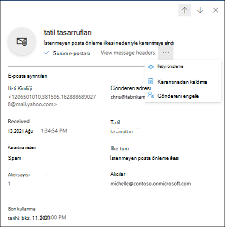
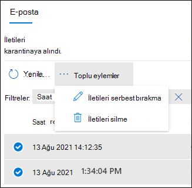

# EOP'de kullanıcı olarak karantinaya alınmış iletileri bulma ve serbest bırakma

[!INCLUDE [Microsoft 365 Defender rebranding](../includes/microsoft-defender-for-office.md)]

**Geçerli olduğu yer:**
- [Exchange Online Protection](exchange-online-protection-overview.md)
- [1. plan Office 365 plan 2 için Microsoft Defender](defender-for-office-365.md)
- [Microsoft 365 Defender](../defender/microsoft-365-defender.md)

Microsoft 365 posta kutusu olmayan Exchange Online ya da tek başına Exchange Online Protection Exchange Online Protection EOP Exchange Online) kuruluşlarında, karantinada tehlikeli veya istenmeyen iletiler karantinaya alın. Daha fazla bilgi için bkz. [EOP'de karantina](quarantine-email-messages.md).

Normal bir kullanıcı (yönetici olarak değil), karantinaya  alınmış iletinin alıcısı olarak sizin için kullanılabilir varsayılan özellikler aşağıdaki tabloda açıklanmıştır:

 

****

|Karantina nedeni|Görünüm|Sürüm|Silme|
|---|:---:|:---:|:---:|
|**İstenmeyen posta önleme ilkeleri**||||
|Toplu||||
|İstenmeyen posta||||
|Yüksek güven istenmeyen posta||||
|Kimlik avı||||
|Yüksek güven kimlik avı||||
|**Kimlik avı önleme ilkeleri**||||
|EOP'de akıllı ifade koruması||||
|Office 365 için Defender'da kimliğine bürünülen kullanıcı Office 365||||
|Office 365 için Defender'da kimliğine bürünülen etki alanı Office 365||||
|Office 365 için Defender'da posta kutusu zekası koruması||||
|**Kötü amaçlı yazılımdan koruma ilkeleri**||||
|Ekleri olan ve kötü amaçlı yazılım olarak karantinaya alınmış e-posta iletileri.||||
|**Kasa için Defender'da Ekleri Office 365**||||
|Kasa kötü amaçlı ekleri olan e-posta iletilerini kötü amaçlı yazılım olarak karantinaya alan ekler ilkelerini içerir.||||
|Kasa dosyalarını kötü amaçlı yazılım olarak SharePoint, OneDrive Microsoft Teams için ekleri karantinaya alın.||||
|**Posta akış kuralları (aktarım kuralları)**||||
|E-posta iletilerini karantinaya alan posta akışı kuralları.||||
|

_Karantina ilkeleri_, desteklenen özelliklerde iletinin neden karantinaya alındığına bağlı olarak, kullanıcıların karantinaya alınmış iletilerde ne yapmalarına [izin verilmiyor?](quarantine-policies.md#step-2-assign-a-quarantine-policy-to-supported-features) Varsayılan karantina ilkeleri, geçmiş özelliklerini önceki tabloda açıklandığı gibi zorlar. Yöneticiler desteklenen özelliklerde kullanıcılar için daha az kısıtlayıcı veya daha kısıtlayıcı özellikler tanımlayan özel karantina ilkeleri oluşturabilir ve uygulayabilir. Daha fazla bilgi için bkz. [Karantina ilkeleri](quarantine-policies.md).

Karantinaya alınmış iletilerinizi en son karantina portalında Microsoft 365 Defender ya da (bir yönetici bu iletileri ayarladı ise) karantina ilkelerinden yönetirsiniz.

## Başlamadan önce bilmeniz gerekenler

- Oturum açma Microsoft 365 Defender için, ' gidin<https://security.microsoft.com>. Doğrudan Karantina sayfasına **gitmek için** , kullanın <https://security.microsoft.com/quarantine>.

- Yöneticiler, istenmeyen posta önleme ilkelerde iletilerin kalıcı olarak silinmeden önce karantinada tutulma sürelerini yapılandırabilirsiniz. Karantinada süresi dolmuş olan iletiler kurtarılamaz. Daha fazla bilgi için bkz. [EOP'de istenmeyen posta önleme ilkelerini yapılandırma](configure-your-spam-filter-policies.md).

- Varsayılan olarak, yüksek güven amaçlı kimlik avı, kötü amaçlı yazılım veya posta akış kuralları nedeniyle karantinaya alınmış iletiler yalnızca yöneticiler tarafından kullanılabilir ve kullanıcılar tarafından görülmeyebilir. Daha fazla bilgi için bkz [. EOP'de yönetici olarak karantinaya alınmış iletileri ve dosyaları yönetme](manage-quarantined-messages-and-files.md).

## Karantinaya alınmış iletilerinizi görüntüleme

> [!NOTE]
> Karantinaya alınmış iletileri görüntüleme olanağınız, karantinaya alınmış  ileti türüne uygulanan karantina ilkesi (karantina nedeninin varsayılan karantina [ilkesi olabilir) tarafından denetlenr](quarantine-policies.md#step-2-assign-a-quarantine-policy-to-supported-features).

1. Aşağıdaki Microsoft 365 Defender portalında E-posta Gönder <https://security.microsoft.com>ve işbirliğini **& Karantina'ya** \>  \> **gidin**. Doğrudan Karantina sayfasına **gitmek için** , kullanın <https://security.microsoft.com/quarantine>.

2. Karantina **sayfasında** , kullanılabilir bir sütun başlığına tıklayarak sonuçları sıraleyebilirsiniz. Gösterilen **sütunları değiştirmek**  için Sütunları özelleştir'e tıklayın. Varsayılan değerler yıldız işaretiyle () işaretlenir\*:

   - **Alınan saat**\*
   - **Konu**\*
   - **Gönderen**\*
   - **Karantina nedeni**\*
   - **Sürüm durumu**\*
   - **İlke türü**\*
   - **Son kullanma tarihi**\*
   - **Alıcı**
   - **İleti Kimliği**
   - **İlke adı**
   - **İleti boyutu**
   - **Posta yönü**

   Bitirdikten sonra Uygula'ya **tıklayın**.

3. Sonuçları filtrelemek için Filtre'ye **tıklayın**. Görüntülenen Filtreler açılır yapısında **aşağıdaki** filtreler kullanılabilir:
   - **İleti Kimliği**: İletinin genel benzersiz tanımlayıcısıdır.
   - **Gönderen adresi**
   - **Alıcı adresi**
   - **Konu**
   - **Alınan saat**: Başlangıç **saati ve Bitiş** **saati (tarih** ) girin.
   - **Son kullanma** tarihi: İletileri karantinadan kullanım süresi dolana kadar filtrelerini uygulama:
     - **Bugün**
     - **Sonraki 2 gün**
     - **Sonraki 7 gün**
     - **Özel**: Başlangıç **saati ve Bitiş** **saati (tarih** ) girin.
   - **Karantina nedeni**:
     - **Toplu**
     - **İstenmeyen posta**
     - **Kimlik avı**: İstenmeyen posta filtresi **kararının alınan** kimliği avı veya kimlik avı koruması, iletiyi karantinaya aldı ([kimlik](set-up-anti-phishing-policies.md#spoof-settings) sahtesi ayarları veya [kimliğe](set-up-anti-phishing-policies.md#impersonation-settings-in-anti-phishing-policies-in-microsoft-defender-for-office-365) bürünme koruması).
     - **Yüksek güven kimlik avı**
   - **Sürüm durumu**: Aşağıdaki değerlerden herhangi biri:
     - **Gözden geçirme gerekiyor**
     - **Onaylandı**
     - **Reddedildi**
     - **Sürüm isteği alındı**
     - **Yayımlanan**
   - **İlke Türü**: İletileri ilke türüne göre filtreleme:
     - **Kötü amaçlı yazılımdan koruma ilkesi**
     - **Kasa ekleri ilkesi**
     - **Kimlik avı önleme ilkesi**
     - **İstenmeyen posta önleme ilkesi**

   Bitirdikten sonra Uygula'ya **tıklayın**. Filtreleri temizlemek için Filtreleri temizle simgesine  **Filtreleri temizleme**.

4. Belirli **iletileri** bulmak için Arama kutusunu ve karşılık gelen bir değeri kullanın. Joker karakterler desteklenmiyor. Aşağıdaki değerlere göre arama yapabilirsiniz:
   - İleti Kimliği
   - Gönderen e-posta adresi
   - Alıcı e-posta adresi
   - Konu. İletinin konusunun tamamını kullanın. Arama büyük/harfe duyarlı değildir.
   - İlke adı. İlke adının tamamını kullanın. Arama büyük/harfe duyarlı değildir.

   Arama ölçütlerini girdikten sonra, sonuçları filtrelemek için ENTER tuşuna basın.

Belirli bir karantinaya alınmış iletiyi bu olduktan sonra, ayrıntılarını görüntülemek ve iletiyle ilgili bir işlem yapmak için (örneğin, iletiyi görüntüleme, bırakma, indirme veya silme) iletiyi seçin.

### Karantinaya alınan ileti ayrıntılarını görüntüleme

Listeden karantinaya alınmış iletiyi seçin, görüntülenen ayrıntılar açılır iletisinde aşağıdaki bilgiler kullanılabilir.

Listeden bir e-posta iletisi seçin, Ayrıntılar bölmesine aşağıdaki **ileti ayrıntıları** gösterilir:

- **İleti Kimliği**: İletinin genel benzersiz tanımlayıcısıdır.
- **Gönderen adresi**
- **Alındı**: İletinin alın aldığı tarih/saat.
- **Konu**
- **Karantina nedeni**
- **İlke** türü: İlke türü. Örneğin, **İstenmeyen posta önleme ilkesi**.
- **Alıcı sayısı**
- **Alıcılar**: İleti birden çok alıcı içeriyorsa, alıcıların tam listesini görmek için  İletiyi önizleme'yi veya İleti üst bilgilerini görüntüle'yi tıklatmanız gerekir.
- **Son kullanma** tarihi: İletinin karantinadan otomatik olarak ve kalıcı olarak silinecek olduğu tarih/saat.

İleti üzerinde işlem yapmak için sonraki bölüme bakın.

> [!NOTE]
> Ayrıntılar uç iletisinde kalmak, ancak üzerinde karantinaya alınmış iletiyi değiştirmek için, uç ilişkinin üst kısmında bulunan yukarı ve aşağı okları kullanın.
>
> 

### Karantinaya alınmış e-postada eyleme geç

> [!NOTE]
> Karantinaya alınmış iletilerde eylem yapma olanağınız, karantinaya alınmış  ileti türüne uygulanan karantina ilkesi (karantina nedeninin varsayılan karantina [ilkesi olabilir) tarafından denetlenr](quarantine-policies.md#step-2-assign-a-quarantine-policy-to-supported-features). Bu bölümde kullanılabilir tüm eylemler açık bulunmaktadır.

Listeden karantinaya alınmış bir ileti belirttikten sonra, ayrıntılar iletisinde aşağıdaki eylemler kullanılabilir:

-  **Sürüm e-postası**\*: İletiyi Gelen Kutunuza teslim ediyor.

-  **İleti üst bilgilerini görüntüleme**: İleti üst bilgisi metnini görmek için bu bağlantıyı seçin. İleti **üst bilgisi** açılır başlığı, aşağıdaki bağlantılarla birlikte görüntülenir:
- **İleti üst bilginizi** kopyalayın: İleti üst bilgilerini (tüm üst bilgi alanları) panoya kopyalamak için bu bağlantıya tıklayın.
- **Microsoft İleti Üst Bilgisi Çözümleyicisi**: Üstbilgi alanlarını ve değerlerini derinlemesine çözümlemek için, bu bağlantıya tıklayarak İleti Üst Bilgisi Çözümleyicisi'ne gidin. İleti üst bilgilerini Çözümlemek istediğiniz  ileti üst bilgilerini ekleme bölümüne yapıştırın (CTRL+V veya sağ tıklayın ve Yapıştır'ı **seçin) ve** ardından Üst bilgileri **çözümle'ye tıklayın**.

Diğer eylemler simgesine tıklarsanız aşağıdaki  **Diğer eylemler**:

-  **Önizleme iletisi**: Görüntülenen açılır listede, aşağıdaki sekmelerden birini seçin:
  - **Kaynak**: Tüm bağlantılar devre dışı bırakılmıştır ve ileti gövdesinin HTML sürümünü gösterir.
  - **Düz metin**: İleti gövdesini düz metin olarak gösterir.

-  **Karantinadan kaldır**: Görüntülenen **uyarıda Evet'e** tıklarsanız, ileti özgün alıcılara gönderilmeden hemen silinir.

-  **E-postayı** indir: Görüntülenen açılır iletide, Bu iletiyi indirmenin risklerini anlıyorum öğesini seçin ve sonra da indir'e tıklayıp iletinin yerel bir kopyasını .eml biçiminde kaydedin.

-  **Göndereni** engelleme: Göndereni posta kutunuzda Engellenen Gönderenler **listesine** ekleyin. Daha fazla bilgi için bkz [. Posta göndereni engelleme](https://support.microsoft.com/office/b29fd867-cac9-40d8-aed1-659e06a706e4).

\* Bu seçenek, daha önce yayımlanan iletiler için kullanılamaz (Yayımlanan **durum** değeri Sürüm **tarihidir**).

İletiyi çıkartır veya kaldırsanız bile, varsayılan karantina bekletme süresinin süresi dolsa bile (Süre aşımına varıldı sütununda gösterildiği gibi) bu **ileti** silinir.

> [!NOTE]
> Mobil cihazda, eylem simgelerini açıklama metni kullanılamaz.
>
> 
>
> Simgeler ve bunların karşılık gelen açıklamaları aşağıdaki tabloda özetlenmiştir:
>
> |Simge|Açıklama|
> |---:|---|
> ||**Sürüm e-postası**|
> ||**İleti üst bilgilerini görüntüleme**|
> ||**İletiyi önizleme**|
> ||**Karantinadan kaldırma**|
> ||**Göndereni engelle**|

#### Birden çok karantinaya alınmış e-posta iletide eyleme geç

İlk sütunun sol tarafından boş bir alana tıklayarak listede birden çok karantinaya alınmış ileti (en çok 100) seçin; burada, aşağıdaki eylemleri gerçekleştirebilirsiniz:

-  **Sürüm iletileri**: İletileri Gelen Kutunuza teslim ediyor.
-  **İletileri** silme: Görüntülenen **uyarıda Evet'e** tıklarsanız, iletiler özgün alıcılara gönderilmeden hemen karantinadan kaldırılır.
