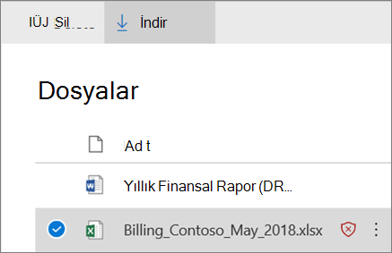

# Kasa, Bağlantı SharePoint OneDrive için Ekleri Microsoft Teams

[!INCLUDE [Microsoft 365 Defender rebranding](../includes/microsoft-defender-for-office.md)]

**Geçerli olduğu yer:**
- [1. plan Office 365 plan 2 için Microsoft Defender](defender-for-office-365.md)
- [Microsoft 365 Defender](../defender/microsoft-365-defender.md)

Kasa için [Microsoft Defender'da](whats-new-in-defender-for-office-365.md) SharePoint, OneDrive ve Microsoft Teams ekleri Office 365 içinde yer alan yaygın virüs algılama altyapısı tarafından zaman uyumsuz olarak taranmış dosyalar için ek bir koruma katmanı sağlar [ Microsoft 365](virus-detection-in-spo.md). Kasa. SharePoint, OneDrive ve Microsoft Teams ekleri, ekip sitelerinde ve belge kitaplıklarında kötü amaçlı olarak tanımlanan mevcut dosyaları algılamaya ve engellemeye yardımcı olur.

Kasa, SharePoint, OneDrive ve Microsoft Teams için ekler varsayılan olarak etkin değildir. Bu eklentiyi açmak için bkz[. Kasa, E-posta SharePoint OneDrive' Microsoft Teams](turn-on-mdo-for-spo-odb-and-teams.md).

## E Kasa, SharePoint, OneDrive ve Microsoft Teams nasıl çalışır?

Kasa, SharePoint, OneDrive ve Microsoft Teams ekleri etkinleştirildiğinde ve bir dosyayı kötü amaçlı olarak tanımıyorsa, dosya depolarla doğrudan tümleştirme kullanılarak kilitlenir. Aşağıdaki resimde, kitaplıkta algılanan kötü amaçlı bir dosyanın örneği bulunmaktadır.

Engellenen dosya belge kitaplığında ve web, mobil veya masaüstü uygulamalarında listelenmiş olsa da, kişiler dosyayı açamıyor, kopyalayıp taşıyamıyor veya paylaşamıyor. Ancak engellenen dosyayı silebilirler.

İşte mobil cihazda engellenen dosyanın nasıl göründüğünün bir örneği:

Varsayılan olarak, kişiler engellenen bir dosyayı indirebilir. Engellenen bir dosyayı indirme işlemi mobil cihaza şöyle olur:

SharePoint Online yöneticileri kişilerin kötü amaçlı dosyaları indirmesini önlenebilir. Yönergeler için bkz. [SharePoint kötü amaçlı dosyaları indirmelerini engellemek için SharePoint Online PowerShell kullanma](turn-on-mdo-for-spo-odb-and-teams.md#step-2-recommended-use-sharepoint-online-powershell-to-prevent-users-from-downloading-malicious-files).

Bir dosya kötü amaçlı olarak algılandığında kullanıcı deneyimi hakkında daha fazla bilgi edinmek için bkz. [SharePoint Online'da, OneDrive'de](https://support.microsoft.com/office/01e902ad-a903-4e0f-b093-1e1ac0c37ad2) veya başka bir Microsoft Teams.

## Dosya, Dosya ve Dosya Ekleri Kasa tarafından algılanan kötü amaçlı dosyalar SharePoint OneDrive bilgileri Microsoft Teams

Kasa, SharePoint, OneDrive ve Microsoft Teams ekleri tarafından kötü amaçlı olarak tanımlanan dosyalar, [Office 365 için Microsoft Defender](view-reports-for-mdo.md) ve [Explorer'da (](threat-explorer.md)ve gerçek zamanlı algılamalar) raporlarda yer aşişiya neden olur.

Dosya Kasa, SharePoint OneDrive ve Microsoft Teams ekleri ile kötü amaçlı olarak tanımlandısa, dosya karantinada da kullanılabilir, ancak yalnızca yöneticiler tarafından kullanılabilir. Daha fazla bilgi için bkz[. Daha fazla bilgi için Defender'da karantinaya alınmış Office 365](manage-quarantined-messages-and-files.md#use-the-microsoft-365-defender-portal-to-manage-quarantined-files-in-defender-for-office-365).

## Bu noktaları gözlerde tutma

- Office 365 için Defender, SharePoint Online, OneDrive İş veya Microsoft Teams'de tek tek dosyaları taramaz. Bu, tasarımdan kaynaklanır. Dosyalar zaman uyumsuz olarak taranır. Bu işlemde, kötü amaçlı dosyaları tanımlamak için paylaşım ve konuk etkinliği etkinliklerinin yanı sıra akıllı heuristler ve tehdit işaretleri de kullanılır.

- En son SharePoint Modern deneyimi kullanmak üzere yapılandırıldığından [emin olun](/sharepoint/guide-to-sharepoint-modern-experience). Dosya Office 365 için Defender, Modern deneyim veya Klasik görünüm kullan olsa da geçerlidir; bununla birlikte, bir dosyanın engellenmiş olduğu görsel göstergeler yalnızca Modern deneyimde kullanılabilir.

- Kasa SharePoint, OneDrive ve Microsoft Teams ekleri, Exchange Online Protection'te (EOP) istenmeyen posta ve kötü amaçlı yazılımdan koruma ile kötü amaçlı yazılımdan korumayı içeren genel tehdit koruma stratejisinde yer alan Kasa Bağlantılar'dır ve Kasa için Microsoft Defender'daki Ekleri Office 365. Daha fazla bilgi edinmek için bkz[. Güvenlik tehditlerine Office 365](protect-against-threats.md).
