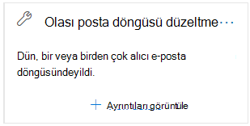

# Güvenlik ve Uyumluluk Merkezi'nde olası posta döngüsü & çözme

[!INCLUDE [Microsoft 365 Defender rebranding](../includes/microsoft-defender-for-office.md)]

**Geçerli olduğu yer:**
- [Exchange Online Protection](exchange-online-protection-overview.md)
- [1. plan Office 365 plan 2 için Microsoft Defender](defender-for-office-365.md)
- [Microsoft 365 Defender](../defender/microsoft-365-defender.md)

Posta döngüleri hatalıdır çünkü:

- Sistem kaynaklarını kullanırlar.
- Bunlar, kurumnizin posta toplu kotasını tüketir.
- Bunlar, özgün ileti gönderenlere karmaşık teslim edililmeyen raporlar (NDR'ler veya geri dönen iletiler olarak da bilinir) gönderir.

Güvenlik **ve** Uyumluluk Merkezi'nde Posta akışı panosunun Sizin için önerilenler alanında  yer alan Olası posta döngüsü  düzeltme içgörüyü, kurumda bir posta döngüsü algılandığında size bu durumu haber &.

Bu içgörü ancak koşul algılandığında görüntülenir (posta döngüleri yoksa, içgörüyü görmezsiniz).

Widget'ta **Ayrıntıları görüntüle'ye** tıklarken, daha fazla bilgiyle birlikte bir açılır pencere açılır:

- **Etki alanı**
- **İleti sayısı**: Döngüden etkilenen **ileti örneğine** [dair ileti](message-trace-scc.md) izleme sonuçlarını görmek için Örnek iletileri görüntüle'yi tıklatın.
- **Etki alanı** türü" Örneğin, Yetkili veya Yetkili Değil.
- **MX kaydı**: Etki alanının MX **kaydının** **ana** bilgisayarı (Posta sunucusu) ve Öncelik değerleri.
- **Döngü nedeni** **ve Düzeltme:** En yaygın posta döngüsü senaryolarını belirleyecek ve döngüyü düzeltmek için önerilen eylemleri sağlarız.

## Ayrıca bkz.

Posta akışı panosunda yer alan diğer içgörüler hakkında bilgi için, Güvenlik ve Uyumluluk Merkezi'nde [Posta & bakın](mail-flow-insights-v2.md).
