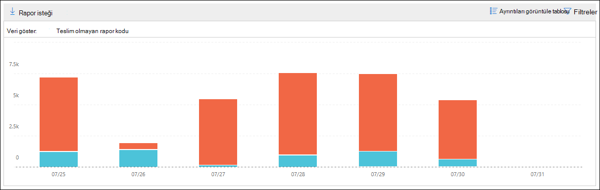

# Güvenlik ve Uyumluluk Merkezi'nde teslim & değil

[!INCLUDE [Microsoft 365 Defender rebranding](../includes/microsoft-defender-for-office.md)]

**Geçerli olduğu yer:**
- [Exchange Online Protection](exchange-online-protection-overview.md)
- [1. plan Office 365 plan 2 için Microsoft Defender](defender-for-office-365.md)
- [Microsoft 365 Defender](../defender/microsoft-365-defender.md)

**Güvenlik** [&](https://protection.office.com) Uyumluluk Merkezi'nin Posta  akışı panosunda, teslim edilemedi raporlarında (NDR'ler veya geri dönen iletiler olarak da bilinir) en çok karşılaşılan hata kodları yer alır. Bu rapor NDR'lerin ayrıntılarını gösterir; böylelikle e-posta teslim sorunlarını giderebilirsiniz.

## Teslim olmayan rapor için rapor görünümü

Teslim değil **raporu widget'ine tıklamak** sizi Teslim **değil raporuna götürmenizi sağlar**.

Varsayılan olarak, tüm hata kodları etkinliği gösterilir. Aşağıdaki için **verileri göster'e** tıklarsanız, açılan listeden belirli bir hata kodu seçin.

Grafikte belirli bir günün belirli bir rengin (hata kodu) üzerine gelindiğinde hatanın toplam ileti sayısını alırsınız.

## Teslim değil raporu için Ayrıntılar tablosu görünümü

Rapor görünümünde **Ayrıntıları görüntüle tablosu'ne** tıklarsanız, aşağıdaki bilgiler gösterilir:

- **Tarih**
- **Teslim olmayan rapor kodu**
- **Sayı**
- **Örnek iletiler**: Etkilenen iletilerden bir örneğin ileti kimlikleri.

Ayrıntılar tablosu **görünümünde Filtreler'e** tıklarsanız, Başlangıç tarihi ve Bitiş tarihi ile bir **tarih** aralığı **belirtebilirsiniz**.

Belirli bir tarih aralığına yönelik raporu bir veya birden çok alıcıya e-postayla göndermek için İndirme **isteği'ne tıklayın**.

Tabloda bir satır seçin; aşağıdaki bilgilerle birlikte bir açılır sayfa görüntülenir:

- **Tarih**
- **Teslim olmayan rapor kodu**: Belirli hata kodunun nedenleri ve çözümleri hakkında daha fazla bilgi almak için bağlantıya tık kullanabilirsiniz.
- **Sayı**
- **Örnek iletiler**: Etkilenen **iletilerden bir örneğine** dair [ileti izleme sonuçlarını görmek](message-trace-scc.md) için Örnek iletileri görüntüle'ye tıkabilirsiniz.

## İlgili konular

Posta akışı panosunda yer alan diğer içgörüler hakkında bilgi için, Güvenlik ve Uyumluluk Merkezi'nde [Posta & bakın](mail-flow-insights-v2.md).
