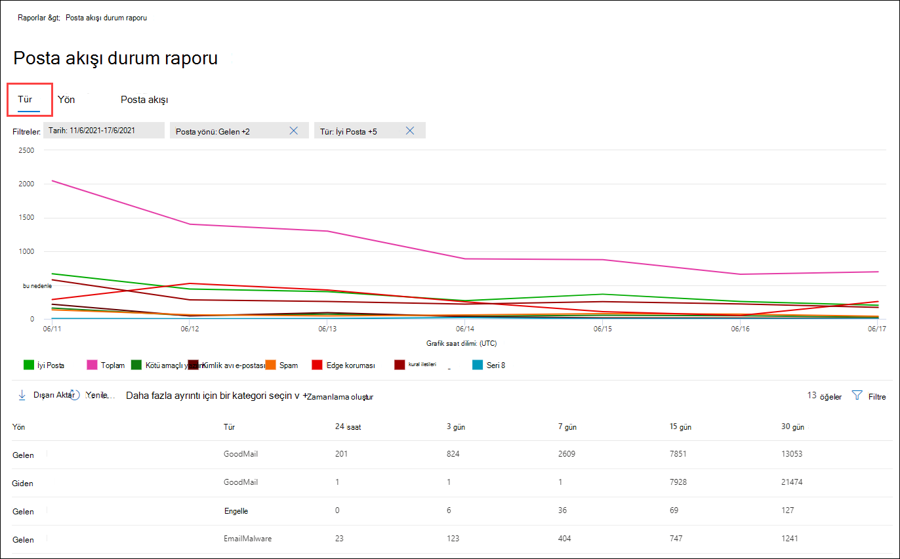
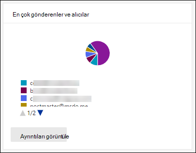

# Portalda e-posta Microsoft 365 Defender görüntüleme

[!INCLUDE [Microsoft 365 Defender rebranding](../includes/microsoft-defender-for-office.md)]

**Geçerli olduğu yer:**
- [Exchange Online Protection](exchange-online-protection-overview.md)
- [1. plan Office 365 plan 2 için Microsoft Defender](defender-for-office-365.md)
- [Microsoft 365 Defender](../defender/microsoft-365-defender.md)

Microsoft 365 Defender portalında <https://security.microsoft.com> İstenmeyen posta önleme, kötü amaçlı yazılımdan koruma ve şifreleme özellikleri gibi e-posta güvenlik özelliklerinin Microsoft 365 için çeşitli raporlar bulabilirsiniz. Gerekli izinlere [sahipsiniz,](#what-permissions-are-needed-to-view-these-reports) bu makalede açıklandığı gibi bu raporları indirebilirsiniz.

> [!NOTE]
>
> E-posta ve işbirliği raporları **sayfasındaki &, e-posta** göndermek için Microsoft Defender Office 365. Bu raporlar hakkında bilgi için bkz. Rapor [portalında Office 365 için View Defender Microsoft 365 Defender.](view-reports-for-mdo.md)
>
> Posta akışıyla ilgili raporlar artık genel Exchange bir yönetim merkezindedir. Bu raporlar hakkında daha fazla bilgi için bkz[. Yeni Yönetim Merkezi'nde Exchange raporları](/exchange/monitoring/mail-flow-reports/mail-flow-reports).

## Güvenliği ihlal edilmiş kullanıcılar raporu

> [!NOTE]
> Bu rapor, posta Microsoft 365 olan tüm Exchange Online kullanılabilir. Tek başına EOP (EOP) Exchange Online Protection kuruluşlarda kullanılamaz.

Güvenliği **ihlal edilmiş** kullanıcılar raporu, son 7 gün içinde Şüpheli veya **Kısıtlanmış** olarak  işaretlenmiş kullanıcı hesaplarının sayısını gösterir. Bu durumların herhangi bir hesapta sorunlu veya hatta güvenliği ihlal edilmiş olabilir. Sık kullanımı kullanarak, şüpheli veya kısıtlanmış hesaplarda depoları ve hatta eğilimleri tespit etmek için raporu kullanabilirsiniz. Güvenliği ihlal edilmiş kullanıcılar hakkında daha fazla bilgi için bkz [. Güvenliği ihlal edilmiş bir e-posta hesabını yanıtla](responding-to-a-compromised-email-account.md).

Toplama görünümü son 90 günlük verileri, ayrıntılı görünüm ise son 30 günlük verileri gösterir.

Raporu aşağıdaki portalda görüntülemek için Microsoft 365 Defender E-posta <https://security.microsoft.com> \> Raporları ve **işbirliği & E-posta** \> **& gidin**. **E-posta ve & raporları sayfasında** Güvenliği ihlal **edilmiş kullanıcıları bulun ve** Ayrıntıları görüntüle'ye **tıklayın**. Doğrudan rapora gitmek için ' i açın <https://security.microsoft.com/reports/CompromisedUsers>.

Güvenliği **ihlal edilmiş kullanıcılar** sayfasında, grafik belirtilen tarih aralığı için aşağıdaki bilgileri gösterir:

- **Kısıtlandı**: Çok şüpheli düzenlerden dolayı kullanıcı hesabının e-posta göndermesi kısıtlandı.
- **Şüpheli**: Kullanıcı hesabı şüpheli e-posta gönderdi ve e-posta göndermesi kısıtlanıyor.

Grafiğin altındaki ayrıntılar tablosu aşağıdaki bilgileri gösterir:

- **Oluşturma zamanı**
- **Kullanıcı Kimliği**
- **Eylem**

Filtre'ye tıklar ve beliren açılır grafikte aşağıdaki  değerlerden birini veya birden fazlasını seçerek hem grafiği hem de ayrıntılar tablosuna filtre yapabilirsiniz:

- **Tarih (UTC)**: **Başlangıç tarihi ve** **Bitiş tarihi**.
- **Etkinlik**: **Kısıtlanmış** veya **Şüpheli**

Filtreleri yapılandırmayı bitirdikten sonra, Filtreleri Uygula, İptal **et** **veya Temizle'yi** **tıklatın**.

Güvenliği ihlal **edilmiş kullanıcılar** sayfasında Zamanlama  **[Zamanlama oluştur](#schedule-report)**,  **[Rapor isteği](#request-report)** ve Dışarı Aktar  **[Dışarı](#export-report)** aktar düğmeleri kullanılabilir.

## Exchange Aktarım Kuralı raporu

> [!NOTE]
> Yeni **Exchange Aktarım Kuralı raporu**, artık EAC'de kullanılabilir. Daha fazla bilgi için bkz[. Exchange EAC'de aktarım kuralı raporunu düzenleme](/exchange/monitoring/mail-flow-reports/mfr-exchange-transport-rule-report).

### Yöne göre grafik kırılım

Yöne **Göre Grafik çözümlemesi'ne** tıklayın, aşağıdaki grafikler kullanılabilir:

- **Verileri aktarım kurallarına Exchange**: Posta akışı kurallarında etkilenen Gelen ve  Giden iletilerinin  sayısı.
- **Verileri DLP veya Exchange göre görüntüleme**: Veri kaybı önleme (DLP)  posta akış kurallarından etkilenen Gelen ve Giden iletilerinin sayısı.

Grafiğin altındaki ayrıntılar tablosunda aşağıdaki bilgiler gösterilir:

- **Tarih**
- **DLP ilkesi** (**Verileri yalnızca aktarım Exchange DLP'ye göre** görüntüleme)
- **Aktarım kuralı**
- **Konu**
- **Gönderen adresi**
- **Alıcı adresi**
- **Önem Derecesi**
- **Yön**

Filtre'ye tıklar ve beliren açılır grafikte aşağıdaki  değerlerden birini veya birden fazlasını seçerek hem grafiği hem de ayrıntılar tablosuna filtre yapabilirsiniz:

- **Tarih (UTC)** **Başlangıç tarihi ve** **Bitiş tarihi**.
- **Yön**: **Giden** ve **Gelen**.
- **Önem Derecesi**: **Yüksek önem düzeyi**, **Orta önem düzeyi** ve **Düşük önem düzeyi**

Filtreleri yapılandırmayı bitirdikten sonra, Filtreleri Uygula, İptal **et** **veya Temizle'yi** **tıklatın**.

Zamanlamayı **Exchange raporu sayfasında** Zamanlama oluştur  **[Zamanlama oluştur](#schedule-report)**,  **[Rapor isteği](#request-report)** ve Dışarı Aktar  **[Dışarı](#export-report)** aktar düğmeleri kullanılabilir.

### Önem Düzeyine göre grafik çözümlemesi

Önem **Derecesine Göre Grafik Çözümlemesi'ne** tıklayın, aşağıdaki grafikler kullanılabilir:

- **Verileri aktarım kurallarına Exchange görüntüle**: Yüksek önem **düzeyi, Orta** önem **düzeyi** ve Düşük önem **düzeyi iletileri**. Önem düzeyini kuralda bir eylem olarak **ayarlayın (Bu** kuralı önem düzeyi veya _SetAuditSeverity ile denetle_). Daha fazla bilgi için bkz[. Posta akışı kuralı eylemleri Exchange Online](/Exchange/security-and-compliance/mail-flow-rules/mail-flow-rule-actions).

- **Verileri DLP veya aktarım Exchange** göre görüntüleme: DLP posta akışı kuralları tarafından etkilenen Yüksek önem **derecesi, Orta** önem düzeyi ve  Düşük önem düzeyi iletileri sayısı. 

Grafiğin altındaki ayrıntılar tablosunda aşağıdaki bilgiler gösterilir:

- **Tarih**
- **DLP ilkesi** (**Verileri yalnızca aktarım Exchange DLP'ye göre** görüntüleme)
- **Aktarım kuralı**
- **Konu**
- **Gönderen adresi**
- **Alıcı adresi**
- **Önem Derecesi**
- **Yön**

Filtre'ye tıklar ve beliren açılır grafikte aşağıdaki  değerlerden birini veya birden fazlasını seçerek hem grafiği hem de ayrıntılar tablosuna filtre yapabilirsiniz:

- **Tarih (UTC)** **Başlangıç tarihi** ve **Bitiş tarihi**
- **Yön**: **Giden** ve **Gelen**
- **Önem Derecesi**: **Yüksek önem düzeyi**, **Orta önem düzeyi** ve **Düşük önem düzeyi**

Filtreleri yapılandırmayı bitirdikten sonra, Filtreleri Uygula, İptal **et** **veya Temizle'yi** **tıklatın**.

Zamanlamayı **Exchange raporu sayfasında** Zamanlama oluştur  **[Zamanlama oluştur](#schedule-report)**,  **[Rapor isteği](#request-report)** ve Dışarı Aktar  **[Dışarı](#export-report)** aktar düğmeleri kullanılabilir.

## Rapor iletme

> [!NOTE]
> Bu rapor artık EAC'de kullanılabilir. Daha fazla bilgi için bkz [. Yeni EAC'de otomatik iletili iletiler raporu](/exchange/monitoring/mail-flow-reports/mfr-auto-forwarded-messages-report).

## Posta akışı durum raporu

Posta **Akışı durum** raporu, gelen ve giden e-posta, istenmeyen posta algılamaları, kötü amaçlı yazılım, "iyi" olarak tanımlanan e-posta ve kenarda izin verilen veya engellenen e-postayla ilgili bilgileri gösteren akıllı bir raportur. Bu, kenar koruma bilgileri içeren tek rapor olup, hizmete Exchange Online Protection (EOP) tarafından değerlendirme için izin verilmeden önce ne kadar e-postanın engellenmiş olduğunu gösterir. Bir ileti beş alıcıya gönderilirse, bunun tek bir ileti değil beş farklı ileti olarak sayılacağınızı anlamanız önemlidir.

Raporu aşağıdaki portalda görüntülemek için Microsoft 365 Defender E-posta <https://security.microsoft.com> \> Raporları ve **işbirliği & E-posta** \> **& gidin**. **E-posta Akışı & raporları sayfasında** Posta Akışı durum **özetini bulun ve** Ayrıntıları görüntüle'ye **tıklayın**. Doğrudan rapora gitmek için ' i açın <https://security.microsoft.com/reports/mailflowStatusReport>.

### Posta Akışı durum raporu için tür görünümü

Posta **Akışı durum raporu sayfasında** , Tür **sekmesi** varsayılan olarak seçilidir. Grafikte belirtilen tarih aralığı için aşağıdaki bilgiler görüntülenir:

- **İyi posta**: İstenmeyen posta olmadığını belirlediği ya da kullanıcı veya kuruluş ilkeleri tarafından izin verilen e-posta.
- **Toplam**
- **Kötü amaçlı** yazılım: Çeşitli filtreler tarafından kötü amaçlı yazılım olarak engellenen e-posta.
- **Kimlik avı e-postası**: Çeşitli filtreler tarafından kimlik avı olarak engellenen e-posta.
- **İstenmeyen** posta: Çeşitli filtreler tarafından istenmeyen posta olarak engellenen e-posta.
- **Kenar koruması**: EOP veya Office 365 için Defender tarafından değerlendirilmeden önce kenar/çevre tarafından reddedilen e-Office 365.
- **Kural iletileri**: Posta akış kuralları (aktarım kuralları olarak da bilinir) tarafından gereğini yapılan e-posta iletileri.

Grafiğin altındaki ayrıntılar tablosu aşağıdaki bilgileri gösterir:

- **Yön**
- **Tür**
- **24 saat**
- **3 gün**
- **7 gün**
- **15 gün**
- **30 gün**

Filtre'ye tıklar ve beliren açılır grafikte aşağıdaki  değerlerden birini veya birden fazlasını seçerek hem grafiği hem de ayrıntılar tablosuna filtre yapabilirsiniz:

- **Tarih (UTC)**: **Başlangıç tarihi ve** **Bitiş tarihi**.
- **Posta yönü**: **Gelen** ve **Giden**.
- **Tür**:
  - **İyi posta**
  - **Kötü amaçlı yazılım**
  - **İstenmeyen posta**
  - **Edge koruması**
  - **kural iletileri**
  - **Kimlik avı e-postası**

Filtreleri yapılandırmayı bitirdikten sonra, Filtreleri Uygula, İptal **et** **veya Temizle'yi** **tıklatın**.

Posta Akışı **durum raporu sayfasına geri dönerek** , diğer ayrıntılar için Kategori **seç'e tıklarsanız** aşağıdaki değerlerden birini seçebilirsiniz:

- **Kimlik avı e-postası**: Bu seçim sizi Tehdit [koruması durumu raporuna alır](view-email-security-reports.md#threat-protection-status-report).
- **E-postada** kötü amaçlı yazılım: Bu seçim sizi [Tehdit koruması durumu raporuna alır](view-email-security-reports.md#threat-protection-status-report).
- **İstenmeyen posta** algılamaları: Bu seçim sizi [İstenmeyen Posta Algılamaları raporuna alır](view-email-security-reports.md#spam-detections-report).
- **Edge engellenmiş istenmeyen** posta: Bu seçim sizi [İstenmeyen Posta Algılamaları raporuna alır](view-email-security-reports.md#spam-detections-report).

Posta **Akışı durum raporu sayfasında** Zamanlama oluştur  **[Zamanlama oluştur ve](#schedule-report)** Dışarı  **[Dışarı](#export-report)** aktar düğmeleri kullanılabilir.

### Posta Akışı durum raporu için yön görünümü

Yön sekmesine **tıklarsanız** grafikte belirtilen tarih aralığı için aşağıdaki bilgiler görüntülenir:

- **Gelen**
- **Giden**

Filtre'ye tıklar ve beliren açılır grafikte aşağıdaki  değerlerden birini veya birden fazlasını seçerek hem grafiği hem de ayrıntılar tablosuna filtre yapabilirsiniz:

- **Tarih (UTC)**: **Başlangıç tarihi ve** **Bitiş tarihi**.
- **Posta yönü**: **Gelen** ve **Giden**.
- **Tür**:
  - **İyi posta**
  - **Kötü amaçlı yazılım**
  - **İstenmeyen posta**
  - **Edge koruması**
  - **kural iletileri**
  - **Kimlik avı e-postası**

Filtreleri yapılandırmayı bitirdikten sonra, Filtreleri Uygula, İptal **et** **veya Temizle'yi** **tıklatın**.

Posta Akışı **durum raporu sayfasına geri dönerek** , diğer ayrıntılar için Kategori **seç'e tıklarsanız** aşağıdaki değerlerden birini seçebilirsiniz:

- **Kimlik avı e-postası**: Bu seçim sizi Tehdit [koruması durumu raporuna alır](view-email-security-reports.md#threat-protection-status-report).
- **E-postada** kötü amaçlı yazılım: Bu seçim sizi [Tehdit koruması durumu raporuna alır](view-email-security-reports.md#threat-protection-status-report).
- **İstenmeyen posta** algılamaları: Bu seçim sizi [İstenmeyen Posta Algılamaları raporuna alır](view-email-security-reports.md#spam-detections-report).
- **Edge engellenmiş istenmeyen** posta: Bu seçim sizi [İstenmeyen Posta Algılamaları raporuna alır](view-email-security-reports.md#spam-detections-report).

Posta **Akışı durum raporu sayfasında** Zamanlama oluştur  **Zamanlama oluştur ve** Dışarı  **Dışarı** aktar düğmeleri kullanılabilir.

### Posta Akışı durum raporu için posta akışı görünümü

Posta **Akışı görünümü** Microsoft'un e-posta tehdit koruması özelliklerinin, gelen ve giden e-postayı kuruluş içinde nasıl filtrele olduğunu gösterir. Bu görünüm toplam e-posta sayısıyla ilgili ayrıntıları ve uç koruma, kötü amaçlı yazılımdan koruma, kimlik avından koruma, istenmeyen posta önleme ve kimlik sahtesi önleme gibi yapılandırılmış tehdit koruması özelliklerinin bu sayımı nasıl etkilediğini görmek için yatay akış diyagramı ( _Sankey_ diyagramı olarak bilinir) kullanır.

Toplam görünüm ve ayrıntılar tablosu görünümü 90 günlük filtrelemeye izin vermez.

Diyagramda yer alan bilgiler, **EOP** veya Office 365 **için Defender tarafından renk Office 365** ve şifreleridir.

Diyagram aşağıdaki yatay şeritler olarak düzenlenmiştir:

- **Toplam e-posta** bandı: Bu değer her zaman ilk önce gösterilir.
- **Edge bloğu** ve **İşlenmiş** bant:
  - **Kenar bloğu**: Kenardan filtrelenmiş ve Edge Koruması olarak tanımlanan iletiler.
  - **İşlendi**: Filtre yığını tarafından işlenen iletiler.
- Sonuçlar grubu:
  - **Kural Bloğu**: Posta akış kuralları Exchange tarafından işlenen iletiler (aktarım kuralları).
  - **Kötü amaçlı** yazılım bloğu: Çeşitli filtreler tarafından kötü amaçlı yazılım olarak tanımlanan iletiler.\*
  - **Kimlik avı** bloğu: Çeşitli filtreler tarafından işlem sırasında kimlik avı olarak tanımlanan iletiler.\*
  - **İstenmeyen** posta bloğu: Çeşitli filtreler tarafından işlem sırasında istenmeyen posta olarak tanımlanan iletiler.\*
  - **Kimliğe bürünme** bloğu: Kullanıcı kimliğine bürünme veya etki alanı kimliğine bürünme olarak algılanan iletiler, Office 365.\*
  - **Detonation block**: Kasa Ekler ilkeleri veya Kasa için Defender'da Bağlantılar ilkeleri tarafından dosya veya URL'nin detonasyonu sırasında algılanan iletiler Office 365.\*
  - **ZAP kaldırıldı**: Sıfır saatlik otomatik temizleme (ZAP) ile kaldırılan iletiler.\*
  - **Teslim** edildi: İzin nedeniyle kullanıcılara teslim edilen iletiler.\*

Diyagramda yatay bir bandın üzerine gelindiğinde ilgili iletilerin sayısını görmenizi sağlar.

\* Bu öğeye tıklarsanız, diyagram diğer ayrıntıları gösterecek şekilde genişletilir. Genişletilmiş düğümlerde her öğenin açıklaması için bkz. [Algılama teknolojileri](/office/office-365-management-api/office-365-management-activity-api-schema#detection-technologies).

Diyagramın altındaki ayrıntılar tablosu aşağıdaki bilgileri gösterir:

- **Tarih**
- **Toplam e-posta**
- **Edge filtrelenmiş**
- **kural iletileri**
- **Kötü amaçlı yazılımdan koruma altyapısı, Kasa Önleme, filtrelenmiş kural**
- **DMARC kimliğe bürünme, kimlik sahteci, kimlik avı filtresi**
- **Detonation algılama**
- **İstenmeyen posta önleme filtrelenmiş**
- **ZAP kaldırıldı**
- **Tehditlere karşı algılanan iletiler**

Ayrıntılar tablosunda bir satır seçerek, görüntülenen ayrıntılar açılır yapısında e-posta sayılarının daha ayrıntılı çözümlemesi görüntülenir.

Filtre'ye tıklar ve beliren açılır grafikte aşağıdaki  değerlerden birini veya birden fazlasını seçerek hem grafiği hem de ayrıntılar tablosuna filtre yapabilirsiniz:

- **Tarih (UTC)** **Başlangıç tarihi ve** **Bitiş tarihi**.
- **Yön**: **Giden** ve **Gelen**.

Filtreleri yapılandırmayı bitirdikten sonra, Filtreleri Uygula, İptal **et** **veya Temizle'yi** **tıklatın**.

Posta Akışı durum **raporu sayfasına geri dönebilirsiniz** ve görüntülenen Posta Akışı  eğilimleri açılır iletisinde eğilim grafiklerini görmek **için Eğilimleri** göster'e tıkleyebilirsiniz.

Posta **Akışı durum raporu sayfasında** Dışarı Aktar  **Dışarı** Aktar düğmesi kullanılabilir.

## Kötü amaçlı yazılım algılamaları raporu

> [!NOTE]
> Bu rapor kullanımdan silindi. Aynı bilgiler Tehdit koruması durumu [raporunda da mevcuttur](#threat-protection-status-report).

## Posta gecikme süresi raporu

Windows **için Defender'daki** Posta gecikme Office 365, kurum içinde yaşanan posta teslimi ve detonasyonu gecikme süresiyle ilgili bilgileri içerir. Daha fazla bilgi için bkz [. Posta gecikme süresi raporu](view-reports-for-mdo.md#mail-latency-report).

## İstenmeyen posta algılama raporu

> [!NOTE]
> Bu rapor kullanımdan silindi. Aynı bilgiler Tehdit koruması durumu [raporunda da mevcuttur](#threat-protection-status-report).

## Spoof algılamaları raporu

**Spoof algılamaları** raporu, ele alınan veya ele alınan ileti sayısı nedeniyle engellenen veya izin verilen iletiler hakkında bilgi gösterir. Poing hakkında daha fazla bilgi için bkz. [EOP'depoing anti-poing protection](anti-spoofing-protection.md).

Raporun toplam görünümü 90 günlük filtrelemeye izin verirken, ayrıntılı görünüm yalnızca on gün boyunca filtrelemeye izin verir.

Raporu bir web portalında görüntülemek Microsoft 365 Defender E-posta  \> Raporları ve **işbirliği & E-posta** \> **& gidin**. **E-posta & raporları sayfasında**, **Bilgi tanıma algılamalarını bulun ve Ayrıntıları** **görüntüle'ye tıklayın**. Doğrudan rapora gitmek için ' i açın <https://security.microsoft.com/reports/SpoofMailReportV2>.

Grafik aşağıdaki bilgileri gösterir:

- **Pass**
- **Başarısız**
- **SoftPass**
- **Yok**
- **Diğer**

Grafikte bir günün (veri noktası) üzerine gelindiğinde, kaç ileti algılandığında ve neden olduğunu görebilir.

Filtre'ye tıklar ve beliren açılır grafikte aşağıdaki  değerlerden birini veya birden fazlasını seçerek hem grafiği hem de ayrıntılar tablosuna filtre yapabilirsiniz:

- **Tarih (UTC)** **Başlangıç tarihi** ve **Bitiş tarihi**
- **Sonuç**:
  - **Pass**
  - **Başarısız**
  - **SoftPass**
  - **Yok**
  - **Diğer**
- **Poof türü**: **İç** ve **Dış**

Grafiğin altındaki ayrıntılar tablosu aşağıdaki bilgileri gösterir:

- **Tarih**
- **Kullanıcı kimliklerini doğrulandı**
- **Altyapı gönderme**
- **Poof türü**
- **Sonuç**
- **Sonuç kodu**
- **SPF**
- **DKIM**
- **DMARC**
- **İleti sayısı**

Bileşik kimlik doğrulama sonuç kodları hakkında daha fazla bilgi için bkz. [İstenmeyen posta önleme ileti üst bilgileri Microsoft 365](anti-spam-message-headers.md).

Hesap **tanıma algılamaları sayfasında** Zamanlama oluştur  **[Zamanlama oluştur](#schedule-report)**,  **[Rapor isteği](#request-report)** ve Dışarı Aktar  **[Dışarı](#export-report)** aktar düğmeleri kullanılabilir.

## Gönderiler raporu

**Gönderiler raporu**, yöneticilerin çözümleme için Microsoft'a bildir yaptıkları öğelerle ilgili bilgileri gösterir. Daha fazla bilgi için bkz. Yönetici Gönderimi'ni kullanarak şüpheli istenmeyen posta, kimlik avı [, URL'ler ve dosyaları Microsoft'a gönderme](admin-submission.md).

Raporu aşağıdaki portalda görüntülemek için Microsoft 365 Defender E-posta <https://security.microsoft.com> \> Raporları ve **işbirliği & E-posta** \> **& gidin**. **E-posta Gönderileri & raporları sayfasında** Gönderiler'i **bulun ve** Ayrıntıları görüntüle'ye **tıklayın**. Doğrudan rapora gitmek için ' i açın <https://security.microsoft.com/adminSubmissionReport>. Bir portalda [yönetici gönderileri'ne Microsoft 365 Defender](admin-submission.md) Gönderilere **Git'e tıklayın**. Yöneticiler son 30 gün için raporu  bakabilecektir.

Grafik aşağıdaki bilgileri gösterir:

- **Beklemede**
- **Tamamlandı**

Filtre'ye tıklar ve beliren açılır grafikte aşağıdaki  değerlerden birini veya birden fazlasını seçerek hem grafiği hem de ayrıntılar tablosuna filtre yapabilirsiniz:

- **Bildirilen tarih**: **Başlangıç saati** **ve Bitiş saati**
- **Gönderim türü**:
  - **E-posta**
  - **URL**
  - **Dosya**
- **Gönderim Kimliği**
- **Ağ İletisi Kimliği**
- **Gönderen**
- **Ad**
- **Gönderilen**
- **Gönderme nedeni**:
  - **Gereksiz değil**
  - **Kimlik avı**
  - **Kötü amaçlı yazılım**
  - **İstenmeyen posta**
- **Yenidencan durumu**:
  - **Beklemede**
  - **Tamamlandı**

Grafiğin altındaki ayrıntılar tablosu aynı bilgileri gösterir ve Çözümleme için gönderildi sekmesindeki E-posta  ve işbirliği Gönderimleri'nde  yer alan Çözümleme için **gönderildi** \> sekmesindeki & veya Özelleştir **seçeneklerini içerir**. Daha fazla bilgi için bkz [. Microsoft'a yönetici gönderimlerini görüntüleme](admin-submission.md#view-admin-submissions-to-microsoft).

Gönderiler **sayfasında** Dışarı **[Aktar](#export-report)** düğmesi kullanılabilir.

## Tehdit koruması durum raporu

Tehdit **koruması durum raporu**, hem EOP'de hem de Office 365 Için Defender'da kullanılabilir; bununla birlikte, raporlar farklı veriler içerir. Örneğin, EOP müşterileri e-postada algılanan kötü amaçlı yazılımla ilgili bilgileri yalnızca Kasa[, SharePoint, OneDrive](mdo-for-spo-odb-and-teams.md) ve Microsoft Teams için ekler tarafından algılanan kötü amaçlı dosyalar hakkında Microsoft Teams.

Raporda, [e-posta](zero-hour-auto-purge.md) iletilerinin sayısını kötü amaçlı yazılımdan koruma altyapısı tarafından engellenen dosyalar veya web sitesi adresleri (URL'ler), sıfır saatlik otomatik temizleme (ZAP) ve [Kasa Bağlantıları](safe-links.md), [Kasa](safe-attachments.md) Ekleri ve kimlik avı önleme ilkelerine yönelik kimliğe bürünme koruması özellikleri gibi Office 365 özellikleri için Defender [sağlar.](set-up-anti-phishing-policies.md#exclusive-settings-in-anti-phishing-policies-in-microsoft-defender-for-office-365) Bu bilgileri, eğilimleri tanımlamak veya kuruluş ilkelerinin ayarlanması gerekip gerek olmadığını belirlemek için kullanabilirsiniz.

**Not**: Bir ileti beş alıcıya gönderilirse, bunu bir ileti olarak değil de beş farklı ileti olarak kabul etmek önemlidir.

Raporu bir web portalında görüntülemek Microsoft 365 Defender E-posta  \> Raporları ve **işbirliği & E-posta** \> **& gidin**. **E-posta & raporları sayfasında** Tehdit koruması **durumunu bulun ve Ayrıntıları** **görüntüle'ye tıklayın**. Doğrudan rapora gitmek için aşağıdaki URL'lerden birini açın:

- Office 365 için Defender:<https://security.microsoft.com/reports/TPSAggregateReportATP>
- EOP: <https://security.microsoft.com/reports/TPSAggregateReport>

Varsayılan olarak, grafik son 7 günlerin verilerini gösterir. Tehdit **koruması durum raporu** sayfasında **Filtre'ye** tıklarsanız, 90 günlük bir tarih aralığı seçin (deneme abonelikleri 30 gün ile sınırlı olabilir). Ayrıntılar tablosu 30 gün boyunca filtrelemeye izin verir.

Kullanılabilir görünümler aşağıdaki bölümlerde açıklanmıştır.

### Verileri Genel Bakış'a göre görüntüleme

Verileri **Genel Bakış görünümünde görüntüleme** görünümünde, grafikte aşağıdaki algılama bilgileri gösterilir:

- **Kötü amaçlı e-posta**
- **E-posta kimlik avı**
- **İstenmeyen e-posta**
- **İçerik kötü amaçlı yazılımı**

Grafiğin altında herhangi bir ayrıntı tablosu yoktur.

**Filtre'ye tıklarsanız**, aşağıdaki filtreler kullanılabilir:

- **Tarih (UTC)** **Başlangıç tarihi ve** **Bitiş tarihi**.
- **Algılama**:
  - **Kötü amaçlı e-posta**
  - **E-posta kimlik avı**
  - **İstenmeyen e-posta**
  - **İçerik kötü amaçlı yazılımı**
- **Koruma:** **MDO** (Office 365 Defender) ve **EOP**.
- **Etiket**: **Tüm** veya belirtilen kullanıcı etiketi (öncelik hesapları dahil). Kullanıcı etiketleri hakkında daha fazla bilgi için bkz. [Kullanıcı etiketleri](user-tags.md).
- **Yön**:
  - **Hepsi**
  - **Gelen**
  - **Giden**
- **Etki** alanı: **Hepsi** veya [kabul edilen bir etki alanı](/exchange/mail-flow-best-practices/manage-accepted-domains/manage-accepted-domains).
- **İlke türü**:
  - **Hepsi**
  - **Kötü amaçlı yazılımdan koruma**
  - **Kasa Ekleri Kaydetme**
  - **Kimlik avı önleme**
  - **İstenmeyen posta önleme**
  - **Posta akış kuralı** (aktarım kuralı)
  - **Diğer**

Filtreleri yapılandırmayı bitirdikten sonra, Filtreleri Uygula, İptal **et** **veya Temizle'yi** **tıklatın**.

### Verileri Algılama Teknolojisine Göre E-posta \> Kimlik Avı ve Grafik Çözümlemesi'ne göre görüntüleme

Verileri **E-Posta KimlikLerine Göre \>** Görüntüleme **ve Algılama Teknolojisine** Göre Grafik Çözümleme görünümünde, grafikte aşağıdaki bilgiler gösterilir:

- **URL kötü amaçlı itibarı**\*: Diğer birçok müşteri tarafından Office 365 için Defender'dan oluşturulan kötü amaçlı URL Microsoft 365.
- **Gelişmiş filtre**: Kimlik avı, makine öğrenimine dayalı sinyaller.
- **Genel filtre**: Kimlik avı, analist kurallarına dayalı sinyaller.
- **Poof intra-org**: Sender is trying to spoof the recipient domain.
- **Dış etki alanı kimliği:** Gönderen başka bir etki alanını bulmaya çalışıyor.
- **Kimlik hatası DMARC**: İletilerde DMARC kimlik doğrulama hatası.
- **Kimliğe bürünme** markası: Gönderenlere dayalı olarak iyi bilinen markaların kimliğe bürünme.
- **Karma çözümleme algılama**
- **Dosya itibarı**
- **Parmak izi eşleştirme**
- **URL'nin detonasyonu itibarı**\*
- **URL detonasyonu**\*
- **Kimliğe Bürünme kullanıcısı**\*
- **Kimliğe Bürünme etki**\* alanı: Müşterinin sahip olduğu veya tanımladığı etki alanlarının kimliğe bürünme.
- **Posta kutusu zekası kimliğe**\* bürünme: Yönetici tarafından tanımlanan veya posta kutusu zekası aracılığıyla öğrenilen kullanıcıların kimliğine bürünme.
- **Dosyanın detonasyonu**\*
- **Dosya detonasyonu itibarı**\*
- **Kampanya**\*

\*Yalnızca Office 365 için Defender

Grafiğin altındaki ayrıntılar tablosunda aşağıdaki bilgiler kullanılabilir:

- **Tarih**
- **Konu**
- **Gönderen**
- **Alıcılar**
- **Algılama teknolojisi**
- **Teslim durumu**
- **Gönderen IP'si**
- **Etiketler**

**Filtre'ye tıklarsanız**, aşağıdaki filtreler kullanılabilir:

- **Tarih (UTC)** **Başlangıç tarihi** ve **Bitiş tarihi**
- **Algılama**: Grafikle aynı değerlerdir.
- **Koruma:** **MDO** (Office 365 Defender) **veya EOP**
- **Yön**:
  - **Hepsi**
  - **Gelen**
  - **Giden**
- **Etiket**: **Tüm** veya belirtilen kullanıcı etiketi (öncelik hesapları dahil). Kullanıcı etiketleri hakkında daha fazla bilgi için bkz. [Kullanıcı etiketleri](user-tags.md).
- **Etki** alanı: **Hepsi** veya [kabul edilen bir etki alanı](/exchange/mail-flow-best-practices/manage-accepted-domains/manage-accepted-domains).
- **İlke türü**:
  - **Hepsi**
  - **Kötü amaçlı yazılımdan koruma**
  - **Kasa Ekleri Kaydetme**
  - **Kimlik avı önleme**
  - **İstenmeyen posta önleme**
  - **Posta akış kuralı** (aktarım kuralı)
  - **Diğer**
- **İlke adı (yalnızca ayrıntılar tablosu görünümü)**: **Hepsi** veya belirtilen ilke.
- **Alıcılar**

Filtreleri yapılandırmayı bitirdikten sonra, Filtreleri Uygula, İptal **et** **veya Temizle'yi** **tıklatın**.

Tehdit **koruması durumu sayfasında** Zamanlama oluştur  **[Zamanlama oluştur](#schedule-report)**,  **[Rapor isteği](#request-report)** ve Dışarı Aktar  **[Dışarı](#export-report)** aktar düğmeleri kullanılabilir.

### Verileri Algılama Teknolojisine Göre E-posta \> İstenmeyen Posta'ya ve Grafik Çözümlemesi'ne göre görüntüleme

Verileri **E-posta İstenmeyen \> Postalara Göre** Görüntüle ve **Algılama** Teknolojisine Göre Grafik Çözümleme görünümünde, grafikte aşağıdaki bilgiler gösterilir:

- **URL kötü amaçlı itibarı**
- **Gelişmiş filtre**
- **Genel filtre**
- **Karma çözümleme algılama**: İleti kararını birden çok filtre aldı.
- **Parmak izi eşleştirme**: İleti, önceki iletilere göre kötü olarak işaretlendi.
- **Etki alanı itibarı**: Bu ileti, gönderenin etki alanı itibarına göre istenmeyen posta olarak kabul edilirdi.
- **Toplu**: Kullanıcı için toplu ayarı aşıldı olarak algılanan öğeler.
- **IP itibarı**: İleti, gönderen IP adresi itibarına göre istenmeyen posta olarak kabul edilirdi.

Grafiğin altındaki ayrıntılar tablosunda aşağıdaki bilgiler kullanılabilir:

- **Tarih**
- **Konu**
- **Gönderen**
- **Alıcılar**
- **Algılama teknolojisi**
- **Teslim durumu**
- **Gönderen IP'si**
- **Etiketler**

**Filtre'ye tıklarsanız**, aşağıdaki filtreler kullanılabilir:

- **Tarih (UTC)** **Başlangıç tarihi** ve **Bitiş tarihi**
- **Algılama**: Grafikle aynı değerlerdir.
- **Yön**:
  - **Hepsi**
  - **Gelen**
  - **Giden**
- **Etiket**: **Tüm** veya belirtilen kullanıcı etiketi (öncelik hesapları dahil). Kullanıcı etiketleri hakkında daha fazla bilgi için bkz. [Kullanıcı etiketleri](user-tags.md).
- **Etki** alanı: **Hepsi** veya [kabul edilen bir etki alanı](/exchange/mail-flow-best-practices/manage-accepted-domains/manage-accepted-domains).
- **İlke türü**:
  - **Hepsi**
  - **Kötü amaçlı yazılımdan koruma**
  - **Kasa Ekleri Kaydetme**
  - **Kimlik avı önleme**
  - **İstenmeyen posta önleme**
  - **Posta akış kuralı** (aktarım kuralı)
  - **Diğer**
- **İlke adı (yalnızca ayrıntılar tablosu görünümü)**: **Hepsi** veya belirtilen ilke.
- **Alıcılar**

Filtreleri yapılandırmayı bitirdikten sonra, Filtreleri Uygula, İptal **et** **veya Temizle'yi** **tıklatın**.

Tehdit **koruması durumu sayfasında** Zamanlama oluştur  **[Zamanlama oluştur](#schedule-report)**,  **[Rapor isteği](#request-report)** ve Dışarı Aktar  **[Dışarı](#export-report)** aktar düğmeleri kullanılabilir.

### Verileri E-posta Kötü Amaçlı Yazılımına \> ve Grafik Çözümlemesi'ne göre Algılama Teknolojisine göre görüntüleme

Verileri **E-Posta Kötü Amaçlı \> Yazılımına** Göre Görüntüle **ve Algılama** Teknolojisine Göre Grafik Çözümleme görünümünde, grafikte aşağıdaki bilgiler gösterilir:

- **Dosya detonasyonu**\*: Ekleri Algılama Kasa Algılama.
- **Dosya detonasyonu itibarı**\*: Defender tarafından oluşturulan tüm kötü amaçlı dosya Office 365 detonations.
- **Dosya itibarı**
- **Kötü amaçlı yazılımdan koruma altyapısı**\*: Kötü amaçlı yazılımdan koruma altyapılarından algılama.
- **Kötü amaçlı yazılımdan koruma ilkesi dosya türü bloğu**: Bunlar, iletide tanımlanan kötü amaçlı dosya türü nedeniyle filtrelenmiş e-posta iletileridir.
- **URL kötü amaçlı itibarı**\*
- **URL detonasyonu**\*
- **URL'nin detonasyonu itibarı**\*
- **Kampanya**\*

Grafiğin altındaki ayrıntılar tablosunda aşağıdaki bilgiler kullanılabilir:

- **Tarih**
- **Konu**
- **Gönderen**
- **Alıcılar**
- **Algılama teknolojisi**
- **Teslim Durumu**
- **Gönderen IP'si**
- **Etiketler**

**Filtre'ye tıklarsanız**, aşağıdaki filtreler kullanılabilir:

- **Tarih (UTC)** **Başlangıç tarihi** ve **Bitiş tarihi**
- **Algılama**: Grafikle aynı değerlerdir.
- **Koruma:** **MDO** (Office 365 Defender) **veya EOP**
- **Yön**:
  - **Hepsi**
  - **Gelen**
  - **Giden**
- **Etiket**: **Tüm** veya belirtilen kullanıcı etiketi (öncelik hesapları dahil). Kullanıcı etiketleri hakkında daha fazla bilgi için bkz. [Kullanıcı etiketleri](user-tags.md).
- **Etki** alanı: **Hepsi** veya [kabul edilen bir etki alanı](/exchange/mail-flow-best-practices/manage-accepted-domains/manage-accepted-domains).
- **İlke türü**:
  - **Hepsi**
  - **Kötü amaçlı yazılımdan koruma**
  - **Kasa Ekleri Kaydetme**
  - **Kimlik avı önleme**
  - **İstenmeyen posta önleme**
  - **Posta akış kuralı** (aktarım kuralı)
  - **Diğer**
- **İlke adı (yalnızca ayrıntılar tablosu görünümü)**: **Hepsi** veya belirtilen ilke.
- **Alıcılar**

Filtreleri yapılandırmayı bitirdikten sonra, Filtreleri Uygula, İptal **et** **veya Temizle'yi** **tıklatın**.

Koruma **durumu sayfasında Zamanlama** oluştur  **[Zamanlama oluştur](#schedule-report)**,  **[Rapor isteği](#request-report)** ve Dışarı Aktar  **[Dışarı](#export-report)** aktar düğmeleri kullanılabilir.

### İlke türüne göre grafik çözümleme

Verileri **E-posta \>** KimlikLerine Göre **Görüntüle, \>****\>** Verileri E-posta İstenmeyen Posta'ya Göre Görüntüle veya Verileri E-posta Kötü Amaçlı E-posta görünümlerine göre görüntüle'de, İlke türüne göre grafik kırılım'ı seçmek grafikte aşağıdaki bilgileri gösterir:

- **Kötü amaçlı yazılımdan koruma**
- **Kasa Ekleri Kaydetme**\*
- **Kimlik avı önleme**
- **İstenmeyen posta önleme**
- **Posta akışı kuralı** (aktarım kuralı olarak da bilinir)
- **Diğer**

Grafiğin altındaki ayrıntılar tablosunda aşağıdaki bilgiler kullanılabilir:

- **Tarih**
- **Konu**
- **Gönderen**
- **Alıcılar**
- **Algılama teknolojisi**
- **Teslim durumu**
- **Gönderen IP'si**
- **Etiketler**

**Filtre'ye tıklarsanız**, aşağıdaki filtreler kullanılabilir:

- **Tarih (UTC)** **Başlangıç tarihi** ve **Bitiş tarihi**
- **Algılama**:
  - **URL kötü amaçlı itibarı**\*: Diğer birçok müşteri tarafından Office 365 için Defender'dan oluşturulan kötü amaçlı URL Microsoft 365.
  - **Gelişmiş filtre**: Kimlik avı, makine öğrenimine dayalı sinyaller.
  - **Genel filtre**: Kimlik avı, analist kurallarına dayalı sinyaller.
  - **Poof intra-org**: Sender is trying to spoof the recipient domain.
  - **Dış etki alanı kimliği:** Gönderen başka bir etki alanını bulmaya çalışıyor.
  - **Kimlik hatası DMARC**: İletilerde DMARC kimlik doğrulama hatası.
  - **Kimliğe bürünme** markası: Gönderenlere dayalı olarak iyi bilinen markaların kimliğe bürünme.
  - **Karma çözümleme algılama**
  - **Dosya itibarı**
  - **Parmak izi eşleştirme**
  - **URL'nin detonasyonu itibarı**\*
  - **URL detonasyonu**\*
  - **Kimliğe Bürünme kullanıcısı**\*
  - **Kimliğe Bürünme etki**\* alanı: Müşterinin sahip olduğu veya tanımladığı etki alanlarının kimliğe bürünme.
  - **Posta kutusu zekası kimliğe**\* bürünme: Yönetici tarafından tanımlanan veya posta kutusu zekası aracılığıyla öğrenilen kullanıcıların kimliğine bürünme.
  - **Dosyanın detonasyonu**\*
  - **Dosya detonasyonu itibarı**\*
  - **Kampanya**\*
- **Koruma:** **MDO** (Office 365 Defender) **veya EOP**
- **Yön**:
  - **Hepsi**
  - **Gelen**
  - **Giden**
- **Etiket**: **Tüm** veya belirtilen kullanıcı etiketi (öncelik hesapları dahil). Kullanıcı etiketleri hakkında daha fazla bilgi için bkz. [Kullanıcı etiketleri](user-tags.md).
- **Etki** alanı: **Hepsi** veya [kabul edilen bir etki alanı](/exchange/mail-flow-best-practices/manage-accepted-domains/manage-accepted-domains).
- **İlke türü**:
  - **Hepsi**
  - **Kötü amaçlı yazılımdan koruma**
  - **Kasa Ekleri Kaydetme**
  - **Kimlik avı önleme**
  - **İstenmeyen posta önleme**
  - **Posta akış kuralı** (aktarım kuralı)
  - **Diğer**
- **İlke adı (yalnızca ayrıntılar tablosu görünümü)**: **Hepsi** veya belirtilen ilke.
- **Alıcılar**

\*Yalnızca Office 365 için Defender

Filtreleri yapılandırmayı bitirdikten sonra, Filtreleri Uygula, İptal **et** **veya Temizle'yi** **tıklatın**.

Tehdit **koruması durumu sayfasında** Zamanlama oluştur  **[Zamanlama oluştur](#schedule-report)**,  **[Rapor isteği](#request-report)** ve Dışarı Aktar  **[Dışarı](#export-report)** aktar düğmeleri kullanılabilir.

### Teslim durumuna göre grafik çözümlemesi

Verileri **E-posta \>** KimlikLerine Göre **Görüntüle, \>****\>** Verileri E-posta İstenmeyen Posta'ya Göre Görüntüle veya Verileri Kötü  Amaçlı E-posta Görünümlerine Göre Görüntüle'de, Teslim durumuna göre grafik kırılımını seçmek grafikte aşağıdaki bilgileri gösterir:

- **Barındırılan posta kutusu: Gelen Kutusu**
- **Barındırılan posta kutusu: Gereksiz**
- **Barındırılan posta kutusu: Özel klasör**
- **Barındırılan posta kutusu: Silinmiş Öğeler**
- **Iletildi**
- **Şirket içi sunucu: Teslim edildi**
- **Karantina**
- **Teslim başarısız oldu**
- **Bırakılan**

Grafiğin altındaki ayrıntılar tablosunda aşağıdaki bilgiler kullanılabilir:

- **Tarih**
- **Konu**
- **Gönderen**
- **Alıcılar**
- **Algılama teknolojisi**
- **Teslim durumu**
- **Gönderen IP'si**
- **Etiketler**

**Filtre'ye tıklarsanız**, aşağıdaki filtreler kullanılabilir:

- **Tarih (UTC)** **Başlangıç tarihi** ve **Bitiş tarihi**
- **Algılama**:
  - **URL kötü amaçlı itibarı**\*: Diğer birçok müşteri tarafından Office 365 için Defender'dan oluşturulan kötü amaçlı URL Microsoft 365.
  - **Gelişmiş filtre**: Kimlik avı, makine öğrenimine dayalı sinyaller.
  - **Genel filtre**: Kimlik avı, analist kurallarına dayalı sinyaller.
  - **Poof intra-org**: Sender is trying to spoof the recipient domain.
  - **Dış etki alanı kimliği:** Gönderen başka bir etki alanını bulmaya çalışıyor.
  - **Kimlik hatası DMARC**: İletilerde DMARC kimlik doğrulama hatası.
  - **Kimliğe bürünme** markası: Gönderenlere dayalı olarak iyi bilinen markaların kimliğe bürünme.
  - **Karma çözümleme algılama**
  - **Dosya itibarı**
  - **Parmak izi eşleştirme**
  - **URL'nin detonasyonu itibarı**\*
  - **URL detonasyonu**\*
  - **Kimliğe Bürünme kullanıcısı**\*
  - **Kimliğe Bürünme etki**\* alanı: Müşterinin sahip olduğu veya tanımladığı etki alanlarının kimliğe bürünme.
  - **Posta kutusu zekası kimliğe**\* bürünme: Yönetici tarafından tanımlanan veya posta kutusu zekası aracılığıyla öğrenilen kullanıcıların kimliğine bürünme.
  - **Dosyanın detonasyonu**\*
  - **Dosya detonasyonu itibarı**\*
  - **Kampanya**\*
- **Koruma:** **MDO** (Office 365 Defender) **veya EOP**
- **Yön**:
  - **Hepsi**
  - **Gelen**
  - **Giden**
- **Etiket**: **Tüm** veya belirtilen kullanıcı etiketi (öncelik hesapları dahil). Kullanıcı etiketleri hakkında daha fazla bilgi için bkz. [Kullanıcı etiketleri](user-tags.md).
- **Etki** alanı: **Hepsi** veya [kabul edilen bir etki alanı](/exchange/mail-flow-best-practices/manage-accepted-domains/manage-accepted-domains).
- **İlke türü**:
  - **Hepsi**
  - **Kötü amaçlı yazılımdan koruma**
  - **Kasa Ekleri Kaydetme**
  - **Kimlik avı önleme**
  - **İstenmeyen posta önleme**
  - **Posta akış kuralı** (aktarım kuralı)
  - **Diğer**
- **İlke adı (yalnızca ayrıntılar tablosu görünümü)**: **Hepsi** veya belirtilen ilke.
- **Alıcılar**

\*Yalnızca Office 365 için Defender

Filtreleri yapılandırmayı bitirdikten sonra, Filtreleri Uygula, İptal **et** **veya Temizle'yi** **tıklatın**.

Tehdit **koruması durumu sayfasında** Zamanlama oluştur  **[Zamanlama oluştur](#schedule-report)**,  **[Rapor isteği](#request-report)** ve Dışarı Aktar  **[Dışarı](#export-report)** aktar düğmeleri kullanılabilir.

### Verileri İçerik Kötü Amaçlı Yazılımına göre \> görüntüleme

Verileri İçerik **Kötü Amaçlı Yazılıma \>** Göre Görüntüle görünümünde, bu kuruluşlar için Microsoft Defender'ın Office 365 gösterilir:

- **Kötü amaçlı yazılımdan** koruma altyapısı: SharePoint'te yerleşik OneDrive algılaması Microsoft Teams ve Microsoft Teams'de [tespit edilen kötü amaçlı Microsoft 365](virus-detection-in-spo.md).
- **MDO detonasyonu**: Dosya Eki Kasa tarafından algılanan SharePoint [, OneDrive dosyaları ve Microsoft Teams](mdo-for-spo-odb-and-teams.md).
- **Dosya itibarı**

Grafiğin altındaki ayrıntılar tablosunda aşağıdaki bilgiler kullanılabilir:

- **Tarih (UTC)**
- **Ek dosya adı**
- **workload**
- **Algılama teknolojisi**
- **Dosya boyutu**
- **Son kullanıcı değiştirme**

**Filtre'ye tıklarsanız**, aşağıdaki filtreler kullanılabilir:

- **Tarih (UTC)** **Başlangıç tarihi** ve **Bitiş tarihi**
- **Algılama**: **Kötü amaçlı yazılımdan koruma altyapısı**, **MDO detonasyonu** ve **Dosya detonasyonu**
- **İş** **yükü: Teams**, **SharePoint** ve **OneDrive**

Filtreleri yapılandırmayı bitirdikten sonra, Filtreleri Uygula, İptal **et** **veya Temizle'yi** **tıklatın**.

Tehdit **koruması durumu sayfasında** Zamanlama oluştur  **[Zamanlama oluştur](#schedule-report)**,  **[Rapor isteği](#request-report)** ve Dışarı Aktar  **[Dışarı](#export-report)** aktar düğmeleri kullanılabilir.

### Verileri Sistem geçersiz kılma ve Neden'e göre Grafik çözümlemeye göre görüntüleme

Verileri Sistem **geçersiz kılmaya göre görüntüleme ve** **Nedene göre Grafik çözümlemesi** görünümünde, grafikte aşağıdaki geçersiz kılma nedeni bilgileri gösterilir:

- **Şirket içi atla**
- **IP izin verme**
- **Exchange Aktarım Kuralı** (posta akış kuralı)
- **Kuruluş izin verilen gönderenler**
- **Kuruluş izin verilen etki alanları**
- **ZAP etkin değil**
- **Kullanıcı Kasa Gönderen**
- **Kullanıcı Kasa Etki Alanı**
- **Kimlik avı benzetimi**: Daha fazla bilgi için bkz. Üçüncü taraf kimlik avı benzetimlerinin kullanıcılara ve filtrelenmemiş [iletilere SecOps posta kutularına teslimi yapılandırma](configure-advanced-delivery.md).
- **Üçüncü taraf filtresi**

Grafiğin altındaki ayrıntılar tablosunda aşağıdaki bilgiler kullanılabilir:

- **Tarih**
- **Konu**
- **Gönderen**
- **Alıcılar**
- **Sistem geçersiz kılma**
- **Gönderen IP'si**
- **Etiketler**

**Filtre'ye tıklarsanız**, aşağıdaki filtreler kullanılabilir:

- **Tarih (UTC)** **Başlangıç tarihi** ve **Bitiş tarihi**
- **Neden**: Grafikle aynı değerlerdir.
- **Teslim Konumu**: **Önemsiz Posta klasörü etkinleştirilmedi veya** **SecOps posta kutusu**.
- **Yön**:
  - **Hepsi**
  - **Gelen**
  - **Giden**
- **Etiket**: **Tüm** veya belirtilen kullanıcı etiketi (öncelik hesapları dahil). Kullanıcı etiketleri hakkında daha fazla bilgi için bkz. [Kullanıcı etiketleri](user-tags.md).
- **Etki** alanı: **Hepsi** veya [kabul edilen bir etki alanı](/exchange/mail-flow-best-practices/manage-accepted-domains/manage-accepted-domains).
- **İlke türü**: **All**
- **İlke adı (yalnızca ayrıntılar tablosu görünümü)**: **All**
- **Alıcılar**

Filtreleri yapılandırmayı bitirdikten sonra, Filtreleri Uygula, İptal **et** **veya Temizle'yi** **tıklatın**.

Tehdit **koruması durumu sayfasında** Dışarı Aktar  **[Dışarı](#export-report)** Aktar düğmesi kullanılabilir.

### Verileri Sistem geçersiz kılma ve Teslim konumuna göre Grafik kırılım'a göre görüntüleme

Verileri Sistem **geçersiz kılmaya göre görüntüleme ve** Teslim **konumuna** göre Grafik çözümlemesi görünümünde, grafikte aşağıdaki geçersiz kılma nedeni bilgileri gösterilir:

- **Önemsiz Posta klasörü etkin değil**
- **SecOps posta** kutusu: Daha fazla bilgi için bkz. Üçüncü taraf kimlik avı benzetimlerinin kullanıcılara ve filtrelenmemiş [iletilerin SecOps posta kutularına teslimi yapılandırma](configure-advanced-delivery.md).

Grafiğin altındaki ayrıntılar tablosunda aşağıdaki bilgiler kullanılabilir:

- **Tarih**
- **Konu**
- **Gönderen**
- **Alıcılar**
- **Sistem geçersiz kılma**
- **Gönderen IP'si**
- **Etiketler**

**Filtre'ye tıklarsanız**, aşağıdaki filtreler kullanılabilir:

- **Tarih (UTC)** **Başlangıç tarihi** ve **Bitiş tarihi**
- **Neden**
  - **Şirket içi atla**
  - **IP izin verme**
  - **Exchange Aktarım Kuralı** (posta akış kuralı)
  - **Kuruluş izin verilen gönderenler**
  - **Kuruluş izin verilen etki alanları**
  - **ZAP etkin değil**
  - **Kullanıcı Kasa Gönderen**
  - **Kullanıcı Kasa Etki Alanı**
  - **Kimlik avı benzetimi**: Daha fazla bilgi için bkz. Üçüncü taraf kimlik avı benzetimlerinin kullanıcılara ve filtrelenmemiş [iletilere SecOps posta kutularına teslimi yapılandırma](configure-advanced-delivery.md).
  - **Üçüncü taraf filtresi**
- **Teslim Konumu**: **Önemsiz Posta klasörü etkinleştirilmedi veya** **SecOps posta kutusu**.
- **Yön**:
  - **Hepsi**
  - **Gelen**
  - **Giden**
- **Etiket**: **Tüm** veya belirtilen kullanıcı etiketi (öncelik hesapları dahil). Kullanıcı etiketleri hakkında daha fazla bilgi için bkz. [Kullanıcı etiketleri](user-tags.md).
- **Etki** alanı: **Hepsi** veya [kabul edilen bir etki alanı](/exchange/mail-flow-best-practices/manage-accepted-domains/manage-accepted-domains).
- **İlke türü**:
  - **Hepsi**
  - **Kötü amaçlı yazılımdan koruma**
  - **Kasa Ekleri Kaydetme**\*
  - **Kimlik avı önleme**
  - **İstenmeyen posta önleme**
  - **Posta akış kuralı** (aktarım kuralı)
  - **Diğer**
- **İlke adı (yalnızca ayrıntılar tablosu görünümü)**: **All**
- **Alıcılar**

\*Yalnızca Office 365 için Defender

Filtreleri yapılandırmayı bitirdikten sonra, Filtreleri Uygula, İptal **et** **veya Temizle'yi** **tıklatın**.

Tehdit **koruması durumu sayfasında** Dışarı Aktar  **[Dışarı](#export-report)** Aktar düğmesi kullanılabilir.

## En üst kötü amaçlı yazılım raporu

En **üst kötü amaçlı** yazılım raporu, EOP'de kötü amaçlı yazılımdan koruma tarafından algılanan [çeşitli kötü amaçlı yazılımları gösterir](anti-malware-protection.md).

Raporu bir web portalında görüntülemek Microsoft 365 Defender E-posta  \> Raporları ve **işbirliği & E-posta** \> **& gidin**. **E-posta ve & raporları sayfasında En** iyi kötü amaçlı **yazılım'ı bulun ve** Ayrıntıları **görüntüle'ye tıklayın**. Doğrudan rapora gitmek için ' i açın <https://security.microsoft.com/reports/TopMalware>.

Pasta grafikte bir grafiğin üzerine gelindiğinde, bir tür kötü amaçlı yazılımın adını ve bu kötü amaçlı yazılıma sahip olduğu saptanan ileti sayısıyla ilgili bilgi edinebilirsiniz.

En üst **kötü amaçlı yazılım** raporu sayfasında, pasta grafiğin daha büyük bir sürümü görüntülenir. Grafiğin altındaki ayrıntılar tablosu aşağıdaki bilgileri gösterir:

- **En iyi kötü amaçlı yazılım**
- **Sayı**

Filtre'ye **tıklarsanız**, Başlangıç tarihi ve Bitiş tarihi **ile bir tarih** aralığı **belirtsiniz**.

Üst kötü **amaçlı yazılım** sayfasında Zamanlama oluştur  **[Zamanlama oluştur ve](#schedule-report)** Dışarı  **[Dışarı](#export-report)** aktar düğmeleri kullanılabilir.

## En çok gönderenler ve alıcılar raporu

En **çok gönderenler ve alıcılar** raporu hem EOP'de hem de Office 365 için Defender'da kullanılabilir; bununla birlikte, raporlar farklı veriler içerir. Örneğin, EOP müşterileri en çok kötü amaçlı yazılım, istenmeyen posta ve kimlik avı (kimlik avı) alıcılarıyla ilgili bilgileri iletiyi iletiyi sınar ancak [Kasa](safe-attachments.md) Ekler veya kimliğe bürünme koruması tarafından algılanan kimlik avı hakkında bilgileri [görüntülemez](set-up-anti-phishing-policies.md#impersonation-settings-in-anti-phishing-policies-in-microsoft-defender-for-office-365).

En **Çok gönderenler** ve alıcılar, eOP tarafından algılanan iletiler için en yüksek alıcıların yanı sıra en çok gelen iletilerin yanı sıra koruma özellikleri için de EOP ve Defender Office 365 gösterir. Varsayılan olarak, rapor son haftanın verilerini gösterir, ancak son 90 gün için de veriler kullanılabilir.

Raporu aşağıdaki portalda görüntülemek için Microsoft 365 Defender E-posta <https://security.microsoft.com> \> Raporları ve **işbirliği & E-posta** \> **& gidin**. **E-posta & raporları sayfasında**, En çok gönderenler **ve alıcılar raporunu bulun ve Ayrıntıları** **görüntüle'ye tıklayın**. Doğrudan rapora gitmek için aşağıdaki URL'lerden birini açın:

- Office 365 için Defender:<https://security.microsoft.com/reports/TopSenderRecipientsATP>
- EOP: <https://security.microsoft.com/reports/TopSenderRecipient>

Pasta grafikte bir çizginin üzerine gelindiğinde, gönderenin veya alıcının ileti sayısını alabilirsiniz.

Üst **gönderenler ve alıcılar sayfasında** , pasta grafiğin daha büyük bir sürümü görüntülenir. Aşağıdaki grafikler kullanılabilir:

- **İlk gelen posta gönderenleri için verileri gösterme** (bu varsayılan görünümdir)
- **İlk posta alıcıları için verileri gösterme**
- **En çok istenmeyen posta alıcıları için verileri gösterme**
- **En yüksek kötü amaçlı yazılım alıcıları (** EOP) için verileri gösterme
- **En çok kimlik avı alıcıları için verileri gösterme**
- **En iyi kötü amaçlı yazılım alıcıları (MDO) için verileri gösterme**
- **En çok kimlik avı alıcıları (MDO) için verileri gösterme**

Veriler seçiminize bağlı olarak değişir.

Pasta grafikte bir çizginin üzerine gelindiğinde, o belirli gönderenin veya alıcının ileti sayısını alabilirsiniz.

Grafiğin altındaki ayrıntılar tablosu, seçtiğiniz görünüme bağlı olarak gönderenleri veya alıcıları ve ileti sayılarını gösterir.

Filtre'yi tıklatıp Başlangıç tarihi ve Bitiş tarihi'yi **seçerek hem** grafiği hem de ayrıntılar **tablosuna** **filtre ekleyebilirsiniz**.

Filtreleri yapılandırmayı bitirdikten sonra, Filtreleri Uygula, İptal **et** **veya Temizle'yi** **tıklatın**.

Üst **gönderenler ve alıcılar sayfasında** Dışarı Aktar  **Dışarı** Aktar düğmesi kullanılabilir.

## URL koruma raporu

**URL koruma raporu yalnızca** Microsoft Defender'da Office 365. Daha fazla bilgi için bkz. [URL koruma raporu](view-reports-for-mdo.md#url-protection-report).

## Kullanıcı ileti raporunu bildirdi

> [!IMPORTANT]
> Kullanıcı tarafından bildirilen **iletiler raporunun** doğru çalışması **için, denetim** günlüğünün rapor ortamınız için Microsoft 365 gerekir. Bu normalde, bir hesapta Denetim Günlükleri rolü atanmış olan biri Exchange Online. Daha fazla bilgi için denetim [günlüğü Microsoft 365 açma veya kapatma'ya bakın](../../compliance/turn-audit-log-search-on-or-off.md).

Kullanıcı **tarafından bildirilen iletiler** raporu, kullanıcıların Rapor İletisi eklentiyi veya Rapor Kimlik Avı eklentilerini kullanarak gereksiz, kimlik avı girişimleri veya iyi posta olarak bildiren [e-posta](enable-the-report-message-add-in.md) iletileriyle ilgili [bilgileri gösterir](enable-the-report-phish-add-in.md).

Raporu bir web portalında görüntülemek Microsoft 365 Defender E-posta  \> Raporları ve **işbirliği & E-posta** \> **& gidin**. **E-posta & raporları sayfasında Kullanıcı** tarafından bildirilen **iletiler'i bulun ve** Ayrıntıları görüntüle'ye **tıklayın**. Doğrudan rapora gitmek için ' i açın <https://security.microsoft.com/reports/userSubmissionReport>. Bir portalda [yönetici gönderileri'ne Microsoft 365 Defender](admin-submission.md) Gönderilere **Git'e tıklayın**.

Filtre'ye tıklar ve beliren açılır grafikte aşağıdaki  değerlerden birini veya birden fazlasını seçerek hem grafiği hem de ayrıntılar tablosuna filtre yapabilirsiniz:

- **Bildirilen tarih**: **Başlangıç saati** **ve Bitiş saati**
- **Rapor**
- **E-posta konusu**
- **İleti bildirilen kimlik**
- **Ağ İletisi Kimliği**
- **Gönderen**
- **Bildirilen neden**
  - **Gereksiz değil**
  - **Kimlik avı**
  - **İstenmeyen posta**
- **Kimlik avı benzetimi**: **Evet** veya **Hayır**

Filtreleri yapılandırmayı bitirdikten sonra, Filtreleri Uygula, İptal **et** **veya Temizle'yi** **tıklatın**.

Girdileri grupla için, **Grup'a** tıklayın ve açılan listeden aşağıdaki değerlerden birini seçin:

- **Yok**
- **Neden**
- **Gönderen**
- **Rapor**
- **Sonucu yeniden elde  ede**
- **Kimlik avı benzetimi**

Grafiğin altındaki ayrıntılar tablosu aşağıdaki bilgileri gösterir:

- **E-posta konusu**
- **Rapor**
- **Bildirilen tarih**
- **Gönderen**
- **Bildirilen neden**
- **Sonucu yeniden elde  ede**
- **Etiketler**

Çözümleme için Microsoft'a ileti göndermek için, tablodan ileti girdisini seçin, çözümleme için **Microsoft'a** Gönder'e tıklayın ve sonra açılan listeden aşağıdaki değerlerden birini seçin:

- **Rapor temizleme**
- **Kimlik avını bildirme**
- **Kötü amaçlı yazılım bildir**
- **İstenmeyen posta bildir**'
- **Tetikleyici soruşturma** (Office 365 için Defender)

Kullanıcı **ileti bildirdi sayfasında** Dışarı Aktar  **[Dışarı](#export-report)** Aktar düğmesi kullanılabilir.

## Bu raporları görüntülemek için hangi izinler gereklidir?

Bu makalede açıklanan raporları görüntülemek ve kullanmak için, Microsoft 365 Defender portalında aşağıdaki rol gruplarından birinin üyesi Microsoft 365 Defender gerekir:

- **Kuruluş Yönetimi**
- **Güvenlik Yöneticisi**
- **Güvenlik Okuyucu**
- **Genel Okuyucu**

Daha fazla bilgi için bkz[. Microsoft 365 Defender portalına.](permissions-microsoft-365-security-center.md)

**Not**: Kullanıcı atama Azure Active Directory ilgili kullanıcı rolüne Microsoft 365 yönetim merkezi, kullanıcılara _Microsoft 365 Defender portalında_ gerekli izinleri ve Microsoft 365. Daha fazla bilgi için bkz. [Yönetici rolleri hakkında](../../admin/add-users/about-admin-roles.md).

## Raporlar veri göster görünmüyorsa ne olacak?

Raporlarınıza veri görmüyorsanız, kullanmakta olduğu filtreleri denetleyin ve ilkelerinizin doğru ayar olup olmadığını bir kez daha denetleyin. Daha fazla bilgi edinmek için bkz [. Tehditlere karşı koruma](protect-against-threats.md).

## Rapor zamanlama

1. Belirli bir raporun ana sayfasında Zamanlama oluştur simgesine  **Zamanlama oluşturma**.
2. **Zamanlanmış rapor oluştur** sihirbazı açılır. Zamanlanmış **ad raporu sayfasında** Ad değerini gözden geçirin **veya özelleştirin** ve ardından Sonraki'ye **tıklayın**.
3. Tercihleri **ayarla sayfasında** aşağıdaki ayarları yapılandırabilirsiniz:
   - **Sıklık**: Aşağıdaki değerlerden birini seçin:
     - **Haftalık** (varsayılan)
     - **Aylık**
   - **Başlangıç tarihi**: Raporun ne zaman yenil olduğu. Varsayılan değer bugün değeridir.
   - **Son kullanma tarihi**: Raporun yeni oluşturma süresi sona erer. Varsayılan değer bugünden bir yıl sonradır.

   Bitirdikten sonra, Sonraki'ne **tıklayın**.

4. Alıcılar **sayfasında,** rapor için alıcıları seçin. Varsayılan değer e-posta adresinizdir, ancak başkalarını da  eklersiniz.

   Bitirdikten sonra, Sonraki'ne **tıklayın**.

5. Gözden Geçir **sayfasında** seçimlerinizi gözden geçirebilirsiniz. Değişiklik yapmak için **ilgili** bölümlerde Geri **düğmesine veya** Düzenle bağlantısına tıklayabilirsiniz.

   Bitirdikten sonra Gönder'e **tıklayın**.

### Varolan yönetilen zamanlanmış raporlar

Önceden oluşturduğunuz zamanlanmış raporları yönetmek için aşağıdaki adımları izleyin:

1. Aşağıdaki Microsoft 365 Defender portalında Raporlar'a gidin <https://security.microsoft.com>E-posta  \> ve **işbirliği & Zamanlamayı** \> **yönet'i seçin**.

   Doğrudan Zamanlamaları yönet **sayfasına gitmek için** kullanın <https://security.microsoft.com/ManageSubscription>.

2. Zamanlanan **her rapor** için Zamanlamaları yönet sayfasında aşağıdaki bilgiler gösterilir:
   - **Zamanlama başlangıç tarihi**
   - **Zamanlama adı**
   - **Rapor türü**
   - **Sıklık**
   - **En son gönderildi**

   Değiştirmek istediğiniz var olan zamanlanmış raporu bulun.

3. Zamanlanan raporu belirttikten sonra, açılan ayrıntılar açılır yapısında aşağıdaki eylemlerden herhangi birini yapın:
   - **Adı düzenle**: Bu düğmeye tıklayın, görüntülenen açılır çıkışta raporun adını ve ardından Kaydet'e **tıklayın**.
   - **Zamanlamayı** sil: Bu düğmeye tıklayın, görüntülenen uyarıyı okuyun (önceki raporlar artık indirilemez) ve ardından Kaydet'e **tıklayın**.
   - **Zamanlama ayrıntıları** bölümü: Aşağıdaki **ayarları değiştirmek için** Tercihleri düzenle'ye tıklayın:
     - **Sıklık**: **Haftalık** **veya Aylık**
     - **Başlangıç tarihi**
     - **Son kullanma tarihi**

     Bitirdiğinizde, **Kaydet**'i tıklatın.

   - **Alıcılar bölümü** : Zamanlanan **rapora alıcı** eklemek veya kaldırmak için Alıcıları düzenle'ye tıklayın. Bitirdikten sonra Kaydet'e **tıklayın.**

   Bitirdikten sonra Kapat'a **tıklayın**.

## Rapor isteği

1. Belirli bir raporun ana sayfasında Rapor isteği simgesine  **Rapor isteği.**
2. **Isteğe bağlı rapor oluştur sihirbazı** açılır. isteğe **bağlı ad raporu sayfasında, Ad** değerini gözden geçirin **veya özelleştirin** ve ardından Sonraki'ye **tıklayın**.
3. Tercihleri **ayarla sayfasında** , aşağıdaki ayarları gözden geçirin veya yapılandıryın:
   - **Başlangıç tarihi**: Raporun ne zaman yenil olduğu. Varsayılan değer bir ay önce.
   - **Son kullanma tarihi**: Raporun yeni oluşturma süresi sona erer. Varsayılan değer bugün değeridir.

   Bitirdikten sonra, Sonraki'ne **tıklayın**.

4. Alıcılar **sayfasında,** rapor için alıcıları seçin. Varsayılan değer e-posta adresinizdir, ancak başkalarını da  eklersiniz.

   Bitirdikten sonra, Sonraki'ne **tıklayın**.

5. Gözden Geçir **sayfasında** seçimlerinizi gözden geçirebilirsiniz. Değişiklik yapmak için **ilgili** bölümlerde Geri **düğmesine veya** Düzenle bağlantısına tıklayabilirsiniz.

   Bitirdikten sonra Gönder'e **tıklayın**.

6. Rapor başarıyla oluşturulduktan sonra, Yeni isteğe bağlı rapor oluşturuldu sayfasına  alınır ve Burada Başka bir rapor oluştur'a veya **Bitti'ye** **tıklarsiniz**.

   Rapor, bir sonraki bölümde **açıklandığı gibi İndirme** için raporlar sayfasında da kullanılabilir.

### Raporları indirme

1. Aşağıdaki Microsoft 365 Defender portalında Raporlar'a gidin <https://security.microsoft.com>**E-posta** \> **ve işbirliği & İndirme** \> **için raporlar'ı seçin**.

   Doğrudan İndirme raporları **sayfasına gitmek için** kullanın <https://security.microsoft.com/ReportsForDownload>.

2. İndirme **raporları sayfasında** , kullanılabilir her rapor için aşağıdaki bilgiler gösterilir:
   - **Başlangıç tarihi**
   - **Ad**
   - **Rapor türü**
   - **En son gönderildi**
   - **Yön**

   İndirmek istediğiniz raporu bulun ve seçin.

## Raporu dışarı aktarma

Belirli bir raporun ana sayfasında, Dışarı Aktar simgesine  **Dışarı aktar** (bu bağlantı varsa). Aşağıdaki **ayarları yapılandırabilirsiniz** bir Dışarı aktarma koşulları açılır açılır:

- **Dışarı aktarıla bir görünüm** seçin: Aşağıdaki değerlerden birini seçin:
  - **Özet**: Son 90 gün için veriler kullanılabilir.
  - **Ayrıntılar**: Son 30 gün için veriler kullanılabilir.
- **Tarih (UTC)**: **Başlangıç tarihi ve** **Bitiş tarihi**.

Filtreleri yapılandırmayı bitirdikten sonra Dışarı Aktar'a **tıklayın**. Açılan iletişim kutusunda dosyayı açmayı, dosyayı kaydetmeyi veya seçimi anımsayın.

Dışarı aktarıldı .csv 150.000 satırla sınırlıdır. Veri 150.000'den fazla satır içeriyorsa, birden .csv dosya oluşturulur.

## İlgili konular

[EOP'de istenmeyen posta önleme ve kötü amaçlı yazılımlardan koruma](anti-spam-and-anti-malware-protection.md)

[Web portalında akıllı raporlar Microsoft 365 Defender öngörüler](reports-and-insights-in-security-and-compliance.md)

[Portalda posta akışı raporlarını Microsoft 365 Defender görüntüleme](view-mail-flow-reports.md)

[Office 365 için Defender raporlarını görüntüleme](view-reports-for-mdo.md)
