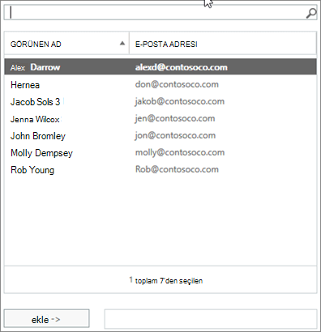

# Üyelerin grup olarak veya bir grup adına göndermesine izin verme

Bir Microsoft 365 olarak gönderme veya Adına gönderme izinleri olan bir grup üyesi grup olarak  veya grup adına  e-posta gönderebilir. (Gruptaki konuklara bu izinler ver kullanılamaz.)

Bu makalede, genel veya Exchange yöneticinin bu izinleri nasıl ayarlay yardımlı olduğu açıklanmıştır.
  
Örneğin, İtalik Bowen **Eğitim Microsoft 365 üyesi** ise ve grupta Gönderme izni varsa, grup olarak  bir e-posta gönderirse, e-posta Eğitim grubunun gönderdiği gibi olur. 
  
Adına **Gönderme izni,** kullanıcının bir grup kullanıcı adına e-posta gönderme Microsoft 365 sağlar. Örneğin, **Pazarlama ekibi Microsoft 365** grubunun bir parçası olan Alex Wilber, Adına Gönderme izinlerine sahipse ve grup  olarak bir e-posta gönderirse, e-posta Pazarlama adına **Alex Wilber** tarafından gönderilmiş gibi görünüyor.

> [!IMPORTANT]
> Belirli bir kullanıcı **için Olarak** Gönder **veya Gönder'i** yapılandırmış, ancak her ikisi için birden yapılandıramazsanız. Her ikisini de yapılandırsanız, varsayılan olarak Gönder **ayarında kullanılır**.

> [!NOTE]
> **Karma yönetim** **ve yapılandırmalarda**, Farklı Gönder ve adına Mac için Outlook destek Exchange desteklanmaz.
    
## Üyelerin grup olarak e-posta göndermesine izin verme

Bu bölümde, kullanıcıların yönetim merkezinde <a href="https://go.microsoft.com/fwlink/p/?linkid=2059104" target="_blank">(EAC) grup olarak e-posta göndermelerine Exchange ilgili</a> yönetim Exchange Online.
  
1. Exchange yönetim merkezinde Alıcılar **Grupları'ne** \> <a href="https://go.microsoft.com/fwlink/?linkid=2183233" target="_blank">**gidin**</a>.
    
2. **EditEdit** seçin. 
    
3. Grup **temsilcisi seçme**.
    
4. Farklı **Gönder bölümünde** , grup **+** olarak göndermek istediğiniz kullanıcıları eklemek için işareti seçin. 
    
    
  
5. Aramak için yazın veya listeden bir kullanıcı seçin. **Tamam'ı ve** **Kaydet'i seçin**.
    
    
  
## Üyelerin grup adına e-posta göndermesine izin verme

Bu bölümde, kullanıcıların yönetim merkezinde <a href="https://go.microsoft.com/fwlink/p/?linkid=2059104" target="_blank">(EAC)</a> yer alan bir grup adına e-Exchange göndermelerine nasıl izin Exchange Online.
  
1. Exchange yönetim merkezinde Alıcılar **Grupları'ne** \> <a href="https://go.microsoft.com/fwlink/?linkid=2183233" target="_blank">**gidin**</a>.
    
2. Grubu **düzenle**  seçin. 
    
3. Grup **temsilcisi seçme**.
    
4. Adına Gönder bölümünde, grup olarak **+** göndermek istediğiniz kullanıcıları eklemek için işareti seçin. 
    
    
  
5. Aramak için yazın veya listeden bir kullanıcı seçin. **Tamam'ı ve** **Kaydet'i seçin**.
    
    

## İlgili makaleler

[Grup üyelerinden veya bu grup adına e-Microsoft 365 gönderme](https://support.microsoft.com/office/0f4964af-aec6-484b-a65c-0434df8cdb6b)

[İşbirliği yönetim planlaması önerileri](collaboration-governance-overview.md#collaboration-governance-planning-recommendations)

[İşbirliği yönetim planınızı oluşturma](collaboration-governance-first.md)

[Gruplarla ilgili daha Microsoft 365 bilgi](https://support.microsoft.com/office/b565caa1-5c40-40ef-9915-60fdb2d97fa2)

[Add-RecipientPermission](/powershell/module/exchange/add-recipientpermission)

[Set-UnifiedGroup](/powershell/module/exchange/set-unifiedgroup)
