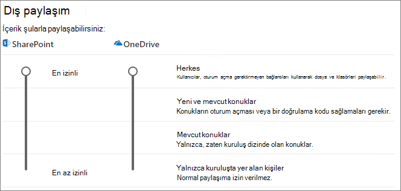

# Konuklarla belge üzerinde işbirliği yapma

kuruluş dışından veya başka bir kuruluşta iş birliği SharePoint OneDrive, onlara belgenin paylaşım bağlantısını gönderebilirsiniz. Bu makalede, SharePoint ve ağ bağlantılarının Microsoft 365 için gereken OneDrive yapılandırma adımlarını takip edeceğiz.

## Video tanıtımı

Bu videoda, bu belgede açıklanan yapılandırma adımları gösterir. 

> [!VIDEO https://www.microsoft.com/videoplayer/embed/RE450Vt?autoplay=false]

## Azure dış işbirliği ayarları

Dış Microsoft 365, çalışma sayfasındaki [B2B dış işbirliği ayarları tarafından en yüksek Azure Active Directory](/azure/active-directory/external-identities/delegate-invitations). Azure AD'de konuk paylaşımı devre dışı bırakılmış veya kısıtlanmışsa, bu ayar Microsoft 365.

Konuklarla paylaşımın engellenmiş olduğundan emin olmak için B2B dış işbirliği ayarlarını kontrol edin.

Dış işbirliği ayarlarını ayarlamak için

1. Azure Active Directory'ta oturum açma[https://aad.portal.azure.com](https://aad.portal.azure.com).
2. Sol gezinti bölmesinde Ekle'ye **Azure Active Directory**.
3. Dış **kimlikler'e tıklayın**.
4. Çalışmaya başlama **ekranında,** sol gezinti bölmesinde Dış işbirliği **ayarları'ne tıklayın**.
5. Belirli yönetici **rollerine atanan** Üye kullanıcıların ve kullanıcıların, konuk kullanıcılar (üye izinleri olan konuklar dahil) davet etme veya Kuruluşta herkes konuk kullanıcılar (konuklar ve yönetici olmayanlar) seçili olarak davet olabilir.
6. Değişiklikler yaptıysanız Kaydet'e **tıklayın**.

İşbirliği kısıtlamaları bölümündeki **ayarlara dikkat** edin. Konukların işbirliği yapmak istediğiniz etki alanlarının engellenmiş olduğundan emin olun.

Birden çok kuruluştan konuklarla çalışıyorsanız, dizin verilerine erişim izinlerini kısıtlamak istemeyebilirsiniz. Bu, dizinde başka kimlerin konuk olduğunu görmelerini önler. Bunu yapmak için Konuk kullanıcı erişimi kısıtlamaları'nın **altında Konuk kullanıcıların** özelliklere erişimi ve dizin nesneleri ayarları üyeliği sınırlı seçeneğini veya Konuk kullanıcı erişimi kendi dizin nesnelerinin özellik ve üyelikleriyle **sınırlıdır**.

## SharePoint düzeyinde paylaşım ayarlarını değiştirme

Kuruluş dışından kişilerin SharePoint veya OneDrive'ta bir belgeye erişimleri olması için, SharePoint ve OneDrive kuruluş düzeyi paylaşım ayarları, kuruluş dışındaki kullanıcılarla paylaşım için izin vermektedir.

Her site için kuruluş SharePoint ayarları, tek tek sitelerde veya sitelerde SharePoint belirler. Site ayarları, kuruluş düzeyindeki ayarlardan daha izinli olamaz. Kuruluş düzeyi ayarı OneDrive kitaplıklarında kullanılabilen paylaşım düzeyini OneDrive belirler.

Kimlik SharePoint ve OneDrive kimliği doğrulanmamış dosya ve klasör paylaşımına izin vermek için Herkes'i **seçin**. Kuruluş dışından kişilerin kimlik doğrulaması yapmalarını sağlamak için Yeni ve mevcut **konuklar'ı seçin**. *Herkes* bağlantıları paylaşmanın en kolay yoludur: kuruluş dışından kişiler bağlantıyı kimlik doğrulaması olmadan açabilir ve başkalarına ücretsiz olarak iletir.

Örneğin SharePoint herhangi bir site için gereken izinli ayarı seçin.

Kuruluş SharePoint paylaşım ayarlarını ayarlamak için

1. Gezinti Microsoft 365 yönetim merkezi Yönetim merkezleri'nin altındaki Gezinti **Bölmesi'nde Yer'e** **SharePoint**.
2. Gezinti SharePoint bölmesindeki İlkeler'in altında **Paylaşım'a** **tıklayın**.
3. Dış paylaşım için, SharePoint veya OneDrive veya Yeni ve var **olan konuklar** **olarak ayarlayın**. (Bu OneDrive izin verilenden fazla izin SharePoint.
4. Değişiklikler yaptıysanız Kaydet'e **tıklayın**.

## SharePoint düzeyinde varsayılan bağlantı ayarlarını değiştirme

Varsayılan dosya ve klasör bağlantısı ayarları, bir dosya veya klasör paylaştıklarda kullanıcılara varsayılan olarak gösterilecek bağlantı seçeneğini belirler. Kullanıcılar,  istediklerinizi paylaşmadan önce bağlantı türünü diğer seçeneklerden biri ile değiştirebilir.

Bu ayarın, tüm site SharePoint yanı sıra tüm sitelerinizi de etkileyeceğini OneDrive.

Aşağıdaki türlerden herhangi biri için bağlantı seçin ve bu bağlantı kullanıcılar dosya ve klasör paylaştığında varsayılan olarak seçilir:

- **Bağlantısı olan herkes** - Çok fazla kimliği doğrulanmamış dosya ve klasör paylaşımı olmasını bekliyorsanız bu seçeneği belirtin. Herkes bağlantılarına izin *vermek istiyor* ancak kimliği doğrulanmamış paylaşım konusunda endişeleniyorsanız, varsayılan olarak diğer seçeneklerden birini kullanın. Bu bağlantı türü yalnızca Herkes paylaşımını **etkinleştirdiysen** kullanılabilir.
- **Yalnızca kuruluş içindeki kişiler** - Çoğu dosya ve klasör paylaşımının kuruluş içindeki kişilerle olmasını bekliyorsanız bu seçeneği belirleyin.
- **Belirli kişiler** - Konuklarla çok fazla dosya ve klasör paylaşımı olmasını bekliyorsanız, bu seçeneği göz önünde bulundurabilirsiniz. Bu bağlantı türü konuklar için çalışır ve konukların kimlik doğrulamasını gerektirir.
 

Kuruluş düzeyi SharePoint OneDrive ayarlarını değiştirmek için

1. Yönetim merkezinde Paylaşım SharePoint gidin.
2. Dosya **ve klasör bağlantıları'nın** altında, kullanmak istediğiniz varsayılan paylaşım bağlantısını seçin.
3. Değişiklikler yaptıysanız Kaydet'e **tıklayın**.

Paylaşım bağlantısıyla ilgili izni ayarlamak için, Paylaşım **bağlantıları için varsayılan olarak seçilen izni seçin'in altında.**

1. Kimliği **doğrulanmamış** kullanıcıların dosya ve klasörlerde değişiklik yapmalarını istemiyorsanız Görünüm'i seçin.
2. Kimliği **doğrulanmamış** kullanıcıların dosya ve klasörlerde değişiklik yapmalarına izin vermek için Düzenle'yi seçin.

Yukarıdaki iki ön kullanım seçeneklerinin yalnızca konuklara/dış kullanıcılara değil, aynı zamanda iç kullanıcılara da uygulananana dikkat edin. Seçtiğiniz izin seçeneği kendi takdirine bağlı olarak belirlenir.

Herkesle paylaşıma olanak sağlayan bağlantıların izinlerini ayarlamak için

1. Bu bağlantılar **altında şu izinler olabilir:** alt bölme, 
    1. Dosyalar **açılan** listesinden 
        - Kimliği **doğrulanmamış kullanıcıların dosyalarda** değişiklik yapmalarına izin vermek için Görüntüle ve düzenle'yi seçin.
        - Kimliği **doğrulanmamış** kullanıcıların dosyalarda değişiklik yapmalarını istemiyorsanız Görünüm'e tıklayın.
    2. Klasörler **açılan** listesinden
        - Kimliği **doğrulanmamış kullanıcıların klasörlerde değişiklik yapmalarına** izin vermek için Görüntüle, düzenle ve karşıya yükle'yi seçin.
        - Kimliği **doğrulanmamış** kullanıcıların klasörlerde değişiklik yapmalarını istemiyorsanız Görünüm'e tıklayın.

## SharePoint düzeyinde paylaşım ayarlarını değiştirme

Bir sitedeki dosya ve klasörleri paylaşıyorsanız SharePoint site için site düzeyinde paylaşım ayarlarını da denetlemeniz gerekir.

Site düzeyinde paylaşım ayarlarını ayarlamak için

1. Gezinti SharePoint bölmesinde Siteler'i genişletin **ve Etkin** **siteler'e tıklayın**.
2. Dosyaları ve klasörleri konuklarla paylaşmak istediğiniz siteyi seçin.
3. Seçilen sitenin olduğu satır boyunca sağa doğru kaydırın ve Dış paylaşım sütununda herhangi bir **yere** tıklayın.
4. Açılan sayfada İlkeler **sekmesine tıklayın** .
5. Dış paylaşım **bölmesinin altında** Düzenle'ye **tıklayın**.
6. Paylaşımın Herkes veya Yeni ve mevcut **konuklar** **olarak ayarlanmış olduğundan emin olmak**.
7. Değişiklikler yaptıysanız Kaydet'e **tıklayın**.

## Kullanıcıları davet et

Konuk paylaşımı ayarları artık yapılandırılmıştır; böylece kullanıcılar artık dosyalarınızı ve klasörlerinizi kuruluş dışındaki kullanıcılarla paylaşabilir. Daha [fazla OneDrive için Dosya ve](https://support.office.com/article/9fcc2f7d-de0c-4cec-93b0-a82024800c07) klasörleri [paylaşma ve SharePoint veya klasörleri](https://support.office.com/article/1fe37332-0f9a-4719-970e-d2578da4941c) paylaşma.

## Ayrıca bkz.

[Kimliği doğrulanmamış kullanıcılarla dosya ve klasör paylaşmak için en iyi yöntemler](best-practices-anonymous-sharing.md)

[Konuklarla paylaşım sırasında dosyalarda yanlışlıkla açık kalma sürelerini sınırlama](share-limit-accidental-exposure.md)

[Azure Active Directory B2B ile SharePoint ve OneDrive tümleştirmesi](/sharepoint/sharepoint-azureb2b-integration-preview)
