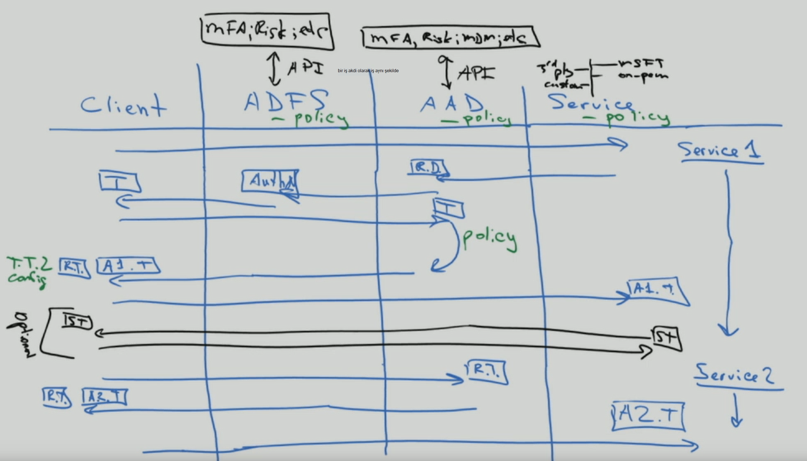

# Kimlik ve ötesine—Mimarlardan birinin bakış açısı

Bu makalede, Microsoft'un Baş Teknik Mimarı [Alex Shteynberg](https://www.linkedin.com/in/alex-shteynberg/), Microsoft 365 ve diğer Microsoft bulut hizmetlerini benimseyen kurumsal kuruluşlara yönelik en iyi tasarım stratejilerini ele almaktadır.

## Yazar hakkında

New York [Microsoft Teknoloji Merkezi'nde](https://www.microsoft.com/mtc?rtc=1) Baş Teknik Mimarım. Çoğunlukla büyük müşteriler ve karmaşık gereksinimlerle çalışıyorum. Bakış açım ve görüşlerim bu etkileşimleri temel alır ve her durum için geçerli olmayabilir. Ancak deneyimlerime göre, müşterilere en karmaşık zorluklar konusunda yardımcı olabilirsek, tüm müşterilere yardımcı olabiliriz.

Normalde her yıl 100'de fazla müşteriyle çalışıyorum. Her kuruluşun benzersiz özellikleri olsa da eğilimleri ve ortak noktaları görmek ilginçtir. Örneğin, bir eğilim birçok müşteri için sektörler arası ilgidir. Sonuçta, banka şubesi bir kafe ve topluluk merkezi de olabilir.

Rolümde, müşterilerin benzersiz iş hedeflerini ele almak için en iyi teknik çözüme ulaşmalarına yardımcı olmaya odaklanıyorum. Resmi olarak Kimlik, Güvenlik, Gizlilik ve Uyumluluk konularına odaklanıyorum. Bu dokunuşların yaptığımız her şeye dokunmasını seviyorum. Çoğu projeyle ilgilenmem için bana bir fırsat veriyor. Bu beni çok meşgul ediyor ve bu rolden keyif alıyorum.

New York City'de yaşıyorum (en iyisi!) ve kültürünün, yemeğinin ve insanlarının (trafik değil) çeşitliliğinden gerçekten keyif alıyorum. Ömrüm boyunca dünyanın çoğunu görmeyi umduğum zaman seyahat etmeye bayılırım. Şu anda vahşi yaşam hakkında bilgi edinmek için Afrika'ya bir gezi araştırıyorum.

## Yol gösteren ilkeler

- **Basit genellikle daha iyidir**: Teknolojiyle (neredeyse) her şeyi yapabilirsiniz, ancak yapmanız gerektiği anlamına gelmez. Özellikle güvenlik alanında, birçok müşteri daha fazla yük devretme çözümü sunar. Google'ın Stripe konferansındaki [bu videodan](https://www.youtube.com/watch?v=SOQgABDSYZE) bu noktanın altını çiziyorum.
- **İnsanlar, süreç, teknoloji**: İnsanların süreci geliştirmesi [için tasarım](https://en.wikipedia.org/wiki/Human-centered_design) yapın, önce teknoloji değil. "Mükemmel" çözümler yoktur. Çeşitli risk faktörlerini dengelememiz gerekiyor ve kararlar her işletme için farklı olacaktır. Çok fazla müşteri, kullanıcılarının daha sonra kaçındıkları bir yaklaşım tasarlar.
- **Önce 'neden' ve sonra 'nasıl' üzerine odaklanın**: Milyonlarca sorusu olan sinir bozucu 7-yr yaşlı çocuk olun. Sorulacak doğru soruları bilmiyorsak doğru yanıta ulaşamayız. Birçok müşteri, iş sorununu tanımlamak yerine işlerin nasıl çalışması gerektiği konusunda varsayımlarda bulunur. Her zaman alınabilecek birden çok yol vardır.
- **Geçmiş en iyi yöntemlerin uzun kuyruğu**: En iyi yöntemlerin ışık hızında değiştiğini fark edin. Üç aydan uzun bir süre önce Azure AD'ye baktıysanız, büyük olasılıkla eskimişsinizdir. Buradaki her şey yayından sonra değişebilir. "En iyi" seçenek bugünden itibaren altı ay sonra aynı olmayabilir.

## Temel kavramlar

Bu bölümü atlamayın. Bulut hizmetlerini yıllardır kullanan müşteriler için bile bu konulara geri adım atmam gerektiğini sık sık fark ediyorum.
Ne yazık ki, dil kesin bir araç değildir. Genellikle aynı sözcüğü farklı kavramlar veya aynı kavram anlamına gelen farklı sözcükler için kullanırız. Temel terminoloji ve "hiyerarşi modeli" oluşturmak için genellikle aşağıdaki diyagramı kullanıyorum.
  

 

Yüzmeyi öğrendiğinizde okyanusun ortasında değil havuzdan başlamak daha iyidir. Bu diyagramda teknik olarak doğru olmaya çalışmıyorum. Bazı temel kavramların tartışıldığı bir modeldir.

Diyagramda:

- Kiracı = Azure AD örneği. Hiyerarşinin "en üstünde" veya diyagramda Düzey 1'dir. Bunu diğer her şeyin gerçekleştiği "[sınır](/azure/active-directory/users-groups-roles/licensing-directory-independence)" olarak değerlendirebiliriz ([Azure AD B2B](/azure/active-directory/b2b/what-is-b2b) bir yana). Tüm Microsoft kurumsal bulut hizmetleri bu kiracılardan birinin parçasıdır. Tüketici hizmetleri ayrıdır. "Kiracı", belgelerde Office 365 kiracı, Azure kiracısı, WVD kiracısı vb. olarak görünür. Bu çeşitlemelerin müşteriler için karışıklığa neden olduğunu sık sık buluyorum.
- Diyagramdaki Düzey 2 olan hizmetler/abonelikler tek bir kiracıya aittir. SaaS hizmetlerinin çoğu 1:1'dir ve geçiş olmadan taşınamaz. Azure farklıdır; faturalamayı ve/veya [aboneliği](/azure/active-directory/fundamentals/active-directory-how-subscriptions-associated-directory) başka bir kiracıya [taşıyabilirsiniz](/azure/cost-management-billing/manage/billing-subscription-transfer). Azure aboneliklerini taşıması gereken birçok müşteri vardır. Bunun çeşitli etkileri vardır. Aboneliğin dışında bulunan nesneler taşınmaz (örneğin, rol tabanlı erişim denetimi veya Azure RBAC ve gruplar, uygulamalar, ilkeler gibi Azure AD nesneleri). Ayrıca bazı hizmetler (Azure Key Vault, Data Bricks vb.). İyi bir iş gereksinimi olmadan hizmetleri geçirmeyin. Geçiş için yararlı olabilecek bazı betikler [GitHub'de paylaşılır](https://github.com/lwajswaj/azure-tenant-migration).
- Belirli bir hizmetin genellikle bir tür "alt düzey" sınırı veya Düzey 3 (L3) vardır. Bu, güvenlik, ilkeler, idare vb. ayrımını anlamak için yararlıdır. Ne yazık ki bildiğim tek tip bir isim yok. L3 için bazı örnek adlar şunlardır: Azure Aboneliği = [kaynak](/azure/azure-resource-manager/management/manage-resources-portal); Dynamics 365 CE = [örnek](/dynamics365/admin/new-instance-management); Power BI = [çalışma alanı](/power-bi/service-create-the-new-workspaces); Power Apps = [ortam](/power-platform/admin/environments-overview); ve benzeri.
- Düzey 4, gerçek verilerin bulunduğu yerdir. Bu 'veri düzlemi' karmaşık bir konudur. Bazı hizmetler RBAC için Azure AD kullanıyor, diğerleri kullanmıyor. Temsilci seçme konularına gelince bunu biraz tartışacağım.

Birçok müşteriyi (ve Microsoft çalışanlarını) bulduğum bazı ek kavramlar kafanızı karıştırıyor veya bunlarla ilgili sorularım var:

- Herkes [hiçbir ücret ödemeden](https://azure.microsoft.com/pricing/details/active-directory/) birçok kiracı [oluşturabilir](/azure/active-directory/fundamentals/active-directory-access-create-new-tenant). İçinde sağlanan bir hizmete ihtiyacınız yoktur. Bende onlarca var. Her Kiracı adı, Microsoft'un dünya çapındaki bulut hizmetinde benzersizdir (başka bir deyişle, iki kiracı aynı ada sahip olamaz). Hepsi TenantName.onmicrosoft.com biçimindedir. Kiracıları otomatik olarak ([yönetilmeyen kiracılar](/azure/active-directory/users-groups-roles/directory-self-service-signup)) oluşturan işlemler de vardır. Örneğin, kullanıcı başka bir kiracıda bulunmayan bir e-posta etki alanıyla kurumsal hizmete kaydolduğunda bu durum oluşabilir.
- Yönetilen bir kiracıda, birçok [DNS etki alanı](/azure/active-directory/fundamentals/add-custom-domain) bu kiracıya kaydedilebilir. Bu, özgün kiracı adını değiştirmez. Şu anda bir kiracıyı yeniden adlandırmanın kolay bir yolu yoktur (geçiş dışında). Kiracı adı teknik olarak bu günlerde kritik olmasa da, bazıları bunun sınırlayıcı olduğunu düşünebilir.
- Henüz herhangi bir hizmet dağıtmayı planlamasanız bile kuruluşunuz için bir kiracı adı ayırmanız gerekir. Aksi takdirde, birisi bunu sizden alabilir ve geri almak için basit bir işlem yoktur (DNS adları ile aynı sorun). Müşterilerden bu şekilde çok sık duyuyorum. Kiracı adınızın ne olması gerektiği de bir tartışma konusudur.
- DNS ad alanlarınız varsa, bunların tümünü kiracılarınıza eklemeniz gerekir. Aksi takdirde, bu adla [yönetilmeyen bir kiracı](/azure/active-directory/users-groups-roles/directory-self-service-signup) oluşturulabilir ve bu da [yönetilmelerini sağlamak](/azure/active-directory/users-groups-roles/domains-admin-takeover) için kesintiye neden olur.
- DNS ad alanı (contoso.com gibi) tek bir kiracıya ait olabilir. Bunun çeşitli senaryolar üzerinde etkileri vardır (örneğin, birleştirme veya alma sırasında e-posta etki alanını paylaşma vb.). Dns alt öğesini (div.contoso.com gibi) farklı bir kiracıya kaydetmenin bir yolu vardır, ancak bundan kaçınılmalıdır. Üst düzey etki alanı adı kaydedildiğinde, tüm alt etki alanları aynı kiracıya ait olduğu varsayılır. Çok kiracılı senaryolarda (aşağıya bakın) normalde başka bir üst düzey etki alanı adı (contoso.ch veya ch-contoso.com gibi) kullanmanızı öneririm.
- Kiracı Who "sahip olmalıdır"? Kiracılarının sahibini bilmeyen müşterileri sık sık görüyorum. Bu büyük bir kırmızı bayrak. Microsoft desteğini en kısa sürede arayın. Aynı sorun, bir hizmet sahibinin (genellikle Exchange yöneticisi) kiracıyı yönetmek üzere atandığında olduğu gibi. Kiracı, gelecekte isteyebileceğiniz tüm hizmetleri içerir. Kiracı sahibi, bir kuruluştaki tüm bulut hizmetlerinin etkinleştirilmesi için karar verebilen bir grup olmalıdır. Bir diğer sorun da kiracı sahibi grubunun tüm hizmetleri yönetmesi istendiğinde oluşur. Bu, büyük kuruluşlar için ölçeklendirilmiyor.
- Alt/süper kiracı kavramı yoktur. Nedense, bu efsane kendini tekrar ediyor. Bu, [Azure AD B2C](/azure/active-directory-b2c/) kiracıları için de geçerlidir. "B2C ortamım XYZ Kiracımda" veya "Azure kiracımı Office 365 kiracıma taşımak Nasıl yaparım??"
- Çoğu müşterinin kullandığı bu olduğundan bu belge çoğunlukla dünya çapındaki ticari buluta odaklanır. Bazen [bağımsız bulutlar](/azure/active-directory/develop/authentication-national-cloud) hakkında bilgi edinmek yararlı olabilir. Bağımsız bulutların, bu tartışmanın kapsamı dışında olan ek etkileri vardır.

## Temel kimlik konuları

Microsoft'un kimlik platformu (Azure Active Directory (Azure AD) hakkında çok fazla belge vardır. Yeni başlayanlar için genellikle bunaltıcı geliyor. Bu konuda bilgi edindikten sonra bile sürekli yeniliğe ve değişikliğe ayak uydurmak zor olabilir. Müşteri etkileşimlerimde genellikle iş hedefleri ve bunları ele almak için "İyi, Daha İyi, En İyi" yaklaşımlar (ve bu konular için insan "uçurum notları" gibi) arasında "çevirmen" olarak görev yapıyorum. Nadiren mükemmel bir yanıt vardır ve "doğru" karar çeşitli risk faktörlerinin bir dengesidir. Müşterilerle tartışma eğiliminde olduğum yaygın soru ve karışıklık alanlarından bazıları aşağıdadır.

### Sağlama

Azure AD, kimlik dünyanızdaki idare eksikliğini çözmez! [Kimlik idaresi](/azure/active-directory/governance/identity-governance-overview) , bulut kararlarından bağımsız olarak kritik bir öğe olmalıdır. İdare gereksinimleri zaman içinde değişir, bu nedenle bir araç değil bir programdır.

[Azure AD Bağlan](/azure/active-directory/hybrid/whatis-azure-ad-connect) ve [Microsoft Identity Manager](/microsoft-identity-manager/microsoft-identity-manager-2016) (MIM) ile başka bir şey (üçüncü taraf veya özel) karşılaştırması mı? Hem şimdi hem de gelecekte kendinizi çok fazla baş ağrısından kurtarın ve Azure AD Bağlan ile devam edin. Bu araçta, kendine özgü müşteri yapılandırmalarını ve sürekli yenilikleri ele almak için her türlü akıllı vardır.

Daha karmaşık bir mimariye yönlendirebilecek bazı uç durumlar:

- Bunlar arasında ağ bağlantısı olmayan birden çok AD ormanım var. [Bulut Sağlama](/azure/active-directory/cloud-provisioning/what-is-cloud-provisioning) adlı yeni bir seçenek vardır.
- Active Directory'm yok ve yüklemek de istemiyorum. Azure AD Bağlan [LDAP'den eşitlenecek](/azure/active-directory/hybrid/plan-hybrid-identity-design-considerations-tools-comparison) şekilde yapılandırılabilir (iş ortağı gerekebilir).
- Aynı nesneleri birden çok kiracıya sağlamam gerekiyor. Bu teknik olarak desteklenmez ancak "aynı" tanımına bağlıdır.

Varsayılan eşitleme kurallarını ([nesneleri filtreleme](/azure/active-directory/hybrid/how-to-connect-sync-configure-filtering), [öznitelikleri değiştirme](/azure/active-directory/hybrid/reference-connect-sync-attributes-synchronized), [alternatif oturum açma kimliği](/azure/active-directory/hybrid/plan-connect-userprincipalname) vb.) özelleştirmeli miyim? Bundan kaçının! Kimlik platformu yalnızca onu kullanan hizmetler kadar değerlidir. Her türlü çatlak yapılandırmayı yapabileceksiniz ancak bu soruyu yanıtlamak için uygulamalar üzerindeki etkisine bakmanız gerekir. Posta özellikli nesneleri filtrelerseniz, çevrimiçi hizmetler için GAL eksik olur; uygulama belirli özniteliklere dayanırsa, bunları filtrelemenin öngörülemeyen bir etkisi olur ve bu şekilde devam eder. Bu bir kimlik ekibi kararı değil.

XYZ SaaS Tam Zamanında (JIT) sağlamayı destekliyor, neden eşitlememi istiyorsunuz? Yukarıya bakınız. Birçok uygulamanın işlevsellik için "profil" bilgilerine ihtiyacı vardır. Posta özellikli tüm nesneler kullanılamıyorsa GAL'niz olamaz. Aynı durum, Azure AD ile tümleştirilmiş uygulamalarda [kullanıcı sağlama](/azure/active-directory/app-provisioning/user-provisioning) için de geçerlidir.

### Kimlik Doğrulama

[Parola karması eşitleme](/azure/active-directory/hybrid/how-to-connect-password-hash-synchronization) (PHS) ile [geçişli kimlik doğrulaması](/azure/active-directory/hybrid/how-to-connect-pta-how-it-works) (PTA) ve [federasyon](/azure/active-directory/hybrid/how-to-connect-fed-compatibility) karşılaştırması.

Genellikle federasyonla ilgili tutkulu bir [tartışma](/azure/active-directory/hybrid/choose-ad-authn) olur. Daha basit genellikle daha iyidir ve bu nedenle iyi bir nedeniniz yoksa PHS kullanın. Aynı kiracıdaki farklı DNS etki alanları için farklı kimlik doğrulama yöntemleri yapılandırmak da mümkündür.

Bazı müşteriler genellikle şunlar için federasyon + PHS'yi etkinleştirir:

- Federasyon hizmeti kullanılamıyorsa (olağanüstü durum kurtarma için) öğesine [geri dönme](/azure/active-directory/hybrid/plan-migrate-adfs-password-hash-sync) seçeneği.
- Ek özellikler (örn. [Azure AD DS](/azure/active-directory-domain-services/tutorial-configure-password-hash-sync)) ve güvenlik hizmetleri (ör. [sızdırılan kimlik bilgileri](/azure/active-directory/reports-monitoring/concept-risk-events#leaked-credentials))
- Azure'da federasyon kimlik doğrulamasını anlamayan hizmetler için destek (örneğin, [Azure Dosyalar](/azure/storage/files/storage-files-active-directory-overview)).

Bazı yanlış algıları netleştirmek için müşterilere genellikle istemci kimlik doğrulama akışında yol gösteririm. Sonuç, aşağıdaki resme benzer ve bu, etkileşimli oraya varma işlemi kadar iyi değildir.

Bu beyaz tahta çizimi, güvenlik ilkelerinin bir kimlik doğrulama isteğinin akışı içinde nereye uygulandığını gösterir. Bu örnekte, Active Directory Federasyon Hizmeti (AD FS) aracılığıyla uygulanan ilkeler ilk hizmet isteğine uygulanır, ancak sonraki hizmet isteklerine uygulanmaz. Bu, güvenlik denetimlerini mümkün olduğunca buluta taşımanın en az bir nedenidir.

Hatırlayabildiğim kadar uzun süredir [çoklu oturum açma](/azure/active-directory/manage-apps/what-is-single-sign-on) (SSO) hayalinin peşindeyiz. Bazı müşteriler "doğru" federasyon (STS) sağlayıcısını seçerek bunu başarabileceklerine inanıyor. Azure AD [, SSO özelliklerini etkinleştirmeye](/azure/active-directory/manage-apps/plan-sso-deployment) önemli ölçüde yardımcı olabilir, ancak hiçbir STS sihirli değildir. Kritik uygulamalar için hala kullanılan çok fazla "eski" kimlik doğrulama yöntemi vardır. Azure AD'nin [iş ortağı çözümleriyle](/azure/active-directory/saas-apps/tutorial-list) genişletilmesi bu senaryoların çoğunu ele alabilir. SSO bir strateji ve bir yolculuk. [Uygulamalar için standartlara](/azure/active-directory/develop/v2-app-types) geçmeden oraya ulaşamazsınız. Bu konu ile ilgili olarak, sihirli bir yanıtı olmayan [parolasız](/azure/active-directory/authentication/concept-authentication-passwordless) kimlik doğrulamasına yönelik bir yolculuk vardır.

[Çok faktörlü kimlik doğrulaması](/azure/active-directory/authentication/concept-mfa-howitworks) (MFA) bugün çok önemlidir (daha fazlası için [burada](https://techcommunity.microsoft.com/t5/azure-active-directory-identity/your-pa-word-doesn-t-matter/ba-p/731984) ). Buna [kullanıcı davranışı analizi](/azure/active-directory/authentication/tutorial-risk-based-sspr-mfa) eklerseniz en yaygın siber saldırıları önleyen bir çözümünüz vardır. Tüketici hizmetleri bile MFA gerektirmek üzere hareket ediyor. Yine de [modern kimlik doğrulama](../enterprise/hybrid-modern-auth-overview.md) yaklaşımlarına geçmek istemeyen birçok müşteriyle görüşüyorum. Duyduğum en büyük bağımsız değişken, kullanıcıları ve eski uygulamaları etkileyecektir. Bazen iyi bir tekme, müşterilerin [duyurulan değişiklikler](https://techcommunity.microsoft.com/t5/exchange-team-blog/basic-auth-and-exchange-online-february-2020-update/ba-p/1191282) Exchange Online ilerlemelerine yardımcı olabilir. Müşterilerin bu geçişe yardımcı olması için çok sayıda Azure AD [raporu](/azure/active-directory/fundamentals/concept-fundamentals-block-legacy-authentication) kullanıma sunuldu.

### Yetkilendirme

[Wikipedia](https://en.wikipedia.org/wiki/Authorization) başına , "yetkilendirmek" bir erişim ilkesi tanımlamaktır. Birçok kişi buna bir nesneye (dosya, hizmet vb.) erişim denetimleri tanımlama özelliği olarak bakar. Mevcut siber tehdit dünyasında bu kavram, çeşitli tehdit vektörlerine tepki verebilen ve bunlara yanıt olarak erişim denetimlerini hızlı bir şekilde ayarlayabilen dinamik bir politikaya hızla gelişmektedir. Örneğin, banka hesabıma olağan dışı bir konumdan erişirsem ek onay adımları alıyorum. Buna yaklaşmak için yalnızca ilkenin kendisini değil, tehdit algılama ve sinyal bağıntı yöntemleri ekosistemini de göz önünde bulundurmamız gerekir.

Azure AD'nin ilke altyapısı [Koşullu Erişim ilkeleri](/azure/active-directory/conditional-access/overview) kullanılarak uygulanır. Bu sistem, dinamik kararlar almak için diğer çeşitli tehdit algılama sistemlerinden alınan bilgilere bağlıdır. Basit bir görünüm aşağıdaki çizime benzer olacaktır:

Tüm bu sinyallerin birleştirilmesi aşağıdaki gibi dinamik ilkelere olanak tanır:

- Cihazınızda bir tehdit algılanırsa, verilere erişiminiz indirme özelliği olmadan yalnızca web'e indirilir.
- Alışılmadık derecede yüksek miktarda veri indiriyorsanız, indirdiğiniz her şey şifrelenir ve kısıtlanır.
- Yönetilmeyen bir cihazdan bir hizmete erişirsen, yüksek oranda hassas verilere erişimin engellenir, ancak başka bir konuma kopyalama özelliği olmadan kısıtlanmamış verilere erişmesine izin verilir.

Bu genişletilmiş yetkilendirme tanımına katılıyorsanız ek çözümler uygulamanız gerekir. Hangi çözümleri uygulayacağınız, ilkenin ne kadar dinamik olmasını istediğinize ve öncelik vermek istediğiniz tehditlere bağlıdır. Bu tür sistemlere bazı örnekler şunlardır:

- [Azure AD Kimlik Koruması](/azure/active-directory/identity-protection/)
- [Kimlik için Microsoft Defender](/azure-advanced-threat-protection/)
- [Uç Nokta için Microsoft Defender](/windows/security/threat-protection/microsoft-defender-atp/microsoft-defender-advanced-threat-protection)
- [Office 365 için Microsoft Defender](../security/office-365-security/defender-for-office-365.md)
- [Microsoft Defender for Cloud Apps](/cloud-app-security/) (Bulut için Defender Uygulamaları)
- [Microsoft 365 Defender](../security/defender/microsoft-365-defender.md)
- [Microsoft Intune](/mem/intune/)
- [Microsoft Purview Information Protection](../compliance/information-protection.md)
- [Microsoft Sentinel](/azure/sentinel/)

Tabii ki, Azure AD'ye ek olarak, çeşitli hizmet ve uygulamaların kendi belirli yetkilendirme modelleri vardır. Bunlardan bazıları daha sonra temsilci seçme bölümünde ele alınmıştır.

### Denetim

Azure AD ayrıntılı [denetim ve raporlama](/azure/active-directory/reports-monitoring/) özelliklerine sahiptir. Ancak, güvenlik kararları almak için gereken tek bilgi kaynağı genellikle bu değildir. Temsilci seçme bölümünde bu konu hakkında daha fazla tartışmaya bakın.

## Exchange

Panik yapmayın! Bu, Exchange kullanım dışı bırakıldığı (veya SharePoint vb.) anlamına gelmez. Hala temel bir hizmettir. Demek istediğim, bir süredir teknoloji sağlayıcılarının kullanıcı deneyimlerini (UX) birden çok hizmetin bileşenlerini kapsayacak şekilde geçirmesi. Microsoft 365'da, e-posta [eklerinin](https://support.office.com/article/Attach-files-or-insert-pictures-in-Outlook-email-messages-BDFAFEF5-792A-42B1-9A7B-84512D7DE7FC) SharePoint Online'da veya OneDrive İş depolandığı "modern ekler" basit bir örnektir.

Outlook istemcisine baktığınızda, yalnızca Exchange değil, bu deneyimin bir parçası olarak "bağlı" olan birçok hizmeti görebilirsiniz. Buna Azure AD, Microsoft Arama, Uygulamalar, Profil, uyumluluk ve Office 365 grupları dahildir.

Yaklaşan özelliklerin önizlemesi için [Microsoft Akıcı Çerçeve](https://techcommunity.microsoft.com/t5/microsoft-365-blog/microsoft-ignite-blog-microsoft-fluid-framework-preview/ba-p/978268) hakkında bilgi edinin. Önizlemede artık Teams konuşmaları doğrudan Outlook okuyup yanıtlayabilirim. Aslında[, Teams istemcisi](https://products.office.com/microsoft-teams/download-app) bu stratejinin en önemli örneklerinden biridir.

Genel olarak, Office 365 ile Microsoft bulutlarındaki diğer hizmetler arasında net bir çizgi çizmek zorlaşıyor. Tek bir bileşen kullansalar bile yaptığımız her şeyde toplam yenilikten yararlanabilecekleri için bunu müşterilere büyük bir avantaj olarak alıyorum. Oldukça havalı ve birçok müşteri için çok fazla etki var.

Bugün birçok müşteri BT grubunun "ürünler" etrafında yapılandırıldığını düşünüyorum. Her ürün için bir uzmana ihtiyacınız olduğundan, şirket içi bir dünya için mantıklıdır. Ancak, bu hizmetler buluta taşındığından, bir Active Directory veya Exchange veritabanında bir daha hata ayıklamak zorunda olmadığım için çok mutluyum. Otomasyon (bulut türü) yinelenen bazı el ile işleri kaldırır (fabrikalara ne olduğuna bakın). Ancak bunlar hizmetler arası etkileşimi, etkiyi, iş gereksinimlerini vb. anlamak için daha karmaşık gereksinimlerle değiştirilir. [Öğrenmeye](/learn/) istekliyseniz, bulut dönüşümü tarafından etkinleştirilen harika fırsatlar vardır. Teknolojiye atlamadan önce, BT becerilerinde ve ekip yapılarındaki değişikliği yönetme hakkında müşterilerle sık sık konuşuyorum.

Tüm SharePoint fanatiklere ve geliştiricilere "XYZ'yi çevrimiçi SharePoint nasıl yapabilirim?" sorusunu sormayı bırakın. İş akışı için [Power Automate](/power-automate/) (veya Flow) kullanın, çok daha güçlü bir platformdur. 500 K öğe listenize daha iyi bir UX oluşturmak için [Azure Bot Framework'i](/azure/bot-service/) kullanın. CSOM yerine [Microsoft Graph](https://developer.microsoft.com/graph/) kullanmaya başlayın. [Microsoft Teams](/MicrosoftTeams/Teams-overview) SharePoint ama daha fazlasını da içerir. Listeleyebileceğiniz başka birçok örnek daha var. Dışarıda muazzam ve harika bir evren var. Kapıyı açın ve [keşfetmeye başlayın]().

Diğer yaygın etki uyumluluk alanındadır. Bu hizmetler arası yaklaşım birçok uyumluluk ilkesini tamamen karıştırıyor gibi görünüyor. "Tüm e-posta iletişimlerini bir eBulma sistemine günlüğe kaydetmeliyim" diyen kuruluşlar görüyorum. E-posta artık yalnızca e-posta değil diğer hizmetlere açılan bir pencere olduğunda bu gerçekten ne anlama gelir? Office 365 [uyumluluk](../compliance/index.yml) için kapsamlı bir yaklaşıma sahiptir, ancak insanların ve süreçlerin değiştirilmesi genellikle teknolojiden çok daha zordur.

Başka birçok kişi ve sürecin etkileri vardır. Bence bu kritik ve tartışılmamış bir alan. Belki de başka bir makalede daha fazlası.

## Kiracı yapısı seçenekleri

### Tek kiracı ve çok kiracılı

Genel olarak, çoğu müşterinin yalnızca bir üretim kiracısı olmalıdır. Birden çok kiracının zor olmasının birçok nedeni vardır ([Bing arama](https://www.bing.com/search?q=office%20365%20multiple%20tenants) verin) veya bu [teknik incelemeyi](https://aka.ms/multi-tenant-user) okuyun. Aynı zamanda, birlikte çalıştığım birçok kurumsal müşterinin BT öğrenmesi, testi ve denemesi için başka bir (küçük) kiracısı var. Azure Lighthouse ile kiracılar arası Azure erişimi daha kolay hale [getiriliyor](https://azure.microsoft.com/services/azure-lighthouse/). Office 365 ve diğer birçok SaaS hizmeti, kiracılar arası senaryolar için sınırlara sahiptir. [Azure AD B2B](/azure/active-directory/b2b/what-is-b2b) senaryolarında dikkate alınması gereken çok şey vardır.

Birçok müşteri bir birleşme ve alımdan (M&A) sonra birden çok üretim kiracısına sahip olur ve birleştirmek ister. Bugün bu basit değildir ve Microsoft Danışmanlık Hizmetleri (MCS) veya bir iş ortağı artı üçüncü taraf yazılım gerektirir. Gelecekte çok kiracılı müşterilerle çeşitli senaryoları ele almak için devam eden mühendislik çalışmaları vardır.

Bazı müşteriler birden fazla kiracıyla gitmeyi tercih edebilir. Bu çok dikkatli bir karar olmalı ve neredeyse her zaman iş nedeni odaklı olmalıdır! Bazı örnekler şunlardır:

- Farklı varlıklar arasında kolay işbirliği gerektiren ve güçlü yönetim ve diğer yalıtım gereksinimlerinin bulunduğu bir holding türü şirket yapısı.
- Bir alımdan sonra, iki varlığı ayrı tutmak için bir iş kararı velanır.
- Müşterinin üretim ortamını değiştirmeyen bir müşterinin ortamının benzetimi.
- Müşteriler için yazılım geliştirme.

Bu çok kiracılı senaryolarda müşteriler genellikle bazı yapılandırmaları kiracılar arasında aynı tutmak veya yapılandırma değişiklikleri ve kaymalarını bildirmek ister. Bu genellikle el ile yapılan değişikliklerden kod olarak yapılandırmaya geçiş anlamına gelir. Microsoft Premiere desteği, şu genel IP'yi temel alan bu tür gereksinimler için bir atölye sunar: <https://Microsoft365dsc.com>.

### Multi-Geo

[Multi-Geo'ya](../enterprise/microsoft-365-multi-geo.md) veya Multi-Geo'ya değil, asıl soru bu. Office 365 Multi-Geo ile bekleyen verileri, veri [yerleşimi](../enterprise/o365-data-locations.md) gereksinimlerini karşılamak için seçtiğiniz coğrafi konumlarda sağlayabilir ve depolayabilirsiniz. Bu özellik hakkında birçok yanlış algı vardır. Aşağıdakileri unutmayın:

- Performans avantajları sağlamaz. [Ağ tasarımı](https://aka.ms/office365networking) doğru değilse performansı daha kötü hale getirebilir. Cihazları verilerinize değil Microsoft ağına "yakın" alın.
- [GDPR uyumluluğu](https://www.microsoft.com/trust-center/privacy/gdpr-overview) için bir çözüm değildir. GDPR, veri hakimiyetine veya depolama konumlarına odaklanmaz. Bunun için başka uyumluluk çerçeveleri de vardır.
- Yönetim temsilcisi seçme (aşağıya bakın) veya [bilgi engellerini](../compliance/information-barriers.md) çözmez.
- Çok kiracılı ile aynı değildir ve ek [kullanıcı sağlama](https://github.com/MicrosoftDocs/azure-docs-pr/blob/master/articles/active-directory/hybrid/how-to-connect-sync-feature-preferreddatalocation.md) iş akışları gerektirir.
- Kiracınızı (Azure AD'niz) başka bir coğrafyaya [taşımaz](../enterprise/moving-data-to-new-datacenter-geos.md) .

## Yönetim temsilcisi

Çoğu büyük kuruluşta görev ayrımı ve rol tabanlı erişim denetimi (RBAC) gerekli bir gerçekliktir. Önceden özür dileyeceğim. Bu, bazı müşterilerin istediği kadar basit değildir. Müşteri, yasal, uyumluluk ve diğer gereksinimler farklıdır ve bazen dünya çapında çakışıyor. Basitlik ve esneklik genellikle birbirinin karşı tarafındadır. Beni yanlış anlamadım, bu işte daha iyi bir iş yapabiliriz. Zaman içinde önemli geliştirmeler yapıldı (ve olacak). 379230 belgelerini okumadan iş gereksinimlerinize uygun modeli bulmak için yerel [Microsoft Teknoloji Merkezinizi](https://www.microsoft.com/mtc) ziyaret edin! Burada, neden böyle olduğunu değil, düşünmeniz gereken şeylere odaklanacağım. Aşağıda plan yapmak için beş farklı alan ve karşılaştığım bazı yaygın sorular yer almaktadır.

### Azure AD ve Microsoft 365 yönetim merkezleri

[Yerleşik rollerin](/azure/active-directory/roles/permissions-reference) uzun ve büyüyen bir listesi vardır. Her rol, belirli eylemlerin gerçekleştirilebilmesine izin vermek için birlikte gruplandırılmış rol izinlerinin bir listesinden oluşur. Bu izinleri her rolün içindeki "Açıklama" sekmesinde görebilirsiniz. Alternatif olarak, bunların daha insan tarafından okunabilir bir sürümünü Microsoft 365 Yönetici Merkezi'nde görebilirsiniz. Yerleşik rollerin tanımları değiştirilemez. Genellikle bunları üç kategoride gruplandırıyorum:

- **Genel yönetici**: Bu "tüm güçlü" rol, diğer sistemlerde olduğu gibi [yüksek oranda korunmalıdır](../enterprise/protect-your-global-administrator-accounts.md). Tipik öneriler şunlardır: kalıcı atama yok ve Azure AD Privileged Identity Management (PIM) kullanma; güçlü kimlik doğrulaması ve benzeri. İlginçtir ki, bu rol varsayılan olarak her şeye erişmenize izin vermez. Genellikle, uyumluluk erişimi ve Azure erişimi hakkında daha sonra tartışılan karışıklıklar görüyorum. Ancak, bu rol her zaman kiracıdaki diğer hizmetlere erişim atayabilir.
- **Belirli hizmet yöneticileri**: Bazı hizmetler (Exchange, SharePoint, Power BI vb.) Azure AD'den üst düzey yönetim rollerini kullanır. Bu tüm hizmetler arasında tutarlı değildir ve daha sonra ele alınan hizmete özgü daha fazla rol vardır.
- **İşlevsel**: Belirli işlemlere (konuk davet eden vb.) odaklanan rollerin uzun (ve büyüyen) bir listesi vardır. Düzenli aralıklarla, bunların daha fazlası müşteri ihtiyaçlarına göre eklenir.

Her şeye temsilci seçmek mümkün değildir (boşluk azalsa da), bu da Genel yönetici rolünün bazen kullanılması gerektiği anlamına gelir. Bu rolün kişi üyeliği yerine kod olarak yapılandırma ve otomasyon dikkate alınmalıdır.

**Not**: Microsoft 365 yönetim merkezi daha kullanıcı dostu bir arabirime sahiptir ancak Azure AD yönetici deneyimine kıyasla özelliklerin bir alt kümesine sahiptir. Her iki portal da aynı Azure AD rollerini kullandığından, değişiklikler aynı yerde gerçekleşir. İpucu: Tüm Azure dağınıklığı olmadan kimlik yönetimi odaklı bir yönetici kullanıcı arabirimi istiyorsanız kullanın <https://aad.portal.azure.com>.

Adında ne var? Rolün adından varsayımlarda bulunmayın. Dil çok hassas bir araç değildir. Amaç, hangi rollerin gerekli olduğuna bakmadan önce temsilci olarak atanması gereken işlemleri tanımlamak olmalıdır. Birini "Güvenlik Okuyucusu" rolüne eklemek, her şeyde güvenlik ayarlarını görmesine neden olmaz.

[Özel roller](/azure/active-directory/users-groups-roles/roles-custom-overview) oluşturma özelliği yaygın bir sorudur. Bu, Azure AD'de bugün sınırlıdır (aşağıya bakın) ancak zamanla özellikler artacaktır. Bunları Azure AD'deki işlevler için geçerli olarak düşünüyorum ve hiyerarşi modelini "aşağı" yayamayabilirim (yukarıda ele alınmalıdır). "Özel" ile ne zaman ilgilensem, "basit daha iyidir" müdürüme geri dönme eğilimindeyim.

Sık sorulan bir diğer soru da rollerin bir dizinin alt kümesine göre kapsam oluşturabilmesidir. Bir örnek, "Yalnızca AB'deki kullanıcılar için Yardım Masası Yöneticisi" gibi bir örnektir. [Yönetim Birimleri](/azure/active-directory/users-groups-roles/directory-administrative-units) (AU) bunu ele almak için tasarlanmıştır. Yukarıda olduğu gibi, bunları Azure AD'deki işlevler için geçerli olarak düşünüyorum ve "aşağı" yayılmayabilir. Elbette, belirli rollerin kapsamını (genel yöneticiler, hizmet yöneticileri vb.) kapsaması mantıklı değildir.

Bugün, tüm bu roller doğrudan üyelik (veya [Azure AD PIM](/azure/active-directory/privileged-identity-management/) kullanıyorsanız dinamik atama) gerektirir. Bu, müşterilerin bunları doğrudan Azure AD'de yönetmesi gerektiği ve bunların bir güvenlik grubu üyeliğine dayanamayacağı anlamına gelir. Yükseltilmiş haklarla çalışması gerekeceğinden bunları yönetmek için betikler oluşturmayı pek sevmem. Genellikle ServiceNow gibi işlem sistemleriyle veya Saviynt gibi iş ortağı idare araçlarını kullanarak API tümleştirmesi öneriyorum. Zaman içinde bu sorunu çözmek için mühendislik çalışmaları devam edecek.

[Azure AD PIM'den](/azure/active-directory/privileged-identity-management/) birkaç kez bahsettim. Şirket içi denetimler için ilgili Microsoft Identity Manager (MIM) [Privileged Access Management](/microsoft-identity-manager/pam/privileged-identity-management-for-active-directory-domain-services) (PAM) çözümü vardır. [Ayrıca Privileged Access workstations](/windows-server/identity/securing-privileged-access/privileged-access-workstations) (PAW) ve [Azure AD Identity Governance'a](/azure/active-directory/governance/identity-governance-overview) da bakmak isteyebilirsiniz. Tam zamanında, yeterli ve dinamik rol yükseltmeyi etkinleştirebilen çeşitli üçüncü taraf araçları da vardır. Bu genellikle ortamın güvenliğini sağlamaya yönelik daha büyük bir tartışmanın parçasıdır.

Bazen senaryolar bir role dış kullanıcı eklemeyi çağırır (yukarıdaki çok kiracılı bölüme bakın). Bu gayet iyi çalışıyor. [Azure AD B2B](/azure/active-directory/b2b/) , belki de başka bir makalede müşterilere yol gösteren başka bir büyük ve eğlenceli konudur.

### Güvenlik ve Uyumluluk Merkezi (SCC)

[Office 365 Güvenlik & Uyumluluk Merkezi'ndeki izinler](../security/office-365-security/permissions-in-the-security-and-compliance-center.md), Azure AD rollerinden ayrı ve ayrı olan bir "rol grupları" koleksiyonu. Bu rol gruplarından bazıları Azure AD rolleriyle (örneğin, Güvenlik Okuyucusu) aynı ada sahip olduğundan, ancak farklı üyelikleri olabileceğinden bu durum kafa karıştırıcı olabilir. Azure AD rollerini kullanmayı tercih ediyorum. Her rol grubu bir veya daha fazla "rolden" oluşur (aynı sözcüğü yeniden kullanma hakkında ne demek istediğimi görün?) ve e-posta özellikli nesneler olan Azure AD üyelerine sahiptir. Ayrıca, rolle aynı ada sahip bir rol grubu oluşturabilirsiniz; bu rol bu rolü içerebilir veya içermeyebilir (bu karışıklığı önleyin).

Bir anlamda, bunlar Exchange rol grupları modelinin bir evrimidir. Ancak Exchange Online kendi [rol grubu yönetim](/exchange/permissions-exo) arabirimine sahiptir. Exchange Online'daki bazı rol grupları kilitlenir ve Azure AD veya Güvenlik & Uyumluluk Merkezi'nden yönetilir, ancak diğerleri aynı veya benzer adlara sahip olabilir ve Exchange Online (karışıklığa ek olarak) içinde yönetilir. Exchange yönetimi için kapsamlara ihtiyacınız olmadığı sürece Exchange Online kullanıcı arabirimini kullanmaktan kaçınmanızı öneririz.

Özel roller oluşturamazsınız. Roller, Microsoft tarafından oluşturulan hizmetler tarafından tanımlanır ve yeni hizmetler kullanıma sunulduğunda büyür. Bu, kavram olarak Azure AD'deki [uygulamalar tarafından tanımlanan rollere](/azure/active-directory/develop/howto-add-app-roles-in-azure-ad-apps) benzer. Yeni hizmetler etkinleştirildiğinde, bunlara erişim izni vermek veya bunlara temsilci atamak için genellikle yeni rol gruplarının oluşturulması gerekir (örneğin, [insider risk yönetimi](../compliance/insider-risk-management-configure.md)).

Bu rol grupları doğrudan üyelik gerektirir ve Azure AD gruplarını içeremez. Ne yazık ki bugün bu rol grupları Azure AD PIM tarafından desteklenmiyor. Azure AD rolleri gibi, bunların API'ler veya Saviynt gibi bir iş ortağı idare ürünü veya diğerleri aracılığıyla yönetilmesini önerme eğilimindeyim.

Güvenlik & Uyumluluk Merkezi rolleri Microsoft 365 kapsar ve bu rol gruplarının kapsamını ortamın bir alt kümesi olarak belirleyemezsiniz (Azure AD'deki yönetim birimleriyle yapabileceğiniz gibi). Birçok müşteri nasıl altdelem yapabileceklerini soruyor. Örneğin, "yalnızca AB kullanıcıları için bir DLP ilkesi oluşturun." Bugün, Güvenlik & Uyumluluk Merkezi'nde belirli bir işlev üzerinde haklarınız varsa, kiracıda bu işlevin kapsadığı her şey üzerinde haklarınız vardır. Ancak, birçok ilke ortamın bir alt kümesini hedeflemeye yönelik özelliklere sahiptir (örneğin, "bu [etiketleri](../compliance/create-sensitivity-labels.md#publish-sensitivity-labels-by-creating-a-label-policy) yalnızca bu kullanıcılar için kullanılabilir hale getirme"). Doğru idare ve iletişim, çakışmaları önlemek için önemli bir bileşendir. Bazı müşteriler, Güvenlik & Uyumluluk Merkezi'nde alt teslimi ele almak için "kod olarak yapılandırma" yaklaşımını uygulamayı tercih eder. Bazı belirli hizmetler alt birleştirmeyi destekler (aşağıya bakın).

Şu anda Güvenlik & Uyumluluk Merkezi (protection.office.com) aracılığıyla yönetilen denetimlerin iki ayrı yönetici portalına geçirilme sürecinde olduğunu belirtmek gerekir: security.microsoft.com ve compliance.microsoft.com. Değişim tek sabittir!

### Hizmete Özgü

Daha önce belirtildiği gibi, birçok müşteri daha ayrıntılı bir temsil modeli elde etmek için aramaktadır. Yaygın bir örnek: "XYZ hizmetini yalnızca Bölüm X kullanıcıları ve konumları için yönetme" (veya başka bir boyut). Bunu yapabilme özelliği her hizmete bağlıdır ve hizmetler ve yetenekler arasında tutarlı değildir. Ayrıca, her hizmetin ayrı ve benzersiz bir RBAC modeli olabilir. Bunların tümünü tartışmak yerine (sonsuza kadar sürecek) her hizmet için ilgili bağlantılar ekliyorum. Bu tam bir liste değildir, ancak başlamanıza neden olur.

- **Exchange Online** - (/exchange/permissions-exo/permissions-exo)
- **SharePoint Online** - (/sharepoint/manage-site-collection-administrators)
- **Microsoft Teams** - (/microsoftteams/itadmin-readiness)
- **eBulma** - (.. /compliance/index.yml)
  - **İzin Filtreleme -** (.. /compliance/index.yml)
  - **Uyumluluk Sınırları** - (.. /compliance/set-up-compliance-boundaries.md)
  - **Advanced eDiscovery** - (.. /compliance/overview-ediscovery-20.md)
- **Yammer** - (/yammer/manage-yammer-users/manage-yammer-admins)
- **Multi-geo** - (.. /enterprise/add-a-sharepoint-geo-admin.md)
- **Dynamics 365** – (/dynamics365/)

  Not: Bu bağlantı belgelerin kökünedir. Yönetici/temsilci modelinde varyasyonları olan birden çok hizmet türü vardır.

- **Power Platform** - (/power-platform/admin/admin-documentation)
  - **Power Apps** - (/power-platform/admin/wp-security)

    Not: Yönetici/temsilci modellerinde varyasyonları olan birden çok tür vardır.

  - **Power Automate** - (/power-automate/environments-overview-admin)
  - **Power BI** - (/power-bi/service-admin-governance)

    Not: veri platformu güvenliği ve temsilcisi (Power BI bir bileşendir) karmaşık bir alandır.

- **MEM/Intune** - (/mem/intune/fundamentals/role-based-access-control)
- **Uç Nokta için Microsoft Defender** - (/windows/security/threat-protection/microsoft-defender-atp/user-roles)
- **Microsoft 365 Defender** - (.. /security/defender/m365d-permissions.md)
- **Microsoft Defender for Cloud Apps** - (/cloud-app-security/manage-admins)
- **Stream** - (/stream/assign-administrator-user-role)
- **Bilgi engelleri** - (.. /compliance/information-barriers.md)

### Etkinlik Günlükleri

Office 365 [birleşik bir denetim günlüğüne](../compliance/search-the-audit-log-in-security-and-compliance.md) sahiptir. Bu çok [ayrıntılı bir günlük](/office/office-365-management-api/office-365-management-activity-api-schema), ancak adı çok fazla okumayın. Güvenlik ve uyumluluk gereksinimleriniz için istediğiniz veya ihtiyacınız olan her şeyi içermeyebilir. Ayrıca, bazı müşteriler [Gelişmiş Denetim](../compliance/advanced-audit.md) ile gerçekten ilgileniyor.

Diğer API'ler aracılığıyla erişilen Microsoft 365 günlüklerine örnek olarak şunlar verilebilir:

- [Azure AD](/azure/azure-monitor/platform/diagnostic-settings) (Office 365 ile ilgili olmayan etkinlikler)
- [Exchange İleti İzleme](/powershell/module/exchange/get-messagetrace)
- Yukarıda açıklanan Tehdit/UEBA Sistemleri (örneğin, Azure AD Kimlik Koruması, Microsoft Defender for Cloud Apps, Uç Nokta için Microsoft Defender vb.)
- [Microsoft Purview Information Protection](../compliance/data-classification-activity-explorer.md)
- [Uç Nokta için Microsoft Defender](/windows/security/threat-protection/microsoft-defender-atp/api-power-bi)
- [Microsoft Graph](https://graph.microsoft.com)

Öncelikle bir güvenlik ve uyumluluk programı için gereken tüm günlük kaynaklarını belirlemek önemlidir. Ayrıca, farklı günlüklerin farklı satır içi saklama sınırlarına sahip olduğunu unutmayın.

Yönetici temsilcisi açısından bakıldığında, Microsoft 365 etkinlik günlüklerinin çoğunda yerleşik bir RBAC modeli yoktur. Bir günlüğü görme izniniz varsa, içindeki her şeyi görebilirsiniz. Müşteri gereksiniminin yaygın bir örneği şunlardır: "Etkinliği yalnızca AB kullanıcıları için sorgulamak istiyorum" (veya başka bir boyut). Bu gereksinimi sağlamak için günlükleri başka bir hizmete aktarmamız gerekir. Microsoft bulutunda bunu [Microsoft Sentinel'e](/azure/sentinel/overview) veya [Log Analytics'e](/azure/azure-monitor/learn/quick-create-workspace) aktarmanızı öneririz.

Üst düzey diyagram:

Yukarıdaki diyagram, Günlükleri Olay Hub'ına ve/veya Azure Depolama ve/veya Azure Log Analytics'e göndermeye yönelik yerleşik özellikleri temsil eder. Henüz tüm sistemlerde bu kullanıma uygun sistem yok. Ancak bu günlükleri aynı depoya göndermeye yönelik başka yaklaşımlar da vardır. Örneğin, bkz. [Microsoft Sentinel ile Teams koruma](https://techcommunity.microsoft.com/t5/azure-sentinel/protecting-your-teams-with-azure-sentinel/ba-p/1265761).

Tüm günlüklerin tek bir depolama konumunda birleştirilmesi, çapraz bağıntılar, özel saklama süreleri, RBAC modelini desteklemek için gereken verilerle artırma gibi ek avantaj içerir. Veriler bu depolama sistemine eklendikten sonra uygun RBAC modeline sahip bir Power BI panosu (veya başka bir görselleştirme türü) oluşturabilirsiniz.

Günlüklerin yalnızca bir yere yönlendirilmesi gerekmez. [ayrıca Office 365 Günlüklerini Power BI'da Microsoft Defender for Cloud Apps](/cloud-app-security/connect-office-365-to-microsoft-cloud-app-security) veya özel bir RBAC modeliyle tümleştirmek de yararlı [olabilir.](../admin/usage-analytics/usage-analytics.md) Farklı depoların farklı avantajları ve hedef kitleleri vardır.

[Microsoft 365 Defender](../security/defender/microsoft-365-defender.md) adlı bir hizmette güvenlik, tehditler, güvenlik açıkları vb. için çok zengin bir yerleşik analiz sistemi olduğunu belirtmek gerekir.

Birçok büyük müşteri bu günlük verilerini üçüncü taraf bir sisteme (örneğin, SIEM) aktarmak ister. Bunun için farklı yaklaşımlar vardır, ancak genel olarak [Azure Olay Hub'ı](/azure/azure-monitor/platform/stream-monitoring-data-event-hubs) ve [Graph](/graph/security-integration) iyi başlangıç noktalarıdır.

### Azure

Genellikle Azure AD, Azure ve SaaS arasında yüksek ayrıcalıklı rolleri ayırmanın bir yolu olup olmadığı sorulur (ör. Azure'da Office 365 genel yönetici değil).  Pek değil.  Tam yönetim ayrımı gerekiyorsa çok kiracılı mimari gereklidir, ancak bu önemli [bir karmaşıklık](https://aka.ms/multi-tenant-user) ekler (yukarıya bakın). Tüm bu hizmetler aynı güvenlik/kimlik sınırının bir parçasıdır (yukarıdaki hiyerarşi modeline bakın).

Aynı kiracıdaki çeşitli hizmetler arasındaki ilişkileri anlamak önemlidir. Azure, Office 365 ve Power Platform'a (ve genellikle şirket içi ve üçüncü taraf bulut hizmetlerine) yayılan iş çözümleri oluşturan birçok müşteriyle çalışıyorum. Yaygın örneklerden biri:

1. Bir dizi belge/görüntü/vb üzerinde işbirliği yapmak istiyorum (Office 365)
2. Her birini bir onay işlemi aracılığıyla gönderme (Power Platform)
3. Tüm bileşenler onaylandıktan sonra bunları birleşik bir teslim edilebilir (Azure) olarak bir araya getirerek [Microsoft Graph API](/azure/active-directory/develop/microsoft-graph-intro) bunlar için en iyi dostunuzdur.  İmkânsız değildir, ancak [birden çok kiracıyı](/azure/active-directory/develop/single-and-multi-tenant-apps) kapsayan bir çözüm tasarlamak çok daha karmaşıktır.

Azure Role-Based Access Control (RBAC), Azure için ayrıntılı erişim yönetimi sağlar. RBAC kullanarak, kullanıcılara işlerini gerçekleştirmek için gereken en az izni vererek kaynaklara erişimi yönetebilirsiniz. Ayrıntılar bu belgenin kapsamı dışındadır, ancak RBAC hakkında daha fazla bilgi için bkz. [Azure'da rol tabanlı erişim denetimi (RBAC) nedir?](/azure/role-based-access-control/overview) RBAC, Azure için idare konusunda dikkat edilmesi gerekenlerin yalnızca bir parçasıdır. [Bulut Benimseme Çerçevesi](/azure/cloud-adoption-framework/govern/) daha fazla bilgi edinmek için harika bir başlangıç noktasıdır. Arkadaşım [Andres Ravinet'in](https://www.linkedin.com/in/andres-ravinet/) müşterilere adım adım adım eşlik etme şeklini seviyorum ancak yaklaşıma karar vermek için çeşitli bileşenler var. Çeşitli öğeler için üst düzey görünüm (gerçek müşteri modeline ulaşmak kadar iyi değil) şöyledir:

Yukarıdaki resimde görebileceğiniz gibi, diğer birçok hizmet tasarımın bir parçası olarak düşünülmelidir (örneğin: [Azure İlkeleri](/azure/governance/policy/overview), [Azure Blueprints](/azure/governance/blueprints/overview), [Yönetim Grupları](/azure/governance/management-groups/) vb.).

## Sonuç

Kısa bir özet olarak başladım, beklediğimden daha uzun bir süre sona erdi.  Umarım artık kuruluşunuz için temsilci modeli oluşturma konusunda ayrıntılı bir bakışa başlamaya hazırsınızdır.  Bu konuşma müşterilerle çok yaygındır. Herkes için çalışan bir model yoktur. Müşteriler genelinde gördüğümüz yaygın desenleri belgelemeden önce Microsoft mühendisliğinden birkaç planlı geliştirme bekleniyor. Bu arada, microsoft hesabı ekibinizle birlikte çalışarak en yakın [Microsoft Teknoloji Merkezi'ne](https://www.microsoft.com/mtc) bir ziyaret ayarlayabilirsiniz.  Orada görüşürüz!
