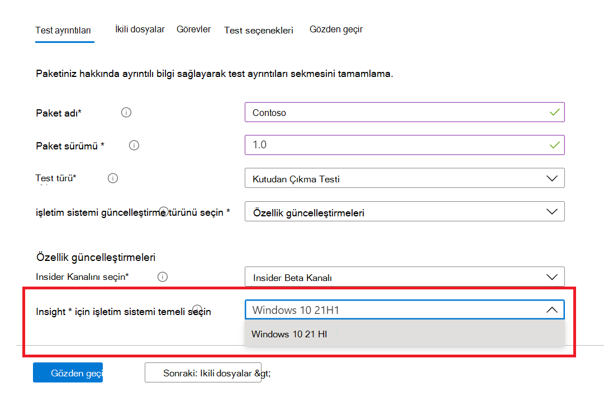

# <a name="windows-feature-update-validation"></a>Windows güncelleştirme doğrulaması

Yeni Windows özelliklerini doğrulamak için bir ortamı korumadan, Windows 10 veya Windows 11'in sonraki sürümüyle uygulamalarınızı nasıl gerçekleştirecekleri hakkında içgörülere ihtiyacınız var mı? 

Doğrulama testlerinizi Azure ortamımızda Windows Insider Programı derlemelerine karşı çalıştırmak istiyor musunuz?

**M365** için Test Temel'in özellik güncelleştirme doğrulaması tüm bunları ve daha fazlasını başarmanıza yardımcı olabilir!

M365 için Test Temel hizmeti altında bu yeni beceriye nasıl erişebilirsiniz hakkında bilgi için aşağıdaki adım adım ana hatta göz atın.

```Feature update validation``` M365 için Test Temel'de çalışmaya başlamak için, self servis ekleme portalı aracılığıyla uygulamalarınızı (ve ilgili dosyaları) karşıya yükleyin. 

Aşağıda, Test ayrıntılarını doldururken atılması gereken adımlar **vurgulanmıştır**:

1. işletim **sistemi güncelleştirme türünüz** olarak Özellik Güncelleştirmesi'ne seçin:


2. Uygulama Windows doğrulanmasını istediğiniz Insider Kanalı kanalını seçin.  


3. test için taban çizgisi (ve sonuçta elde edilen içgörüler!) olarak Windows 10 veya Windows 11'in pazar içi bir sürümü seçin ve paketinizi başarılı bir şekilde eklemek için gereken diğer ayrıntıları açık bırakın.



4. Yayın öncesi sürüm özellik güncelleştirmelerine karşı uygulamanın doğrulanmasından Windows 10 için şu makaleyi ziyaret edin```Feature Updates Test Results```: .


## <a name="next-steps"></a>Sonraki adımlar

Bellek regresyon çözümlemesi'nin nasıl olduğunu anlamaya başlamak için sonraki makaleye ilerleyin.
> [!div class="nextstepaction"]
> [Sonraki adım](memory.md)

<!---
Add button for next page
-->
