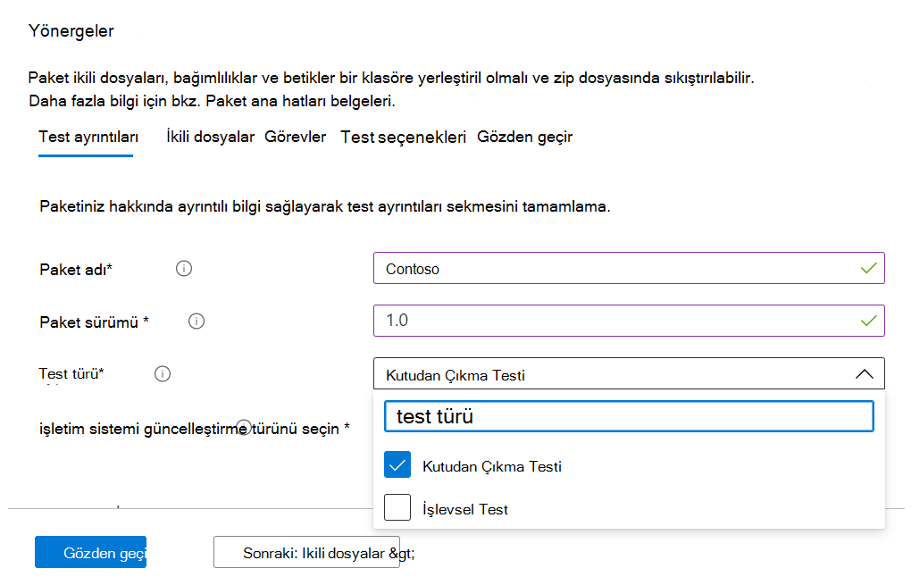

# <a name="functional-testing"></a>İşlevsel test

Yazılım satıcısı olarak, artık M365 için self servis Test Temel'i kullanarak istediğiniz test çerçevesini kullanarak özel işlevsel testler gerçekleştirebilirsiniz. 

Hizmeti ilk kez başlattığımızda, standartleştirilmiş betik aracılığıyla yönlendiren ve önceden tanımlanmış bir dizi test olan Hazır testler sunduk. Öte yandan bu, birçok Bağımsız Yazılım Satıcı (ISV) için tam test kapsamına ulaşamayebiliyordu. 

Bu nedenle, geri bildirimlerinize yanıt olarak ISV'lerimize otomatik işlevsel testleri karşıya yükleme olanağı sağlıyoruz.

Bu özelliği kullanmak için aşağıdaki adımları izleyin:

1. Upload (ikili dosyalar, bağımlılıklar ve betikler) tek bir dosya paketi .zip.
2. Çeşitli yürütme noktalarında test Sanal Makinelerini (SANAL MAKINELER) yeniden başlatmak mı istediğinize karar seçin.
3. Betikleriniz için kullanılabilir seçenekleri yönetin.
4. Yürütme sırasında VM'de Windows güncelleştirmesini ne zaman uygulayacaklarını seçin.

Yukarıdaki adımların ayrıntılı açıklamaları aşağıda vurgulanmıştır:

**Upload bir test paketidir**

Çalışmaya başlamak için, Upload sayfasına gidin, Azure'Upload M365 için Test Temel'in sol tarafındaki gezinti menüsündeki Uygulama kataloğu altında yeni bir uygulama seçin. Buradan:

Sekme 1 - Temel bilgileri girin. Uygulamanın adını ve sürümünü girin. Test türü seçeneğinde öğesini seçin ```Functional tests```. 

*Varsayılan olarak, Kutusu Dışında (OOB) seçeneğinin gerekli olduğunu unutmayın.*




2. Sekme: Upload tüm test (ikili dosyalar, bağımlılıklar, betikler vb.) ile bir zip dosyası yükerek paketinizin bileşenlerini düzenleyin. 

Ayrıntılar aka.ms/usl-package-outline bilgi için bkz. (Not: Hem İlk Çalıştırma testi betikleri hem de İşlevsel test içeriği aynı zip dosyasına yerleştirilsin). Şu anda, dosya boyutu 2 GB ile sınırlıdır.

Sekme 3 - Kutusu Dışında ve İşlevsel test görevlerini yapılandırma. Burada, powershell betiklerinin yollarını seçin; bu betikleri, hem uygulamanızı başlatacak, kapatacak ve kaldıracak (Hazır Kutusu Dışında) hem de tüm özel betiklerinizi işlevsel testlerinizi gerçekleştirmek için bunların yollarını seçin. **(Not: Uygulama kaldırma betiği isteğe bağlıdır).**

Şu anda, işlevsel testlerinizi yüklemek için 1 ile 8 arasında betik yükleyebilirsiniz. (Daha fazla betikye ihtiyacınız varsa, bu gönderiye lütfen yorum olun!)


(İsteğe bağlı) Yüklemeden sonra yeniden başlatmayı yapılandırma. Bazı uygulamalar yüklemeden sonra yeniden başlatmayı gerektirir. 

Bu ```Reboot After Execution``` betiğin yürütülmesi sonrasında bir yeniden başlatmanın yürütülmesini istediğiniz belirli Betik için Görevler sekmesindeki seçimi yapın.

4. Sekme - Windows güncelleştirmenin ne zaman yüklenimini seçin: En son Güncelleştirme Windows uygulaması, seçtiğiniz herhangi bir betikten önce yapılır. Uygulamanın yüklenmesi sonrasında, gerçek Windows kullanım senaryolarınızı yakından taklit etmek için bir güncelleştirme güncelleştirmesini yüklemeniz önerilir.


Sekme 5 - Paketi gözden geçirin ve oluşturun. Yukarıda listelenen adımları tamamlandıktan sonra, karşıya yükleme ```Create``` işlemini tamamlamak için öğesini seçin.

Paketiniz oluşturulduktan sonra paketinizin doğrulama durumunu kontrol edin.

Uygulamanızı yüklemek, başlatmak, kapatmak ve kaldırmak için bir başlangıç testi çalıştırdık. Bu, paketinizin hatasız olarak hizmetimize yüklenemediklerini doğrulamamıza olanak sağlar.

Doğrulama işlemi 24 saat kadar sürebilir. Doğrulama tamamlandıktan sonra, menüde durumu görebilir ```Manage packages``` ve şu iki girişlerden birini kullanabilirsiniz:

1. Doğrulama başarılı olur: Paket, seçtiğiniz işletim sistemi derlemeleri için Windows öncesi sürüm güncelleştirmeleri ile otomatik olarak test edilecektir.
veya
2. Doğrulama başarısız: Başarısızlığın nedenlerini araştırmanız, sorunu düzeltmeniz ve paketinizi yeniden karşıya yüklemeniz gerekir.

Ayrıca, her iki sonucun da Azure portalda bildirim simgesi aracılığıyla size bildirilmesi gerekir.
